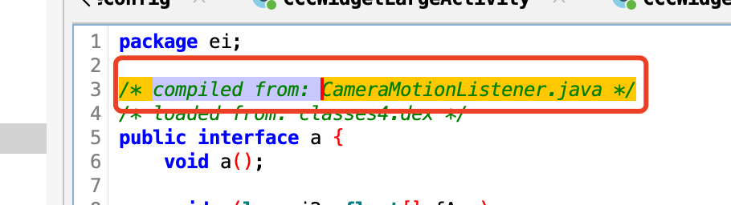

# Android Proguard

## 混淆选项
一般会在项目的 build.gradle 中看到这样的配置，以引入混淆：
```
android {
    buildTypes {
        release {
            ...
            minifyEnabled true
            proguardFiles getDefaultProguardFile('proguard-android.txt'), 'proguard-rules.pro'
        }
    }
}
```
其中，getDefaultProguardFile 获取到的是：```%[android_sdk]/tools/proguard/proguard-android.txt```。关于混淆选项的详细说明，可以参考：[ProGuard](https://www.guardsquare.com/manual/configuration/usage)

在自定义的混淆选项中，有几个需要注意：
- ```-renamesourcefileattribute SourceFile```
  + 可以去掉反编译apk时看到的类头部的注释：```/* compiled from: xxx_name */```
    - 
    - 也有说可以通过去掉```-keepattributes Signature,LineNumberTable,SourceFile```中的**SourceFile**实现此效果，没验证过。
- ```-repackageclasses```
  + 用于优化包结构，可以增加反编译难度。
  + 注意，在有些老版本的 gradle plugin 中可能无效，此时可以尝试使用：```-flattenpackagehierarchy```


## 字符串混淆
可以使用 [StringFog](https://github.com/MegatronKing/StringFog.git) 来实现，编译时对代码中的字符串加密。

## 资源(assets)文件加密
可以通过 gradle 脚本来实现，如：[asset_crypt.gradle](./rsc/asset_crypt.gradle)。只需要在项目的 build.gradle 中引入即可：```apply from: 'asset_crypt.gradle'```

它可以实现编译器对 flutter 的资源进行加密，只需要添加 flutter 的 asset 路径即可。

## 资源名混淆
可以使用[AndResGuard](https://github.com/shwenzhang/AndResGuard.git)进行资源名混淆，效果如：```res/drawable/wechat```转换成```r/d/a```。

需要注意的是：```Do NOT enable 7zip compression(use7zip) when you distribute your APP on Google Play. It'll prevent the file-by-file patch when updating your APP.```

## DebugMetadata
R8 (not a fullMode) 做混淆时，即使在 release 版本中，每个使用 coroutine 的 class 都会有这样的注释：```kotlin.coroutines.jvm.internal.DebugMetadata```, 如：
```
// The code after the R8:

    @DebugMetadata(c = "my.path.to.package.ActivationManager$removeActivationRemotely$2", f = "ActivationManager.kt", l = {286, 290}, m = "invokeSuspend")
    static final class g extends sb1 implements qc1<h0, ya1<? super d91>, Object> {
        private h0 j;
        Object k;
```

可能可以通过如下配置消除：更多信息可以查看：[Obfuscation not applied to kotlin.coroutines.jvm.internal.DebugMetadata](https://issuetracker.google.com/issues/155947700?pli=1)
```
# Ensure the DebugMetadata annotation is not included in the APK.
-checkdiscard @interface kotlin.coroutines.jvm.internal.DebugMetadata
-assumenosideeffects public class kotlin.coroutines.jvm.internal.BaseContinuationImpl {
  private kotlin.coroutines.jvm.internal.DebugMetadata getDebugMetadataAnnotation() return null;
  public java.lang.StackTraceElement getStackTraceElement() return null;
  public java.lang.String[] getSpilledVariableFieldMapping() return null;
}
```

## 技巧
1. 默认是不会混淆四大组件以及View的，这就造成，如果某个包里有一个此类型对象时，整个包结构有很大概率被保留下来。
   - 所以，可以通过将被 keep 的对象组织在一起，混淆效果更佳
