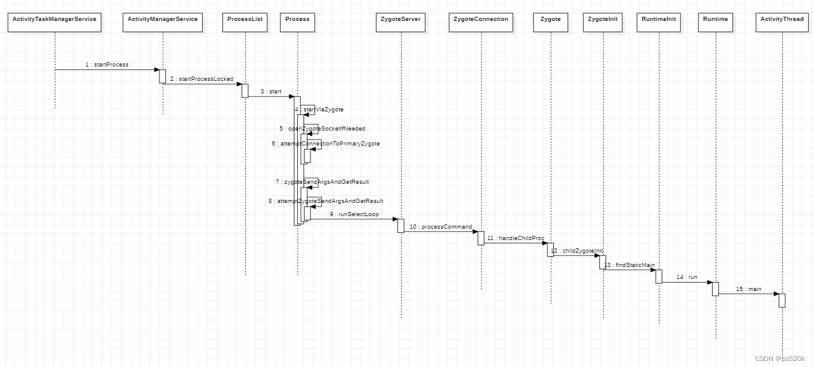
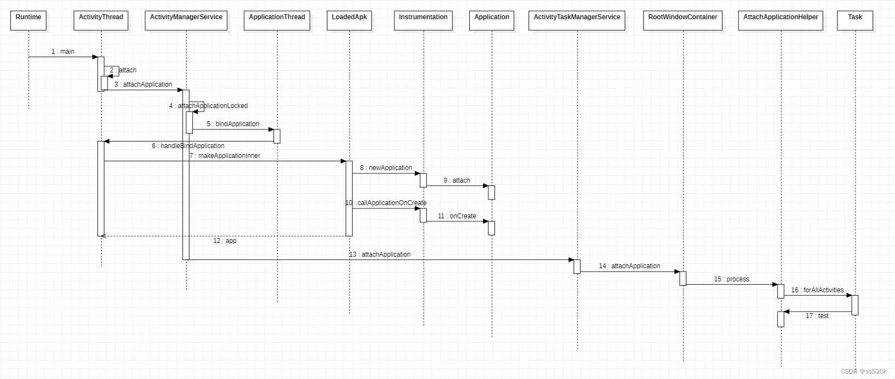
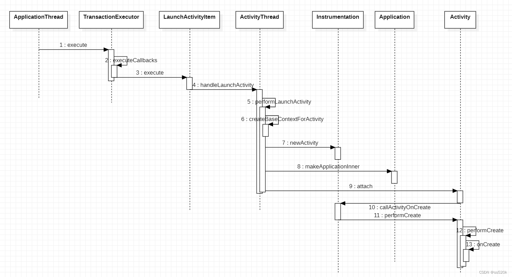
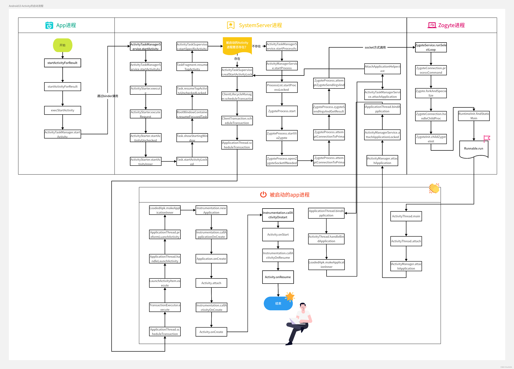
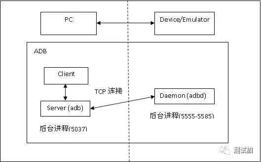

# Android Reverse Engine

## 背景知识
**app_a_zygote_startProcess**

**app_b_attachApplication**

**app_c_application_startActivity**

**app_activity_start_13**


## 环境


在 mac 中使用 adb 连接 android 模拟器的方法：
1. 在虚拟机中执行 *adb devices*，以确认 虚拟机中 adb 已经正常工作
   - 需要虚拟机中的 adb 路径(一般使用模拟器安装目录下的 adb 文件)设置到系统环境变量
2. 在虚拟机中建立端口转发：
   - 建立: ```netsh interface portproxy add v4tov4 listenport=18888 listenaddress=10.211.55.3 connectport=21503 connectaddress=127.0.0.1```
   - 删除: ```netsh interface portproxy delete v4tov4 listenaddress=10.211.55.3 listenport=18888```
   - 说明: 
     + 在虚拟机中监听 10.211.55.3:18888 并转发数据到 模拟器的 adb 监听端口(逍遥模拟器是：127.0.0.1:21503)
     + 在虚拟机中监听的端口(18888)可以根据需要自定义
     + 逍遥模拟器的 adb 端口则需要通过 adb devices 命令去查看确认
3. 在 mac 中执行```adb connect 10.211.55.3:18888```以连接到 android 模拟器

> adb端口说明图：

[MT管理器: https://mt2.cn/](https://mt2.cn/)

## BugReport
 adb bugreport

## Pull APK
```
    adb shell pm list packages
    adb shell pm path xxx
    adb pull path_xxx
```


## Debug APK
### 步骤
1. 反编译包
``` 
    apktool d -f [待反编译的apk] -o [反编译之后存放文件夹] 
    说明：
        -s 参数可以指明跳过 dex 转成 smali 的步骤; 不带此参数时，生成的是 smali 文件集合, 带上时生成 dex 文件
```

2. 修改 apk 为 debuggable
   + 修改 ```AndroidManifest.xml``` 的 ```application``` 标签加上 ```android:debuggable="true"```，然后重新打包
     - 注意：这种方式会破坏数字签名
   + 在 root 的手机或模拟器上运行时，可以不用此操作

3. 重新打包
``` java -jar ~/opt/apktool_2.5.0.jar b [待打包文件夹] -o [生成的apk].apk ```
在重新打包时有可能会遇到失败，大多数原因是：资源文件和一些api版本兼容的问题，比如 style，manifest 的一些application属性等识别不了。此时，可以通过给 apktool 命令增加 -r 参数来避免 resc 的反编译即可。

4. 对齐
```~/opt/zipalign -f -v -p 4 appname.apk appname.aligned.apk```

5. 签名
```~/opt/apksigner sign --ks ~/opt/my-key.jks --ks-pass pass:123456 --out appname.aligned.sign.apk appname.aligned.apk```

生成签名文件：```keytool -genkey -keystore test.keystore -keyalg RSA -validity 10000 -alias test.keystore```

6. 启动 jdwp 调试
```adb shell ps | grep [包名] | awk '{print $2}' | xargs -I {} adb forward tcp:5005 jdwp:{}```

### 调试技巧
1. 调试挂载点
常见的有两种方式:
- 在入口 activity 的 onCreate 函数里添加(等待调试的代码)：```invoke-static {}, Landroid/os/Debug;->waitForDebugger()V``` 
- 使用 ```adb shell am start -D -n [acitivity全路径]``` 启动应用并进入调试模式

## Dalvik ByteCode : smali

### smali 

#### 本地寄存器
Dalvik VM 与 JVM 的最大的区别之一就是 Dalvik VM 是基于寄存器的。也就是说，在smali里的 所有操作都必须经过寄存器来进行。

本地寄存器没有限制，理论上是可以任意使用。

本地寄存器用```v```开头数字结尾的符号来表示，如 v0、v1、v2...

参数寄存器则用```p```开头数字结尾的符号来表示，如 p0、p1、p2... 

特别注意的是，在非 static 函数中，p0 代指```this```

#### 数据类型
类型 | 符号 | 说明
--- | --- | ---
byte | B |
char | C |
double | D |
float | F |
int | I |
long | J |
short | S |
void | V |
boolean | Z |
array | [xxx | 数组的表示方式是：在基本类型前加上前中括号```[```
object | Lxxx/yyy | 对象则以 L 开头，格式是```LpackageName/objectName;```（注意必须以分号结尾）

#### 函数
函数的定义一般为：```FuncName (ParaType1ParaType2ParaType3...)ReturnType```, 注意参数与参数之间没有任何分隔符

#### 常见指令
获取的指令有：iget、sget、iget-boolean、sget-boolean、iget-object、sget-object等，
操作的指令有：iput、sput、iput-boolean、sput-boolean、iput-object、sput-object等。

没有“-object”后缀的表示操作的成员变量对象是基本数据类型，带“-object”表示操作的成员变量是对象类型，特别地，boolean类型则使用带“-boolean”的指令操作。


## 常用知识

<uses-library android:name="org.apache.http.legacy" android:required="true" /> 
    在 Android 清单文件（AndroidManifest.xml）中 <uses-library> 和 <uses-optional-library> 元素用于声明应用程序的依赖关系。这两个元素有一些区别，主要体现在依赖是否是必需的。
        <uses-library> 用于声明应用程序依赖于系统库或框架库，它通常用于检查设备是否具有某个必需的库。
    PackageInfo 中的 usesLibraries 和 usesOptionalLibraries 字段
ApplicationInfo.sharedLibraryFiles:
    用于指定应用程序需要链接到的共享库文件的路径。这个属性是一个字符串数组，包含了应用程序所依赖的共享库文件的路径。
    在 Android 系统中，一些系统级应用程序或库可能会使用 sharedLibraryFiles 属性来指定它们的依赖关系。
ApplicationInfo.splitNames
    在 Android App Bundle（AAB）构建和发布系统中，应用程序可以被分割成多个 APK 文件，每个 APK 文件包含应用程序的一部分功能或资源。这个特性有助于减小应用程序的安装包大小，因为用户只需下载和安装其设备所需的那部分功能或资源。

    splitNames 字段的主要用途是存储应用程序的分割 APK 的名称，以便应用在运行时能够正确加载和使用相应的功能或资源。

    在具体的应用程序开发中，开发者可能会根据应用程序的需求进行分割 APK，例如按照设备屏幕密度、语言、CPU 架构等。splitNames 字段的内容将包含这些分割 APK 的名称，以便在运行时动态加载和使用。
<activity android:name=".MyActivity" android:preferredOrder="1" />
    Package.mPreferredOrder 属性
    用于 <activity> 或 <service> 元素，指定组件在匹配 Intent 时的首选顺序。具体来说，用于在多个匹配的组件中选择使用哪一个。
<meta-data> 元素用于在应用程序清单文件中包含一些与应用程序相关的元数据。
    Package.mAppMetaData  属性
    在 Java 代码中，可以使用 PackageManager 获取应用元数据。
<uses-feature> 元素用于指定应用程序所需的设备功能，以便系统在安装应用程序时检查设备是否具备这些功能。
    Package.reqFeatures 属性

### 定位
bbs:
    https://www.52pojie.cn/thread-1732253-1-1.html
    https://www.52pojie.cn/thread-1709943-1-1.html
    坐标拾取器: https://lbs.amap.com/tools/picker
360:
    https://bbs.kanxue.com/thread-258511.htm


【Android 逆向】脱壳解决方案 ( DEX 整体加壳 | 函数抽取加壳 | VMP 加壳 | Dex2C 加壳 | 

###
1. 52xiyue.com、vps、https
   + https://zhuanlan.zhihu.com/p/344978462
   + https://domains.squarespace.com/
   + 购买：https://zhuanlan.zhihu.com/p/59653738 Vultr
2. 顺序
   ```
   Application.attachBaseContext
   installContentProviders
   Application.onCreate
   Activity\Service\BroadcastReceiver
   ```


Xposed → C++部分，Xposed版的zygote，用于替换原生zygote，并为XposedBridge提供JNI方法，需由XposedInstaller在root后放到/system/bin目录下；
XposedBridge → Java部分，编译后会生成一个jar包，负责在Native层与Framework层进行交互；
XposedInstaller → Xposed插件管理及功能控制的APP，包括启用、下载、禁用插件等功能；
XposedTools → 用于编译Xposed及XposedBridge；

