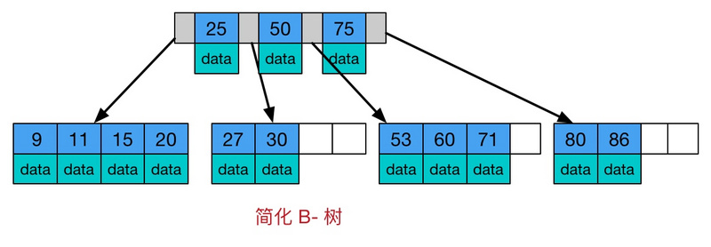
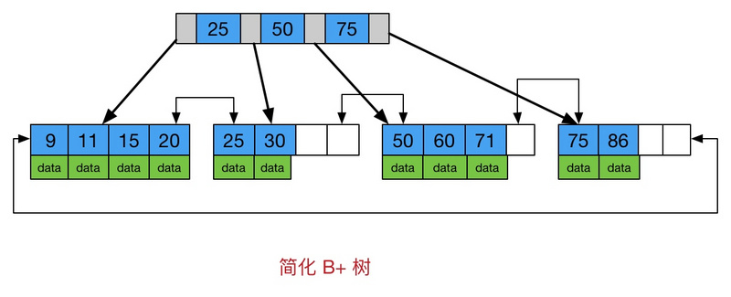

# mysql 中的索引类型
在 mysql 中，有两类索引：聚簇索引(clustered) 和 非聚簇索引(nonclustered)。正常情况下，InnoDB 的主键使用 聚簇索引，MyISAM 使用的是 非聚簇索引。这个差异也给两个引擎的最优使用场景带来了不同，使用时注意测试、考察。

先说下 聚簇索引 和 非聚簇索引 的差异：
- 聚簇索引
    + 主键和表数据一起存储：主键索引的叶结点存储主键值的同时也包含了行数据。二级索引的叶结点存储行的主键值
- 非聚簇索引
    + 索引和表数据分开存储：所有的节点都是索引，叶子节点存储的是 索引 和 索引对应的数据记录地址。主键索引和二级索引在存储上没有任何区别。

## B+Tree
这里，我们需要说一下，常用的索引结构 B+ tree, 

从图中也可以看到，B+树与B树的不同在于：
1. 所有数据都存储在叶子节点，非叶子节点不存储真正的data
2. 为所有叶子节点增加了一个链指针

## 聚簇索引
根据上述信息，我们可以想象，对于聚簇索引来说:
1. 插入速度严重依赖于插入顺序，按照主键的顺序插入是最快的方式，否则将会出现页分裂，严重影响性能。

同时, 由于主键发生变更的话, 索引结构需要再平衡、以及相关数据的移动, 这个代价相对较大, 所以一般设置主键为不可更新的.

因此，对于InnoDB表，我们一般都会定义一个自增的ID列为主键。

页分裂是指，当行的主键值要求必须将这一行插入到某个已满的页中时，存储引擎会将该页分裂成两个页面来容纳该行，这就是一次分裂操作。页分裂会导致表占用更多的磁盘空间。

2. 二级索引访问需要两次索引查找，第一次找到主键值，第二次根据主键值找到行数据。而非聚簇索引，主键索引和非主键索引，都可以直接定位数据的具体位置，然后进行访问即可。
3. 当通过聚簇索引查找目标数据时理论上比非聚簇索引要快，因为非聚簇索引定位到对应主键时还要多一次目标记录寻址,即多一次I/O。
4. 当需要取出一定范围内的数据时，用聚簇索引要比用非聚簇索引好

对于聚簇索引的存储引擎，因为数据是根据主键顺序连续存储的，数据的物理存放顺序与索引顺序是一致的，所以只要索引是相邻的，那么对应的数据一定也是相邻地存放在磁盘上的，索引结构相对紧凑，磁盘碎片少，效率也高。可以很方便的取出一定范围内的数据。

对于聚簇索引也有一些不足之处，如：
1. 聚簇索引可能导致全表扫描变慢，尤其是行比较稀疏，或者由于页分裂导致数据存储不连续的时候。
2. 顺序主键在高并发工作负载下，在InnoDB中按主键顺序插入可能会造成明显的争用。

主键的上界会成为“热点”。因为所有的插入都发生在这里，所以并发插入可能导致间隙锁竞争。

另一个热点可能是auto_increment锁机制；如果遇到这个问题，则可能需要考虑重新设计表或者应用，比如应用层面生成单调递增的主键ID，插表不使用auto_increment机制，或者更改innodb_autonc_lock_mode配置。

## 非聚簇索
对于非聚簇索引而言，
1. 二级索引可能比想象的要更大，因为在二给索引的叶子节点包含了引用行的主键列。
2. 由于插入的数据，是顺序写入的，与索引顺序无关，所以可以不必用单调递增ID。
3. 但是 MyISAM 的锁是表级：写入数据，会使用全局(独占)表锁，读取数据也会使用全局(非独占)表锁。而 Innodb 使用行级锁，同时有 MVCC 加持读性能。
