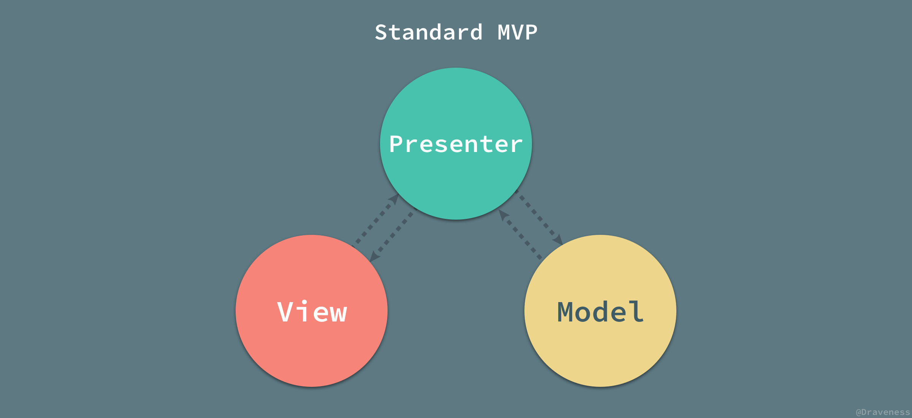

# MVP MVP MVVM

## MVC (Model-View-Controller)

- 分层：
    + 当有用户的行为触发操作时，会有控制器更新模型，并通知视图进行更新，在这时视图向模型请求新的数据
        - Model: *管理应用的行为和数据，响应数据请求(经常来自视图)和更新状态的指令(经常来自控制器)*
        - View: *管理作为位图展示到屏幕上的图形和文字输出*
        - Controller: *翻译用户的输入并依照用户的输入操作模型和视图*
- 问题
   + 很容易将 VC 层写到一起，造成 V或C 层臃肿
   + Controller更多时候承担一种转发的作用
- 说明
    + MVC 最重要的目的并不是规定各个模块应该如何交互和联系，而是将原有的混乱的应用程序划分出合理的层级，把一团混乱的代码，按照展示层和领域层分成两个部分。
    + 分离展示层
        - GUI 应用程序由于其需要展示内容的特点，分为两个部分：一部分是用于展示内容的展示层(Presentation Layer)，另一部分包含领域和数据逻辑的领域层(Domain Layer)
        - 展示层依赖于领域层中存储的数据，而领域层对于展示层一无所知，领域层其实也是 MVC 模式中的模型层，而展示层可以理解为 VC 部分
    + 观察者同步(观察者模式)
        - 因为在 MVC 模式中，模型可以单独工作，同时它对使用模型中数据的视图和控制器一无所知，为了保持模型的独立性，我们需要一种机制，当模型发生改变时，能够同时更新多个视图和控制器的内容；在这时，就需要以观察者同步的方式解决这个问题。
    + 占主导地位的控制器
        - 控制器承担了MVC架构中的大部分业务逻辑，在用户请求到达或者事件发生时都会首先通知控制器并由它来决定如何响应这次请求或者事件。
    + 被动的模型
        - 模型都不会主动向视图或者控制器推送消息。它对于视图和控制器的存在并不知情，只是向外部提供接口并响应视图和控制器对于数据的请求和更新操作。

## MVP (Model-View-Presenter)

- 分层
    + Model负责数据(的存储、以及增删改查等动作)。一般会使用 Model interface 用来降低耦合
    + View负责显示(绘制UI元素)以及与用户进行交互(在Android中体现为Activity)
        - 一般会使用 View interface : 需要View实现的接口
        - View通过View interface与Presenter进行交互，降低耦合，方便进行单元测试
    + Presenter负责(与用户交互的)业务逻辑
- 实现
    + 根据Presenter和View对逻辑代码分担的程度不同，这种模式又有两种情况：
        - Passive View(常用)
            + 交互流程
                ```
                    1、当视图接收到来自用户的事件时，会将事件转交给 Presenter 进行处理
                    2、被动的视图向外界暴露接口，当需要更新视图时 Presenter 通过视图暴露的接口更新视图的内容
                    3、Presenter 负责对模型进行操作和更新，在需要时取出其中存储的信息
                    4、当模型层改变时，可以将改变的信息发送给观察者 Presenter
                ```
            + 说明
                - View向Presenter发送用户交互请求:
                    + 应该采用这样的口吻：“我现在将用户交互请求发送给你，你看着办，需要我的时候我会协助你”
                    + 不应该是这样：“我现在处理用户交互请求了，我知道该怎么办，但是我需要你的支持，因为实现业务逻辑的Model只信任你”；
                - 对于绑定到View上的数据，不应该是View从Presenter上“拉”回来的，应该是Presenter主动“推”给View的；
                - View 尽可能不维护数据状态, 因为它仅仅是用户交互请求的汇报者，不参与响应用户交互相关的逻辑和流程
        - Supervisor Controller
            + 视图和模型之间新增的依赖就是数据绑定的产物；视图通过声明式的语法与模型中的简单属性进行绑定，当模型发生改变时，会通知其观察者视图作出相应的更新。
            + 这种方式能够减轻监督控制器的负担，减少其中简单的代码，将一部分逻辑交由视图进行处理；这样也就导致了视图同时可以被 Presenter 和数据绑定两种方式更新，相比于被动视图，监督控制器的方式也降低了视图的可测试性和封装性。
- 说明
    + MVP 与 MVC 对比
        - MVP 与 MVC 之间的重大区别就是，MVP(Passive View)中的视图和模型是完全解耦的，它们对于对方的存在完全不知情
    + 占主导地位的视图
        - 视图层在整个架构中都是占主导地位的
        - 在 MVC 中，控制器负责以不同的视图响应客户端请求的不同动作；然而 MVP 中视图层选择好要渲染的图层后将所有的动作交给 Presenter 进行处理

## MVVM (Model-View-ViewModel)
- 分层
    + ViewModel可以理解成是View的数据模型和Presenter的合体，说白了就是包含View的一些数据属性和操作的东东
    + ViewModel和View之间的交互通过Data Binding完成，而Data Binding可以实现双向的交互，这就使得视图和控制层之间的耦合程度进一步降低。
- 说明
   - 这种模式的关键技术就是数据绑定(data binding)
   - View的变化会直接影响ViewModel，ViewModel的变化或者内容也会直接体现在View上
   - 它实际上是框架替应用开发者做了一些工作，开发者只需要较少的代码就能实现比较复杂的交互

## 备注
- 这些模式，只是对数据、逻辑、视图这三层的不同划分方式，整体目的还是三层解耦
- MVP和MVVM完全隔离了Model和View，但是在有些情况下，数据从Model到ViewModel或者Presenter的拷贝开销很大，可能也会结合MVC的方式，Model直接通知View进行变更。
- 在实际的应用中很有可能你已经在不知不觉中将几种模式融合在一起，但是为了代码的可扩展、可测试性，必须做到模块的解耦，不相关的代码不要放在一起。