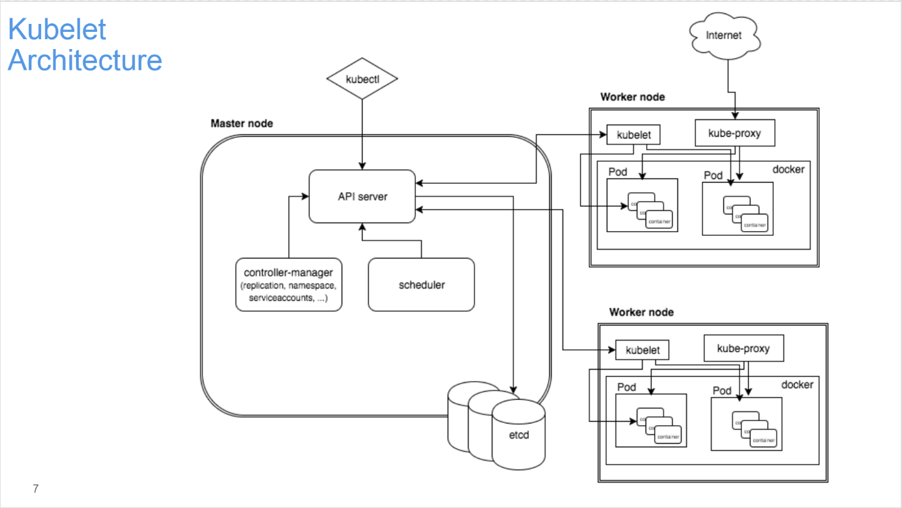
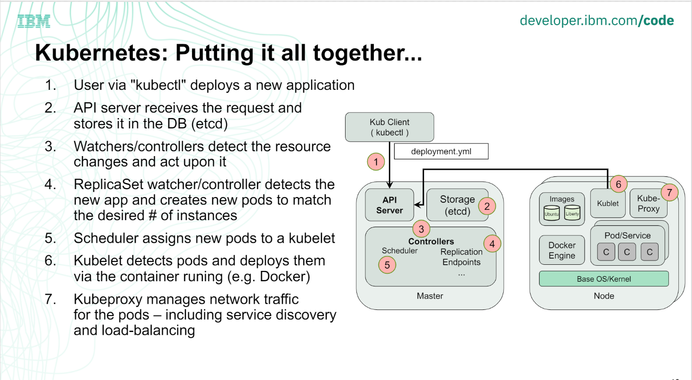

# Kubernetes

## summary
- 本质：
    + Kubernetes 的本质是应用的生命周期管理，具体来说就是部署和管理（扩缩容、自动恢复、发布）。为微服务提供了可扩展、高弹性的部署和管理平台。
    ```
        At its core, k8s is a database(etcd). With "watchers" & "controllers" that react to changes in the DB. 
        The controllers are what make it Kubernetes. 
        This pluggability and extensibility is part of its "secret sauce"
    ```
- xDS：
    + xDS 协议控制了 Istio Service Mesh 中所有流量的具体行为，可以进行更加完善、精准的管理流量

- k8s架构如下:
    + 

- 各个模块之间的工作流：
    + 

总的来说，k8s 由以下几部分组成：
+ kube-apiserver ::: 提供统一接口
+ kube-controller-manager ::: 负责资源管理同步
    - Replication Controller
    - Service Controller
    - ResourceQuota Controller
    - Namespace Controller
    - Node Controller
    - .etc
+ kube-scheduler ::: 负载资源与pod的匹配
+ kube-proxy ::: 负责k8s中的网络配置
+ kubelet ::: 管理pod的生命周期

其中，常见的资源类型有：
+ Config Maps、Daemon Sets、Deployments、Events、Endpoints、Ingress、Jobs、Nodes、Namespaces、Pods、Persistent Volume、Replic Sets、Secrets、Services、Service Accounts、Stateful Sets, and more...

## Network
- 网络架构
    + 架构图
    + 优缺点
    + istio
- 网络架构分层学习优缺点
- 定制网络
- 问题定位

- CRI(container runtime interface)
    + CRI integrations
        - containerd(with cri-containerd)
        - cri-o
        - docker
        - frakti
        - rktlet
    + cri-containerd
        - a containerd based implementation of CRI
- CNI(container network interface)
    + notes
        + kubernetes 使用 CNI 组件容器网络
        + 当 POD 创建和销毁时，kubernetes 将调用 CNI 插件接口生成网络配置
        + CNI 插件将生成虚拟NIC，将其挂载在主机的网络上，并和 POD 的 namespace 关联
    + Calico
        - 基于三层路由(BGP路由协议)，不依赖二层软件
    + Flannel


## kubernetes details
- k8s pause容器:
	+ 在pod中担任Linux命名空间共享的基础；
		- 每个Pod里运行着一个特殊的被称之为Pause的容器，其他容器则为业务容器，这些业务容器共享Pause容器的网络栈和Volume挂载卷，因此他们之间通信和数据交换更为高效
	+ 启用pid命名空间，开启init进程
        - 是同一个pod中，其他容器1号进程的父进程
    + reference: [almighty-pause-container](https://www.ianlewis.org/en/almighty-pause-container)
- k8s externalIPs: 
    + LoadBalancer 这种访问集群内的方式，会自动创建 externalIPs (需要云服务商提供相应支持)
    + reference: [service-discovery](https://www.shipengqi.top/kubernetes-learn/service-discovery/service.html)
- k8s kubeproxy:
    + Service 实现负载均衡（Load Balance）功能，自动把请求流量分布到后端所有的服务上，这一功能的关键，就是 kube-proxy。
        - kube-proxy 运行在每个节点上，监听 API Server 中服务对象的变化，通过管理 iptables 来实现网络的转发。
    + kube-proxy 有两种实现 service 的方案：userspace 和 iptables
        - userspace 是在用户空间监听一个端口，所有的 service 都转发到这个端口，然后 kube-proxy 在内部应用层对其进行转发。因为是在用户空间进行转发，所以效率也不高
        - iptables 完全实现 iptables 来实现 service，是目前默认的方式，也是推荐的方式，效率很高（只有内核中 netfilter 一些损耗）。
    + *问题：k8s kubeproxy 在 istio 中是否有用？有的话，能发挥什么样的作用*
- 不常用的重要命令
```
    kubectl api-resources -o wide: limit:  >= 1.11.0
    kubectl explain: eg. kubectl explain replicaset --api-version apps/v1	
```

## istio summary
- envoy 的4种DS(discovery Service):Discovery Service就是部署在控制面的，在istio中，是Pilot。
    1. listener，也即envoy既然是proxy，专门做转发，就得监听一个端口，接入请求，然后才能够根据策略转发，这个监听的端口称为listener
    2. endpoint，是目标的ip地址和端口，这个是proxy最终将请求转发到的地方。
    3. cluster，一个cluster是具有完全相同行为的多个endpoint，也即如果有三个容器在运行，就会有三个IP和端口，但是部署的是完全相同的三个服务，他们组成一个Cluster，从cluster到endpoint的过程称为负载均衡，可以轮询等。
    4. route，有时候多个cluster具有类似的功能，但是是不同的版本号，可以通过route规则，选择将请求路由到某一个版本号，也即某一个cluster。

## reference
- [istio-handbook](https://www.servicemesher.com/istio-handbook/)
- [ibm-opentech-ma](https://github.com/dWChina/ibm-opentech-ma/tree/master/k8s)


https://kubernetes.feisky.xyz/
https://sookocheff.com/post/kubernetes/understanding-kubernetes-networking-model/

重启 k8s deployment 的方式：
    kubectl rollout restart deployment your_deployment_name
    更改 deployment 文件(更改label、image等有效部分)，并重新 apply

conntrack