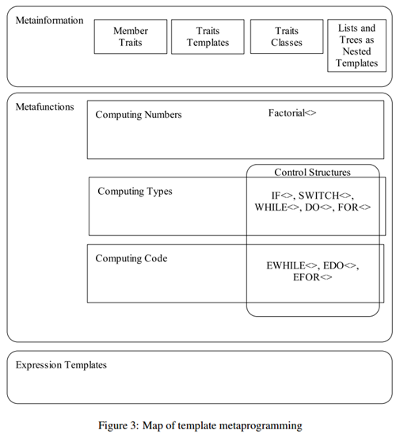

# C && C++

# 一、基础
## 1.1 编译
c/c++ 源代码一般会通过以下步骤，被编译、链接成可执行文件：
1. 预处理(Preprocess) : ``` gcc -E test.cpp -o test.i ```
2. 编译为汇编(Compilation): ``` gcc -S test.i -o test.s ```
3. 汇编(Assembly): ``` gcc -c test.s -o test.o ```
4. 连接(Linking): ``` gcc test.o -o test ```

当然，上述步骤可以直接通过 ``` gcc define.cpp test.cpp -o test ``` 一步到位.

## 1.2 标准库
c && c++ 标准定义了语法、语言特性 以及 C++ 内置库(也就是C++标准库)的实现规范, 但不同的编译器对标准库的实现方法各不一致

| Subject | Content | Status |
| :--- | :---: | :---: |
| 语言特性 | C++ 11/14/17 标准、多态、模版 | &#9745; |
| 异常 | 标准异常、VEH、SEH、TopLevelEH... | &#9744; | 
| 调优 | 内存、性能 | &#9744; | 
| 编译运行 | 编译、运行期的 action 和 mechanism | &#9744; |
| Design | is-a(Inheritance) 和 has-a(Composition) | &#9745; | 
| 平台特性 | window、linux | &#9744; |
| 技巧 | Tricks and Traps | &#9744; |

## 1.3 Feature
Version | Name | Sample | Note
--- | --- | --- | --- 
C++11 | rvalue reference | ```int &&ref_a_left = 6; ``` | 右值引用 和 移动语义
C++11 | move semantics | ```std::move``` | move and move contructor
C++11 | perfect forwarding | ```std::forward``` | 移动语义 和 完美转发
C++11 | decltype | ```int n = 3; decltype(n) t = n + 4;``` | 类型推导, 以普通表达式作为参数返回该表达式的类型, 注意，decltype 不会对表达式进行求值
C++11 | auto | ```auto a = 4 + 6;``` | 类型推导, 从变量声明的初始化表达式获得变量的类型
C++14 | "auto" return type deduction | ```template <typename A, typename B>```<br>```auto do_something(const A& a, const B& b)```<br>```{ return a.do_something(b); }``` | 
C++11 | trailing-return type | ```auto foo(int p) -> int { return p * 42; }``` | auto, decltype, trailing-return type
C++11 | lambda | ```auto aLambda = [](auto a, auto b) { return a < b; };``` | 
C++11 | constexpr | ```constexpr int x = 5;``` | 
C++11 | strongly typed enums | ```enum class : char { };``` | 
C++11 | static assert | ```static_assert(sizeof(int) == 4);``` | 编译期的断言
C++11 | range based for | ```for (auto x : vec)  { /* TODO */ }``` |
C++11 | type alias | ```using func = void (*) (int, int);``` | using、typedef、typename<br>using 可读性更高，且可以用于模板别名[The "typename" keyword](https://stackoverflow.com/questions/610245/where-and-why-do-i-have-to-put-the-template-and-typename-keywords/17579889#17579889)
C++11 | unicode strings | ```const char16_t* utf16 = u"foo";```<br>```const char32_t* utf32 = U"foo";``` | 
C++11 | override | ```struct A { virtual void foo() {}; };```<br>```struct B : public A { void foo() override {}; };``` | 
C++17 | constexpr if | ```if constexpr (sizeof(int) == 1) return 0;``` | 
C++17 | template auto | ```template <auto Value>```<br>```struct constant { static constexpr auto value = Value;};``` | type and non-type template parameters
C++17 | nested namespace definition | ```namespace A::B::C { class X {}; }``` | 
C++17 | inline variable | ```class X { static inline int field = 2; };``` |
C++17 | structured binding  | ```int arr[3] = {3,4,5};```<br>```auto [a, b, c] = arr;```<br>```auto [x, y, z] = std::make_tuple("str", 0.4, 1);``` |
C++20 | designated initializer | ```struct A { int x; int y; int z; };```<br>```A a { .x = 1, .z = 2 };``` | 
C++20 | modules | ```export module A; import A; import std.core;``` | 
C++20 | consteval | ```static consteval int square(int n) { return n * n; }``` | 
C++20 | constinit | ```constinit auto sqrOf5 = square(5);``` | 
C++20 | concept | ```template<typename T>```<br>```concept Integral = std::is_integral<T>::value;``` | 
C++11 | attribute specifier sequence | ```[[gnu::const]] [[nodiscard]]```<br>```inline int f(); ``` | 
C++ | enumerators with attributes | ```enum class myEnum{ value1 [[anAttribute]], }; ``` | ??
C++11 | std::integral_constant | | 包装特定类型的静态常量。它是 C++ 类型特征的基类。
C++11 | constexpr length for const string | ```template<class T>```<br>```constexpr size_t const_str_len(const T* str) { return (*str == 0) ? 0 : const_str_len(str + 1) + 1; }``` |
C++17 | constexpr length for const string | ```constexpr auto l = std::char_traits<char>::length("123");``` |


### Thriving in a Crowded and Changing World: C++ 2006–2020
这是 C++ 之父 Bjarne Stroustrup 的 [HOPL4](https://www.stroustrup.com/hopl20main-p5-p-bfc9cd4--final.pdf) 论文的标题。

HOPL(History of Programming Languages，编程语言历史)ACM(Association of Computing Machines，国际计算机协会)旗下的一个会议，约每十五年举办一次。

Bjarne 的这篇论文是他为 2021 年 HOPL IV 会议准备的论文，它涵盖了 C++98 之后的所有 C++ 版本，从 C++11 直到 C++20。

鉴于这篇论文可以帮助 C++ 从业者对 C++ 的设计原则和历史有一个系统的了解，全球 C++ 及系统软件技术大会的主办方 Boolan 组织了一群译者，把这篇重要论文翻译成了中文: [在拥挤和变化的世界中茁壮成长：C++ 2006–2020](https://github.com/Cpp-Club/Cxx_HOPL4_zh)

# 二、多态
## 1. 虚函数表内存模型
## 2. 方法派发(dispatch)流程(选择正确方法调用的过程) 
+ 派发机制按照选择正确方法的时期(编译期和运行期)，可以分为: static dispatch 和 dynamic dispatch
  + static dispatch
    - 在编译期就完全确定调用方法的分派方式。也就是说，编译期直接决定函数地址(方法指针)，运行时可以直接通过函数地址调用方法。
      - static dispatch 的进行进一步优化的一种实现方式叫做内联(inline), 是指编译期从指定被调用的方法指针，改为将方法的实现平铺在调用方的可执行文件内，从而节省了指针到方法实现体的调用的消耗。
        - 内联展开和宏展开的区别在于,内联发生在编译期,并且不会改变源文件.但是宏展开是在编译前就完成的,会改变源码本身,之后再对此进行编译.
        - inline 关键字是一个 desire 声明而非 require. 只能告诉编译器倾向使用内联方式, 但是最终实现是编译器决定的.
          + 如果一个方法被内联10次,那么会出现10份方法的副本.所以内联适用于会被频繁调用的比较小的方法.但是如果一个方法特别大,被inline关键字修饰的话,编译器也可能会选择不使用内联实现.
  + dynamic dispatch
    - 在运行期选择调用方法的实现的流程
    - 虚函数表(动态分派的一种实现机制)
      + 常见语言如 C++、Java 都是通过虚函数表来实现的(Java所有的实例方法都默认使用虚函数表实现)。
      + 虚函数表
        - 编译器会为每个类创建单独的虚函数表。编译器也会生成包含了虚函数表指针的代码。
        - 多继承和指针修正(thunks)
          + 菱形继承
            - 虚基类
    - 和 late binding 不同：
      - late binding (也叫dynamic binding或dynamic linkage)是一种用于处理在运行时通过对象调用方法或者通过函数名去调用包含参数的方法的一种编程机制.
        + 简单的说，就是在编译期并不会解读足够的信息去确定方法是否存在
      - 在组件对象模型编程中,使用late binding的最大优势在于,不要求编译器在编译期间去引用包含对象的库.这使得编译过程可以更有效的去避免类的虚函数表突然更改带来的冲突.
      - 大部分的动态类型语言都可以在运行时去修改对象的方法列表, 因此他们就需要late binding.

# 三、模版
模板分为函数模板(function template)和类模板(class template), 一般在头文件中定义, 可能被包含多次，编译和链接时会消除等价模板实例；

C++ 模板有以下特点：
- 图灵完备
- 函数式编程

所谓元编程，就是编写直接生成或操纵程序的程序，而 C++ 模板赋予了 C++ 语言提元编程的能力。

## 图灵完备
C++ 模板最初是为实现泛型编程设计的，但人们发现模板的能力远远不止于最初的设计初衷。一个重要理论结论就是：C++ 模板是图灵完备的(Turing-complete)。也就是说，C++ 模板元编程是"意外"功能，而不是设计的功能，这也是 C++ 模板元编程语法丑陋的根源。

C++ 模板是图灵完备的，主要体现在具备以下能力：
- 编译期数值计算
- 类型计算
- 代码计算(如循环展开)

从编程形式来看，模板的“<>”中的模板参数相当于函数调用的输入参数，模板中的 typedef 或 static const 或 enum 定义函数返回值(类型或数值，数值仅支持整型，如果需要可以通过编码计算浮点数)

依赖以下两个能力，C++ 模板具有了和普通语言一样通用的能力(图灵完备性):
- 依赖 C++ 模板的**特例化**, 模板拥有了条件判断能力
- 依赖 C++ 模板的**递归嵌套**, 模板拥有了循环的能力

所以，可以确定，能够用模板实现类似普通程序中的 if 和 while 语句。

理论上说 C++ 模板可以执行任何计算任务，但实际上因为模板是编译期计算，其能力受到具体编译器实现的限制(如递归嵌套深度，C++11 要求至少 1024，C++98 要求至少 17)。

数值计算的实际意义不太大，但可以很好证明 C++ 模板的能力，而类型计算和代码计算可以使得代码更加通用，更加易用，性能更好(也更难阅读，更难调试，有时也会有代码膨胀问题)

代码计算是通过类型计算进而选择类型的函数实现的(C++ 属于静态类型语言，编译器对类型的操控能力很强)。

类型计算, 比如类型萃取, 依赖模板的特化来实现



### 模板特例化(template specialization)
模板的特例化分完全特例化(full specialization)和部分特例化(partial specialization)。实例化将会匹配参数集合最小的特例。

模板特化时，使用类型等价判断规则确定使用(模板的多个实例中的)哪一个模板：
- 同一个模板(模板名及其参数类型列表构成的模板签名 template signature 相同)且指定的模板实参等价(类型参数是等价类型，非类型参数值相同)
- 函数模板可以重载，类模板不存在重载

可变模版参数(variadic templates)，C++11新增的最强大的特性之一。可以用递归实现伪变长参数模板，C++11 变长参数模板背后的原理也是模板递归；

## 函数式编程
从编程范型(programming paradigm)上来说，C++ 模板是函数式编程(functional programming)，它的主要特点是：函数调用不产生任何副作用(没有可变的存储，都是编译期常量)，用递归形式实现循环结构的功能。

函数式编程看上去似乎效率低下(因为它和数学接近，而不是和硬件工作方式接近)，但有自己的优势：描述问题更加简洁清晰(前提是熟悉这种方式)，没有可变的变量就没有数据依赖，方便进行并行化。

## 关键字：template、typename、this
template、typename、this 关键字用来消除歧义，避免编译错误或产生不符预期的结果；

C++标准规定，如果解析器在一个模板中遇到一个嵌套依赖名字，它假定那个名字不是一个类型，除非显式用 typename 关键字前置修饰该名字；

和上一条 typename 用法类似，template 用于指明嵌套类型或函数为模板；

this 用于指定查找基类中的成员(当基类是依赖模板参数的类模板实例时，由于实例化总是推迟，这时不依赖模板参数的名字不在基类中查找)。

## 特性(traits)，策略(policy)，标签(tag)
特性，策略，标签是模板编程常用技巧，它们可以是模板变得更加通用。

特性(traits)一般是对类型的信息(如 value_type、 reference)进行包装，使得上层代码可以以统一的接口访问这些信息。C++ 模板元编程会涉及大量的类型计算，很多时候要提取类型的信息(typedef、 常量值等)，如果这些类型的信息的访问方式不一致(如上面的迭代器和指针)，我们将不得不定义特例，这会导致大量重复代码的出现(另一种代码膨胀)，而通过加一层特性可以很好的解决这一问题。

策略(policy)一般是一个类模板，典型的策略是 STL 容器(如 std::vector<>，完整声明是template<class T, class Alloc=allocator<T>> class vector;)的分配器(这个参数有默认参数，即默认存储策略)，策略类将模板的经常变化的那一部分子功能块集中起来作为模板参数，这样模板便可以更为通用

标签(tag)一般是一个空类，其作用是作为一个独一无二的类型名字用于标记一些东西，典型的例子是 STL 迭代器的五种类型的名字(input_iterator_tag, output_iterator_tag, forward_iterator_tag, bidirectional_iterator_tag, random_access_iterator_tag)

## 缺点
C++ 模板编程的两个问题是：
- 难调试，会产生冗长且难以阅读的编译错误信息
  + 可以增加一些检查代码，让编译器及时报错
- 代码膨胀(源代码膨胀、二进制对象文件膨胀)
  + 使用特性、策略等让模板更通用，可能的话合并一些模板实例

## Reference
- [关于模板元编程](https://www.eet-china.com/mp/a39910.html)


# 四、导入(import)导出(export) 
## 1. 对象
- 函数、接口、类、成员函数、成员变量

## 2. 使用
- 导出
  + 模块定义文件(.def)
  + ```__declspec(export)```、```__declspec(import)```
  + ```visibility```
    - 代码修饰：```__attribute((visibility("default")))```、```__attribute((visibility("hidden")))```
    - 链接选项：```-fvisibility=default```、```-fvisibility=hidden```
      + gcc 默认设置为 default 即全部可见(导出)
- 加载
  + 显式加载：从导出表获取函数地址(通过函数名、函数编号)，进行使用
  + 隐式加载：依赖生成dll时生成的 lib 文件，直接引用头文件
    + lib 文件包含了导出的符号信息，会在模块被加载时主动寻找 dll或so 文件并关联其中对应的符号
    + 宏定义(You can use the same header file for both the DLL and the client application)：
      ```
      #ifdef _EXPORTING
        #define API_DECLSPEC    __declspec(dllexport)
      #else
        #define API_DECLSPEC    __declspec(dllimport)
      #endif
      ```
    + [MSDN关于__declspec(dllimport)的解释](https://docs.microsoft.com/en-us/cpp/build/importing-into-an-application-using-declspec-dllimport?view=msvc-170)
      - *The keyword __declspec(dllimport) works whether you export with .def files or with the __declspec(dllexport) keyword.*
      - *Using __declspec(dllimport) is optional on function declarations, but the compiler produces more efficient code if you use this keyword.*
      - *However, you must use __declspec(dllimport) for the importing executable to access **the DLL's public data symbols and objects.***
    + 示例：*假设 func 是 DLL 中的一个函数，在另一个程序的 main 函数中尝试调用 DLL 中的的这个函数*
      - 如果导入的头文件中函数**没有**__declspec(dllimport)的修饰
        ```
        编译器将产生类似这样的调用:
          call func
        然后，链接器把该调用翻译为类似这样的代码：
          call 0x40000001       // 0x40000001是 func 的地址
        并且，链接器将产生一个 Thunk，形如：
          0x40000001: jmp DWORD PTR __imp_func

        这里的 imp_func 是 func 函数在 exe 的导入地址表中的函数槽的地址。然后，加载器只需要在加载时更新 exe 的导入地址表(导入表修复)即可
        ```
      - 如果使用了__declspec(dllimport)显示地导入函数
        ```
        链接器将不会产生 Thunk(如果不被要求的话)，而直接产生一个间接调用。形如：
          call DWORD PTR __imp_func1
        因此，显示地导入函数能有效减少目标代码、增加执行效率(因为不产生Thunk)。
        ```
- 注意
  + 类、成员函数、成员变量 导出时的对象归属问题

# 五、名称修饰(符号名)
- 查看方法：
  + Linux
    - gcc 编译，而后以 **nm** 命令查看动态、静态库以及```.o```中的符号
  + Window
    - cl 编译(参数```-c```)，而后以 **dumpbin** 命令查看符号(参数```/SYMBOLS```)
- 注意
  + 不同的编译器的名称修饰方法可能不同，所以不同的编译器对于同一个函数签名可能对应不同的修饰后名称
  + 模块定义文件(.def) 定义的函数，不会使用名称修饰，而是保持函数名不变
  + Microsoft 提供了一个 UnDecorateSymbolName() 的API，可以将修饰后名称转换成函数签名
  + VC 提供了一个预处理指示符 "#pragma" 来指定连接选项, 其中有：
    - ```/EXPORT:entryname[,@ordinal[,NONAME]][,DATA]```，@ordinal 指定顺序；NONAME 指定只将函数导出为序号；DATA 关键字指定导出项为数据项
      + 用于修改导出的名称，如：```#pragma comment(linker,"/EXPORT:MyExportFunction=_MyExportFunction@4")```
- C 编译器的函数名修饰规则
  +  Visual C++ 的基本C名称修饰方法：
    - ```__stdcall``` x86 调用约定，编译器会在输出函数名前加上一个下划线前缀，函数名后面加上一个“@”符号和其參数的字节数。比如 ```_functionname@argbytes```
    - ```__fastcall``` x86 调用约定，在输出函数名前加上一个"@"符号，后面也是一个"@"符号和其參数的字节数，比如 ```@functionname@argbytes```
    - ```__stdcall``` x64 和 ```__fastcall``` x64 调用约定，保持输出函数名不变，比如```functionname```
    - ```__cdecl``` 同 GCC
  + GCC 的基本C名称修饰方法：
    - ```__cdecl``` x86 调用约定，仅在输出函数名前加上一个下划线前缀。比如```_functionname```
    - ```__cdecl``` x64 调用约定，保持输出函数名不变。比如```functionname```
- C++ 编译器的名称修饰规则
  + Visual C++ 的基本C++名称修饰方法：
    - 形如：```?func_name@class_name@namespace@@flags_and_args_and_return@Z ```, 修饰后名字由"?"开头，接着是函数名由"@"符号结尾的函数名；后面跟着由"@"结尾的类名和名称空间，再一个"@"表示函数的名称空间结束；其后可能有，函数调用类型(__cdecl或__stdcall等)、函数保护属性(public、private...) 以及 参数列表等信息，由"@"结束，最后由"Z"结尾。
      + 比如 int C::C2::func(int) 经过名称修饰以后就是 ?func@C2@C@@AAEHH@Z
  + GCC 的基本C++名称修饰方法：
    - 所有的符号都以"_Z"开头，对于嵌套的名字(在名称空间或在类里面的)，后面紧跟"N"，然后是各个名称空间和类的名字，每个名字前是名字字符串长度，再以"E"结尾。对于一个函数来说，它的参数列表紧跟在"E"后面。
      + 比如 N::C::func 经过名称修饰以后就是 _ZN1N1C4funcE。N::C::func(int) 函数签名经过修饰为 _ZN1N1C4funcEi, 对于int类型来说，就是字母"i"。

# 六、特性
## const
  + 指针：位于*的左侧 或 右侧
  + 成员变量
  + 成员函数
    - 不被允许修改它所在对象的任何一个数据成员(但可以访问)
    - const成员函数，可以访问const成员函数
  + 对象
    - 该对象的任何非const成员函数都不能被调用，因为任何非const成员函数会有修改成员变量的企图
  + *const_cast<type_id> (expression)*

## attribute
    ```
      #if defined(__GCC__)
      /*
      * __attribute__ 是 GCC 编译器特有的机制
      * 如，__attribute__((packed)) 和 __attribute__(aligned(4))
      * 
      * 使用：
      *   typedef struct {
      *   } __attribute__((packed)) position_t;
      * 
      *   struct test {
      *   } __attribute__((packed));
      */
      #endif
      对齐方式还有：
      #if ( _MSC_VER >= 800 && !defined(_M_I86)) || defined(_PUSHPOP_SUPPORTED)
        #pragma pack(push,1)
      #else
        #pragma pack(1)
      #endif
    ```

## 对象模型
1. 单一继承( class D : public B {} )：
   + 单一继承派生类的对象模型
   + 单一继承并含有虚函数
      - 派生类override了基类的虚函数
2. 多重继承( class D : public B1, public B2, public B3 {} )：
   + 多重继承派生类的对象模型
   + 多重继承且各基类中含有虚函数时
     - 派生类override了基类的虚函数 
     - 注意：出现了两个新的实体，offset to top 和 non-virtual thunk
     - 注意：派生类和第一个基类公用 vptr 和 虚表
3. 菱形继承( class D : public B1, public B2 {}; class B1 : public BB {}; class B2 : public BB {}; )：
   
注意：
1. 派生类 与 基类 之间回 alignment 对齐
2. 辅助工具
  - https://godbolt.org/
  - https://cppinsights.io/


# 七、Traps
## 1. Enum
### 1.1 疑问
```
class Test {
public:
    enum Result {
        Result_OK = 0x1000,
    };

    Test(enum Result emRst) {
        m_nRst = emRst;
    }

    static int m_nRst;
};

int Test::m_nRst = 0; /* OK */
// Test::m_nRst = 0; /* ERROR, 此声明没有存储类或类型说明符 */

int main() { 
    Test(Test::Result(Test::Result_OK)); /* OK */
    Test((Test::Result)Test::Result_OK); /* OK */
    // Test(Test::Result_OK); /* ERROR, 当前范围内无法定义 constant "Test::Result_OK" */
}
```

**为什么上述代码在去掉注释"//"后，vs2019编译器会提示错误？**

### 1.2 背景
我们需要明白，enum 关键字会定义一个类型，同时，其内定义的项目会被展开为int型常量到定义 enum 的作用域。

这会造成，在全局位置定义的 enum 类型中的项目名需要是全局唯一的, 如下述定义会编译出错(*error C2365: “a”: 重定义*)：
```
enum X { a };
enum Y { a };
```

由此，为了解决**作用域 以及 强类型限定**问题，**C++11 中引入了 enum class 或 enum struct**。

### 1.3 解答
1. 全局位置的 *ERROR, 此声明没有存储类或类型说明符*：
   + c/c++ 没有全局代码块，在全局位置的是 **声明或定义**
2. 传递枚举值到枚举类型参数时 *ERROR, 当前范围内无法定义 constant*：
   + ？
   + vs2019 会报错，但，g++ 在 linux 下编译正常
     - 可能是：强类型限定造成现在拒绝枚举量与int之间的隐式转换

## 2. Array & Pointer
### 2.1 疑问
```
// define.c
int arr[] = { 1,2,3 };
int* arm = &arr[0];

// test.c
int art[] = { 5,6,7,8,9 };
extern int* arr;

void test() {
    int* x = arr + 1;
    int* m = art + 1;
}
```

请问 test 函数中的 x 和 m 分别是多少？(int)x = 5, *m = 6

同我们的认知：**数组可以当成指针使用** 不一样，对吧...

### 2.2 解答
将上述代码编译成汇编后的代码如下：
- define.cpp
```
        .file   "define.cpp"
        .text
        .globl  arr
        .data
        .align 8
        .type   arr, @object
        .size   arr, 12
arr:
        .long   1
        .long   2
        .long   3
        .globl  arm
        .section        .data.rel.local,"aw"
        .align 8
        .type   arm, @object
        .size   arm, 8
arm:
        .quad   arr
        .ident  "GCC: (Ubuntu 9.3.0-17ubuntu1~20.04) 9.3.0"
        .section        .note.GNU-stack,"",@progbits
        .section        .note.gnu.property,"a"
        .align 8
        .long    1f - 0f
        .long    4f - 1f
        .long    5
```

- test.cpp
```
        .file   "test.cpp"
        .text
        .globl  art
        .data
        .align 16
        .type   art, @object
        .size   art, 20
art:
        .long   5
        .long   6
        .long   7
        .long   8
        .long   9
        .text
        .globl  test
        .type   test, @function
test:
.LFB0:
        .cfi_startproc
        endbr64
        pushq   %rbp
        .cfi_def_cfa_offset 16
        .cfi_offset 6, -16
        movq    %rsp, %rbp
        .cfi_def_cfa_register 6
        movq    arr(%rip), %rax
        addq    $4, %rax
        movq    %rax, -16(%rbp)
        leaq    4+art(%rip), %rax
        movq    %rax, -8(%rbp)
        movq    -8(%rbp), %rax
        movl    (%rax), %eax
        movl    %eax, -20(%rbp)
        nop
        popq    %rbp
        .cfi_def_cfa 7, 8
        ret
        .cfi_endproc
.LFE0:
        .size   test, .-test
        .ident  "GCC: (Ubuntu 9.3.0-17ubuntu1~20.04) 9.3.0"
        .section        .note.GNU-stack,"",@progbits
        .section        .note.gnu.property,"a"
        .align 8
        .long    1f - 0f
        .long    4f - 1f
        .long    5
```

观察：
- ```define.cpp```中 arr 和 arm 的定义
- ```test.cpp```中 arr(%rip) 和 art(%rip) 的操作

可以发现：
1. 数组可以当成指针使用，的原因是：**编译器帮忙做了取地址操作**
2. 因为 ```extern int* arr``` 在使用时**缺少了**编译器帮忙做*取地址操作*这一动作，直接被把 arr 当成了 指针使用：具体的方式可以参考 arm 的定义：**直接把 arm 的值当成了地址使用**

## 3. Single Parameter Constructor
C++中单参数构造函数是可以被隐式调用的，主要有两种情形会隐式调用单参数构造函数:
- 同类型对象的拷贝构造
  + 即用相同类型的其它对象来初始化当前对象
- 不同类型对象的隐式转换
  + 即其它类型对象隐式调用单参数拷贝构造函数初始化当前对象。比如 A a=1; 就是隐式转换，而不是显示调用构造函数，即A a(1); 像 A(1) 这种涉及类型转换的单参数构造函数，又被称为转换构造函数(Converting Constructor)

可以通过 explict 关键字避免这种隐式调用。

## 4. HeapOnly & StackOnly
  ```
      #include <iostream>
      class HeapOnly {
      public:  
          HeapOnly() { }
          void destroy() const { delete this; }
      private:  
          ~HeapOnly() { }
      };
      class StackOnly {
      public:
          StackOnly() { }
          ~StackOnly() { }
      private:
          void* operator new(size_t);
      };
      int main() {  
          StackOnly s; // ok
          StackOnly *p = new StackOnly; // wrong
          HeapOnly *p = new HeapOnly; // ok
          p->destroy();
          HeapOnly h;  // wrong
          return 0;
      }
  ```

# Reference
- 《深度探索C++对象模型》
- 《Effective C++》
- 《More Effecitve C++》
- 《C专家编程》
- 《C陷阱与缺陷》
- 《C++ Templates》
- [gcc.gnu.org/onlinedocs](https://gcc.gnu.org/onlinedocs/gcc-4.4.7/gcc/)