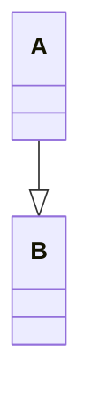

# Markdown 常用语法

## 常用符号
功能 | 语法/标记 | 说明
--- | :---: | :---
勾选框 | &#9745; <br> &#9744; |
一个空格 | ```&emsp;```<br>```&#8194;``` |
两个空格 | ```&ensp;```<br>```&#8195;``` |
不换行空格 | ```&nbsp;```<br>```&#160;``` |

## mermaid
功能 | 语法/标记 | 说明
--- | :---: | :---
延长连线 | 增加相应字符即可 | 如```A-->B```变为```A--->B``` 
注释 | 行首以```%%```开头 | 如：<br>```graph LR```<br>```%%这是一条注释，在渲染图中不可见```<br>&ensp;&ensp;```A --> B```

mermaid | 关键字 
--- | ---
饼状图 | pie
流程图 | graph
序列图 | sequenceDiagram
甘特图 | gantt
类图 | classDiagram
状态图 | stateDiagram
用户旅程图 | journey

关键字 | 组件 | 名字 | 语法 | 说明
--- | --- | --- | --- | ---
graph | 形状 | 方形 | ```id1[方形]``` | 默认
graph | 形状 | 圆边矩形 | ```id2(圆边矩形)``` |
graph | 形状 | 体育场形 | ```id3([体育场形])``` |
graph | 形状 | 子程序形 | ```id4[[子程序形]]``` |
graph | 形状 | 圆柱形 | ```id5[(圆柱形)]``` |
graph | 形状 | 圆形 | ```id6((圆形))``` |
graph | 形状 | 菱形 | ```id1{菱形}``` |
graph | 形状 | 六角形 | ```id2{{六角形}}``` |
graph | 形状 | 平行四边形 | ```id3[/平行四边形/]``` |
graph | 形状 | 反向平行四边形 | ```id4[\反向平行四边形\]``` |
graph | 形状 | 梯形 | ```id5[/梯形\]``` |
graph | 形状 | 反向梯形 | ```id6[\反向梯形/]``` |
graph | 箭头线 | 实线 | ```a-->b--文本-->c-->|文本B|d``` |	
graph | 箭头线 | 粗实线 | ```a==>b==文本==>c``` |		
graph | 箭头线 | 虚线 | ```a-.->b-.文本.->c``` |		
graph | 无箭头线 | 实线 | ```a--b--文本--c--|文本B|d``` |	
graph | 无箭头线 | 粗实线 | ```a==b==文本==c``` |		
graph | 无箭头线 | 虚线 | ```a-.-b-.文本.-c``` |		
flowchart | 线 | | ```A o--o B``` |
flowchart | 线 | | ```B <--> C``` |
flowchart | 线 | | ```C x--x D``` |
flowchart | 线 | | ```D --文本--> E``` |
flowchart | 子图 | | ```subgraph one```<br>&ensp;&ensp;```A-->B```<br>```end``` | 以 subgraph 开始，以 end 结尾

## classDiagram
形如：


可见范围 | 表示方法
-- | --
 ```private``` | -
 ```public``` | +
 ```protected``` | #
 ```package``` | ~

类的修饰符 | 类型
-- | --
 ```<<Interface>> ```| 接口
 ```<<abstract>>``` | 抽象类
 ```<<Service>>``` | service类
 ```<<enumeration>>``` | 枚举

两种表示方式：
```
class A
A : +String name
A : -int age
A : List~Object~ child    //带泛型的变量
A : +eat()
A : +sleep(time)          //有参数的方法
A : +getAge() int         //有返回值的方法
```
```
class B {
    +String name
    -int age
    List~Object~ child
    +eat()
    +sleep(time)
    +getAge() int
}
```

名字 | Name | 标记 | 表示 | 用途
-- | -- | -- | -- | --
泛化 | Inheritance/Generalization | ```Animal <|-- Person``` | 带三角箭头的实线，箭头指向父类 | 继承
实现 | Realizations | ```Person <|.. Woman``` | 带三角箭头的虚线，箭头指向接口或抽象类
组合 | Composition | ```Company *-- Department``` | 带实心菱形的实线，实心菱形指向整体 | 整体与部分的关系，但部分不能离开整体而单独存。<br><br>一般形式为成员变量
聚合 | Aggregation | ```Car o-- Wheel``` | 带空心菱形的实现，空心菱形指向整体 | 整体与部分的关系，且部分可以离开整体而单独存在。<br><br>一般形式为通过参数传递到聚合对象。
关联 | Association | ```Student <-- Course``` | 带普通箭头的实心线，指向被拥有者。 | 
依赖 | Dependency | ```Oxygen <.. Animal``` | 带普通箭头的虚线，箭头指向被使用者。| 是一种使用关系，即一个类的实现需要另一个类的协助

关系上添加标签：```Oxygen <.. Animal : 依赖```
关系上添加数量标识：```Company "1" --> "*" Employee```

## Reference
- [markdown UML 语法 - mermaid](https://zhuanlan.zhihu.com/p/364179902)