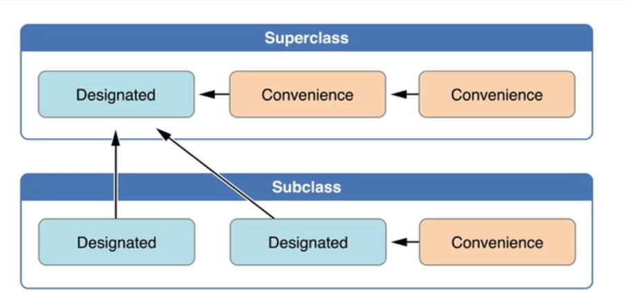
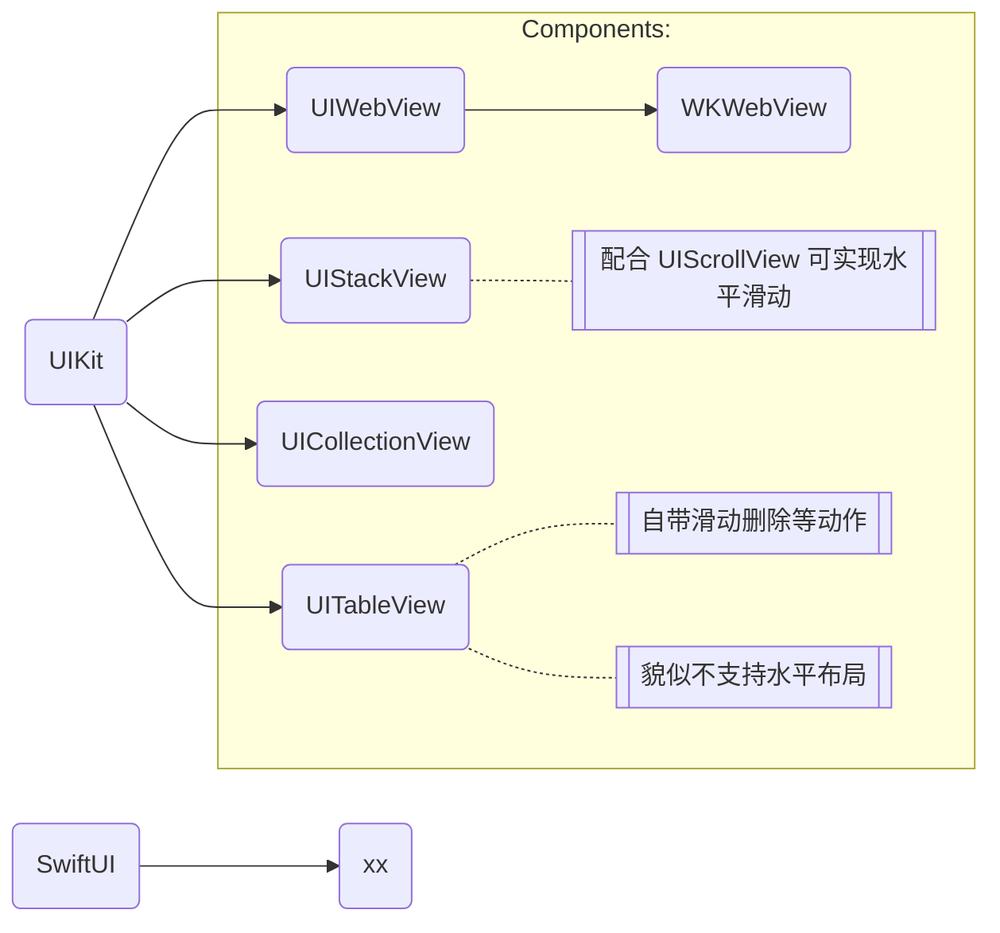

# Swift

## 一、基础概览

### 1. 变量
Category | Keyword | Desc | Note | More
:-- | --- | :-- | --- | ---
命名 | | 1. 包含几乎所有字符，包括 Unicode 字符<br>2. 不能以数字开头<br>3. 不能包含：数学符号、箭头、连线与制表符<br>4. 不能包含：保留或非法 Unicode 码位 | 所以可以看到```#xxx```以及```@xxx``这样的关键字，如 ```#selector```
声明 | ```let```<br>```var``` | ```let name = 0```<br>```let name: Int = 0```<br>```var name = 0```<br>```var name: Int = 0```<br>```var name: Int? = nil``` | 类型可以自动推导
声明 | | ```var num: Int!```<br>```num = 1``` | 隐式解析可选类型 | 相当于告诉编译器：使用 optional 值之前，一定会被初始化并且有值，所以在使用时，编译器帮忙做拆包
声明 | ```lazy var``` | 延时加载存储属性：第一次被调用时才会计算其初始值 | 只能对 var 关键字使用 | 延时加载存储属性的初始值可能在实例构造完成后才得到, 而常量属性在构造过程完成之前必须要有初始值
声明 | ```optional``` | ```var x: Int?```<br>```var x: optional Int``` | 可选类型, 表示可能有值，也可能为空
类型 | class | 引用类型 | 
类型 | struct | 值类型 | 
类型 | enum | 值类型 | ```enum Name : RawType {```<br>&ensp;&ensp;```case xxx```<br>```}``` | 具有原始值和关联值
基本类型 | integer | 值类型 | 
基本类型 | floating | 值类型 | 
基本类型 | boolean | 值类型 | 
基本类型 | string | 值类型 | 
基本类型 | array | 值类型 |
基本类型 | dictionary | 值类型 | ```let dict: [Int:Int] = [:]```<br>```let dict = [Int:Int]()```<br>```let dict = Dictionary<Int,Any>()```
类型 | set | | ```let set: Set<Int> = [1,2,3]```<br>```let set: Set = [1,2,3]```<br>```let set = Set(arrayLiteral: 1,2,4)```
比较 | ```===```<br>```!==``` | 恒等运算符 | 适用于引用类型，判定两个常量或者变量是否引用同一个实例
别名 | ```typealias``` | ```typealias alias = UInt16``` | 可以在任何使用原始名的地方使用类型别名
类型占位符 | ```associatedtype``` | ```associatedtype Item``` | 常于协议中使用类型占位符
. | ```switch```<br>```case```<br>```fallthrough``` | case 中默认终止后续 case | 如果想让 case 之后的语句按顺序继续运行，则需要使用 ```fallthrough```

#### 1.1 值类型：
- 值类型是这样一种类型，当它被赋值给一个变量、常量或者被传递给一个函数的时候，其值会被拷贝。
- Swift 中所有的基本类型都是值类型，其底层也是使用结构体实现的。
  + 标准库定义的集合，例如数组，字典和字符串，都对复制进行了优化以降低性能成本。新集合不会立即复制，而是跟原集合共享同一份内存，共享同样的元素。在集合的某个副本要被修改前，才会复制它的元素。

#### 1.2 类型占位符
```
protocol CJLStackProtocol {
    //协议中使用类型的占位符
    associatedtype Item
}
struct CJLStack: CJLStackProtocol{
    //在使用时，需要指定具体的类型
    typealias Item = Int
    private var items = [Item]()
}
```

### 2. 类
Name | Desc | Note | More
:-- | :-- | --- | ---
类对象 | ```class x {}``` | 类定义的所有存储属性**必须**在调用父类初始化器之前完成初始化 | 构造函数 ```init()```
协议 | ```protocol x {}``` |  只能包含计算型变量或方法
继承 | ```class x : BaseClass, BaseProtocol {}``` |
扩展 | ```extension x {}```<br>```extension x : BaseClass, BaseProtocol {}``` | 只能包含计算型变量或方法
泛型 | ``` ``` | 

构造函数类别 | Desc | Note | More
:-- | :-- | --- | ---
normal | ```deinit()``` | 反初始化
normal | ```init()``` | 初始化 | 没有显示声明初始化器时，会生成默认初始化器 ```init() {}```
optional | ```init?()``` | 可失败初始化器，常见的有：<br>1. 使用 storyboard 构建界面时调用的：```init?(coder aDecoder: NSCoder)```
required | ```required init()``` | 必要初始化器, 强制子类重写此构造函数
convenience | ```convenience init()``` | 1. 不能被子类重写或是从子类中以 super 方式被调用<br>2. 内部必须最终调用到指定初始化器 ```self.init()```



### 3. 函数


### 4. 常见操作
Name | Desc | Note | More
:-- | :-- | --- | ---
三元运算符 | ```a ? b : c``` | Ternary Conditional Operator 
空合运算符 | ```a ?? b``` | Nil Coalescing Operator | 1. 如果 a 有值就解包，否则返回默认值 b<br>2. 表达式 a 必须是 Optional 类型<br>3. 默认值 b 的类型必须要和 a 存储值的类型保持一致<br>4. 是以下代码的简短表达: ```a != nil ? a! : b```
区间运算符 | ```a...b```<br>```a..<b``` | Range Operators | 闭区间<br>前闭后开区间
可选绑定 | ```if let constName = someOptional { statements }``` | optional binding | 判断可选类型是否包含值，如果包含就把值赋给一个临时常量或者变量 | 可选绑定可以用在 if 和 while 语句中

#### 区间运算符(Range Operators)
区间运算符不止有闭区间、半开区间，还有一种 单侧区间：可以表达往一侧无限延伸的区间。

例如，一个包含了数组从索引 2 到结尾的所有值的区间。在这些情况下，你可以省略掉区间操作符一侧的值。这种区间叫做单侧区间，因为操作符只有一侧有值。例如：
```
for name in names[2...] { /* statement */ }
for name in names[...2] { /* statement */ }
for name in names[..<2] { /* statement */ }
```

单侧区间不止可以在下标里使用，也可以在别的情境下使用。你不能遍历省略了初始值的单侧区间，因为遍历的开端并不明显。你可以遍历一个省略最终值的单侧区间；然而，由于这种区间无限延伸的特性，请保证你在循环里有一个结束循环的分支。你也可以查看一个单侧区间是否包含某个特定的值，就像下面展示的那样。
```
let range = ...5
range.contains(7)   // false
range.contains(4)   // true
range.contains(-1)  // true
```

### 常见控件
Category | Name | Desc | Usage | More
--- | --- | --- | --- | --- 
. | UIScrollView | 相当于提供了滚动条功能
. | UIStackView | 
. | UITableView | 1. 自带左滑删除条目<br>2. 貌似不能水平滚动
. | UICollectionView | 

### closure
Trailling Closure
Escaping Closure

UIWebView ---> WKWebView
### 错误处理

### 
引用计数仅仅应用于类的实例。结构体和枚举类型是值类型，不是引用类型，也不是通过引用的方式存储和传递。

Swift 提供了两种办法用来解决你在使用类的属性时所遇到的循环强引用问题：弱引用（weak reference）和无主引用（unowned reference）。


属性的访问冲突​

如结构体，元组和枚举的类型都是由多个独立的值组成的，例如结构体的属性或元组的元素。因为它们都是值类型，修改值的任何一部分都是对于整个值的修改，意味着其中一个属性的读或写访问都需要访问整一个值。例如，元组元素的写访问重叠会产生冲突：

限制结构体属性的重叠访问对于保证内存安全不是必要的。保证内存安全是必要的，但因为访问独占权的要求比内存安全还要更严格——意味着即使有些代码违反了访问独占权的原则，也是内存安全的，所以如果编译器可以保证这种非专属的访问是安全的，那 Swift 就会允许这种行为的代码运行。特别是当你遵循下面的原则时，它可以保证结构体属性的重叠访问是安全的：

你访问的是实例的存储属性，而不是计算属性或类的属性
结构体是本地变量的值，而非全局变量
结构体要么没有被闭包捕获，要么只被非逃逸闭包捕获了
如果编译器无法保证访问的安全性，它就不会允许那次访问。

## 列表
### 环境：
xcode：target、project、workspace、.xcodeproj、.xcworkspace、project.pbxproj、project.xcworkspace
Pod: 

### Swift\UIKit\SwiftUI ：object-c



- 唯一id
  + keychain

- 关键字
  + #selector : https://blog.csdn.net/wangyanchang21/article/details/78928925

### UIKit
https://www.cnblogs.com/huliangwen/p/5444280.html

### Tests


