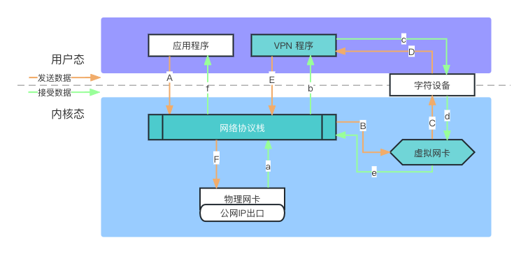
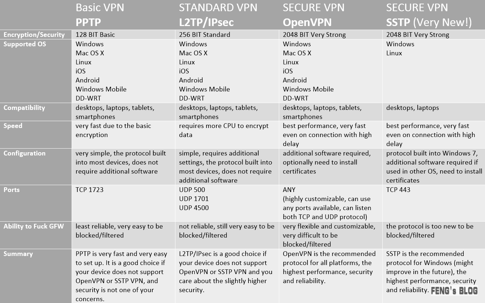

#
## 链路流程
APP 
主机
GFW
代理服务器
目标

## 基础
### TAP/TUN
- tun 是三层设备，是 PPP 点对点设备，没有 MAC 地址，其封装的外层是 IP 头
- tap 是二层设备，以太网设备，有 MAC 地址，其封装的外层是以太网数据帧(frame)头
- tap 比 tun 更接近于物理网卡，可以认为，tap 设备等价于去掉了硬件功能的物理网卡

相比于物理网卡负责内核网络协议栈和外界网络之间的数据传输，虚拟网卡的两端则是内核网络协议栈和用户空间，它负责在内核网络协议栈和用户空间的程序之间传递数据：​

发送到虚拟网卡的数据来自于用户空间，然后被内核读取到网络协议栈中；内核写入虚拟网卡，准备通过该网卡发送的数据，目的地是用户空间。

做 为虚拟网卡驱动，Tun/tap驱动程序的数据接收和发送并不直接和真实网卡打交道，而是通过用户态来转交。

SS 原理

## 
中转使得出国相对更稳定一点，BGP 是中转的一种方式，有的过墙有的不过。IPLC（也称专线）不过墙，目前机场语境下的 IPLC 主要的是指阿里云内网。如深港即深圳阿里云 -- 香港阿里云，点对点连接。

IPLC: "International Private Leased Circuit"的缩写，即“国际专线”
    阿里的经典网络，跨数据中心内网互通，阿里内网，并不是严格意义的iplc专线；但阿里云内网这种性价比超高，好东西，且用且珍惜
Anycast

BGP

「原生IP」
    所谓原生IP通常意思为当地运营商原本就拥有的IP；广播国家一般和注册国家相同（一般的IP库不会误判地区），一般不用于公有云计算服务，一般能够用来解锁Netflix、HBO、Hulu 以及其它有限制的流媒体服务
    原生 IP / 本土 IP：是指 VPS 所被分配到的 IP 的注册地址和 VPS 所在的国家 / 地区一致的 IP。

广播 IP：
    VPS 所被分配的 IP 的归属地，不符合该 VPS 所在的地理位置。即，这是从另一个国家 / 地区广播过来的 IP。

流媒体解锁
    很多流媒体服务平台如Netflix会出于版权原因而限制一些特定IP的访问。一般来说网络运营商（如HKT）自己持有的IP，比如商宽、家宽，极少被屏蔽，因为这些IP大多是流媒体服务商的目标客户在使用。家宽IP被屏蔽的几率是最低的，很多ISP的家宽都是动态IP的，很难精准封杀。固定IP的商宽其次。这些流媒体服务商也怕误杀导致投诉，比如GCP的IP段被投诉之后又可以看Netflix了。IDC商家所持有的IP一般会被屏蔽，越大越有名的IDC持有的IP被屏蔽的几率越高。很多IDC会租用运营商的IP从而绕过此类封杀，但是这种方式并不是万无一失的，翻车案例比较多就不再一一例举了。所以除非是商宽、家宽，其他所谓的“原生IP解锁流媒体”都是有几率翻车的。
CN2
    是电信的精品骨干网。首先CN2是一张运营商骨干网，就像电信163、中国移动这一类是同样性质的东西，但相对电信163来说会有更好的稳定性。

Aws/Azure/Gcp这三巨头的线路也还可以，但要说明的是azure/gcp都是按量计费的；
    要是有商家能提供这些线路并且可用流量有100G甚至更高的，且用且珍惜吧。
    aws有轻量服务器，包含了一定的流量，能给得多的商家也好好珍惜用吧
    GCP 可以解锁Netflix，Youtube Premium

TCP加速
    bbr-plus

落地
    即你访问目的所识别的 IP 归属：家宽，商宽，IDC 等。

IP 地理位置为什么重要？DNS 解锁又是怎么一回事？
一切都基本可以认为是地区限制的原因。原生 IP 一般不用于公有云计算服务或 IP 声誉好，一般能够用来解锁 Net­flix、HBO、Hulu 以及其它有限制的流媒体服务。一个极好的例子 Spo­tify 的音乐是分区的。同时，很多海外的购物网站也会有锁 IP 的行为，限定本国家 / 地区的 IP 接入，这个比流媒体的解锁更加麻烦，让不少机场十分难办。

## 协议
工具发展历程：
    vpn -> ss/ssr -> v2ray -> trojan

协议使用：
    vpn: 数据链路层，完全没有特征对抗，主流的VPN协议有PPTP、L2TP、IPSec、OpenVPN和SSTP，具体区别如下：

socks5: 会话层
v2ray: 常用协议组合 - vmess + websocket + tls

运营商会对链路上的数据包做优先级优化(QoS)，以处理拥堵以及网络体验：如，对流媒体包、游戏包、http包等 做不同的优先级，以优化网络体验
    QoS 是一种控制机制，它提供了针对不同用户或者不同数据流采用相应不同的优先级，或者是根据应用程序的要求，保证数据流的性能达到一定的水准。QoS 的保证对于容量有限的网络来说是十分重要的，特别是对于流多媒体应用，例如 VoIP 和 IPTV 等，因为这些应用常常需要固定的传输率，对延时也比较敏感
网关模式代理

常用的客户端：surge(mac)、clash(win)

运营商线路类型：CN2、BGP、IPLC(以及 IEPL, 内网专线)、PCCW

出口是否为原始 ip

GFW 会通过 tcp reset 包进行嗅探测试

如 Clash 的自动测速指定有 url：{http://www.gstatic.com/generate_204}{这个}。这个 url 的好处在于全球都有 CDN？，数值相对准确。

## Android 
流量分流、控制：
    + 国内外流量分流、不同网站流量分流
    + 不同 app 流量分流

## 网络测速
序号 | 节点名称 | 类型 | 平均速度 | 最高速度 | TLS RTT | HTTPS延迟 | Netflix | YouTube | Bilibili | HBO Max | Disney+ | TVBAnywhere | Bahamut | TikTok | ChatGPT | UDP类型 | 
-|-|-|-|-|-|-|-|-|-|-|-|-|-|-|-|-|-
1 | 香港 01 | Shadowsocks | 11.99MB | 14.79MB | 81ms | 407ms | OK(HK) | OK(HK) | OK(HK) | OK | OK(HK) | OK(TW) | OK | OK(TW) | OK(SG) | Unknown

## 配置转换
https://clash.skk.moe/proxy

##
- [漫谈各种黑科技式-dns-技术在代理环境中的应用](https://tachyondevel.medium.com/%E6%BC%AB%E8%B0%88%E5%90%84%E7%A7%8D%E9%BB%91%E7%A7%91%E6%8A%80%E5%BC%8F-dns-%E6%8A%80%E6%9C%AF%E5%9C%A8%E4%BB%A3%E7%90%86%E7%8E%AF%E5%A2%83%E4%B8%AD%E7%9A%84%E5%BA%94%E7%94%A8-62c50e58cbd0)
