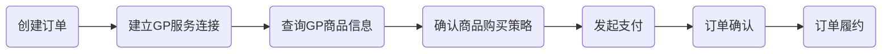
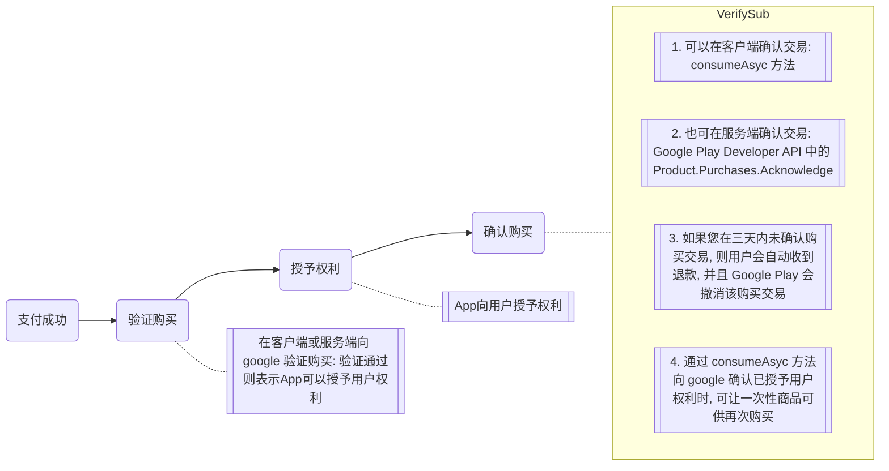
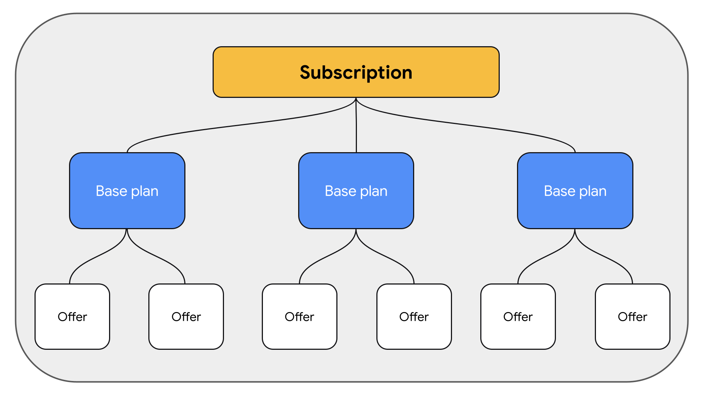

# Android Oversea
## 一、Google Sign-In
### 1.1 Docs
- [Google Sign-In for Android](https://developers.google.com/identity/sign-in/android/start)
- [使用 OAuth 2.0 访问 Google API](https://developers.google.com/identity/protocols/oauth2)

### 1.2 登陆方式：
1. requestIdToken
   1. ```GoogleSignInOptions.Builder(GoogleSignInOptions.DEFAULT_SIGN_IN).requestIdToken```
      + 获取到的 id token 会过期
      + 如果没有处理登出，重新进入 app 时，登录会话保持，此时刷新(```silentSignIn```)获取 id token 即可
   2. 使用 Google ID 来识识别用户，而不是电子邮件地址
      + Google 帐户的电子邮件地址可以更改，因此请勿使用它来识别用户
   3. 实际上，仅通过登录后获得的```GoogleSignInAccount```的即可获得用户的 Google ID(```getId```方法) 等基础信息
   4. 为了使用 Google 的用户信息在自己的服务器端建立会话或创建新帐户，需要使用 ```ID Token``` 
      + 仅使用 Google ID 即可标识用户的唯一性，用于创建自己 app 的账号，为什么还要 ID 令牌？
        - 不安全，修改后的客户端应用程序可以将任意用户 ID 发送到您的服务器以模拟用户
2. requestServerAuthCode
   1. ```GoogleSignInOptions.Builder(GoogleSignInOptions.DEFAULT_SIGN_IN).requestServerAuthCode```
      + 重新进入 app 后，触发登陆时，需要重新获取 authCode，不论登录会话是否保持；否则没办法完成账号转换流程
   2. 如果您希望服务器能够代表用户（可能是在用户离线时）进行Google API调用，则您的服务器需要访问令牌
      + 可以获取包括 ID 令牌在内的更多信息 
3.  GoogleSignInOptions.Builder(GoogleSignInOptions.DEFAULT_SIGN_IN)
    1. **不需要服务端参与**即可获取 ```Google user's ID```, ```email address```, 和其它的 ```basic  profile```
    2. 可以使用 ```GoogleSignIn.hasPermissions``` 判断 ```GoogleSignInAccount``` 是否拥有某个 ```Scope``` 的权限


## 二、GooglePlay Payment

### 2.1 [Google Play 结算系统](https://developer.android.com/google/play/billing?hl=zh-cn)
- [集成示例代码](https://developer.android.com/google/play/billing/additional-resources?hl=zh-cn#samples)
  + 有服务器的集成
  + 无服务器的集成

### 2.2 流程
#### 商品类型
+ INAPP
  - 消耗型(可以重复购买)
  - 非消耗型
+ SUBS

#### 流程


此外还会有：
- 异常订单处理(MissingPurchase)
  + 如，支付完成后没有及时履约等
- 支付信息找回(Restore)
  + 如，更换设备后(APP没有自己的账号体系时)找回用户支付状态信息等

需要注意的是：
- 消耗型 INAPP 商品
  + 在 consumePurchase 后，通过 ```billingClient.queryPurchasesAsync``` 查不到
  + ```https://developer.android.com/reference/com/android/billingclient/api/BillingClient?hl=zh-cn#queryPurchaseHistoryAsync(com.android.billingclient.api.QueryPurchaseHistoryParams,%20com.android.billingclient.api.PurchaseHistoryResponseListener)```

#### 订单确认


#### Docs
- [App 出海 —— Google 结算系统面面观](https://segmentfault.com/a/1190000041772825)

### 订阅
Subscribtion 有[三个层级](https://support.google.com/googleplay/android-developer/answer/12154973?hl=zh-Hans)：（由上至下）

- Subscribtion
  + APP定义的商品，有唯一的 ```ProductId```
    - ```ProductDetails```: 包含```OneTimeProductDetails```、```SubscriptionOfferDetails```以及当前的默认价格信息```PricingPhase```
- Plan
  + 某个商品的购买计划，如价格方案(包月、包年、预付费...)等
  + 一个商品可以有多个 Plan (可以在控制台设置不同的 ```offerTags```)
    - ```ProductDetails.SubscriptionOfferDetails```: ```Represents the available purchase plans to buy a subscription product```
- Offer
  + 针对某一购买计划的优惠方案
  + 一个 Plan 可以有多个 Offer
    - ```ProductDetails.SubscriptionOfferDetails``` -> ```PricingPhases```

#### 订阅升降级
- 同一个商品只能有一个 Plan 被购买
  + 多个 Plan 之间可以互相升降级
- 不同商品之间也可以升降级
  + 也可以被同时购买(由产品定义的商品性质决定)

### 优惠
#### 疑问
1. 优惠的 ID 和 标签怎么获取？？？

#### Docs
[创建和管理订阅](https://support.google.com/googleplay/android-developer/answer/140504?#create_new_offer&zippy=%2C%E5%88%9B%E5%BB%BA%E5%B9%B6%E5%90%AF%E7%94%A8%E4%BC%98%E6%83%A0)

### 测试
1. 添加测试账号到谷歌后台: 
   + 包括**内测用户**添加和**许可测试**添加，两者都需要添加。
   + 接受测试邀请：找到内测链接，点击接受内测邀请(这一步很重要，但容易遗漏)
2. 需要发布内测版本，根据 Google Console 的要求发布一个内测版本，无需等待审核通过

#### 可能遇到的问题
1. 连接不上 gp 服务 或 查询不到商品... 等各种奇葩问题
   + 测试登录支付时，一定要连 vpn ，最好时 新加坡日本(非香港出口) 等
   + 出现后解决方法：
      - 清除 google play 的数据
      - 退出 gp 账号重新登录

## 三、[Google Pay](https://developers.google.cn/pay/api/android/overview?hl=zh-cn) 
Apple Pay and Google Pay 本质上是电子钱包(digital wallet)

- [stripe(作为gateway) 对接 google play](https://stripe.com/docs/google-pay)
- [Google Pay 谷歌支付（gateway = stripe）](https://juejin.cn/post/6922022472611004429)
- [What is a Payment Gateway?](https://www.ecommerceceo.com/learn/payment-gateway/)
- [What is Google Pay](https://ecommerce-platforms.com/payments/what-is-google-pay)
- [Google Pay vs. Google Wallet: What’s different?](https://blog.clover.com/google-pay-vs-google-wallet-whats-different/)

