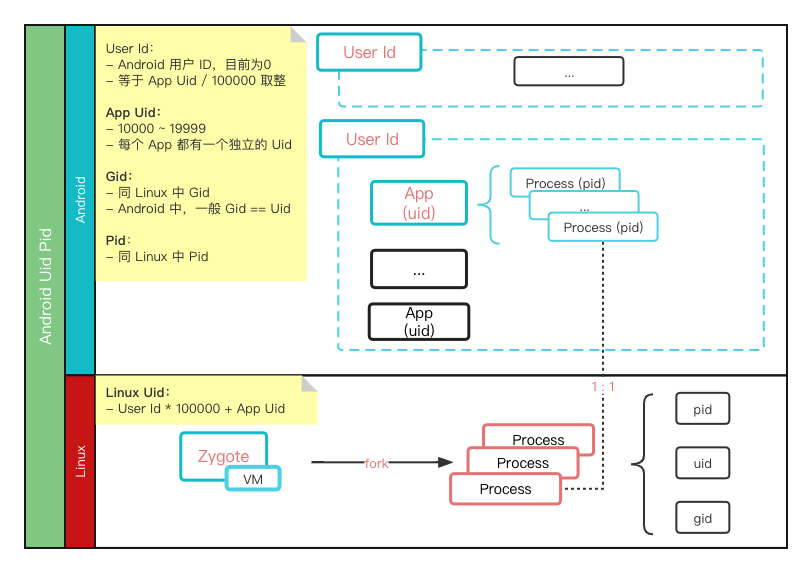

# Android
## 1、Uid、Pid、User Id


### 1.1 查看
```adb shell ps | grep com.tencent.mm```

u0_a110

以"_"为界线, 前一部分是UserId, 后一部分是ApplicationId. 转为int值即为:
u0_a110 == 0 * 100000 + (10110) == 10110 == uid;
         (u0)*(十万)   a110

1> u0即表示userId = 0;
2> a110中的"a"永远翻译为10000(一万)
2> "userId * 100000 + appId = uid"是代码中写死的规则, 全系统通用.

```adb shell cat proc/[pid]/status```
查看系统中 进程相关的 Gid、Uid 等信息

### 1.2 获取
通过包名获取UID
```
    PackageManager mPm = getPackageManager();
    try {
        ApplicationInfo applicationInfo = mPm.getApplicationInfo("com.tencent.mm", 0);
        int uid = applicationInfo.uid;
        Toast.makeText(MainActivity.this, "" + uid, Toast. LENGTH_SHORT).show();
    }catch (Exception e){
        e.printStackTrace();
    }
```

通过 UID 获取包名
```
String packagename = getPackageManager().getNameForUid(uid);
```

### 1.3 系统分配
https://www.jianshu.com/p/b33dd49f2ae6

## 2、Storage
[应用数据和文件](https://developer.android.google.cn/guide/topics/data)

内部存储、外部存储(专有、共享)

/
    data ：内部存储
    mnt ：外部存储
    sdcard ：外部存储
    storage/emulated/<legacy> ：外部存储

内部存储
    /data/user/0/<package> ：其中0表示用户ID
    /data/data/<package>   ：实际上是/data/user/<legacy:current_user_id>/<package>的一个链接
        /data/data/<package>/files
        /data/data/<package>/cache
        /data/data/<package>/shared_prefs
        /data/data/<package>/databses

外部存储    
    /sdcard/
    /mnt/sdcard/ : Android4.0版本之前的显示
    /storage/sdcard0 : Android4.0版本之后的显示
    /storage/emulated/<legacy> ：

    随着 android 系统的发展，外部存储的挂载点依次变化，同时为了向后兼容，把以前的挂载点软链到新的挂载点

    /storage/emulated/0/Android/data/<package> ： 外部存储私有目录
    /storage/emulated/0/Android/data/<package>以外 ： 外部存储公有目录


项目 | Android 10以前 | Android 10 | Android 10之后
:--|--|--|--
内部存储<br>(只能访问私有目录) | 无权限要求 | 无权限要求 | 无权限要求
外部存储: Read | READ_EXTERNAL_STORAGE<br>随意读操作外部存储 | - | -
外部存储: Write | WRITE_EXTERNAL_STORAGE<br>随意写操作外部存储 | - | -
requestLegacyExternalStorage | - | 有效<br>设置为 true 可停用分区存储 | 无效
外部存储: 分区存储 | - |  &#9745; |  &#9745;

> 在启用分区存储后，亦可以通过直接文件路径访问，但需要 READ_EXTERNAL_STORAGE 权限

分区存储 | 细分 | 内容 | 访问 | 权限 | 其他应用访问 | 卸载时移除文件
:--|--|--|--|--|:-|:-:
专属存储 | - | | getFilesDir()<br>getCacheDir()<br>getExternalFilesDir()<br>getExternalCacheDir() | | &#9744; | &#9745;
共享存储 | 媒体 | 图片<br>音频<br>视频 | MediaStore API | | &#9745; <br> 但需要权限：<br>android.permission.READ_MEDIA_IMAGES<br>android.permission.READ_MEDIA_VIDEO<br>android.permission.READ_MEDIA_AUDIO  | &#9744;
共享存储 | 文档、<br>其他文件 | | SAF | | &#9745; <br> 可以通过系统文件选择器访问 | &#9744;
共享存储 | 数据集 | | BlobStoreManager API | | | &#9745;

## 3、Reflection
https://blog.csdn.net/u011240877/article/details/54604212
https://www.cnblogs.com/jimuzz/p/14297042.html
