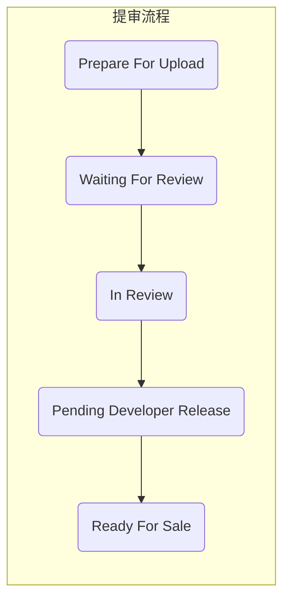
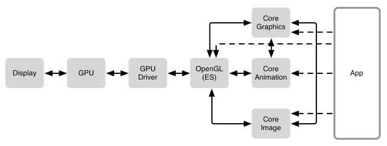
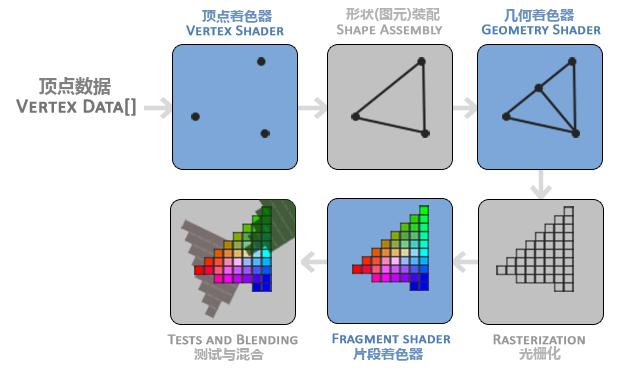
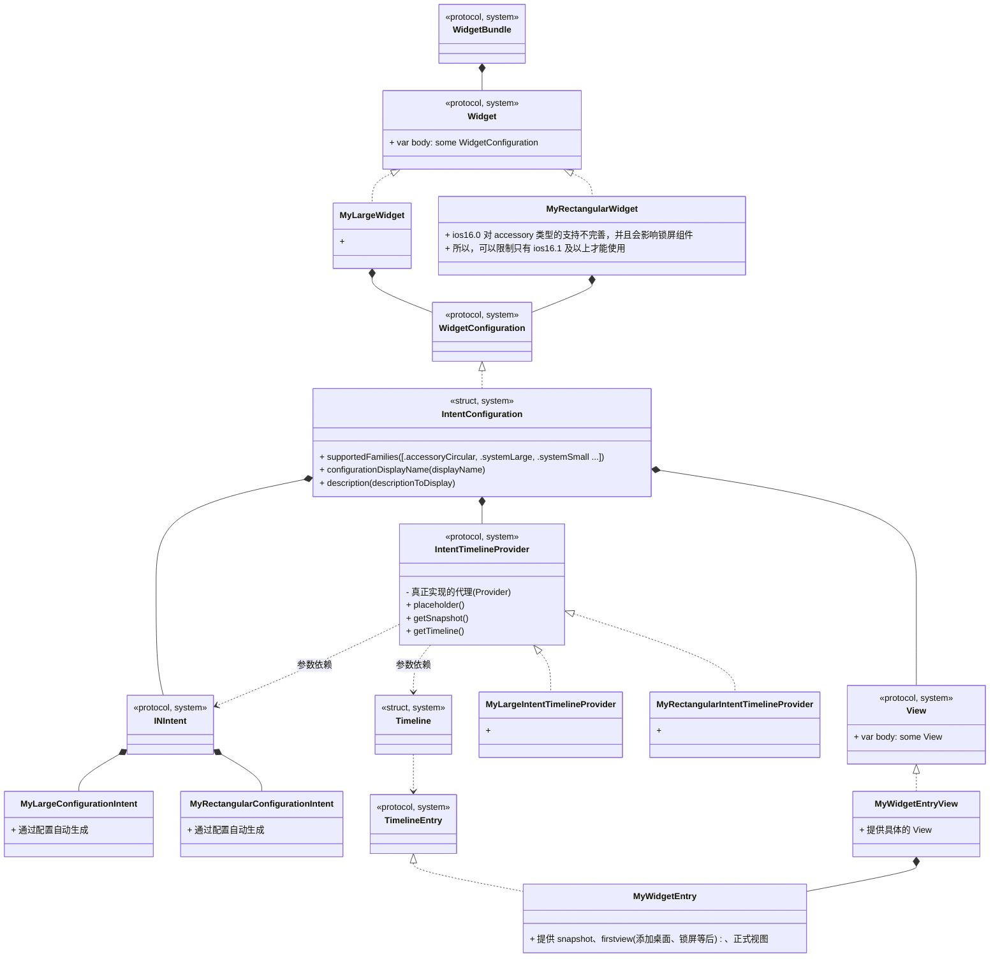
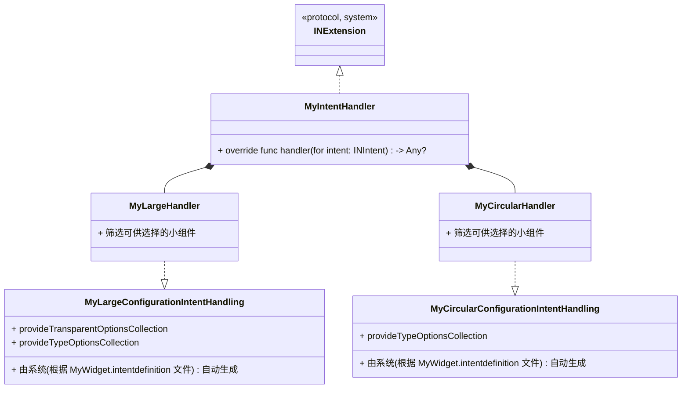

# MacOS 要点

## 基础概括
### 命名
在开发过程中经常见到一些库的前缀，如，NS 等，了解其含义后可以帮助我们快速掌握其核心：
- NS
  + 乔帮主当年被人挤兑出苹果，自立门户的时候做了个公司叫做 NextStep，里面这一整套开发包很是让一些科学家们喜欢，而现在Mac OS用的就是NextStep这一套函数库，里面所有的类都用NextStep的缩写打头命名，也就是 NS**** 
- CF：```Core Foundation```
- CA：```Core Animation```
- CG：```Core Graphics```
- UI：```User Interface```

### Project & Package
- Workspace
  - Xcode的一种文件，用来管理工程和里面的文件，一个workspace可以包含若干个工程，甚至可以添加任何你想添加的文件
  - workspace中的工程默认都是在同一个编译目录下，也就是workspace的编译目录。由于每个工程中的文件都在workspace的编译目录下，所以每个工程之间的文件都是相互可以引用的。
- Project
  - project里面包含了所有的源文件，资源文件和构建一个或者多个product的信息。project利用他们去编译我们所需的product，也帮我们组织它们之间的关系。
  - 一个project可以包含一个或者多个target。project定义了一些基本的编译设置，每个target都继承了project的默认设置，每个target可以通过重新设置target的编译选项来定义自己的特殊编译选项。
- Target
  - target定义了构造一个product所需的文件和编译指令。一个target对应于一个product。target说白了就是告诉编译系统要编译的文件和编译设置。编译指令就是根据build settings and build phases来确定的。
- Scheme
  - scheme定义了编译集合中的若干target，编译时的一些设置以及要执行的测试集合。
- Group
  - 用于在 XCode 的目录结构导航栏中组织源文件。Project文件始终是组(group)和文件结构层次结构(file structure hierarchy)的根
  - 指定某些文件的所属工程目录(.pbxproj 文件)的路径

- Package : Swift Package
  - Multiplatform
- Framework 
  - Multiplatform
  - 实质上，就是一个有着特定结构的文件夹，其中存放各种共享的资源。这些资源通常是 图片、Xibs、动态库、静态库...等，它们被封装成 bundle 存储
  - 有一个独立的工作区(运行环境)，所以嵌入的依赖库可以和 app 环境的依赖库相同，且不会产生 duplicate symbol
- Static Library
  - 不能使用 Swift 代码 ？？
- Dynamic Library
- Metal Library
  - Metal 是一个和 OpenGL ES 类似的面向底层的图形编程接口，通过使用相关的 api 可以直接操作 GPU
  - Metal 是 iOS 平台独有的，意味着它不能像 OpenGL ES 那样跨平台，但是它能最大的挖掘苹果移动设备的 GPU 能力，进行复杂的运算，像 Unity 等游戏引擎都通过 Metal 对 3D 能力进行了优化
  - 下边的层级关系可以帮助我们更好的认识 Metal(平时接触的较多的是前两层)：
    - ```UIKit -> Core Graphics/Animation/Image -> Metal/OpenGL ES -> GPU Driver -> GPU -> Display```


## 过审


苹果审核，分为：
- 预审
- 机审  
  + 机审主要是对代码进行机器审核，排查APP是否重复应用

- 人工审核
  + 主要在 In Review（审核）阶段
  + 这个阶段主要看的是App的元数据，例如APP封面、功能、体验等等，注重用户体验。

### 马甲包
马甲包主要有以下几种用途：

#### A/B测试
正常情况下，任何一款产品都是要不断的更新功能的。如果我们直接在主包上更新，一旦新功能不被用户接受那就损失大了，我们前期大量投资带来的用户将会流失，这对很多产品开发者来说是不可承受之痛。

如果使用马甲包，则可以随意测试新功能，好的功能就在主包上迭代，不好的也无所谓，马甲包本身就是来背锅的。

#### 抗风险
马甲包对于优化人员来说就是一个试水的工具，用于app刷量、规避账号限制、防下架应急措施、竞品竞争等，规避主包风险，当主APP或马甲包被应用市场下架后，用户也可以被导向另一APP。

#### 导量
主包和马甲包属于同一个平台，用户信息可以共享。通过弹窗,广告,Push等引导用户到App Store下载主App。

有一部份App接了网盟相互导流。

#### 增加关键词覆盖数
App Store关键词长度上限是100个字符,据了解人为正常优化的极限是关键词覆盖数在4000左右,那些覆盖数在8000+的都是利用了苹果漏洞。所以,多做一个马甲,也就意味着覆盖的关键词可以更多。


### 注意事项
分类 | 描述 | 优先级 | 处理 | 备注
--- | --- | --- | --- | ---
Info.plist | 属性列表 | | | iOS的app都使用Info.plist文件来存储元信息，用来实现决定bundle所显示的icon，当前app支持打开的文档类型，服务声明等等。
Private API | 私有API检查 | | | 1. 私有API是指放在 PrivateFrameworks 中的API<br>2. 会针对所有固件版本检查
. | 只声明没实现的方法 | | |  | 如果命中了，被拒的概率是非常非常高的
命名 | 字符串\类名等名字不与系统私有类同名 | | |  | 可以减少被拒的可能性
关键词 | 苹果重点监测的词尽量不要使用，如彩票、热门应用的品牌词等 | | |  | 热门应用的品牌词，会被苹果官方认为会给用户造成误导，从而被拒
. | 存储系统检查 | | |  |
. | 版本号 | | | | 最好加密一下再返回给你，让审核人员看不出来是版本号
Guideline 3.1.1 | 第三方支付 | | |  |
Guideline 2.3.1 | Performance | | |  |
Guideline 4.3 | Design-Spam(重复应用) | | |  |
Guideline 2.1 | Information Needed | | | 如果确认没问题，可以申诉并且成功率较高

## Guideline 4.3 - Design - Spam (重复应用)
对于马甲包，需要仔细研究苹果的审核条款以及采用逆向思维（假如我是审核员，我会怎么审核我们提交的APP）来分析审核中出现的问题。

也可以参考现有成功案例，如：**快手、快手极速版、快手概念版；抖音、抖音极速版 等**

一个 ipa 包主要包含：元数据、代码 以及 资源，所以，可以考虑从以下几方面来改善苹果给予应用的 4.3 反馈：

<div style="width:50px">类别</div> | <div style="width:90px">项目</div> | <div style="width:100px">名称</div> | <div style="width:25px">优先级</div> | 描述 | 说明
:-- | :-- | :-- | --- | --- | ---
元数据 | APP信息 | 1. 名字<br>2. ICON<br>3. 标题、副标题<br>4. 应用描述<br>5. Bundle ID(包名)<br>6. 版权人<br>7. 版本号(规则) | P0 | | 
元数据 | APP信息 | 1. 商店宣传图<br>2. 搜索关键词<br>3. 支持网站<br>4. 隐私协议网站 | P0 | | 
元数据 | APP信息 | 1. 分类<br>2. 地区<br>3. 价格 | P0 | 1. 修改产品分类，打造与原产品不同的产品侧重属性分类<br>2. 修改应用程序发布地区，打造与原产品不同的售卖地区或分不同地区运营<br>3. 针对收费产品，可以修改应用程序价格，打造与原产品不同的价格级别
环境 | 帐号 | 开发者帐号<br>测试账号<br>演示账号 | P0 | | 1. 在同一设备对多个苹果账号开启双重验证的话，苹果很容易将账号之间关联起来
环境 | 打包<br>上传<br>提交 | 电脑<br>IP<br>提交间隔 | P0 | | 1. 每台MAC上打的马甲包不要超过5个<br>2. 上传马甲包时，IP 不要跟其他马甲包的 IP 相同<br>3. 不同马甲包提交应当间隔一天以上
资源 | 合集bundle<br>布局文件<br>图片<br>音视频<br>字体 | 1. 名称、路径<br>2. 属性<br>3. hash值 | P0 | 1. 修改资源(压缩或微调文件)<br>2. 适当添加一些(无用)资源<br>3. 适当删除一些资源| 小道消息，UDID(32位十六进制字符串)也是苹果匹配文件特征的一个方式
资源 | 链接 | 域名<br>接口<br>跳转 ? | P0 | | 苹果会开VPN测试国内APP
人工 | 界面 | UI风格<br>主色调 | P1 | | 
运行时 | UI界面 | 1. 首页面<br>2. 其他页面 | P0 | 1. 运行时界面截屏相似度<br>2. 首页面一定要有差异化<br>3. 最好全新UI
运行时 | 产物 | | ? | 1. 运行时生成的文件(如，日志、配置)<br>2. 
运行时 | 网络 | | ??? | 1. 参数<br>2. 应答 <br>3. webview | 据说，会进行 Mock测试，修改返回信息，然后看APP是否有隐藏功能
运行时 | 代码 | | ?? | 越狱环境下，通过运行时拿到app的所有代码，hook 网络请求，hook C函数，hook 调用栈等
代码 | 混淆 | 类<br>方法<br>属性 | P0 | | 
代码 | 混淆 | 字符串常量<br>uuid | P0 | | uuid 生成规则未知，可以用其他工程生成的uuid替换<br>常见的 uuid 在 project.pbxproj 中
代码 | 混淆 | 文件名<br>目录名<br>工程名<br>目录结构 | P0 | | 文件包括：包括资源和代码
代码 | 混淆 | 静态库加密 | P1 | | 几维安全的在线静态库加密，过审率高且免费，缺陷不能支持脚本加密
代码 | 无效代码 | 类、方法、属性、字符串常量 | P1 | | 1. 垃圾类之间相互调用、主代码调用垃圾类垃圾函数<br>2. 垃圾代码量占总代码的30% - 40%为宜<br>3. 放在独立目录即可
代码 | 重构 | 类或方法 | P1 | 有理由相信，类的属性或方法数超过某一阈值时，会被进一步审核 | 如，某个文件比较大，就需要多去修改里面的方法名，变量名，以及顺序；
代码 | 重构 | 功能 | ？ | 1. 删除部分功能<br>2. 添加某些功能 | 修改功能特征，最好不能完全使用之前的功能
代码 | 重构 | 第三方库(框架) | ??? | 1. 替换、添加或删除<br>2. 导入几个无用库、框架<br>3. 嵌入的SDK需要单独申请(?) | 个人觉得，应当排除掉三方库，再来比对项目独有特征的相似性


注意：
- App的应用元数据指的是我们需要在开发者后台所填写的资料，包括但不限于标题、简介、关键词等。这些尽量保持唯一性，对于过审是有帮助的
- 代码审核，主要在 机器审核 阶段，我们认为要求代码的相似程度不高于45%
- 混淆可以降低反馈 4.3 的概率，但是苹果也会逐渐加强这方面的审核技术，如果检测到代码混淆比较明显的话，就会给予 2.3.1 的反馈。
- 推荐用一些比较高级的代码混淆技术来提高过审几率，例如顶象技术的iOS安全编译器来混淆代码的，主要还免费
- 编译路径，xcode编译的时候会把部分文件的路径编译进二进制，用户Users目录同时也会包含在里面
- 两个马甲包不要关联到同一个开发者帐号的信息；比如打包时关联。并且苹果对开发者帐号会进行权重管理，权重越低的帐号，审核越严格。同样的包，可能在权重高的帐号上就能过，在权重低的帐号上就是4.3
- *马甲包激活数据能否提供 ; 马甲包用户数据库独立，不使用主包的库（主要用于IDFA排重）;*

## Symbols - dSym

### 简介
dSym 指的是 Debug Symbols, 我们称之为符号表文件。包含着内存与符号如函数名，文件名，行号等的映射，在崩溃日志分析方面起到了举足轻重的作用。

dwarf 的全称是 Debugging with Attribute Record Formats，其实，就是一种源码调试信息的记录格式，主要用于源码级调试，如 gdb、llvm 调试或者在 Xcode 进行断点调试。

### 构成
dSYM 的文件构成：
```
MyDemo.app.dSYM
└── Contents
    ├── Info.plist
    └── Resources
        └── DWARF
            └── MyDemo 
```

在汇编产生的目标文件(```*.o```)中，包含着```dwarf```信息。
1. 如果我们在 Debug 模式下打包且选择了 Debug Information Format 为 DWARF
   - 那么最终的 App Mach-O 文件中则会包含 dwarf 信息
2. 如果我们在 Release 模式下打包且选择了 Debug Information Format 为 DWARF with dSYM File
   - 那么则会通过 dsymutil 根据 Mach-O 文件中的 dwarf 信息生成```dSYM```文件
   - 然后通过 strip 命令去除掉 Mach-O 中的调试符号化信息，以减少包体积以及不必要的源码隐私泄漏


### 疑问
#### XCode编译后没有生成dSYM文件？

XCode Release 编译默认会生成 dSYM 文件，而 Debug 编译默认不会生成。可以修改对应的Xcode配置，如下即可：
```
XCode -> Build Settings -> Code Generation -> Generate Debug Symbols -> Yes
XCode -> Build Settings -> Build Option -> Debug Information Format -> DWARF with dSYM File
```

此外，只有当 Crash 对应 APP 的 UUID 和 dSYM 的 UUID 相匹配时，符号才可用。可用通过命令查看 dump 的 UUID：```xcrun dwarfdump --uuid <dSYM文件>```

#### XCode编译后生成的dSYM文件位置？
找到 XCode 的项目目录列表中的```Products```目录，其中包含了生成的```*.app```文件，右键此文件，选择```Show in Finder```，即可看到```*.app.dSYM```文件


### Reference
- [Bugly iOS 符号表配置](https://bugly.qq.com/docs/user-guide/symbol-configuration-ios/?v=1.0.0)


## Rending


- Core Animation
  + Core Animation 源自于 Layer Kit，动画只是 Core Animation 特性的冰山一角。
  + Core Animation 是一个复合引擎，其职责是 尽可能快地组合屏幕上不同的可视内容，这些可视内容可被分解成独立的图层（即 CALayer），这些图层会被存储在一个叫做图层树的体系之中。
  + 从本质上而言，CALayer 是用户所能在屏幕上看见的一切的基础。
- Core Graphics
  + Core Graphics 基于 Quartz 高级绘图引擎，主要用于运行时绘制图像。
  + 开发者可以使用此框架来处理基于路径的绘图，转换，颜色管理，离屏渲染，图案，渐变和阴影，图像数据管理，图像创建和图像遮罩以及 PDF 文档创建，显示和分析。
- Core Image
  + 与 Core Graphics 相反，Core Graphics 用于在 运行时创建图像，而 Core Image 是用来处理 运行前创建的图像的。
  + Core Image 框架拥有一系列现成的图像过滤器，能对已存在的图像进行高效的处理。

### UIView 与 CALayer 的关系
CALayer 事实上是用户所能在屏幕上看见的一切的基础。而 UIKit 中的视图之所以能够呈现可视化内容，就是因为每个视图控件内部都有一个关联的 CALayer。

由于这种一一对应的关系，视图层级拥有 视图树 的树形结构，对应 CALayer 层级也拥有 图层树 的树形结构。

其中，视图的职责是 创建并管理 图层，以确保当子视图在层级关系中 添加或被移除 时，其关联的图层在图层树中也有相同的操作，即保证视图树和图层树在结构上的一致性。

> 那么为什么 iOS 要基于 UIView 和 CALayer 提供两个平行的层级关系呢？

其原因在于要做 职责分离，这样也能避免很多重复代码。在 iOS 和 Mac OS X 两个平台上，事件和用户交互有很多地方的不同，基于多点触控的用户界面和基于鼠标键盘的交互有着本质的区别，这就是为什么 iOS 有 UIKit 和 UIView，对应 Mac OS X 有 AppKit 和 NSView 的原因。它们在功能上很相似，但是在实现上有着显著的区别。

> 实际上，这里并不是两个层级关系，而是四个。每一个都扮演着不同的角色。除了 **视图树** 和 **图层树**，还有 **呈现树** 和 **渲染树**。

### 图形渲染
计算机将存储在内存中的形状转换成实际绘制在屏幕上的对应的过程称为**渲染**。渲染过程中最常用的技术就是**光栅化**。一句话总结：光栅化就是将数据转化成可见像素的过程。

#### GPU 图形渲染流水线
GPU 图形渲染流水线的主要工作可以被划分为两个部分：
- 把 3D 坐标转换为 2D 坐标
- 把 2D 坐标转变为实际的有颜色的像素

GPU 图形渲染流水线的具体实现可分为六个阶段，如下图所示。
1. 顶点着色器（Vertex Shader）
2. 形状装配（Shape Assembly），又称 图元装配
3. 几何着色器（Geometry Shader）
4. 光栅化（Rasterization）
5. 片段着色器（Fragment Shader）
6. 测试与混合（Tests and Blending）



#### 纹理（Texture）
纹理（Texture）经常被用来表现细节。纹理是一个 2D 图片（甚至也有 1D 和 3D 的纹理）。纹理一般可以直接作为图形渲染流水线的第五阶段的输入。


## Widget
### extensions


### handler
用于提供用户选择小组件时的功能支持



### 编辑页
一般来说也会提供小组件编辑页，其中需要实时显示最新的小组件预览图，这就要求：更新配置后，预览图实时更新。这与系统调用小组件更新上，功能有重叠的部分，可以通过：将 自定义的config 和 view 封装成一个 ViewHolder 然后被外部使用。

### 注意
1. 小组件申请位置权限
   + 在主工程(the containing app)项目中申请位置权限
     - 必需在主工程 的 Info.plist 文件中添加相关用途字符串
   + 将```NSWidgetWantsLocation```键添加到 widget extension 的 Info.plist 文件中
     - 类型为：Boolean
2. 小组件视图更新
   + 预览图：小组件视图可以通过 renderToImage 生成预览图
   + 实时图：更新相关配置后，可以通过系统强刷接口强制刷新
3. 小组件交互
   + 通过 小组件View 的 widgetURL 方法指定:
      - 注意：```Widgets support one widgetURL modifier in their view hierarchy. If multiple views have widgetURL modifiers, the behavior is undefined.```


## DynamicIsland(灵动岛)、LiveActivity(实时活动)
### 简介
1. 样式(显示实时活动的视图)
   + 包括：紧凑前视图、紧凑尾视图、最小视图和扩展视图
   + 位置：
     + 灵动岛
       - 条件：需要设备支持灵动岛
       - 视图：当用户触摸灵动岛，且灵动岛中有紧凑或最小视图，同时实时活动更新时，会出现扩展视图
     + 锁屏界面上的 banner 卡片
       - 条件：需要设备系统在 iOS 16 及以上
       - 视图：在不支持灵动岛的设备上，锁屏时将显示此视图
   + 在支持实时活动的设备的灵动岛上：
       - 当 App 开始一个唯一活跃的实时活动时，紧凑前视图和尾视图一起出现，在灵动岛中形成一个有凝聚力的视图
       - 当多个实时活动处于活动状态时(无论是来自我们的 App 还是来自多个 App)，系统会选择并显示两个最小视图：
         + 一个最小视图显示附加到灵动岛，而另一个显示为分离的样式(一个同灵动岛等高的圆形视图)
       - 默认情况下，灵动岛中的紧凑视图和最小视图使用黑色背景颜色和白色文本。 使用 keylineTint(_:) 修改器将可选的色调应用到灵动岛，例如青色
2. 更新
   + 开发者若要更新实时活动的动态数据，请在 App 中使用 ActivityKit 框架或允许实时活动接收远程推送通知
     - 而小组件通过 timeline 机制进行更新
   + 当实时活动被主动停止时，视图仍可能会存在一段时间，所以，在停止时，系统提供了机会以更新最后的状态：
      ```activity.end(using: finalState, dismissalPolicy: dismissalPolicy)```
3. 限制
   + ActivityKit 更新和远程推送通知更新的更新动态数据大小不能超过 4KB
   + 每个实时活动运行在自己的沙盒中，它无法访问网络或接收位置更新
     - 这一点与小组件有所不同
   + 实时活动会一直保留在锁定屏幕上，直到用户主动将其移除，或交由系统在4小时后将其移除
     - 实时活动会灵动上岛最多保留8小时，在锁定屏幕上最多保留12小时
   + 为确保系统可以在每个位置显示 App 的实时活动，开发者必须支持所有视图
   + 系统会疏忽任何动画修饰符——例如，withAnimation(_:_:) 和 animation(_:value:) 并改用体系的动画时刻。
4. 样式变化


// https://juejin.cn/post/7144268555779850248


### Widget控件尺寸大小
屏幕尺寸(portrait) | Small widget | Medium widget | Large widget
:-: | :-: | :-: | :-: | 
414 x 896 pt | 169 x 169 pt | 360 x 169 pt | 360 x 376 pt
375 x 812 pt | 155 x 155 pt | 329 x 155 pt | 329 x 345 pt
414 x 736 pt | 159 x 159 pt | 348 x 159 pt | 348 x 357 pt
375 x 667 pt | 148 x 148 pt | 322 x 148 pt | 322 x 324 pt
320 x 568 pt | 141 x 141 pt | 291 x 141 pt | 291 x 299 pt


机型 | Screen Size | Island | Island Lead/Trail | Island Mini | 
:- | :-: | :-: | :-: | :-: | :-: | 
14 Pro | :-: | 37 * 126 | 37 * 52 | 37 * (37 ~ 45)
14 Pro Max | :-: | 37 * 126 | 37 * 62 | 37 * (37 ~ 45)

## 自定义 UIView

```
//
// 一般，通过 myView.layer.cornerRadius = 10 来设置圆角
// 这里描述的是：自定义带圆角的 UIView 
//
class MyView: UIView {
    required init?(coder: NSCoder) {
        fatalError("init(coder:) has not been implemented")
    }

    init() {
        super.init(frame: .zero)
        // 会造成视图绘制异常
        // self.roundCorners([.topLeft, .topRight], radius: 10)
    }

    func buildView(tabs: [String], curTabIndex: Int = 0) {
        // 会造成视图绘制异常
        // self.roundCorners([.topLeft, .topRight], radius: 10)
    }

    override func layoutSubviews() {
        super.layoutSubviews()
        // 不在此时机设置圆角(如：在 init 中，或，init 后独立调用 buildView 中...)，会造成视图绘制异常
        self.roundCorners([.topLeft, .topRight], radius: 10)
    }
}
```


## 添加快捷方式
常见的添加快捷方式功能，将其添加到桌面，点击桌面图标打开app进入对应页面。可以实现图标美化以及快捷访问功能。

### Reference
- [iOS 添加快捷方式到桌面](https://juejin.cn/post/6847902220080414733)

## 常用小功能
### 锁死 host 
```
hosts文件被锁死，请在终端中输入下行解锁代码
  sudo chflags -hv noschg /etc/hosts 
  sudo chflags -hv nouchg /etc/hosts 
按回车, 输入电脑密码后即成功

若需要重新锁死hosts文件，请在终端中输入下行锁死代码
  sudo chflags uchg /etc/hosts
  sudo chflags schg /etc/hosts
按回车, 输入密码后即成功
```


## Reference
- [App Review](https://developer.apple.com/cn/app-store/review/)
- [苹果马甲包应用上线经验总结](https://zhuanlan.zhihu.com/p/113436475)
- [马甲包混淆工具](https://zfj1128.blog.csdn.net/article/details/95482006)
- [AppStore马甲包过审技巧](https://bbs.pediy.com/thread-221030.htm)
- [ios马甲包](https://blog.csdn.net/weixin_42325823/article/details/103769799)
- [建立一套扫描方法](https://zhuanlan.zhihu.com/p/101222974)
- [马甲包上架注意事项](http://wd.nnjjkj.com/article/22.html)
- [YJS/confuse](https://gitee.com/yanjinsheng/confuse)
- [iOS马甲包预审分析工具](https://blog.csdn.net/box_kun/article/details/124823230)
- [认识MachO](https://www.jianshu.com/p/c07e5ee89b3e)
- [AppInfoScanner](https://github.com/kelvinBen/AppInfoScanner)
- [从Mach-O看砸壳及App的安全性原理](https://www.codercto.com/a/81235.html)
- [iOS App 签名的原理](http://blog.cnbang.net/tech/3386/)
- https://www.jianshu.com/p/4e8ccb02e92d
- https://juejin.cn/post/6844904014170030087
- [Flutter 编译产物的理解](https://allenwu.itscoder.com/flutter-compile-product)


# Ios应用快速原型化探索

## 前置知识
### 要素
1. 模块化：不能循环依赖
   + Framework
     - 包管理：CocoaPods
       + 特点：包多(基本大部分都支持), 使用稍复杂，项目入侵严重
       + 依赖导入
         + CocoaPods
     - 更改包名、包结构
       + 需要同步修改工程配置文件
   + Package
     - 只支持单一语言
     - 包管理：SPM
       + 特点：包多(大部分支持，但少于CocoaPods), 使用简单，没有项目侵入性
       + 依赖导入
         + 源码、git
       + 自建版本管理
         + 可以依托 git 实现，**待实践**
     - 创建
       + 1. 在 Xcode 中选择 Swift Package
       + 2. 在命令行中写入 swift package init。命令行创建会将当前目录名称用作包名。
     - 更改包名、包结构
       + 直接修改目录结构，xcode 会自动更改项目
     - 更改引入方式
       + 动、静态库


1. 模版化
   + 要求：更改名称、包结构
   + 方式：Xcode Template：工程模版、子工程模版

#### Reference
- [](https://maimai.cn/article/detail?fid=1758568260&efid=LnLf4PsHKi00KjtDZ9XbuA)
- [](https://juejin.cn/post/7007987863954391054)
- [Xcode Template：工程模版、子工程模版、类文件模版](https://juejin.cn/post/6844903715296526350)

### 问题
1. 模块化s
   + 模块的开发
   + 模块的使用
   + 模块的bug修复
2. 快速原型化 带来的 包判重问题


## 模块
NO. | Name | Description | Note | Others
:-:|--|:-|--|--
1 | 模版 | 1. 可以修改项目名、icon <br> 2. splash、main-page、bottom-navigator、me page、setting page、about page、privacy && termOfUse
2 | pay | 
3 | ad | 
4 | data support | | 
5 | network | post、get、download and decompress
6 | net image | 
7 | **More** | 