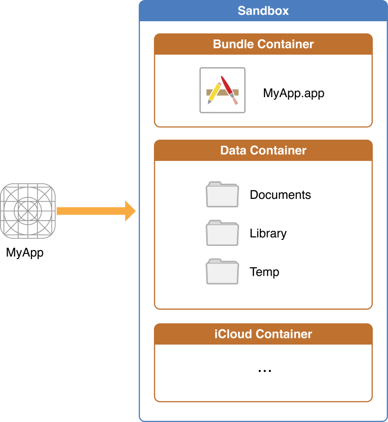

# MacOS Reverse

## Unix 文件系统结构
- /：根目录
- /bin：binary，存放用户级基础功能的二进制文件，如ls、ps等
- /boot：存放能使系统成功启动的所有文件。iOS中此目录为空
- /dev：device，存放BSD设备文件。每个文件代表系统的一个块设备或字符设备。块设备以块为单位传输数据，如硬盘；字符设备以字符为单位传输数据，如调制解调器
- /sbin：system binaries，存放提供系统级基础功的二进制文件，如netstat、reboot等
- /etc：法语Et Cetera（and so on的意思），存放系统脚本及配置文件，如passwd、hosts。iOS中，/etc是一个符号链接，实际指向/private/etc
- /lib：存放系统库文件、内核模块及设备驱动等。iOS中此目录为空
- /mnt：mount，存放临时的文件系统挂载点。iOS中此目录为空
- /private：存放两个目录，分别是/private/etc和/private/var
- /tmp：临时目录。iOS中，/tmp是一个符号链接，实际指向/private/var/tmp
- /usr：包含大多数用户和程序。
  + /usr/bin：包含那些/bin和/sbin中未出现的基础功能，如nm、killall等
  + /usr/include：包含所有的标准C头文件
  + /usr/lib：存放库文件
- /var：variable，存放一些经常更改的文件，如日志、用户数据、临时文件等。
  + /var/mobile：存放了mobile用户的文件。逆向工程重点关注目录
  + /var/root：存放了root用户的文件

## Sandbox 结构


沙盒在逻辑上包含两个部分：Bundle Container和Data Container，两者在iOS文件系统中的位置是平行的，分别是/var/mobile/Containers/Bundle和/var/mobile/Containers/Data。

实际开发中，通过NSHomeDirectory()方法获取到沙盒根目录对应的是 Data Container 的路径。

### Bundle Container
Bundle Container位于/var/mobile/Containers/Bundle/Application/XXXXXXXX-XXXX-XXXX-XXXX-XXXXXXXXXXXX/主要用于存放静态资源

### Data Container
Data Container位于/var/mobile/Containers/Data/Application/YYYYYYYY-YYYY-YYYY-YYYYYYYYYYYY/，主要用于存放App运行时产生的动态数据

## ipa 文件结构
```
Runner.iap
├── Payload
│   └── Runner.app
│       ├── Assets.car
│       ├── Base.lproj
│       │   ├── LaunchScreen.storyboardc // 目录
│       │   └── Main.storyboardc         // 目录
│       ├── Info.plist
│       ├── Intents.intentdefinition
│       ├── Frameworks
│       │   ├── Alamofire.framework // 引入的第三方 framework
│       │   │   ├── Alamofire       // 二进制文件
│       │   │   ├── Info.plist
│       │   │   └── _CodeSignature  // 签名信息目录
│       │   └── Common.framework    // 自定义 framework
│       │       ├── Common          // 二进制文件
│       │       ├── Info.plist
│       │       └── _CodeSignature  // 签名信息目录
│       ├── LICENSE
│       ├── PkgInfo
│       ├── XxLiveActivityWidget.intentdefinition
│       ├── XxWidget.intentdefinition
│       ├── PlugIns // 系统机制的插件
│       │   ├── XxLiveActivityWidgetExtension.appex
│       │   │   ├── XxLiveActivityWidget.intentdefinition
│       │   │   ├── XxLiveActivityWidgetExtension
│       │   │   ├── Info.plist
│       │   │   ├── _CodeSignature  // 签名信息目录
│       │   │   └── embedded.mobileprovision
│       │   ├── XxWidgetExtension.appex
│       │   │   ├── Assets.car
│       │   │   ├── XxWidget.intentdefinition
│       │   │   ├── XxWidgetExtension
│       │   │   ├── Info.plist
│       │   │   ├── _CodeSignature  // 签名信息目录
│       │   │   └── embedded.mobileprovision
│       │   └── XxWidgetHandler.appex
│       │       ├── Info.plist
│       │       └── embedded.mobileprovision
│       ├── embedded.mobileprovision
│       ├── Runner          // 二进制文件
│       ├── _CodeSignature  // 签名信息目录
│       ├── assets          // 自定义资源文件，名字以及结构可以自定义
│       └── en.lproj        // 本地化文件目录
│           ├── LaunchScreen.strings
│           ├── Localizable.strings
│           └── Main.strings
└── SwiftSupport
    └── iphoneos
        └── libswift_Concurrency.dylib
```
其中，有以下文件及其用途：
- *.mobileprovision
  + 包含 app 信息、开发者证书(可以多个)、关联设备信息(可以多个)，用于提交 app store 进行有效性验证(需要验证开发者证书)
  + 注意：从 app store 下载的 app 是没有这个文件的，因为 apple 对提交的 app 做了重新签名，以简化用户下载时的有效性验证(不用再验证开发者证书)
- Info.plist
  + Info.plist记录了App的基本信息，如：bundle identifier、可执行文件名、图标文件名等。
- *.lproj
  + lproj目录下存放各种本地化的字符串
  + 可以通过 plutil -p xxx.strings 查看
- Frameworks
  + app 引入的各种 framework，包括私有的以及(pod引入的)第三方
- PlugIns
  + 通过系统的插件机制做作的扩张程序。实际上也是一个独立的应用形式，但运行主体一般是**系统**，如 widgets、灵动岛等。
  + 注意：
    + 砸壳时，一般这个目录下的二进制不会砸壳成功，但砸壳后二进制中的字符串等具备可读性
    + 以小组件为例，一般小组件的视图需要在系统桌面 以及 应用列表中显示，如果是动态试图的话，常常会把视图的代码封装然后在 extension 和 主程序 中共享。这就给了逆向机会：
      1. 如果以 framework (的动态库)形态封装(最常见)，则必定会在 Frameworks 存在一份会被砸壳的二进制；
      2. 如果以静态库形式引入，则主程序中一定会有其痕迹；
- Assets.car
  + 资源 bundle 文件，可以通过```Asset Catalog Tinkerer```应用查看