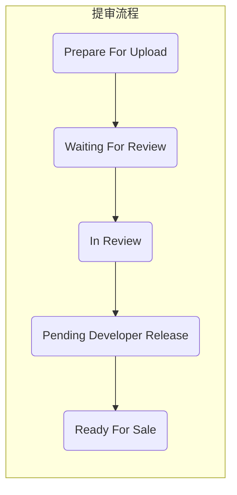
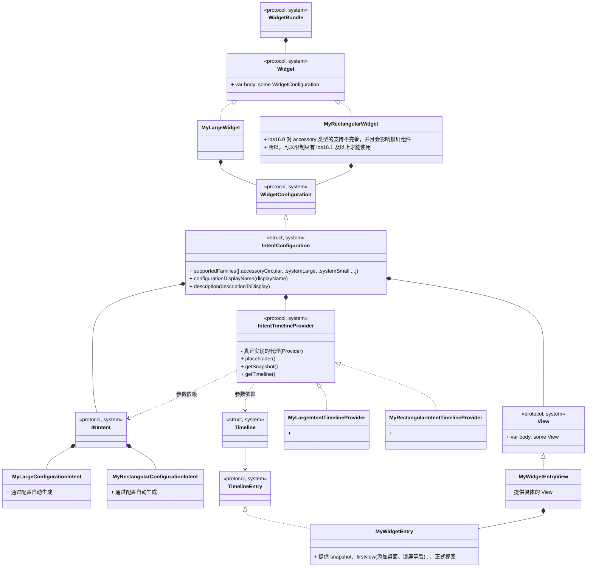
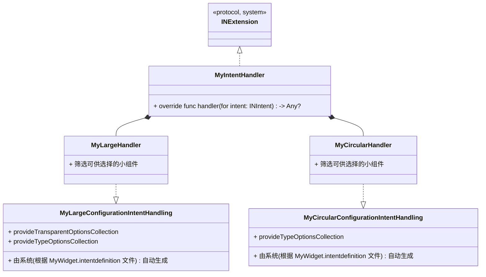

# MacOS 要点记录


苹果审核，分为：
- 预审
- 机审  
  + 机审主要是对代码进行机器审核，排查APP是否重复应用

- 人工审核
  + 主要在 In Review（审核）阶段
  + 这个阶段主要看的是App的元数据，例如APP封面、功能、体验等等，注重用户体验。

## 基础概括
### 命名
在开发过程中经常见到一些库的前缀，如，NS 等，了解其含义后可以帮助我们快速掌握其核心：
- NS
  + 乔帮主当年被人挤兑出苹果，自立门户的时候做了个公司叫做 NextStep，里面这一整套开发包很是让一些科学家们喜欢，而现在Mac OS用的就是NextStep这一套函数库，里面所有的类都用NextStep的缩写打头命名，也就是 NS**** 
- CF
  + Core Foundation
- CA
  + Core Animation
- CG
  + Core Graphics
- UI
  + User Interface


## 过审

### 马甲包
马甲包主要有以下几种用途：

#### A/B测试
正常情况下，任何一款产品都是要不断的更新功能的。如果我们直接在主包上更新，一旦新功能不被用户接受那就损失大了，我们前期大量投资带来的用户将会流失，这对很多产品开发者来说是不可承受之痛。

如果使用马甲包，则可以随意测试新功能，好的功能就在主包上迭代，不好的也无所谓，马甲包本身就是来背锅的。

#### 抗风险
马甲包对于优化人员来说就是一个试水的工具，用于app刷量、规避账号限制、防下架应急措施、竞品竞争等，规避主包风险，当主APP或马甲包被应用市场下架后，用户也可以被导向另一APP。

#### 导量
主包和马甲包属于同一个平台，用户信息可以共享。通过弹窗,广告,Push等引导用户到App Store下载主App。

有一部份App接了网盟相互导流。

#### 增加关键词覆盖数
App Store关键词长度上限是100个字符,据了解人为正常优化的极限是关键词覆盖数在4000左右,那些覆盖数在8000+的都是利用了苹果漏洞。所以,多做一个马甲,也就意味着覆盖的关键词可以更多。


### 注意事项
分类 | 描述 | 优先级 | 处理 | 备注
--- | --- | --- | --- | ---
Info.plist | 属性列表 | | | iOS的app都使用Info.plist文件来存储元信息，用来实现决定bundle所显示的icon，当前app支持打开的文档类型，服务声明等等。
Private API | 私有API检查 | | | 1. 私有API是指放在 PrivateFrameworks 中的API<br>2. 会针对所有固件版本检查
. | 只声明没实现的方法 | | |  | 如果命中了，被拒的概率是非常非常高的
命名 | 字符串\类名等名字不与系统私有类同名 | | |  | 可以减少被拒的可能性
关键词 | 苹果重点监测的词尽量不要使用，如彩票、热门应用的品牌词等 | | |  | 热门应用的品牌词，会被苹果官方认为会给用户造成误导，从而被拒
. | 存储系统检查 | | |  |
. | 版本号 | | | | 最好加密一下再返回给你，让审核人员看不出来是版本号
Guideline 3.1.1 | 第三方支付 | | |  |
Guideline 2.3.1 | Performance | | |  |
Guideline 4.3 | Design-Spam(重复应用) | | |  |
Guideline 2.1 | Information Needed | | | 如果确认没问题，可以申诉并且成功率较高

## Guideline 4.3 - Design - Spam (重复应用)
对于马甲包，需要仔细研究苹果的审核条款以及采用逆向思维（假如我是审核员，我会怎么审核我们提交的APP）来分析审核中出现的问题。

也可以参考现有成功案例，如：**快手、快手极速版、快手概念版；抖音、抖音极速版 等**

一个 ipa 包主要包含：元数据、代码 以及 资源，所以，可以考虑从以下几方面来改善苹果给予应用的 4.3 反馈：

<div style="width:50px">类别</div> | <div style="width:90px">项目</div> | <div style="width:100px">名称</div> | <div style="width:25px">优先级</div> | 描述 | 说明
:-- | :-- | :-- | --- | --- | ---
元数据 | APP信息 | 1. 名字<br>2. ICON<br>3. 标题、副标题<br>4. 应用描述<br>5. Bundle ID(包名)<br>6. 版权人<br>7. 版本号(规则) | P0 | | 
元数据 | APP信息 | 1. 商店宣传图<br>2. 搜索关键词<br>3. 支持网站<br>4. 隐私协议网站 | P0 | | 
元数据 | APP信息 | 1. 分类<br>2. 地区<br>3. 价格 | P0 | 1. 修改产品分类，打造与原产品不同的产品侧重属性分类<br>2. 修改应用程序发布地区，打造与原产品不同的售卖地区或分不同地区运营<br>3. 针对收费产品，可以修改应用程序价格，打造与原产品不同的价格级别
环境 | 帐号 | 开发者帐号<br>测试账号<br>演示账号 | P0 | | 1. 在同一设备对多个苹果账号开启双重验证的话，苹果很容易将账号之间关联起来
环境 | 打包<br>上传<br>提交 | 电脑<br>IP<br>提交间隔 | P0 | | 1. 每台MAC上打的马甲包不要超过5个<br>2. 上传马甲包时，IP 不要跟其他马甲包的 IP 相同<br>3. 不同马甲包提交应当间隔一天以上
资源 | 合集bundle<br>布局文件<br>图片<br>音视频<br>字体 | 1. 名称、路径<br>2. 属性<br>3. hash值 | P0 | 1. 修改资源(压缩或微调文件)<br>2. 适当添加一些(无用)资源<br>3. 适当删除一些资源| 小道消息，UDID(32位十六进制字符串)也是苹果匹配文件特征的一个方式
资源 | 链接 | 域名<br>接口<br>跳转 ? | P0 | | 苹果会开VPN测试国内APP
人工 | 界面 | UI风格<br>主色调 | P1 | | 
运行时 | UI界面 | 1. 首页面<br>2. 其他页面 | P0 | 1. 运行时界面截屏相似度<br>2. 首页面一定要有差异化<br>3. 最好全新UI
运行时 | 产物 | | ? | 1. 运行时生成的文件(如，日志、配置)<br>2. 
运行时 | 网络 | | ??? | 1. 参数<br>2. 应答 <br>3. webview | 据说，会进行 Mock测试，修改返回信息，然后看APP是否有隐藏功能
运行时 | 代码 | | ?? | 越狱环境下，通过运行时拿到app的所有代码，hook 网络请求，hook C函数，hook 调用栈等
代码 | 混淆 | 类<br>方法<br>属性 | P0 | | 
代码 | 混淆 | 字符串常量<br>uuid | P0 | | uuid 生成规则未知，可以用其他工程生成的uuid替换<br>常见的 uuid 在 project.pbxproj 中
代码 | 混淆 | 文件名<br>目录名<br>工程名<br>目录结构 | P0 | | 文件包括：包括资源和代码
代码 | 混淆 | 静态库加密 | P1 | | 几维安全的在线静态库加密，过审率高且免费，缺陷不能支持脚本加密
代码 | 无效代码 | 类、方法、属性、字符串常量 | P1 | | 1. 垃圾类之间相互调用、主代码调用垃圾类垃圾函数<br>2. 垃圾代码量占总代码的30% - 40%为宜<br>3. 放在独立目录即可
代码 | 重构 | 类或方法 | P1 | 有理由相信，类的属性或方法数超过某一阈值时，会被进一步审核 | 如，某个文件比较大，就需要多去修改里面的方法名，变量名，以及顺序；
代码 | 重构 | 功能 | ？ | 1. 删除部分功能<br>2. 添加某些功能 | 修改功能特征，最好不能完全使用之前的功能
代码 | 重构 | 第三方库(框架) | ??? | 1. 替换、添加或删除<br>2. 导入几个无用库、框架<br>3. 嵌入的SDK需要单独申请(?) | 个人觉得，应当排除掉三方库，再来比对项目独有特征的相似性


注意：
- App的应用元数据指的是我们需要在开发者后台所填写的资料，包括但不限于标题、简介、关键词等。这些尽量保持唯一性，对于过审是有帮助的
- 代码审核，主要在 机器审核 阶段，我们认为要求代码的相似程度不高于45%
- 混淆可以降低反馈 4.3 的概率，但是苹果也会逐渐加强这方面的审核技术，如果检测到代码混淆比较明显的话，就会给予 2.3.1 的反馈。
- 推荐用一些比较高级的代码混淆技术来提高过审几率，例如顶象技术的iOS安全编译器来混淆代码的，主要还免费
- 编译路径，xcode编译的时候会把部分文件的路径编译进二进制，用户Users目录同时也会包含在里面
- 两个马甲包不要关联到同一个开发者帐号的信息；比如打包时关联。并且苹果对开发者帐号会进行权重管理，权重越低的帐号，审核越严格。同样的包，可能在权重高的帐号上就能过，在权重低的帐号上就是4.3
- *马甲包激活数据能否提供 ; 马甲包用户数据库独立，不使用主包的库（主要用于IDFA排重）;*

## 分析

### IPA 解析
我们提交给苹果的是一个 ipa 文件，里面的 bin 文件，都是编译好的二进制可执行文件，苹果生态中叫做 machO 格式。

machO 格式定义了各种分段，比如引用的库列表，定义的类列表，方法列表，协议列表，字符串列表，然后又在一个地址映射表中记载着这些类，方法的对应关系，和实际的机器码机址。苹果只要对这些特定的段进行扫描，就能扫出来有没有引用一些非公开的API，类，系统库。

#### 工具
- Otool(object file displaying tool)
  + Xcode自带的常用工具，对ipa的可执行文件进行反编译解析，获取头文件中方法和成员的列表
- MachOView
  + 查看mach-o的原始数据（iOS可执行文件格式）
- frida
  + 适用于开发人员，逆向工程师和安全研究人员的动态检测工具包

### 实践
ipa 拆包：
- 可以拿到安装包内的图片资源：.png,.jpg，可以在我们仿写app的时候用到
- 可以拿到app使用到三方库的.bundle，从而反推断他使用哪些三方工具库
- 可以拿到工程中的配置文件，如.json、.plist，.js，有些文件可以反推断他用的什么技术方案
- 可以拿到音频文件，例如微信app的消息提醒的声音
- 可以拿到布局文件:xx.nib
- 可以拿到打包在工程中的字体文件


## Widget
### extensions


### handler
用于提供用户选择小组件时的功能支持



### 编辑页
一般来说也会提供小组件编辑页，其中需要实时显示最新的小组件预览图，这就要求：更新配置后，预览图实时更新。这与系统调用小组件更新上，功能有重叠的部分，可以通过：将 自定义的config 和 view 封装成一个 ViewHolder 然后被外部使用。

### 注意
1. 小组件申请位置权限
   + 在主工程(the containing app)项目中申请位置权限
     - 必需在主工程 的 Info.plist 文件中添加相关用途字符串
   + 将```NSWidgetWantsLocation```键添加到 widget extension 的 Info.plist 文件中
     - 类型为：Boolean
2. 小组件视图更新
   + 预览图：小组件视图可以通过 renderToImage 生成预览图
   + 实时图：更新相关配置后，可以通过系统强刷接口强制刷新
3. 小组件交互
   + 通过 小组件View 的 widgetURL 方法指定:
      - 注意：```Widgets support one widgetURL modifier in their view hierarchy. If multiple views have widgetURL modifiers, the behavior is undefined.```


### Widget控件尺寸大小
屏幕尺寸(portrait) | Small widget | Medium widget | Large widget
:-: | :-: | :-: | :-: | 
414 x 896 pt | 169 x 169 pt | 360 x 169 pt | 360 x 376 pt
375 x 812 pt | 155 x 155 pt | 329 x 155 pt | 329 x 345 pt
414 x 736 pt | 159 x 159 pt | 348 x 159 pt | 348 x 357 pt
375 x 667 pt | 148 x 148 pt | 322 x 148 pt | 322 x 324 pt
320 x 568 pt | 141 x 141 pt | 291 x 141 pt | 291 x 299 pt


## 添加快捷方式
常见的添加快捷方式功能，将其添加到桌面，点击桌面图标打开app进入对应页面。可以实现图标美化以及快捷访问功能。

### Reference
- [iOS 添加快捷方式到桌面](https://juejin.cn/post/6847902220080414733)


## Reference
- [App Review](https://developer.apple.com/cn/app-store/review/)
- [苹果马甲包应用上线经验总结](https://zhuanlan.zhihu.com/p/113436475)
- [马甲包混淆工具](https://zfj1128.blog.csdn.net/article/details/95482006)
- [AppStore马甲包过审技巧](https://bbs.pediy.com/thread-221030.htm)
- [ios马甲包](https://blog.csdn.net/weixin_42325823/article/details/103769799)
- [建立一套扫描方法](https://zhuanlan.zhihu.com/p/101222974)
- [马甲包上架注意事项](http://wd.nnjjkj.com/article/22.html)
- [YJS/confuse](https://gitee.com/yanjinsheng/confuse)
- [iOS马甲包预审分析工具](https://blog.csdn.net/box_kun/article/details/124823230)
- [认识MachO](https://www.jianshu.com/p/c07e5ee89b3e)
- [AppInfoScanner](https://github.com/kelvinBen/AppInfoScanner)
- [从Mach-O看砸壳及App的安全性原理](https://www.codercto.com/a/81235.html)
- [iOS App 签名的原理](http://blog.cnbang.net/tech/3386/)
- https://www.jianshu.com/p/4e8ccb02e92d
- https://juejin.cn/post/6844904014170030087
- [Flutter 编译产物的理解](https://allenwu.itscoder.com/flutter-compile-product)