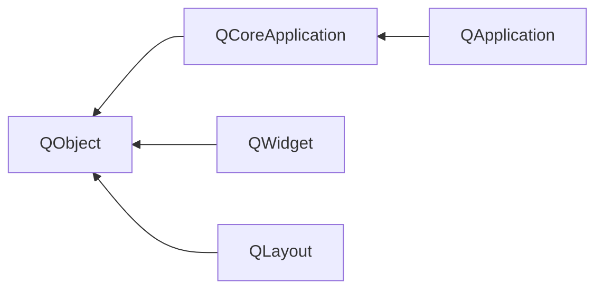

- [Qt 要点概览](#qt-要点概览)
  - [一、Qt是什么](#一qt是什么)
    - [文件](#文件)
    - [编译](#编译)
      - [qmake](#qmake)
        - [moc](#moc)
        - [rcc](#rcc)
        - [uic](#uic)
      - [第三方编译工具](#第三方编译工具)
      - [IDE](#ide)
    - [基本对象](#基本对象)
      - [QWidget](#qwidget)
      - [其他类](#其他类)
  - [二、信号(signals)、槽(slots)](#二信号signals槽slots)
    - [元对象系统](#元对象系统)
  - [三、布局(layout)](#三布局layout)
    - [绝对位置法](#绝对位置法)
    - [人工布局法](#人工布局法)
    - [布局管理器法](#布局管理器法)
      - [影响布局方式: QSizePolicy](#影响布局方式-qsizepolicy)
      - [影响布局方式: Size](#影响布局方式-size)
      - [影响布局方式: 其它](#影响布局方式-其它)
  - [四、样式(style)](#四样式style)
    - [样式表选择器](#样式表选择器)
    - [常见的自定义辅助控制器](#常见的自定义辅助控制器)
    - [常见的控件中可以访问样式表的状态](#常见的控件中可以访问样式表的状态)
  - [五、事件(event)](#五事件event)
    - [常见事件](#常见事件)
  - [六、扩展 Qt](#六扩展-qt)
    - [集成自定义 QWdiget 到 Qt Designer](#集成自定义-qwdiget-到-qt-designer)
      - [改进法(promotion)](#改进法promotion)
      - [插件法(plugin)](#插件法plugin)
    - [插件(plugin)](#插件plugin)
      - [实现](#实现)
      - [加载](#加载)
      - [插件类: 预定义](#插件类-预定义)
      - [插件类: 自定义](#插件类-自定义)
  - [Reference](#reference)

# Qt 要点概览

## 一、Qt是什么
Qt 不仅仅是一个图形用户界面开发包，现在它已经逐渐成长为了一个成熟、优秀的应用程序开发框架。

一个简单的 Qt 程序：
```
#include <QApplication>
#include <QLabel>

int main(int argc, char* argv[])
{
  QApplication app(argc, argv);
  QLabel *label = new QLabel("Hello Qt!");
  label->show();
  return app.exec();
}
```

### 文件
文件 | 用途
--- | --- 
.ui | Qt Designer 文件
.qss | 样式表文件
.qrc | 资源列表文件
.pro | 平台无关的工程文件<br>此文件列举了工程中包含的源文件，qmake 可以使用它来生成 makefile 文件

### 编译
常见的 Qt 编译方法有以下三种：
1. 使用 Qt 提供的 qmake 工具
2. 使用第三方编译工具
3. 使用集成开发环境(IDE)

#### qmake
qmake 工具是与 Qt 一起提供的，使用 ```.pro``` 文件来描述一个工程的相关依赖、源文件以及配置等等。

qmake 包含了调用 Qt 内置代码生成工具(moc、uic 和 rcc)的必要的逻辑规则。

Qt 内置代码生成工具 | 原名 | 作用
--- | --- | --- 
moc | Qt Meta-Object Compiler | 元对象编译器
rcc | Qt Resource Compiler | 用于在构建过程中将(```.qrc```中包含的)资源嵌入到 Qt 应用程序中
uic | Qt User Interface Compiler | 用于对 ```.ui``` 文件生成 ```.h``` 文件

##### moc
Qt 程序在交由标准编译器编译之前，先要使用 moc 分析 C++ 源文件。如果它发现在一个头文件中包含了宏 Q_OBJECT，则会生成一个以原文件名前面加上 moc_ 命名的 C++ 源文件，并与原文件一起参与后续的编译流程。

注意，moc 的执行是在标准编译器编译之前(包含预处理器)。因为预处理器执行之后，Q_OBJECT 宏就不存在了。

##### rcc
rcc 通过生成包含在 Qt 资源(.qrc) 文件中指定的数据的 ```.cpp``` 文件(后续流程会将该文件链接到应用程序中)来工作。

##### uic
uic 读取 Qt Designer 生成的 XML 格式用户界面定义 (.ui) 文件并创建相应的 C++ 头文件。这些生成的 C++ 源文件将会参与后续的编译流程。


#### 第三方编译工具
这里仅以 CMake 为例。

CMake 是一个开源的跨平台 makefile 生成器，使用 ```CMakeLists.txt``` 文件来描述一个工程的相关依赖、源文件以及配置等等。

为了使 CMake 增加对 Qt 的支持，也就是，调用 Qt 内置的代码生成工具，需要对相关代码执行以下命令：
命令 | 作用
--- | ---
qt5_wrap_cpp() | 对给定文件执行 moc
qt5_wrap_ui() | 对给定文件执行 uic<br>注意，此处生成的 .h 文件，需要再次被 qt5_wrap_cpp() 处理
qt5_add_resources() | 对给定文件执行 rcc

举个栗子：
```
project(ss)
cmake_mininum_required(VERSION 3.6.0)
find_package(Qt5 REQUIRED)
include(${QT_USE_FILE})

set(ss_SRCS mydialog.cpp mainwindow.cpp main.cpp)
set(ss_MOC_SRCS mydialog.h mainwindow.h)
set(ss_UIS mydialog.ui)
set(ss_RCCS ss.qrc)

qt5_wrap_cpp(ss_MOCS ${ss_MOC_SRCS})
qt5_wrap_ui(ss_UIS_H ${ss_UIS})
qt5_wrap_cpp(ss_MOC_UI ${ss_UIS_H})
qt5_add_resource(ss_RCC_SRCS ${ss_RCCS})

add_definitions(-DQT_NO_DEBUG)
add_executable(ss
  ${ss_SRCS}
  ${ss_MOCS}
  ${ss_MOC_UI}
  ${ss_RCC_SRCS})
target_link_libraries(ss ${QT_LIBRARIES} pthread)
```

#### IDE
可以使用 Qt 提供的 QCreator，也可以使用 Visual Studio 或 Eclipse 配合相关插件来进行开发编译。

这里仅介绍下 Visual Studio 的配置方法(需要安装 vs 以及 qt)：
插件配置：
1. 从 ```VS2019 菜单栏``` => ```Extentions(扩展)``` => ```Manage Extentions(管理扩展)```
2. 左侧选择：```联机``` => ```Visual Studio Marketplace```, 再通过搜索框，搜索 ```Qt Visual Studio Tools```
3. 安装 ```Qt Visual Studio Tools```，然后根据提示重启 VS2019
4. 进入配置页面：```VS2019 菜单栏``` => ```Extentions(扩展)``` => ```Qt VS Tools``` => ```Options```
5. 在配置页面：```Qt``` => ```Versions```, 在打开的窗口中点击 Add 按钮(```add new Qt version```)
6. 指定 Qt编译器路径(如 C:\Qt\5.12.0\msvc2019)、```Version Name``` (如 x86-msvc2019-5.12.0) 等信息

工程配置：
- 在 Qt 工程项目的属性中配置：```属性``` => ```Qt Project Settings```
  - ```Qt Installation```：填入插件配置中指定的一个```Version Name```
  - ```Qt Modules```：当前工程项目使用到的 Qt 组件，如：core;gui;widgets
  - ```Build Config```：编译选项，如：release、debug


### 基本对象


Qt 会对所有的窗口进行跟踪，所以 new 一个 window 后，可以没有主动 delete。当用户关闭一个主窗口时，默认行为是隐藏它，不过，可以通过 Qt::WA_DeleteOnClose 属性进行修改。

Qt 实现了类似于 MVC 的项视图类。


#### QWidget
如果一个 widget 没有被嵌入到另外一个 widget 中(也就是说，没有父对象)，那么这个 widget 就成了一个独立的窗口。

有两种常见方式，可以使一个 widget 被嵌入到另外一个 widget 中：
1. 显式关联：在 widget 的构造函数中指定 parent
2. 隐式关联：通过函数调用被添加到父窗口中(此时会建立 widget 间的父子关联)

一个 widget 的构造函数可以接受一个或者两个标准参数:
1. QWidget *parent = 0
   + 如果 parent == 0(默认值)，那么这个新 widget 就成了一个独立的 window
   + 如果 parent != 0，那么此 widget 是 parent 的一个子窗口。同时此 widget 的形状会受其父窗口形状的约束(除非指定这个新创建的 widget 的 window flag 为 Qt::Window)
2. Qt::WindowFlags f = 0
   + 这个参数用来设置新创建的 widget 的 window flags(例如是否有最大化按钮等)
   + 默认的参数几乎对所有的widget都是适用的。但如果你需要一个没有边框的widget，那么需要使用特定的flag(如，Qt::FramelessWindowHint)


#### 其他类
Qt 类 | 函数 | 说明
--- | --- | ---
QApplication | beep() | 触发系统提示音
QApplication | clipboard() | 剪切板
QApplication | restoreOverrideCursor()<br>setOverrideCursor(Qt::WaitCursor) | 
QSplashScreen | | 启动画面<br>通常会将相关代码放在 mian() 函数中，位于 Application::exec() 调用之前
QWidget | repaint() | 强制产生一个即时的重绘事件<br>如果窗口部件在屏幕上是不可见的，则什么都不做
QWidget | update() | 只是通知 Qt 下一次处理事件时才简单的调用一个绘制事件<br>如果多次调用 update(), Qt 会把连续多次的绘制事件压缩成一个单一的绘制事件，这样可以避免闪烁现象<br>如果窗口部件在屏幕上是不可见的，则什么都不做
QDialog | show()<br>exec() | 非模态<br>模态
QTableWidget | setItemPrototype() | 可以在构造函数中使用此函数用新数据类替换 QTableWidgetItem<br>QTableWidgetItem 不是一个窗口部件类，而是一个纯粹的数据类
QFile | | 数据处理
QDataStream | | 数据处理
Qt 容器类 | | 都是隐含共享(implicit sharing)的, 这是一个能够把整个容器作为不需要太多运行成本的值来传递的最优化过程


## 二、信号(signals)、槽(slots)
所有定义了 signal 和 slot 的类，都需要在类定义的开始处存在 Q_OBJECT 宏。

信号和槽机制是 Qt 编程的基础。它可以把互不了解的对象绑定在一起：当某个信号被发射时，会自动调用与其关联的一个或多个槽。

- 一个信号可以连接多个槽
  + ```connect(sender, SIGNAL(signal), receiver, SLOT(slot));```
  + 在信号被发射时，会以不确定的顺序一个接一个的调用这些槽。
- 多个信号可以连接同一个槽
- 一个信号可以与另一个信号相连接
- 连接可以被移除
  + 可以通过 ```disconnect(lcd, SIGNAL(overflow()), this, SLOT(handler()));``` 主动移除连接。不过较少用到，因为，当删除对象时，Qt 会自动移除和这个对象相关的所有连接。

要想把信号与槽(或信号)成功连接，它们的参数必须具有相同的顺序和类型，如：```connect(ftp, SIGNAL(f(int, const QString&)), this, SLOT(p(int, const QString&)));```


### 元对象系统
Qt 的主要成就之一就是使用了一种机制对 c++ 进行了扩展，并且使用这种机制创建了独立的软件组件。这些组件可以绑定在一起，但任何一个组件对于它所要连接的组件的情况事先都一无所知。

这种机制称为元对象系统(meta-object system)，它提供了关键的两项技术：信号-槽以及内省(introspection)。

内省功能对于实现信号槽是必需的，并且允许开发人员在运行时获得有关 QObject 子类的"元信息"(meta-information)，包括一个含有对象的类名以及它所支持的信号和槽的列表。这一机制也支持属性(广泛用于 Qt Designer 中)和文本翻译(用于国际化)，并且它也为 QScript 模块奠定了基础。

标准 c++ 没有对 Qt 的元对象系统所需的动态元信息提供支持。**Qt 通过提供一个独立的 moc 工具解决了这个问题，moc 解析 Q_OBJECT 类的定义并且通过 c++ 函数来提供可供使用的信息**。由于 moc 系统使用纯 c++ 来实现它的所有功能，所以 Qt 的元对象系统可以在任意 c++ 编译器上工作。

这一机制是这样工作的：
- Q_OBJECT 宏声明了在每一个 QObject 子类中必须实现的一些内省函数：metaObject()、tr()、qt_metacall()，以及其他函数
- Qt 的 moc 工具生成了用于由 Q_OBJECT 声明的所有函数和所有信号的实现
- 像 connect() 和 disconnect() 这样的 QObject 的成员函数使用这些内省函数来完成它们的工作

由于所有这些工作都是由 ```qmake```、```moc``` 和 ```QObject``` 自动处理的，所以很少需要再去考虑这些事情。如果你对此充满好奇心，可以阅读下有关 QMetaObject 类的文档和由 moc 生成的 c++ 源码。

## 三、布局(layout)
放置在窗体中的每个窗口部件都必须给定一个合适的大小和位置。Qt 提供了三种基本方法用于管理窗体上子窗口部件的布局：**绝对位置法**、**人工布局法** 和 **布局管理器法**。

### 绝对位置法
绝对位置法是一种最原始的摆放窗口部件的方法。这可以通过对窗体的各个子窗口部件(使用 setGeometry() 方法)分配固定的大小和位置以及对窗体分配固定的大小来实现。

这种方法的缺点显而易见：
- 用户无法改变窗口大小
- 必须人工计算这些空间的大小和位置
- 如果受平台的主题、字体、多语言等影响的话，很容易出现显示异常

### 人工布局法
人工布局法虽然还是需要给定窗口部件的绝对位置，但是利用人工布局方法给定的大小尺寸总是可以和窗口的大小成比例。

人工布局法的核心，就是通过重新实现窗体的```resizeEvent()```函数，可以在该函数中设置窗体中的子窗口部件的几何形状，以及主动重新计算各个子窗口部件的新布局位置、大小等。

这种方法也需要开发人员像绝对位置法中那样，进行手动计算各个子窗口部件的位置、大小等繁琐且易错的内容。

### 布局管理器法
布局管理器(Layout Management)会为每种类型的窗口部件提供一些合理的默认值，并且也会考虑每一个窗口部件的大小提示，这些大小提示通常又会取决于该窗口部件的字体、风格和内容。

布局管理器也会充分考虑其最大和最小尺寸，并且会自动通过调整布局来响应字体的变化、内容的改变、窗口大小的调整以及子窗口部件的隐藏或显现等。

Qt 提供的最为重要的三种布局管理器是：QHBoxLayout、QVBoxLayout、QGridLayout。另外，布局管理器对象有个比较重要的函数```addStretch()```, 它告诉布局管理器，它会占满布局中这一处的全部多余空间。在 Qt Designer 中，可以通过插入一个 spacer(通常会显示为蓝色的弹簧形状) 来达到同样的效果。

#### 影响布局方式: QSizePolicy
一个窗口部件的 QSizePolicy 使得布局管理系统(layout management system)拥有良好的默认大小变化管理依据, 它会告诉布局系统应该如何对它进行拉伸或者压缩。

Qt 为它所有的内置窗口部件都提供了合理的默认大小策略值，同时，开发人员也可以主动对其进行修改。

默认的 QSizePolicy 表示 widget 的大小可以自由变化，一般倾向于采用 sizeHint() 返回的大小，这对大多数的 widget 来说已经足够好了。(提示：顶层widget的大小一般约束为桌面大小长度和宽度的的2/3，但也可以通过 resize() 函数来进行调整)

QSizePolicy 具有水平方向和垂直方向两个分量，以下是一些常见的取值：
QSizePolicy | 作用 | 说明
--- | --- | ---
Fixed | widget 不能被拉伸或压缩 | 大小尺寸总是保持为 sizeHint() 的尺寸
Minimum | sizeHint() 是 widget 的最小尺寸 | 尺寸不能比大小提示更小<br>但如有必要，可以拉伸它来填充尽可能多的空间
Maximum | sizeHint() 是 widget 的最大尺寸 | 尺寸不能比大小提示更大<br>但可以把它压缩到它的最小大小提示的尺寸
Preferred | sizeHint() 是 widget 的合适尺寸 | 如有需要，可以对此控件进行拉伸或压缩
Expanding | widget 可以被拉伸或压缩 | 此控件特别希望能够被拉伸(变长变高)

思考：Preferred 和 Expanding 都可以被拉伸或压缩，那么他们有什么不同之处？
- 优先级问题。在重新改变一个既包含 Preferred 窗口部件 又包含 Expanding 窗口部件的窗体大小时，多出来的空间，会优先分配给 Expanding 窗口部件，而 Preferred 窗口部件仍然会按照原有大小提示而保持不变

#### 影响布局方式: Size
| 类别 | 函数名 | 效果 | 作用 | 注意事项 |
| --- | --- | --- | --- | --- |
| | ```setMinimumSize(w,h)```<br>```setMaximumSize(w,h)``` | | | 优先级最高
| | ```setFixedSize(x, y, w, h)``` | 其实就是同时：```setMinimumSize(w,h); setMaximumSize(w,h);``` | |setFixedSize 后再调整窗口大小无效，不过，可以如下设置使其生效：<br>```setMinimumSize(0,0); setMaximumSize(QSize(QWIDGETSIZE_MAX,QWIDGETSIZE_MAX)``` 
| | ```resize(x, y, w, h)``` | 调整的大小受 minimumSize() 和 maximumSize() 约束 | | 在*窗口* resize 时如果 w 或者 h 的值小于窗口内某个控件的 w或h，那么 resize 就在这个方向上无效，此时Qt会自动生成一个合适的值
| | ```setGeometry(x, y, w, h)``` | 其实就是 ```resize```和 ```move``` 的组合<br><br>调整的大小受 minimumSize() 和 maximumSize() 约束 | 控制 widget 相对于其父窗口的几何结构(不包括窗口边框，注意和frameGeometry区别) | 1.setGeometry 时，如果控件可见(visible), 会即时接收到 moveEvent() 和 resizeEvent()。如果控件当前不可见, 会保证在控件被显示前接收到相关事件。<br>2. Warning: Calling setGeometry() inside resizeEvent() or moveEvent() can lead to infinite recursion.
| | ```adjustSize()``` | | Adjusts the size of the widget to fit its contents | 当 sizeHint() 有效(如，size hint 的 w 和 h 都 >= 0)时，会采用它的值；不然的话，会设置它的size 为覆盖所有子控件的矩形区域
| | ```pos()``` | widget相对于其父widget的位置 | 
| | ```rect()``` | widget除去窗口边框的内在几何矩形 | 
| | ```size()``` | widget除去边框之外的大小 | 
| | ```sizeHint()``` | This property holds the recommended size for the widget. | | 如果此小部件没有 layout 时，则 sizeHint() 的默认实现返回一个无效值，否则返回 layout 的首选大小(preferred size)。

**如果控件被放进 layout 里以后，大小由 layout 控制，resize 就不起作用了**。不过：
- 可以通过 setMinimumSize 和 setMaximumSize 控制大小
- 可以通过 move 移动位置

思考：如下设置 qss 的话，新建名为 SpecialButton 的 MyPushButton 控件，会出现 minimumHeight() > maximumHeight() 的情形，此时，设置 setFixedSize 会生效吗？不会，为什么？
```
  /* 按钮 */
  MyPushButton {
      min-height:50px;
      max-height:50px;
  }
  
  /* 按钮: 名为 SpecialButton */
  MyPushButton#SpecialButton {
    min-width:  50px;
    min-height: 100px;
  }
```

#### 影响布局方式: 其它
影响布局的一种常见方法是：设置它的子窗口部件的最小大小、最大大小或固定大小。当布局管理器在摆放这些窗口部件的时候，会考虑这些约束条件。

此外，还可以对子窗口部件的类进行派生，并重新实现 sizeHint() 函数，由此获得所需的大小提示。


## 四、样式(style)
QWdiget 可以使用三种方式来重新定义 Qt 内置窗口部件的外观：
1. 子类化个别的窗口部件类，并且重新实现它的绘制和鼠标事件处理器
2. 子类化 QStyle 或者一个预定义的风格，例如 QWindowStyle
   + Qt 本身就是基于这种方法为它所支持的不同平台提供基于平台的外观的
3. 从 Qt4.2 开始，可以使用样式表(stylesheet)

QApplication::setStyleSheet() 为整个应用程序设置一个样式表；QWdiget::setStyleSheet() 设置窗口以及其子窗口部件的样式表

一般情况下，QWdiget 会从父窗口继承 QSS 样式(如，背景、边框、字体等)，不过可以通过 setAttribute(Qt::WA_StyledBackground) 函数设置属性，来指明不使用从父对象继承来的 QSS 样式。

### 样式表选择器
选择器 | 实例 | 可以匹配的窗口部件
--- | --- | ---
全局对象 | ```*``` | 任意窗口部件
类型 | ```QDial``` | 给定类的实例，**包括子类**
类 | ```.QDial``` | 给定类的实例，**不包括子类**
标识 | ```QDial#ageDial``` | 给定**对象名称**的窗口部件
Qt 属性 | ```QDial[ y="0"``` ] | 为某些**属性**赋值的窗口部件
子对象 | ```QFrame > QDial``` | 给定窗口部件的**直接子窗口**部件
子孙对象 | ```QFrame QDial``` | 给定窗口部件的**子窗口**部件

选择器能以各种方式组合使用。

此外，从 Qt4.2 开始，可以通过 QObject::setProperty() 动态的设置一个不存在的属性。要注意的是，在使用属性选择器时，如果之前控件有其它样式，那么需要调用 ```unpolish() 和 polish()``` 函数来抹去旧样式并换上新样式:
```
  this->setProperty("status", 0);
  this->style()->unpolish(this);
  this->style()->polish(this);
```

### 常见的自定义辅助控制器
辅助控制器 | 说明
--- | ---
::indicator | 复选框、单选钮、可选菜单项或可选组群框的指示器
::menu-indicator | 按钮的菜单指示器
::item | 菜单、菜单栏或状态栏项
::up-button | 微调框、滚动条的向上按钮
::down-button | 微调框、滚动条的向下按钮
::up-arrow | 微调框、滚动条或标题视图的向上箭头
::down-arrow | 微调框、滚动条、标题视图或组合框的向下箭头 
::drop-down | 组合框的下拉箭头
::title | 组群框的标题 

### 常见的控件中可以访问样式表的状态
状态 | 说明
--- | ---
:disabled | 禁用窗口部件
:enabled | 启用窗口部件
:focus | 窗口部件有输入焦点
:hover | 鼠标在窗口部件上悬停
:pressed | 鼠标按键单击窗口部件
:checked | 按钮已被选中
:unchecked | 按钮未被选中
:indeterminate | 按钮被部分选中
:open | 窗口部件位于打开或扩展状态
:close | 窗口部件位于关闭或销毁状态
:on | 窗口部件的状态是"on"
:off | 窗口部件的状态是"off"


## 五、事件(event)
Qt 提供了5个级别的事件处理和事件过滤方法：
1. 重现实现特殊的事件处理器 
   - 重新实现像 mousePressEvent()、keyPressEvent() 和 paintEvent() 这样的事件处理器是比较常用的事件处理方式 
2. 重新实现 QObject::event()
   - 通过 event() 函数的重新实现，可以在这些事件到达特定的事件处理器之前处理它们
   - 当重新实现 event() 时，必须对那些没有明确处理的情况调用其基类的 event() 函数
3. 在 QObject 中安装事件过滤器
   - 对象一旦使用 installEventFilter() 注册过，用于目标对象的所有事件都会首先发送给这个监听对象的 eventFilter() 函数
   - 如果同一个对象上安装了多个事件处理器，那么就会按照安装顺序逆序，从最后安装的到最先安装的，依次激活这些事件处理器
4. 在 QApplication 对象中安装事件过滤器
   - 一旦在唯一的 QApplication 对象中注册了事件过滤器，那么应用程序中每个对象的每个事件都会在发送到其他事件过滤器之前，先发送给这个 eventFilter() 函数
   - 这种处理方式对于调试是非常有用的。它也可以用来处理那些发送给失效窗口部件的鼠标事件，因为 QApplication 通常都会忽略这些事件
5. 子类化 QApplication 并重新实现 notify()
   - Qt 调用 QApplication::notify() 来发送一个事件。重新实现这个函数是在事件过滤器得到所有事件之前获得它们的唯一方式
   - 事件过滤器通常更有用，因为可以同时有多个事件过滤器，而 notify() 函数却只能有一个

### 常见事件
| 类别 | 方法 | 说明 |  注意事项 |
| --- | --- | --- | --- |
| | ```mouseMoveEvent()``` | 鼠标移动事件<br>默认状态下，需要鼠标按下才能捕捉到 | 要想鼠标不按下时的移动也能捕捉到，需要 setMouseTracking(true) |
| | ```mouseReleaseEvent()``` | 收到鼠标按下事件的 widget，也将接收鼠标释放事件 | 如果用户在某 widget 上按下鼠标，然后松开鼠标前拖动鼠标到别的地方，那么此 widget 也将接收到释放事件。<br>有一个例外：如果在按住鼠标按钮的同时出现弹出菜单，则该弹出窗口会立即窃取鼠标事件。|
| | ```enterEvent()``` | 鼠标进入该 widget 所在屏幕区域时被调用 | 该 widget 的屏幕区域不包括其子 widget 的屏幕区域 |
| | ```leaveEvent()``` | 鼠标离开widget所在屏幕区域时被调用，但是如果鼠标进入了子widget屏幕区域时该函数不会被调用 | |
| | ```moveEvent()``` | widget 相对于其父 widget 被移动时被调用 | |
| | ```closeEvent()``` | 用户关闭 widget 时或者调用 close() 函数时被调用 | |


## 六、扩展 Qt
### 集成自定义 QWdiget 到 Qt Designer
在 Qt Designer 中使用自定义窗口部件之前，需要让 Qt Designer 察觉到它们的存在。有两种方法可以完成这一任务：改进法(promotion)和插件法(plugin)

#### 改进法(promotion)
这里以加入一个自定义的 QSpinBox 的子类 MySpinBox 为例，看看操作步骤：
1. 从 Qt Designer 的工具栏插入一个 QSpinBox 控件
2. 右键单击这个微调框，并从上下文菜单中选择"Promote to Custom Widget"(改进成自定义窗口控件)
3. 在弹出的对话框中填入 "MySpinBox" 作为类名，"myspinbox.h" 为头文件名字

以上即可让 uic 生成 myspinbox 的相关代码而不是 QSpinBox。不过，在 Qt Designer 中无法对自定义窗口部件中的特定属性进行访问，也无法对窗口部件自身进行绘制。

#### 插件法(plugin)
插件法需要创建一个插件库(关于插件的更多内容见下文)，Qt Designer 可以在运行时加载这个库，并且可以利用该库创建窗口部件的实例。

在对插件法创建的窗体进行编辑或预览时，Qt Designer 会用到这个真正的窗口部件，这要归功于 Qt 的元对象系统，Qt Designer 才能动态获取到它的属性列表。

**注意**，给 Qt Designer 自动加载的插件必须继承自```QDesignerCustomWidgetInterface```

这里给出一个插件示例：
1. 插件类
```
#include <QDesignerCustomWidgetInterface>

class IconEditorPlugin : public QObject, public QDesignerCustomWidgetInterface
{
  Q_OBJECT
  Q_INTERFACES(QDesignerCustomWidgetInterface)
public:
  ...
};
```
2. 用于编译的 .pro 文件
```
TEMPLATE   = lib
CONFIG    += designer plugin release
HEADERS    = ../iconeditor/iconeditor.h iconeditorplugin.h 
SOURCES    = ../iconeditor/iconeditor.cpp iconeditorplugin.cpp
RESOURCES  = iconeditorplugin.qrc
DESTDIR    = $$[QT_INSTALL_PLUGINS]/designer
```

用上述 .pro 文件构建完成后，文件会自动安装到 Qt Designer 的 plugins/designer 目录中。此时，Qt Designer 中就可以像使用其他内置 Qt 控件一样来使用我们自定义的 IconEditor 控件了。

### 插件(plugin)
Qt 的插件就是一个动态库，它为可选的额外功能提供了一个特殊接口。利用插件，通常可以对现存的 GUI 应用程序进程扩展。可以使用很多插件类型来扩展 Qt，其中最常用的就是数据库驱动、图像格式、风格(style)和文本编码解码器。

#### 实现
对于每一个类型的插件，通常至少需要两个类：一个是 plugin 封装类(实现插件的API接口)，另外则是一个或多个 handler 类(实现一种用于特殊类型插件的API)。

Qt 的插件需要包含：一个 .pro 文件；一个 .h 和 .cpp 文件，由它们提供一个继承了 Q*Plugin 的类对象。在 .cpp 文件的最后，必须添加一个下面这样的宏：```Q_EXPORT_PLUGIN2([目标库名字去除任意扩展符、前缀或者版本号后的基本名], [插件的类名])```

这里给出简单示例：
1. 插件的 .h 和 .cpp 文件，样式如下：
``` 
/* .h */

class XxxPlugin : public QObject, public XxxPluginInterface
{
  Q_OBJECT
  Q_INTERFACES(XxxPluginInterface)
public:
  ...
};
```
``` 
/* .cpp */

...

Q_EXPORT_PLUGIN2([目标库名字去除任意扩展符、前缀或者版本号后的基本名], [插件的类名])
```

2. 插件的 .pro 文件和应用程序的 .pro 文件不同，样式如下：
```
TEMPLATE   = lib                          # 指定为 lib 模板
CONFIG    += plugin                       # 还可以增加编译选项的指定
HEADERS    = xxx.h
SOURCES    = xxx.cpp
RESOURCES  = xxx.qrc
DESTDIR    = $$[QT_INSTALL_PLUGINS]/xxx   # 指定插件存放目录
```

#### 加载
在 Qt Designer 运行时，会自动查找各个插件，并在合适的菜单选项中增加对应选项。

在应用程序中，必须对它们打算使用的 Qt 插件进行配置。Qt 插件必须放在特殊的子目录中(如，plugins/styles 是用于自定义风格的子目录)。Qt 应用程序在可执行文件所在目录的 plugins 目录中查找插件。如果希望把 Qt 插件配置到与此不同的目录中，那么就需要在一开始就调用 QCoreApplication::addLibraryPath() 来扩展插件的搜索路径，或者也可以在启动程序之前设置 QT_PLUGIN_PATH 环境变量。

#### 插件类: 预定义
插件类 | 处理器类 | 备注
--- | --- | ---
QAccessibleBridgePlugin | QAccessibleBridge | 
QAccessiblePlugin | QAccessible | 
QFontEnginePlugin | QAbstractFontEngine | 
QIconEnginePluginV2 | QIconEngineV2 | 
QImageIOPlugin | QImageIOHandler | 
QInputContextPlugin | QInputContext | 
QPictureFormatPlugin | N/A
QScriptExtensionPlugin | N/A
QSqlDriverPlugin | QSqlDriver | 
QStylePlugin | QStyle | 
QTextCodecPlugin | QTextCodec | 
QDecorationPlugin | QDecoration | 仅在 linux 下的 Qt/Embedded 中可用
QScreenDriverPlugin | QScreen | 仅在 linux 下的 Qt/Embedded 中可用
QKbdDriverPlugin | QWSKeyboardHandler | 仅在 linux 下的 Qt/Embedded 中可用
QMouseDriverPlugin | QWSMouseHanlder | 仅在 linux 下的 Qt/Embedded 中可用

预定义的插件类，可以很容易被 Qt 的现有机制调用，如，``` QApplication::setStyle("Bronze");``` 就可以很容加载一个自定义 style 插件中提供的一个名为 Bronze 的 style。

#### 插件类: 自定义
一个应用程序的插件就是实现了一个或多个接口的动态库。接口就是有专有的纯虚函数组成的类。

1. 先定义一个接口：
```
class TextArtInterface 
{
public:
  virtual ~TextArtInterface() {};
  virtual QStringList effects() const = 0;
  virtual QPixmap applyEffect(int nIndex) const = 0;
};

Q_DECLARE_INTERFACE(TextArtInterface, "com.xxx.TextArt.TextArtInterface/1.0");
```
这里定义了一个接口文件，然后用 Q_DECLARE_INTERFACE 宏将这个接口与一个标识符关联起来。这个标识符通常包含4个部分：
a. 倒置了的域名。用于说明这个接口的创建者。
b. 应用程序的名字
c. 接口名
d. 版本号。只要这个接口发生改变，就必须要增加版本号，否则，应用程序可能会因为试图访问一个过期的插件而崩溃。

2. 定义插件并实现：
```
class BasicEffectsPlugin : public QObject, public TextArtInterface
{
  Q_OBJECT
  Q_INTERFACES(TextArtInterface)
public:
  ...
}
```
一个应用程序的插件就是 QObject 和 它想要提供的接口的一个子类。

上述插件实现了一个接口，此外，除了 ```Q_OBJECT``` 外，还必须为继承的每个接口使用 ```Q_INTERFACES()``` 宏，以确保 moc 和 qobject_cast<T>() 可以一起正常工作。

3. 加载插件：
```
void TextArtDialog::loadPlugins()
{
   QDir pluginDir = directoryOf("plugins");
   foreach (QString filename, pluginDir.entryList(QDir::Files)) {
     QPluginLoader loader(pluginDir.absoluteFilePath(filename));
     if (TextArtInterface* p = qobject_cast<TextArtInterface*>(loader.instance()))
     {
        // TODO
     }
   }
}
```


## Reference
- 《C++ GUI Qt4 编程(第二版)》
- [doc.qt.io](https://doc.qt.io/)
  + [Layout Management](https://doc.qt.io/qt-5/layout.html)
  + [The Event System](https://doc.qt.io/qt-5.15/eventsandfilters.html) 
- [QWidget类详解(属性篇)](https://blog.csdn.net/dengjin20104042056/article/details/115304706)
