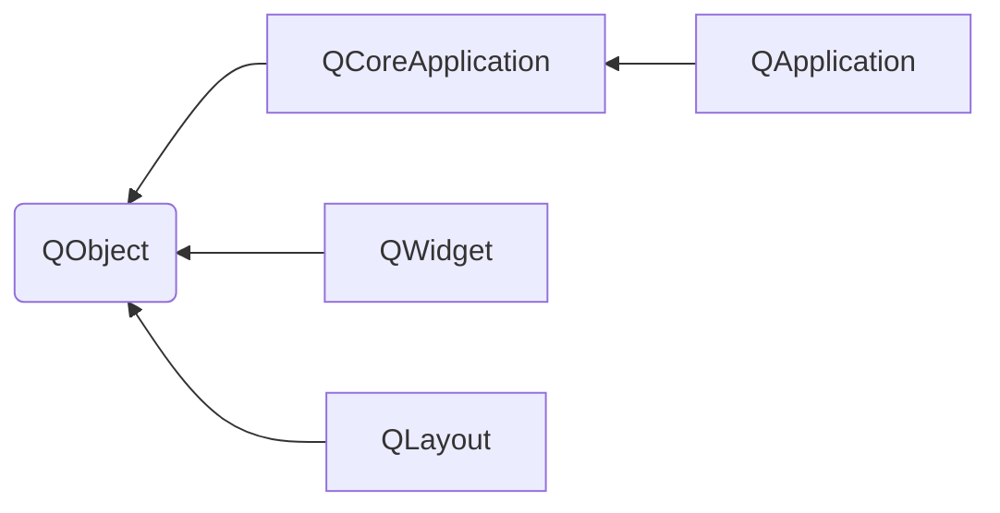

- [Qt 要点概览](#qt-要点概览)
  - [一、Qt是什么](#一qt是什么)
    - [基本对象](#基本对象)
  - [二、信号(signals)、槽(slots)](#二信号signals槽slots)
  - [三、布局(layout)](#三布局layout)
    - [Size](#size)
    - [思考](#思考)
  - [四、样式(style)](#四样式style)
    - [样式表选择器](#样式表选择器)
    - [最常见的自定义辅助控制器](#最常见的自定义辅助控制器)
    - [常见的窗口部件中可以访问样式表的状态](#常见的窗口部件中可以访问样式表的状态)
  - [五、事件(event)](#五事件event)
    - [常见事件](#常见事件)
  - [六、扩展插件(plugin)](#六扩展插件plugin)
  - [Reference](#reference)

# Qt 要点概览

## 一、Qt是什么
Qt 不仅仅是一个图形用户界面开发包，现在它已经逐渐成长为了一个成熟、优秀的应用程序开发框架。

一个简单的 Qt 程序：
```
#include <QApplication>
#include <QLabel>

int main(int argc, char* argv[])
{
  QApplication app(argc, argv);
  QLabel *label = new QLabel("Hello Qt!");
  label->show();
  return app.exec();
}
```

### 文件
文件 | 用途
--- | --- 
.ui | Qt Designer 文件
.qss | 样式表文件
.qrc | 资源列表文件
.pro | 平台无关的工程文件<br>此文件列举了工程中包含的源文件，qmake 可以使用它来生成 makefile 文件

### 编译
常见的 Qt 编译方法有以下三种：
1. 使用 Qt 提供的 qmake 工具
2. 使用第三方编译工具
3. 使用集成开发环境(IDE)

#### qmake
qmake 工具是与 Qt 一起提供的，包含了调用 Qt 内置代码生成工具(moc、uic 和 rcc)的必要的逻辑规则。

#### IDE
可以使用 Qt 提供的 QCreator，也可以使用 Visual Studio 或 Eclipse 配合相关插件来进行开发编译。

这里仅简单介绍下 Visual Studio 的配置方法：
插件配置：
1. 从 ```VS2019 菜单栏``` => ```Extentions(扩展)``` => ```Manage Extentions(管理扩展)```
2. 左侧选择：```联机``` => ```Visual Studio Marketplace```, 再通过搜索框，搜索 ```Qt Visual Studio Tools```
3. 安装 ```Qt Visual Studio Tools```，然后根据提示重启 VS2019
4. 进入配置页面：```VS2019 菜单栏``` => ```Extentions(扩展)``` => ```Qt VS Tools``` => ```Options```
5. 在配置页面：```Qt``` => ```Versions```, 在打开的窗口中点击 Add 按钮(```add new Qt version```)
6. 指定 Qt编译器路径(如 C:\Qt\5.12.0\msvc2019)、```Version Name``` (如 x86-msvc2019-5.12.0) 等信息

工程配置：
- 在 Qt 工程项目的属性中配置：```属性``` => ```Qt Project Settings```
  - ```Qt Installation```：填入插件配置中指定的一个```Version Name```
  - ```Qt Modules```：当前工程项目使用到的 Qt 组件，如：core;gui;widgets
  - ```Build Config```：编译选项，如：release、debug

### 基本对象


一个 widget 的构造函数可以接受一个或者两个标准参数:
1. QWidget *parent = 0
   + 如果 parent 为 0（默认值），那么这个新widget就会变成一个独立的window。
   + 如果 parent 不为0，那么新创建的 widget 是 parent 的一个子窗口，但是此时我们新创建的widget的形状会受其父窗口形状的约束。（除非你指定这个新创建的widget的window flag为Qt::Window）
2. Qt::WindowFlags f = 0
   + 这个参数用来设置新创建的 widget 的 window flags(例如是否有最大化按钮等)。
   + 默认的参数几乎对所有的widget都是适用的。但如果你需要一个没有边框的widget，那么需要使用特定的flag(如，Qt::FramelessWindowHint)。

如果一个 widget 没有被嵌入到另外一个 widget 中，那么这个 widget 就叫做 window，即一个独立的窗口。

Qt 会对所有的窗口进行跟踪，所以 new 一个 window 后，可以没有主动 delete。当用户关闭一个主窗口时，默认行为是隐藏它，不过，可以通过 Qt::WA_DeleteOnClose 属性进行修改。

Qt 实现了类似于 MVC 的项视图类

Qt 类 | 函数 | 说明
--- | --- | ---
QApplication | beep() | 触发系统提示音
QApplication | clipboard() | 剪切板
QApplication | restoreOverrideCursor()<br>setOverrideCursor(Qt::WaitCursor) | 
QSplashScreen | | 启动画面<br>通常会将相关代码放在 mian() 函数中，位于 Application::exec() 调用之前
QWidget | repaint() | 强制产生一个即时的重绘事件<br>如果窗口部件在屏幕上是不可见的，则什么都不做
QWidget | update() | 只是通知 Qt 下一次处理事件时才简单的调用一个绘制事件<br>如果多次调用 update(), Qt 会把连续多次的绘制事件压缩成一个单一的绘制事件，这样可以避免闪烁现象<br>如果窗口部件在屏幕上是不可见的，则什么都不做
QDialog | show()<br>exec() | 非模态<br>模态
QTableWidget | setItemPrototype() | 可以在构造函数中使用此函数用新数据类替换 QTableWidgetItem<br>QTableWidgetItem 不是一个窗口部件类，而是一个纯粹的数据类
QFile | | 数据处理
QDataStream | | 数据处理
Qt 容器类 | | 都是隐含共享(implicit sharing)的, 这是一个能够把整个容器作为不需要太多运行成本的值来传递的最优化过程

## 二、信号(signals)、槽(slots)
所有定义了 signal 和 slot 的类，在类定义的开始处的 Q_OBJECT 宏都是必需的。

信号和槽机制是 Qt 编程的基础。它可以把互不了解的对象绑定在一起：当某个信号被发射时，会自动调用与其关联的一个或多个槽。

- 一个信号可以连接多个槽
  + ```connect(sender, SIGNAL(signal), receiver, SLOT(slot));```
  + 在信号被发射时，会以不确定的顺序一个接一个的调用这些槽。
- 多个信号可以连接同一个槽
- 一个信号可以与另一个信号相连接
- 连接可以被移除
  + 可以通过 ```disconnect(lcd, SIGNAL(overflow()), this, SLOT(handler()));``` 主动移除连接。不过较少用到，因为，当删除对象时，Qt 会自动移除和这个对象相关的所有连接。

要想把信号与槽(或信号)成功连接，它们的参数必须具有相同的顺序和类型，如：```connect(ftp, SIGNAL(f(int, const QString&)), this, SLOT(p(int, const QString&)));```

### 元对象系统
Qt 的主要成就之一就是使用了一种机制对 c++ 进行了扩展，并且使用这种机制创建了独立的软件组件。这些组件可以绑定在一起，但任何一个组件对于它所要连接的组件的情况事先都一无所知。

这种机制称为元对象系统(meta-object system)，它提供了关键的两项技术：信号-槽以及内省(introspection)。

内省功能对于实现信号槽是必需的，并且允许开发人员在运行时获得有关 QObject 子类的"元信息"(meta-information)，包括一个含有对象的类名以及它所支持的信号和槽的列表。这一机制也支持属性(广泛用于 Qt Designer 中)和文本翻译(用于国际化)，并且它也为 QScript 模块奠定了基础。

标准 c++ 没有对 Qt 的元对象系统所需的动态元信息提供支持。**Qt 通过提供一个独立的 moc 工具解决了这个问题，moc 解析 Q_OBJECT 类的定义并且通过 c++ 函数来提供可供使用的信息**。由于 moc 系统使用纯 c++ 来实现它的所有功能，所以 Qt 的元对象系统可以在任意 c++ 编译器上工作。

这一机制是这样工作的：
- Q_OBJECT 宏声明了在每一个 QObject 子类中必须实现的一些内省函数：metaObject()、tr()、qt_metacall()，以及其他函数
- Qt 的 moc 工具生成了用于由 Q_OBJECT 声明的所有函数和所有信号的实现
- 像 connect() 和 disconnect() 这样的 QObject 的成员函数使用这些内省函数来完成它们的工作

由于所有这些工作都是由 ```qmake```、```moc``` 和 ```QObject``` 自动处理的，所以很少需要再去考虑这些事情。如果你对此充满好奇心，可以阅读下有关 QMetaObject 类的文档和由 moc 生成的 c++ 源码。

## 三、布局(layout)
此外，widget 可以通过 setAttribute() 函数设置属性，如，setAttribute(Qt::WA_StyledBackground) 不使用从父对象继承来的 QSS 样式(如，背景、边框、字体等)。


- Layout Management
  - size policy使得layout management system（布局管理系统）拥有良好的默认大小变化管理依据
  - 默认的size policy表示widget的大小可以自由变化，一般倾向于采用sizeHint()返回的大小，这对大多数的widget来说已经足够好了。
  - 提示：顶层widget的大小一般约束为桌面大小长度和宽度的的2/3，但我们也可以通过resize()函数来手动改变大小。

### Size
| 类别 | 函数名 | 效果 | 作用 | 注意事项 |
| --- | --- | --- | --- | --- |
| | ```setMinimumSize(w,h)```<br>```setMaximumSize(w,h)``` | | | 优先级最高
| | ```setFixedSize(x, y, w, h)``` | 其实就是同时：```setMinimumSize(w,h); setMaximumSize(w,h);``` | |setFixedSize 后再调整窗口大小无效，不过，可以如下设置使其生效：<br>```setMinimumSize(0,0); setMaximumSize(QSize(QWIDGETSIZE_MAX,QWIDGETSIZE_MAX)``` 
| | ```resize(x, y, w, h)``` | 调整的大小受 minimumSize() 和 maximumSize() 约束 | | 在*窗口* resize 时如果 w 或者 h 的值小于窗口内某个控件的 w或h，那么 resize 就在这个方向上无效，此时Qt会自动生成一个合适的值
| | ```setGeometry(x, y, w, h)``` | 其实就是 ```resize```和 ```move``` 的组合<br><br>调整的大小受 minimumSize() 和 maximumSize() 约束 | 控制 widget 相对于其父窗口的几何结构(不包括窗口边框，注意和frameGeometry区别) | 1.setGeometry 时，如果控件可见(visible), 会即时接收到 moveEvent() 和 resizeEvent()。如果控件当前不可见, 会保证在控件被显示前接收到相关事件。<br>2. Warning: Calling setGeometry() inside resizeEvent() or moveEvent() can lead to infinite recursion.
| | ```adjustSize()``` | | Adjusts the size of the widget to fit its contents | 当 sizeHint() 有效(如，size hint 的 w 和 h 都 >= 0)时，会采用它的值；不然的话，会设置它的size 为覆盖所有子控件的矩形区域
| | ```pos()``` | widget相对于其父widget的位置 | 
| | ```rect()``` | widget除去窗口边框的内在几何矩形 | 
| | ```size()``` | widget除去边框之外的大小 | 
| | ```sizeHint()``` | This property holds the recommended size for the widget. | | 如果此小部件没有 layout 时，则 sizeHint() 的默认实现返回一个无效值，否则返回 layout 的首选大小(preferred size)。

另外，如果控件被放进 layout 里以后，大小由 layout 控制，resize 就不起作用了。不过：
- 可以通过 setMinimumSize 和 setMaximumSize 控制大小
- 可以通过 move 移动位置

### 思考
1. 如下设置 qss 的话，新建名为 SpecialButton 的 MyPushButton 控件，会出现 minimumHeight() > maximumHeight() 的情形，此时，设置 setFixedSize 会生效吗？
  ```
  /* 按钮 */
  MyPushButton {
      min-height:50px;
      max-height:50px;
  }
  
  /* 按钮: 名为 SpecialButton */
  MyPushButton#SpecialButton {
    min-width:  50px;
    min-height: 100px;
  }
  ```


## 四、样式(style)

可以使用三种方式来重新定义 Qt 内置窗口部件的外观：
1. 子类化个别的窗口部件类，并且重新实现它的绘制和鼠标事件处理器
2. 子类化 QStyle 或者一个预定义的风格，例如 QWindowStyle。Qt 本身就是基于这种方法为它所支持的不同平台提供基于平台的外观的
3. 从 Qt4.2 开始，可以使用样式表(stylesheet)

QApplication::setStyleSheet() 为整个应用程序设置一个样式表；QWdiget::setStyleSheet() 设置窗口以及其子窗口部件的样式表

### 样式表选择器
选择器 | 实例 | 可以匹配的窗口部件
--- | --- | ---
全局对象 | ```*``` | 任意窗口部件
类型 | ```QDial``` | 给定类的实例，**包括子类**
类 | ```.QDial``` | 给定类的实例，**不包括子类**
标识 | ```QDial#ageDial``` | 给定**对象名称**的窗口部件
Qt 属性 | ```QDial[ y="0"``` ] | 为某些**属性**赋值的窗口部件
子对象 | ```QFrame > QDial``` | 给定窗口部件的**直接子窗口**部件
子孙对象 | ```QFrame QDial``` | 给定窗口部件的**子窗口**部件

选择器能以各种方式组合。

从 Qt4.2 开始，可以通过 QObject::setProperty() 动态的设置一个不存在的属性值。

### 最常见的自定义辅助控制器
辅助控制器 | 说明
--- | ---
::indicator | 复选框、单选钮、可选菜单项或可选组群框的指示器
::menu-indicator | 按钮的菜单指示器
::item | 菜单、菜单栏或状态栏项
::up-button | 微调框、滚动条的向上按钮
::down-button | 微调框、滚动条的向下按钮
::up-arrow | 微调框、滚动条或标题视图的向上箭头
::down-arrow | 微调框、滚动条、标题视图或组合框的向下箭头 
::drop-down | 组合框的下拉箭头
::title | 组群框的标题 

### 常见的窗口部件中可以访问样式表的状态
状态 | 说明
--- | ---
:disabled | 禁用窗口部件
:enabled | 启用窗口部件
:focus | 窗口部件有输入焦点
:hover | 鼠标在窗口部件上悬停
:pressed | 鼠标按键单击窗口部件
:checked | 按钮已被选中
:unchecked | 按钮未被选中
:indeterminate | 按钮被部分选中
:open | 窗口部件位于打开或扩展状态
:close | 窗口部件位于关闭或销毁状态
:on | 窗口部件的状态是"on"
:off | 窗口部件的状态是"off"


## 五、事件(event)
Qt 提供了5个级别的事件处理和事件过滤方法：
1. 重现实现特殊的事件处理器 
   - 重新实现像 mousePressEvent()、keyPressEvent() 和 paintEvent() 这样的事件处理器是比较常用的事件处理方式 
2. 重新实现 QObject::event()
   - 通过 event() 函数的重新实现，可以在这些事件到达特定的事件处理器之前处理它们
   - 当重新实现 event() 时，必须对那些没有明确处理的情况调用其基类的 event() 函数
3. 在 QObject 中安装事件过滤器
   - 对象一旦使用 installEventFilter() 注册过，用于目标对象的所有事件都会首先发送给这个监听对象的 eventFilter() 函数
   - 如果同一个对象上安装了多个事件处理器，那么就会按照安装顺序逆序，从最后安装的到最先安装的，依次激活这些事件处理器
4. 在 QApplication 对象中安装事件过滤器
   - 一旦在唯一的 QApplication 对象中注册了事件过滤器，那么应用程序中每个对象的每个事件都会在发送到其他事件过滤器之前，先发送给这个 eventFilter() 函数
   - 这种处理方式对于调试是非常有用的。它也可以用来处理那些发送给失效窗口部件的鼠标事件，因为 QApplication 通常都会忽略这些事件
5. 子类化 QApplication 并重新实现 notify()
   - Qt 调用 QApplication::notify() 来发送一个事件。重新实现这个函数是在事件过滤器得到所有事件之前获得它们的唯一方式
   - 事件过滤器通常更有用，因为可以同时有多个事件过滤器，而 notify() 函数却只能有一个

### 常见事件
| 类别 | 方法 | 说明 |  注意事项 |
| --- | --- | --- | --- |
| | ```mouseReleaseEvent()``` | 收到鼠标按下事件的 widget，也将接收鼠标释放事件 | 如果用户在某 widget 上按下鼠标，然后松开鼠标前拖动鼠标到别的地方，那么此 widget 也将接收到释放事件。<br>有一个例外：如果在按住鼠标按钮的同时出现弹出菜单，则该弹出窗口会立即窃取鼠标事件。|
| | ```enterEvent()``` | 鼠标进入该 widget 所在屏幕区域时被调用 | 该 widget 的屏幕区域不包括其子 widget 的屏幕区域 |
| | ```leaveEvent()``` | 鼠标离开widget所在屏幕区域时被调用，但是如果鼠标进入了子widget屏幕区域时该函数不会被调用 | |
| | ```moveEvent()``` | widget 相对于其父 widget 被移动时被调用 | |
| | ```closeEvent()``` | 用户关闭 widget 时或者调用 close() 函数时被调用 | |


mouseMoveEvent ：当用户按下一个键时才产生，setMouseTracking()

## 六、扩展插件(plugin)
可以使用很多插件类型来扩展 Qt，其中最常用的就是数据库驱动、图像格式、风格(style)和文本编码解码器

对于每一个类型的插件，通常至少需要两个类：一个是插件封装类，另外则是一个或多个处理器类


## Reference
- https://blog.csdn.net/dengjin20104042056/article/details/115304706
- [Layout Management](https://doc.qt.io/qt-5/layout.html)
- [The Event System](https://doc.qt.io/qt-5.15/eventsandfilters.html) 


