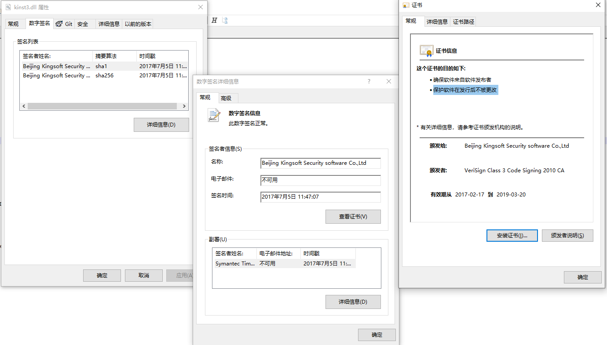
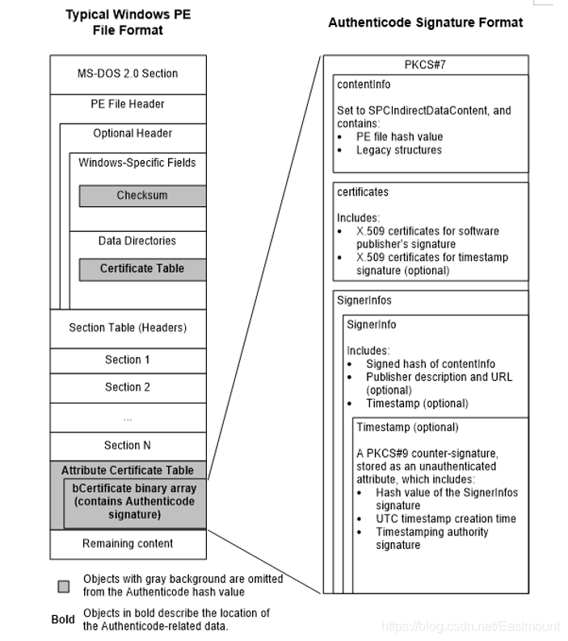
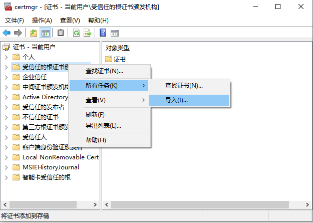

# PE 签名
简单来说，数字签名(digital signature)是非对称公钥密码系统的逆应用：用私钥加密消息，用公钥解密消息。

而证书，实际上就是对公钥进行数字签名，它是对公钥合法性提供证明的技术。

一般来说，证书有两个作用：确保软件来自软件发布者、保护软件在发行后不被更改。本文就是围绕这两个核心问题进行展开说明。

## 签名介绍
windows 平台下的 PE签名 大致可以分为```embedded、catalog```两种，区别如下：
- embedded
    + 嵌入式签名，顾名思义，将签名数据嵌入到 PE 文件中
    + 右键属性即可查看相关信息
    + 格式公开，可以自己解析
- catalog
    + 编录式签名，将签名数据放到一个后缀为```.cat```的编录文件中，并不嵌入到 PE 文件中。这种签名方法可以对任意格式的文件签名，并不局限于PE文件
    + 右键查看文件属性看不到数字签名标签(因为签名数据是独立文件)
    + 微软未公开格式文档

另外，对于运行于内核中的文件，Microsoft 要求必须进行**交叉证书**认证。(可以通过 ```signtool verify /v /kp <mydriver.sys>``` 查看交叉证书链)。

【*在2021年7月1日之后，必须使用 WHQL 签名对内核模式驱动程序签名。不能使用链接到2021年7月1日之后过期的交叉证书的证书来对内核模式驱动程序进行签名。*】

### 查看签名
嵌入式签名内容如下：


签名中包含的主要信息有：
- 签名者(signer)
    + 名字、邮箱、签名时间(一般以'副署'中时间戳为准)
- 签名时间
    + 一般用*副署签名*中的时间戳
- 副署签名(counter signature)
    + optional，一个独立、完整的签名
    + 一般用于签名时间戳，指明允许用当前时间签名数据
    + 常见的两种数据格式:
        - ```szOID_RFC3161_counterSign```
            + ```To obtain the timestamp information (RFC3161) of that signature, search the Unauthenticated attribute with pszObjId = szOID_RFC3161_counterSign (1.3.6.1.4.1.311.3.3.1).```
            + *暂未找到此字段的完整格式描述，但能找到解出时间戳的相关代码*
        - ```szOID_RSA_counterSign```
- 嵌套签名(nested signature)
    + optional，一个独立、完整的签名
    + 如果文件属性中的签名列表有多个签名，从结构上讲，第二个(包含)签名开始就是嵌套签名
    + ```Authenticode stores secondary signatures in the UnauthenticatedAttributes of primary signer (index 0), instead of additional PKCS 7 signer.```
        - ``` From the primary signature, search the UnauthenticatedAttribue for below: define szOID_NESTED_SIGNATURE "1.3.6.1.4.1.311.2.4.1". The encoded object of this attribute is a full PKCS 7 signer.```
    + **注意***对照下文 SignedData 结构的 SignerInfos 字段的用途*
- 证书(certificate)：
    - 证书链(certificate chain)
        + 文件中内嵌的证书链，只到 ca 证书，不包含根证书
    - 签名
        + 不能在属性中查看
        + 用 CA 私钥对证书主体(即下文 X509 证书的```TBSCertificate```结构)加密形成的签名
    - 证书详情
        + 版本(Version)
        + 序列号(Serial Number)
            + 由 CA 指定的独一无二的 ID
        + 颁发者(Issuer)、使用者(Subject)
        + 证书有效期(Not Before、Not After)
        + 签名算法、公钥、公钥参数
            + Subject Public Key 相关的信息
        + 签名哈希算法
        + CRL(证书吊销列表, Certificate revocation list) 分发点
        + 指纹
            + windows 查看 PE 属性时能看到，对 证书完整内容 进行 SHA1 计算得到
        + 秘钥用法(Key Usage)、增强型(enhanced)秘钥用法
            + 指明证书的用途范围
        + 证书策略
        + 授权信息访问、授权秘钥标识符、使用者秘钥标识符

可以通过命令 ```openssl x509 -in abc.cer -text -noout``` 查看证书的详细信息(此工具不支持 DER 编码二进制 X.509, 只支持 Base64 编码的 X.509)。

可以在 Windows 系统的**运行**中输入```certmgr.msc```可以看到系统默认的ECC签名的根证书。

### PE文件中签名结构
嵌入式签名结构如下：


## 签名验证
### 证书生成
1. 服务器将公钥A给CA(公钥是服务器的)
2. CA用自己的私钥B给公钥A加密，生成数字签名A
3. CA把公钥A，数字签名A，附加一些服务器信息整合在一起，生成证书，发回给服务器

*注：私钥B是用于加密公钥A的，私钥B和公钥A并不是配对的*

### 证书验证
1. 客户端得到证书
2. 客户端得到用于证书验证的公钥B(通过CA或系统内嵌或其它途径)
3. 客户端用公钥B对证书中的数字签名解密，得到哈希值
4. 客户端对证书中的公钥A进行哈希值计算
5. 两个哈希值对比，如果相同，则证书合法

*注：公钥B和上述的私钥B是配对的，分别用于对证书的验证(解密)和生成(加密)*

### 验证证书的证书
客户端得到的用于证书验证的**公钥B**是合法的吗？为了解决这个问题，我们也需要想办法对公钥B也进行验证，这就需要找到对公钥B也进行签名、验证，就就是前面讲到的*生成证书、验证证书*。不过，这个过程何时是个尽头呢？根证书(Root Certificate)。

根证书是属于根证书颁发机构(CA)的公钥证书，是在公开金钥基础建设中，信任链的起点。安装根证书意味着对这个CA认证中心的信任。另外，根证书是自签名的证书。

### 签名验证
1. 验证时间戳
2. 验证签名 hash 一致性
3. 验证证书是否被吊销
4. 沿证书链，重复以上流程以验证证书的有效性，直到根证书

## 实践
### 嵌入式
1. 用 ```makecert``` 生成一个自签名的根证书: ``` makecert -n "cn=root" -r -sv test_root.pvk test_root.cer ```
2. 用根证书签发一个子证书: ``` makecert -n "cn=child" -iv test_root.pvk -ic test_root.cer -sv test_child.pvk test_child.cer ```
3. 当然，此时这种证书是不被系统所信任的，需要手动把生成的证书导入到系统：
    - 在 Windows 系统的**运行**中输入```certmgr.msc```
    - 找到 "受信任的根证书颁发机构"，右键 -> 所有任务 -> 导入
        
4. 此时，就可以使用微软的 ```signtool``` 工具对PE文件进行嵌入式签名了

### 编录式
1. 根据需要创建一个 cdf 文件，例如：
    ```
    [CatalogHeader]
    Name=tstamd64.cat
    PublicVersion=0x0000001
    EncodingType=0x00010001
    CATATTR1=0x10010001:OSAttr:2:6.0
    [CatalogFiles]
    <hash>File1=amd64\toaster.pdb
    <hash>File2=amd64\toaster.sys
    <hash>File3=amd64\toastva.exe
    <hash>File4=amd64\toastva.pdb
    ```
2. 使用微软的 ```makecat``` 工具从上一步创建的 cdf 文件生成 cat 文件, 例如：```makecat -v tstamd64.cdf```
3. 使用微软的 ```signtool``` 工具对 cat 文件进行签名

*注：当然也要将证书加入信任列表*

*注：参考 [using-makecat-to-create-a-catalog-file](https://docs.microsoft.com/zh-cn/windows-hardware/drivers/install/using-makecat-to-create-a-catalog-file)*

### 验证签名
使用命令行进行验证： ``` signtool verify /v /kp [service-new.exe] ```

*注：参考 [生成 win10 下调试服务时的证书](windows_make_cert.md)*

## 签名代码
常见的验证签名的代码片段：
```
    BOOL CheckFileTrust( LPCWSTR lpFileName )
    {
        BOOL bRet = FALSE;
        WINTRUST_DATA wd = { 0 };
        WINTRUST_FILE_INFO wfi = { 0 };
        WINTRUST_CATALOG_INFO wci = { 0 };
        CATALOG_INFO ci = { 0 };
    
        HCATADMIN hCatAdmin = NULL;
        if ( !CryptCATAdminAcquireContext( &amp;hCatAdmin, NULL, 0 ) )
        {
            return FALSE;
        }
    
        HANDLE hFile = CreateFileW( lpFileName, GENERIC_READ, FILE_SHARE_READ, NULL, OPEN_EXISTING, 0, NULL );
        if ( INVALID_HANDLE_VALUE == hFile )
        {
            CryptCATAdminReleaseContext( hCatAdmin, 0 );
            return FALSE;
        }
    
        DWORD dwCnt = 100;
        BYTE byHash[100];
        CryptCATAdminCalcHashFromFileHandle( hFile, &amp;dwCnt, byHash, 0 );
        CloseHandle( hFile );
    
        LPWSTR pszMemberTag = new WCHAR[dwCnt * 2 + 1];
        for ( DWORD dw = 0; dw &lt; dwCnt; ++dw )
        {
            wsprintfW( &amp;pszMemberTag[dw * 2], L"%02X", byHash[dw] );
        }
    
        HCATINFO hCatInfo = CryptCATAdminEnumCatalogFromHash( hCatAdmin, byHash, dwCnt, 0, NULL );
        if ( NULL == hCatInfo )   // 编录中没有则验证是否有嵌入式签名
        {
            wfi.cbStruct       = sizeof( WINTRUST_FILE_INFO );
            wfi.pcwszFilePath  = lpFileName;
            wfi.hFile          = NULL;
            wfi.pgKnownSubject = NULL;
    
            wd.cbStruct            = sizeof( WINTRUST_DATA );
            wd.dwUnionChoice       = WTD_CHOICE_FILE;
            wd.pFile               = &amp;wfi;
            wd.dwUIChoice          = WTD_UI_NONE;
            wd.fdwRevocationChecks = WTD_REVOKE_NONE;
            wd.dwStateAction       = WTD_STATEACTION_IGNORE;
            wd.dwProvFlags         = WTD_SAFER_FLAG;
            wd.hWVTStateData       = NULL;
            wd.pwszURLReference    = NULL;
        }
        else  // 编录中有，验证编录文件的签名是否有效
        {
            CryptCATCatalogInfoFromContext( hCatInfo, &amp;ci, 0 );
            wci.cbStruct             = sizeof( WINTRUST_CATALOG_INFO );
            wci.pcwszCatalogFilePath = ci.wszCatalogFile;
            wci.pcwszMemberFilePath  = lpFileName;
            wci.pcwszMemberTag       = pszMemberTag;
    
            wd.cbStruct            = sizeof( WINTRUST_DATA );
            wd.dwUnionChoice       = WTD_CHOICE_CATALOG;
            wd.pCatalog            = &amp;wci;
            wd.dwUIChoice          = WTD_UI_NONE;
            wd.fdwRevocationChecks = WTD_STATEACTION_VERIFY;
            wd.dwProvFlags         = 0;
            wd.hWVTStateData       = NULL;
            wd.pwszURLReference    = NULL;
        }
        GUID action = WINTRUST_ACTION_GENERIC_VERIFY_V2;
        HRESULT hr  = WinVerifyTrust( NULL, &amp;action, &amp;wd );
        bRet        = SUCCEEDED( hr );
    
        if ( NULL != hCatInfo )
        {
            CryptCATAdminReleaseCatalogContext( hCatAdmin, hCatInfo, 0 );
        }
        CryptCATAdminReleaseContext( hCatAdmin, 0 );
        delete[] pszMemberTag;
        return bRet;
    }
```

以上是通过 Windows 的 API 进行验证操作，如果让我们自己去进行完整的验证流程，我们该怎么弄呢？

### 1. 取出签名
根据上文中 PE 结构可知，PE头的```Data Directories中Certificate Table```里面指明了```WIN_CERTIFICATE```的存放位置和大小，```WIN_CERTIFICATE```的```bCertificate```就是是SignedData格式的签名。结构如下：

```
    typedef struct _IMAGE_DATA_DIRECTORY {
        DWORD   VirtualAddress;  // PE文件的偏移
        DWORD   Size;
    } IMAGE_DATA_DIRECTORY, *PIMAGE_DATA_DIRECTORY;
    
    typedef struct _WIN_CERTIFICATE
    {
        DWORD       dwLength; // WIN_CERTIFICATE 的长度（含bCertificate的大小）
        WORD        wRevision;
        WORD        wCertificateType;
        BYTE        bCertificate[ANYSIZE_ARRAY]; // signedData开始的位置
    
    } WIN_CERTIFICATE, *LPWIN_CERTIFICATE;
```

### 2. 校验文件自身的签名
文件签名本身是遵循**PKCS7**标准中的 SignedData 格式，用 ASN1 表述的格式如下：
```
    SignedData ::= SEQUENCE {
        version Version,
        digestAlgorithms DigestAlgorithmIdentifiers,
        contentInfo ContentInfo,  -- 这个里面包含了PE文件的Hash
        certificates  --证书的数组（不包括根证书）
            [0] IMPLICIT ExtendedCertificatesAndCertificates OPTIONAL,
        Crls 
            [1] IMPLICIT CertificateRevocationLists OPTIONAL,
        signerInfos SignerInfos }  -- 签名者的信息
    
    SignerInfos ::= SET OF SignerInfo
```

**PKCS7**是加密消息的语法标准，**X.509**是证书的格式。**ASN1**是一种描述对象结构的语法，在一行的定义中可以简单的认为前面的是变量名后面的是类型。

**ASN1**并未定义编码方法，DER是一种常见的编码方法，其他还有 Base64 等编码方法。

SignerInfos的结构如下：
```
    SignerInfo ::= SEQUENCE {
        version Version,
        issuerAndSerialNumber IssuerAndSerialNumber,
        digestAlgorithm DigestAlgorithmIdentifier,
        authenticatedAttributes -- 内含SignedData中contentInfo的摘要
            [0] IMPLICIT Attributes OPTIONAL,
        digestEncryptionAlgorithm DigestEncryptionAlgorithmIdentifier,
        encryptedDigest EncryptedDigest, -- 加密后的摘要
        unauthenticatedAttributes 
            [1] IMPLICIT Attributes OPTIONAL }
    IssuerAndSerialNumber ::= SEQUENCE {
        issuer Name,
        serialNumber CertificateSerialNumber }
    EncryptedDigest ::= OCTET STRING
```

authenticatedAttributes 包含了 contentType和messageDigest，messageDigest 内就是对 SignedData 的 ContentInfo 做的摘要。对authenticatedAttributes 做摘要得到一个 DigestInfo 结构的数据，DigestInfo 的结构如下：

```
    DigestInfo ::= SEQUENCE {
        digestAlgorithm DigestAlgorithmIdentifier,
        digest Digest }
    
    Digest ::= OCTET STRING
```

用 IssuerAndSerialNumber 找到签名者的证书，使用里面的公钥解密EncryptedDigest 得到一个 DigestInfo 结构（一般是RSA算法），将这个结构与authenticatedAttributes 做摘要得到的结构对比，一致的话才进行下一步。

### 3. 验证证书链
相关结构如下：
```
-- X509的证书格式
   Certificate  ::=  SEQUENCE  {
        tbsCertificate       TBSCertificate,   -- 证书主体
        signatureAlgorithm   AlgorithmIdentifier,  -- 签名用的算法，一般为sha1RSA
        signatureValue       BIT STRING  }     -- 证书的签名
 
   TBSCertificate  ::=  SEQUENCE  {
        version         [0]  EXPLICIT Version DEFAULT v1, -- PE文件数字签名用的版本为3
        serialNumber         CertificateSerialNumber,
        signature            AlgorithmIdentifier,
        issuer               Name,
        validity             Validity, -- 有效期
        subject              Name,
        subjectPublicKeyInfo SubjectPublicKeyInfo,  -- 含有这个证书的公钥
        issuerUniqueID  [1]  IMPLICIT UniqueIdentifier OPTIONAL,
                             -- If present, version MUST be v2 or v3        
        subjectUniqueID [2]  IMPLICIT UniqueIdentifier OPTIONAL,
                             -- If present, version MUST be v2 or v3
        extensions      [3]  EXPLICIT Extensions OPTIONAL  -- 扩展
                             -- If present, version MUST be v3
        }
 
   -- 含有公钥的信息
   SubjectPublicKeyInfo  ::=  SEQUENCE  {
        algorithm            AlgorithmIdentifier,
        subjectPublicKey     BIT STRING  }
```

首先构建证书链，从终端签发数字签名的证书一直到自签名的根证书。这时要了解到证书最后一个成员为扩展，扩展是一列其他的数据，其中两项比较重要的是AuthorityKeyIdentifier和SubjectKeyIdentifier，结构分别如下

```
AuthorityKeyIdentifier ::= SEQUENCE {
      keyIdentifier             [0] KeyIdentifier           OPTIONAL,
      authorityCertIssuer       [1] GeneralNames            OPTIONAL,
      authorityCertSerialNumber [2] CertificateSerialNumber OPTIONAL  }
 
   KeyIdentifier ::= OCTET STRING
 
   SubjectKeyIdentifier ::= KeyIdentifier
```

组建证书链时，将把A证书的中的 AuthorityKeyIdentifier（简称AKID） 的keyIdentifier、authorityCertIssuer、authorityCertSerialNumber 与B证书的 SubjectKeyIdentifier（简称SKID）、issuer 、serialNumber 分别匹配，如果匹配上则B证书为A证书的签发者。如果A证书的上面三项与自己对应数据匹配上，则A证书为自签名的证书，证书链构建完毕。

然后，校验证书链中每个证书的签名、有效期和用法（是否可以用于代码签名）。签名验证的算法为证书中的 signatureAlgorithm，签名是 signatureValue，被签名的数据为 tbsCertificate，公钥从父证书的 subjectPublicKeyInfo 里面拿。

### 4. 比对PE文件和签名数据中的Hash
签名数据中的Hash算法和Hash在SignedData的contentInfo中，contentinfo的结构为：
```
    ContentInfo ::= SEQUENCE {
    contentType ContentType,
    content
        [0] EXPLICIT ANY DEFINED BY contentType OPTIONAL 
    }
```

contentType 是SPC_INDIRECT_DATA_OBJID (1.3.6.1.4.1.311.2.1.4)，表明了content的类型。content是是一个SpcIndirectDataContent结构的数据。

```
    SpcIndirectDataContent ::= SEQUENCE {
        data                    SpcAttributeTypeAndOptionalValue,
        messageDigest           DigestInfo
    } --#public—
    
    DigestInfo ::= SEQUENCE {
        digestAlgorithm     AlgorithmIdentifier,
        digest              OCTETSTRING
    }
```

digestAlgorithm 就是Hash算法，一般为sha1。digest就是文件的Hash。

Hash的计算原则为排除且仅排除掉签名过程中可能会改动的数据以及数字签名本身。大概计算过程如下：
- 除去PE头中 checksum 和 Certificate Table 计算PE头的HASH（含 Section Table）
- 按每个节偏移的顺序依次对每个节的数据算HASH
- 对PE附加数据算HASH
    + 附加数据的起始偏移为：```PE头大小+每个节的大小```
    + ```附加数据大小=文件大小-(PE头+每个节)-签名的大小```
    + ```签名的大小是 Optional Header Data Directories[Certificate Table].Size```

另外，由这个Hash算法可以看出，PE文件的签名数据都是放到PE文件最尾部的，因为只有附加数据最末尾一段为签名数据大小的数据是没有计算在PE的Hash内的。这就给文件带来了在文件尾部进行修改的可能，不是吗？

## 总结
通过上文，我们对 Windows 下的签名有了一定的了解，而这只是 Microsoft 复杂的签名系统中的一小部分，不过有了这些认知，就更容易去学习签名相关的其他细节以及更加复杂的内容了。

## 思考
+ counter signature 是对哪块内容计算签名内容呢？
    - 这个 signature 是父签名的一个属性，表达这个属性的结构体([参考链接](https://chromium.googlesource.com/external/omaha/+/8328814108609a7061697caea3f48bca98c2938f/common/signaturevalidator.cc))为：
        ```
        typedef struct _CRYPT_ATTRIBUTE {
            LPSTR            pszObjId;
            DWORD            cValue;
            PCRYPT_ATTR_BLOB rgValue;
        } CRYPT_ATTRIBUTE, *PCRYPT_ATTRIBUTE;

        typedef struct _CRYPTOAPI_BLOB {
        DWORD cbData;
        BYTE  *pbData;
        } CRYPT_INTEGER_BLOB, *PCRYPT_ATTR_BLOB;
        ```

## Reference
- [对Windows 平台下PE文件数字签名的一些研究](https://blog.mtian.org/2015/06/windowspesign/#_Toc419139202)
- [using-inf2cat-to-create-a-catalog-file](https://docs.microsoft.com/zh-cn/windows-hardware/drivers/install/using-inf2cat-to-create-a-catalog-file)
- [CSP学习之CryptoAPI初识](https://www.cnblogs.com/dspeeding/p/3338129.html)
- [用于内核模式代码签名的交叉证书](https://docs.microsoft.com/zh-cn/windows-hardware/drivers/install/cross-certificates-for-kernel-mode-code-signing)
- [RFC3161 timestamp information in digital signature (authenticode)](https://social.msdn.microsoft.com/Forums/lync/en-US/40dcf50b-c637-4d7d-b0c0-598a61f96f8c/rfc3161-timestamp-information-in-digital-signature-authenticode?forum=windowsgeneraldevelopmentissues)