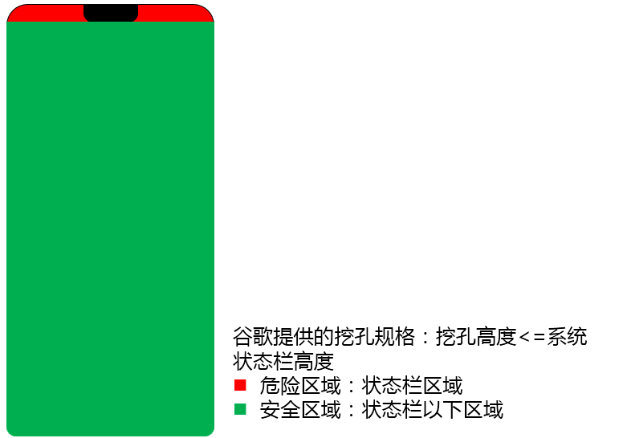
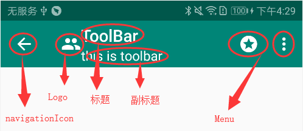
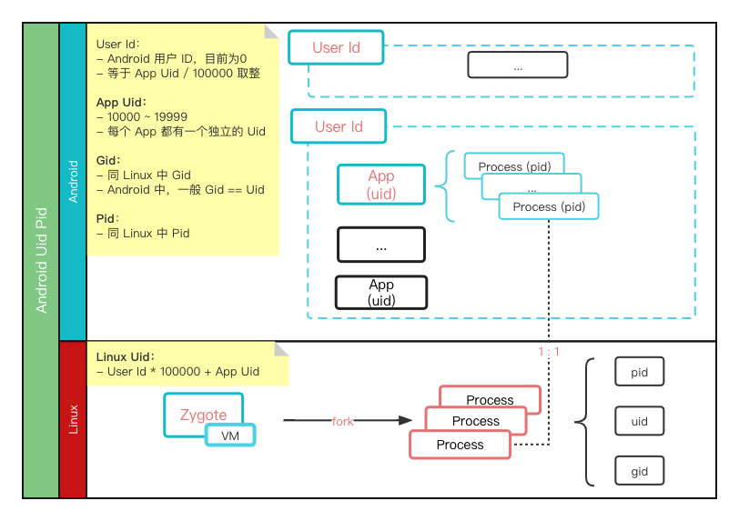

# 目录
- [目录](#目录)
- [Android](#android)
  - [1、android 基础概念](#1android-基础概念)
    - [资源目录 drawable \&\& mipmap](#资源目录-drawable--mipmap)
    - [引入本地其它目录的 module](#引入本地其它目录的-module)
    - [gradle 中预定义变量的定义和使用](#gradle-中预定义变量的定义和使用)
      - [Gradle 中使用 *xxx.properties* 中的预定义变量](#gradle-中使用-xxxproperties-中的预定义变量)
      - [App 代码中使用 *build.gradle* 中的预定义变量](#app-代码中使用-buildgradle-中的预定义变量)
  - [2、Gradle、Gradle Plugin](#2gradlegradle-plugin)
    - [配置参数](#配置参数)
      - [android.buildToolsVersion](#androidbuildtoolsversion)
      - [android.compileSdkVersion](#androidcompilesdkversion)
      - [android.defaultConfig.minSdkVersion](#androiddefaultconfigminsdkversion)
      - [android.defaultConfig.targetSdkVersion](#androiddefaultconfigtargetsdkversion)
  - [3、Storage](#3storage)
  - [4、Splash Screen](#4splash-screen)
    - [低版本 Android 使用 SplashScreen API](#低版本-android-使用-splashscreen-api)
    - [启动画面的元素和机制](#启动画面的元素和机制)
    - [迁移启动画面实现](#迁移启动画面实现)
  - [5、全面屏(刘海屏)适配](#5全面屏刘海屏适配)
    - [ToolBar 介绍](#toolbar-介绍)
    - [介绍：StatusBar、ActionBar、StatusBar](#介绍statusbaractionbarstatusbar)
    - [状态栏的显示](#状态栏的显示)
    - [沉浸式状态栏的适配](#沉浸式状态栏的适配)
    - [全屏显示的适配](#全屏显示的适配)
      - [Android P 及以上 适配](#android-p-及以上-适配)
    - [Reference](#reference)
  - [6、Android Widgets](#6android-widgets)
    - [6.1 EditText \&\& TextInputLayout](#61-edittext--textinputlayout)
  - [7、自定义 Dialog](#7自定义-dialog)
  - [8、自定义 View](#8自定义-view)
  - [9、Binding](#9binding)
  - [10、Uid \& Pid \& User Id](#10uid--pid--user-id)
    - [1.1 查看](#11-查看)
    - [1.2 获取](#12-获取)
    - [1.3 系统分配](#13-系统分配)
  - [11、Window](#11window)
  - [12、Reflection](#12reflection)
  - [13、Binder](#13binder)
- [TODO：](#todo)
  - [Gradle](#gradle)
  - [常见问题](#常见问题)
    - [UIAutomatorViewer](#uiautomatorviewer)
  - [Resources](#resources)

# Android

## 1、android 基础概念
### 资源目录 drawable && mipmap
- ```drawable```是默认的图形资源文件夹，而```drawable-v24```是在**API 24及以上**版本中才能使用的图形资源的文件夹
  + ```drawable-v24```可以用来存放在API 24及以上版本中才能使用的特定资源，比如动画、矢量图等。在低于API 24的设备上，这些资源将会使用 drawable 文件夹中的资源

- 最佳实践：```mipmap```下放置应用图标，其他图片资源放在```drawable```中
  + 在apk安装的时候，```mipmap```的所有分辨率的图片都会保留，而```drawable```只保留适配设备分辨率的图片，其余图片会被丢弃，以减少了APP安装大小
  + 但，某些应用启动器显示的应用图标会比设备的密度级别所要求的大，所以为了保证效果，需要保留所有分辨率的应用图标
    - 参考：[将应用图标放在 mipmap 目录中](https://developer.android.com/training/multiscreen/screendensities?hl=zh-cn#mipmap)

### 引入本地其它目录的 module
1. 在项目中引用并指定位置
   + 修改 project 的 settings.gradle，以在include中引入模块，如：```include ':app', ':xxx'```
   + 修改 project 的 settings.gradle，以指定模块位置(配置在 local.properties 中的 xxx.dir 属性)，如：
      ``` 
      /// 注：以下内容参考 flutter 项目 settings.gradle 对 local.properties 的使用

      def localPropertiesFile = new File(rootProject.projectDir, "local.properties")
      def properties = new Properties()

      assert localPropertiesFile.exists()
      localPropertiesFile.withReader("UTF-8") { reader -> properties.load(reader) }

      def XxxPath = properties.getProperty("xxx.dir")
      project(":xxx").projectDir = file("$XxxPath/xxx")
      ```
2. 在模块中引用
   + 修改 module 的 build.gradle： ```dependencies { implementation project(':xxx') }```

### gradle 中预定义变量的定义和使用
定义示例：
```
/// 注：以下内容参考 flutter 项目 build.gradle 对 local.properties 的使用

def localProperties = new Properties()
def localPropertiesFile = rootProject.file('local.properties')
if (localPropertiesFile.exists()) {
    localPropertiesFile.withReader('UTF-8') { reader ->
        localProperties.load(reader)
    }
}

def flutterRoot = localProperties.getProperty('flutter.sdk')
if (flutterRoot == null) {
    throw new GradleException("Flutter SDK not found. Define location with flutter.sdk in the local.properties file.")
}

def flutterVersionCode = localProperties.getProperty('flutter.versionCode')
if (flutterVersionCode == null) {
    flutterVersionCode = '1'
}

...

android {
    defaultConfig {
        ...

        versionCode flutterVersionCode.toInteger()
        versionName flutterVersionName

        buildConfigField "String[]", "ICON_PACKS", "{\"classic\",\"material\"}"
    }

    signingConfigs {
        release {
            storeFile file("相对或绝对路径")
            storePassword KEY_STORE_PASS_PropertiesDefined
            keyAlias ALIAS_NAME_PropertiesDefined
            keyPassword ALIAS_PASS_PropertiesDefined
        }
    }

    buildTypes {
        debug {
            buildConfigField "String", "gradle_defined_BUILD_TYPE", "\"debug\""
            resValue "string", "gradle_defined_uid", "acountXxx"
            resValue "string", "gradle_defined_pwd", "${propertiesDefinedPwd}"
        }
    }

    flavorDimensions "version"
    productFlavors {
        ove {
            dimension "version"
            applicationIdSuffix = ".ove"

            buildConfigField "String", "gradle_defined_BUILD_VERSION", "\"ove\""
            buildConfigField "String[]", "gradle_defined_BUILD_INFOS", "{\"xxa\"," + "\"xxb\"}"
        }
    }
}
```

使用示例：
```
  fun showToast(ctx: Context) {
    Toast.show(ctx, BuildConfig.gradle_defined_BUILD_VERSION, Toast.LENGTH_LONG).show()
  }
```

```
  <TextView
    android:id="@+id/tv_test"
    android:layout_width="match_parent"
    android:layout_height="wrap_content"
    android:text="@string/gradle_defined_uid" />
```

#### Gradle 中使用 *xxx.properties* 中的预定义变量
可以在 **.properties** 中自定义在 gradle 文件中使用的常量。常用的文件有两种：
- ```gradle.properties```
  + android studio 创建项目时自动创建，存在于项目根目录
  + gradle 可以直接引用其中定义的变量
- ```local.properties```
  + 自定义文件(文件名可自定义，常用 *local.properties*)，存在于项目根目录
  + gradle 不能直接引用其中定义的变量，需要先加载文件: 如上文描述

#### App 代码中使用 *build.gradle* 中的预定义变量
可以在 **build.gradle** 中自定义在项目中引用的常量：
- buildConfigField 
  + 定义方式: ```buildConfigField 类型, 变量名, 值```
  + 在代码中: 通过 ```BuildConfig.Xxx``` 引用
- resValue
  + 定义方式: ```resValue XML资源中的类型, 变量名, 值```
  + 在资源中: 通过 ```@string/Xxx``` 引用, 其中*string*可以根据定义使用具体类型

## 2、Gradle、Gradle Plugin
Android Studio 构建系统以 Gradle 为基础，并且 Android Gradle 插件添加了几项专用于构建 Android 应用的功能。

虽然 Android 插件通常会与 Android Studio 的更新步调保持一致，但插件（以及 Gradle 系统的其余部分）可独立于 Android Studio 运行并单独更新。

不过，Gradle 和 Android Gradle Plugin 的版本需要匹配，同时，Android GradlePlugin 和 Android Studio 也有兼容性要求。具体可以[参考文档：gradle-plugin](https://developer.android.google.cn/studio/releases/gradle-plugin?hl=zh-cn)。

修改 Gradle 和 Android Gradle Plugin 版本的方法有：
1. 在 Android Studio 的 ```File > Project Structure > Project``` 菜单中指定 Gradle、Gradle Plugin 版本
2. Gradle 版本: 在 ```gradle/wrapper/gradle-wrapper.properties``` 文件中修改 Gradle 分发引用来指定：
    ```
    ...
    distributionUrl = "https\://services.gradle.org/distributions/gradle-7.4.2-bin.zip"
    ...
    ```
3. Gradle Plugin 版本: 在顶级 build.gradle 文件中进行指定，如：
    ``` Groovy
    plugins {
        id 'com.android.application' version '7.2.0' apply false
        id 'com.android.library' version '7.2.0' apply false
        id 'org.jetbrains.kotlin.android' version '1.5.31' apply false
    }
    ```

### 配置参数
一般情况下有：```buildToolsVersion >= compileSdkVersion >= targetSdkVersion```

#### android.buildToolsVersion
build.gradle 中，指定```Android SDK Build-Tools```的版本号，**应保持更新 Build Tools 组件**

```Build-Tools```是构建 Android 应用所需的一个 Android SDK 组件，安装在```<sdk>/build-tools/``` 目录中。

更新```Build-Tools```组件的方式有：
1. 使用 Android SDK 管理器下载该组件的最新版本
2. 如果您使用的是[Android Plugin for Gradle 3.0.0](https://developer.android.google.cn/studio/releases/gradle-plugin?hl=zh-cn#3-0-0)或更高版本，那么项目会自动使用该插件指定的默认版本的 Build Tools。
3. 如需使用其他版本的 Build Tools，请在模块的 build.gradle 中使用 buildToolsVersion 进行指定，如下所示：``` android {  buildToolsVersion "30.0.2"} ```

#### android.compileSdkVersion
build.gradle 中，指定用于编译 apk 的 Android SDK 版本，**推荐总是使用最新的 sdk 进行编译**

编译 apk 用的 sdk 只在编译期使用，并不会包含到 apk 中。

如果使用了```Support Library```,  需要与 ```compileSdkVersion``` 保持大版本号一致。通常，新版的 ```Support Library``` 随着新的系统版本而发布，它为系统新增加的 API 和 新特性提供兼容性支持。

#### android.defaultConfig.minSdkVersion
build.gradle 中，指定应用可以运行的最低 sdk 要求

特点如下：
 1. minSdkVersion 是各大应用商店用来判断用户设备是否可以安装某个应用的标志之一
 2. lint 默认会在项目中运行，它会在使用低于 minSdkVersion 的 API 时发出警告，帮助避免调用不存在的 api。如果只在较高版本的系统上才使用某些 API，通常使用运行时检查系统版本的方式解决
 3. 应用依赖的库，如 Google Play services 等，可能有它们自己的 minSdkVersion。那么应用设置的 minSdkVersion 必需大于等于所有库的 minSdkVersion。

#### android.defaultConfig.targetSdkVersion
build.gradle 中，是 Android 提供向前兼容的主要依据

```targetSdkVersion```指定的值表示应用已在该目标版本上做了充分测试, 系统将会为应用启用一些最新的功能和特征。在应用的```targetSdkVersion```没有更新之前系统不会应用最新的行为变化
 
比如, Android 6.0 系统引用了运行时权限这个功能, 如果你将targetSdkVersion 指定为23或者更高, 那么系统就会为你的程序启动运行时权限。如果你将targetSdkVersion 指定为22, 那么就说明你的程序最高只在Android 5.1系统上做过充分的测试, Android6.0系统中引入的新功能就不会启动了。

## 3、Storage
[应用数据和文件](https://developer.android.google.cn/guide/topics/data)

内部存储、外部存储(专有、共享)

/
    data ：内部存储
    mnt ：外部存储
    sdcard ：外部存储
    storage/emulated/<legacy> ：外部存储

内部存储
    /data/user/0/<package> ：其中0表示用户ID
    /data/data/<package>   ：实际上是/data/user/<legacy:current_user_id>/<package>的一个链接
        /data/data/<package>/files
        /data/data/<package>/cache
        /data/data/<package>/shared_prefs
        /data/data/<package>/databses

外部存储    
    /sdcard/
    /mnt/sdcard/ : Android4.0版本之前的显示
    /storage/sdcard0 : Android4.0版本之后的显示
    /storage/emulated/<legacy> ：

    随着 android 系统的发展，外部存储的挂载点依次变化，同时为了向后兼容，把以前的挂载点软链到新的挂载点

    /storage/emulated/0/Android/data/<package> ： 外部存储私有目录
    /storage/emulated/0/Android/data/<package>以外 ： 外部存储公有目录


项目 | Android 10以前 | Android 10 | Android 10之后
:--|--|--|--
内部存储<br>(只能访问私有目录) | 无权限要求 | 无权限要求 | 无权限要求
外部存储: Read | READ_EXTERNAL_STORAGE<br>随意读操作外部存储 | - | -
外部存储: Write | WRITE_EXTERNAL_STORAGE<br>随意写操作外部存储 | - | -
requestLegacyExternalStorage | - | 有效<br>设置为 true 可停用分区存储 | 无效
外部存储: 分区存储 | - |  &#9745; |  &#9745;

> 在启用分区存储后，亦可以通过直接文件路径访问，但需要 READ_EXTERNAL_STORAGE 权限

分区存储 | 细分 | 内容 | 访问 | 权限 | 其他应用访问 | 卸载时移除文件
:--|--|--|--|--|:-|:-:
专属存储 | - | | getFilesDir()<br>getCacheDir()<br>getExternalFilesDir()<br>getExternalCacheDir() | | &#9744; | &#9745;
共享存储 | 媒体 | 图片<br>音频<br>视频 | MediaStore API | | &#9745; <br> 但需要权限：<br>android.permission.READ_MEDIA_IMAGES<br>android.permission.READ_MEDIA_VIDEO<br>android.permission.READ_MEDIA_AUDIO  | &#9744;
共享存储 | 文档、<br>其他文件 | | SAF | | &#9745; <br> 可以通过系统文件选择器访问 | &#9744;
共享存储 | 数据集 | | BlobStoreManager API | | | &#9745;

## 4、Splash Screen
一般 APP 在启动时需要进行一些初始化事务，导致在启动时有一定的空白延迟。之前的一般的做法是通过自定义主题并替换 ```android:windowBackground``` ，使其启动时及时显示一张默认图片来改善启动体验。

在 Android 12 中，官方添加了[SplashScreen API](https://developer.android.google.cn/guide/topics/ui/splash-screen?hl=zh-cn#suspend-drawing)，它可为所有应用提供统一的启动界面，所以不必再自定义```android:windowBackground```了。新启动页面的样式默认是正中显示应用图标，但允许自定义。

此外，官方提供了**Androidx SplashScreen compat**库，能够向后兼容，据称可以在所有 Android 版本上显示外观和风格一致的启动画面。具体使用方式以及细节，可以参考[官方文档](https://developer.android.google.cn/guide/topics/ui/splash-screen?hl=zh-cn)。

需要注意，在 android 低版本中，主题**Theme.SplashScreen**的配置项以及表现，同 Android 12 及以上版本会有差异。

### 低版本 Android 使用 SplashScreen API
需要升级 compileSdkVersion，并依赖SplashScreen库：
```
  android {
    compileSdkVersion 31
    ...
  }
  dependencies {
    ...
    implementation 'androidx.core:core-splashscreen:1.0.0-alpha01'
  }
```

此外，在 style.xml 中配置主题时，少了些参数同时也多了一个参数：
```
<style name="Theme.App.Starting" parent="Theme.SplashScreen">
    // Set the splash screen background, animated icon, and animation duration.
    <item name="windowSplashScreenBackground">@android:color/white</item>

    // Use windowSplashScreenAnimatedIcon to add either a drawable or an
    // animated drawable. One of these is required.
    <item name="windowSplashScreenAnimatedIcon">@drawable/anim_ai_loading</item>
    // # Required for animated icons
    <item name="windowSplashScreenAnimationDuration">1000</item>

    // Set the theme of the Activity that directly follows your splash screen.
    // # Required.
    <item name="postSplashScreenTheme">@style/AppTheme</item> 
</style>
```
相比 Android 12 这里有以下变化：
- 新增 ```postSplashScreenTheme```
  + 应该设置为 APP 的原主题，这样会将这个主题设置给启动画面之后的 Activity，以保持后续样式不变
- 减少 ```windowSplashScreenIconBackground```和```windowSplashScreenBrandingImage``

### [启动画面的元素和机制](https://developer.android.google.cn/guide/topics/ui/splash-screen?hl=zh-cn#elements)
需要注意的是 SplashScreen API 提供的画面有以下几部分：
- 图标蒙层
  - 与自适应图标类似
- 应用图标
  + 应该是矢量可绘制对象，它可以是静态或动画形式。虽然动画的时长可以不受限制，但我们建议不超过 1000 毫秒。默认情况下，使用启动器图标
- 图标背景
  + 可选项
  + 在图标与窗口背景之间需要更高的对比度时图标背景很有用
- 窗口背景
  + 由不透明的单色组成。如果窗口背景已设置且为纯色，则未设置相应的属性时默认使用该背景

简单的说，其提供的图标画面，组成形式同[自适应图标](https://developer.android.google.cn/guide/practices/ui_guidelines/icon_design_adaptive?hl=zh-cn)类似

### 迁移启动画面实现
可以参考官方文档：[将现有的启动画面实现迁移到 Android 12 及更高版本](https://developer.android.google.cn/guide/topics/ui/splash-screen/migrate?hl=zh-cn)


## 5、全面屏(刘海屏)适配


### ToolBar 介绍

1、toolbar:navigationlcon 设置 navigation button
2、toolbar:logo 设置 1ogo 图标
3、toolbar:title 设置标题
4、toolbar:title TextColor 设置标题文字颜色
5、toolbar:subtitle 设置副标题
6.toolbar:subtitleTextColor 设置副标题文字颜色
7、toolbar:titleTextAppearance 设置 title text 相关属性，如：字体,颜色，大小等等
8、toolbar:subtitle TextAppearance 设置 subtitle text 相关属性，如：字体,颜色，大小等等
9、toolbar:logoDescription logo 描述
10、android:background Toolbar 背景
11、android:theme 主题

### 介绍：StatusBar、ActionBar、StatusBar
- StatusBar 
  + 顶部系统状态栏
- ActionBar -> TitleBar(android 3.0推出) -> ToolBar(android 5.0推出)
  + 应用状态栏
- NavigationBar
  + 底部导航栏

值得注意的是 TitleBar 和 ActionBar 在本质上是一样的，他们都不是我们常用的控件的形式，而是绑定在 DecorView 中的，可以通过 getWindow().setFeatureInt() 暴露出的几个方法进行修改功能和样式, 如：
```
requestWindowFeature(Window.FEATURE_NO_TITLE) 
getSupportActionBar().hide()
...
```

而 Android 5.0 推出了 ToolBar 则是一个完全独立的控件，可以独立设置，如：
```
ToolBar toolBar = (ToolBar)findViewById(R.id.toolbar)
setSupportActionBar(toolBar)
```

如果不想使用系统提供的原生 ActionBar，可以通过以下方式隐藏或禁止：
1. 使用```.NoActionBar```的主题，如："@style/Theme.AppCompat.Light.NoActionBar"
   + 使用此方法时，Activity 中 getActionBar() 会返回 null, 也就是说，代码中没有机会再操作ActionBar
2. 在主题中隐藏：设置```android:windowActionBar```为 false
3. 在代码中隐藏：```getSupportActionBar().hide()```
   + 注意 getSupportActionBar 和 getActionBar 的使用

### 状态栏的显示
对状态栏的显示，一般有三种情况：
1. 正常显示
   + 不用专注于状态栏
2. 沉浸式状态栏
   + API Level 19 以上才支持
   + 也就是状态栏透明，页面的布局延伸进状态栏区域显示，这种情况下状态栏(背景透明)内容依然可见
   + 需要进行适配：注意页面视图和状态栏的遮挡、重叠
3. 全屏显示(状态栏不可见)
   + 页面全屏显示，状态栏不可见，类似应用的闪屏页风格
   + 默认情况下，在全屏模式或横屏模式下，整个刘海区域显示为黑边。所以，当应用需要全屏显示时，需要进行适配

沉浸式状态栏, 可以通过以下两种方式进行设置：
1. 为 Activity 使用的 style 添加一个属性：```<item name="android:windowTranslucentStatus">false</item>```
2. 在 Activity 的 onCreate() 中为 Window 添加 Flag：```getWindow().addFlags(WindowManager.LayoutParams.FLAG_TRANSLUCENT_STATUS)```

全屏显示，同样有两种设置方法： 
1. 为 Activity 使用的 style 添加属性：
   ```
    // 全屏，需要通过 android:windowBackground 指定背景
    <item name="android:windowFullscreen">true</item>
   ```
2. 在 Activity 的 onCreate() 中添加代码：
   ```
   getWindow().getDecorView().setSystemUiVisibility(
                View.SYSTEM_UI_FLAG_FULLSCREEN | View.SYSTEM_UI_FLAG_LAYOUT_FULLSCREEN);
   ```

### 沉浸式状态栏的适配
其实沉浸式状态栏带来的遮挡问题与刘海屏无关，本质上是由于设置了透明状态栏导致布局延伸到了状态栏中，就算是不具有刘海屏，一定程度上也会造成布局的遮挡。

总之，就是要让控件或布局避开状态栏显示就可以了，具体的解决方法有三种:
1. 利用```fitsSystemWindows```属性
当我们给最外层View设置了```android:fitsSystemWindows="true"```属性后，当设置了透明状态栏或者透明导航栏后，就会自动给 View 添加 paddingTop 或 paddingBottom 属性，这样就在屏幕上预留出了状态栏的高度，我们的布局就不会占用状态栏来显示了。

2. 根据**状态栏高度**手动设置 paddingTop 或 添加一个高度和状态栏相同的透明 view
```
    public int getStatusBarHeight(Context context) {
        int resourceId = context.getResources().getIdentifier("status_bar_height", "dimen", "android");
        return resourceId > 0 ? context.getResources().getDimensionPixelSize(resourceId) : 0;
    }
```

### 全屏显示的适配
Android P 及以上，谷歌官方提供了相关的适配方案; 而 Android P 以下的手机，只能依照各个厂商提供的适配方案来进行适配。

#### Android P 及以上 适配
谷歌官方从```Android P```开始给开发者提供了刘海屏相关的API，可以通过直接调用 API 来进行刘海屏的适配处理。
通过 DisplayCutout类 可以获得安全区域的范围以及刘海区域（官方的叫法是缺口）的信息，需要注意只有API Level在28及以上才可以调用。

注意：如果是在 style 中设置了全屏模式，在适配之前，顶部状态栏区域显示一条黑边，这时候调用 getDisplayCutout() 获取 DisplayCutout 对象返回的结果是null。其实这也不难理解，因为这时候是看不出刘海区域的，但是这样会导致在适配之前无法通过 DisplayCutout 判断是否存在刘海屏，只能在适配后才能获取到刘海区域信息，因此只能对于所有设备都添加适配代码。

```
public class FullScreenActivity extends AppCompatActivity {
    @Override
    protected void onCreate(@Nullable Bundle savedInstanceState) {
        super.onCreate(savedInstanceState);
        if (Build.VERSION.SDK_INT >= Build.VERSION_CODES.P) {
            WindowManager.LayoutParams lp = getWindow().getAttributes();
            // 仅当缺口区域完全包含在状态栏之中时，才允许窗口延伸到刘海区域显示。(只有在全屏显示的情况下该模式才不允许窗口布局延伸到刘海区域)
            // lp.layoutInDisplayCutoutMode = WindowManager.LayoutParams.LAYOUT_IN_DISPLAY_CUTOUT_MODE_DEFAULT;
            // 永远不允许窗口延伸到刘海区域
            // lp.layoutInDisplayCutoutMode = WindowManager.LayoutParams.LAYOUT_IN_DISPLAY_CUTOUT_MODE_NEVER;
            // 始终允许窗口延伸到屏幕短边上的刘海区域
            lp.layoutInDisplayCutoutMode = WindowManager.LayoutParams.LAYOUT_IN_DISPLAY_CUTOUT_MODE_SHORT_EDGES;
            getWindow().setAttributes(lp);
        }
    }
}
```

### Reference
[Android刘海屏适配方案总结](https://www.jianshu.com/p/8ead0701d8ef)
[支持刘海屏](https://developer.android.com/guide/topics/display-cutout?hl=zh-cn)

## 6、Android Widgets
### 6.1 EditText && TextInputLayout
```
java.lang.Object
   ↳	android.view.View
 	   ↳	android.widget.TextView
 	 	   ↳	android.widget.EditText
 	 	 	   ↳	androidx.appcompat.widget.AppCompatEditText
 	 	 	 	   ↳	com.google.android.material.textfield.TextInputEditText
 	   ↳	android.view.ViewGroup
 	 	   ↳	android.widget.LinearLayout
 	 	 	   ↳	com.google.android.material.textfield.TextInputLayout

// TextInputLayout which wraps a TextInputEditText, EditText, or descendant to show a floating label when the hint is hidden while the user inputs text.
```

## 7、自定义 Dialog
```
    // 实例化 Dialog 对象，并应用自定义的 NormalDialogStyle 去掉系统样式
    Dialog dialog = new Dialog(this,R.style.NormalDialogStyle);

    // 给 dialog 设置一个视图
    View view = View.inflate(this, R.layout.div_dialog, null);
    dialog.setContentView(view);

    // 在点击窗口外的地方可以退出
    dialog.setCanceledOnTouchOutside(true);

    // 实例化窗口布局对象
    Window dialogWindow = dialog.getWindow();
    WindowManager.LayoutParams lp = dialogWindow.getAttributes();
    lp.width = WindowManager.LayoutParams.MATCH_PARENT; // 宽度铺满
    lp.height = WindowManager.LayoutParams.WRAP_CONTENT; // 高度自适应
    lp.gravity = Gravity.BOTTOM; // 窗口停靠在底部居中
    dialogWindow.setAttributes(lp);

    dialog.show();
```

## 8、自定义 View

## 9、Binding
那么LiveData与ViewModel的组合使用可以说是双剑合璧，而Lifecycles贯穿其中。

https://ithelp.ithome.com.tw/articles/10233509

## 10、Uid & Pid & User Id


### 1.1 查看
```adb shell ps | grep com.tencent.mm```

u0_a110

以"_"为界线, 前一部分是UserId, 后一部分是ApplicationId. 转为int值即为:
u0_a110 == 0 * 100000 + (10110) == 10110 == uid;
         (u0)*(十万)   a110

1> u0即表示userId = 0;
2> a110中的"a"永远翻译为10000(一万)
2> "userId * 100000 + appId = uid"是代码中写死的规则, 全系统通用.

```adb shell cat proc/[pid]/status```
查看系统中 进程相关的 Gid、Uid 等信息

### 1.2 获取
通过包名获取UID
```
    PackageManager mPm = getPackageManager();
    try {
        ApplicationInfo applicationInfo = mPm.getApplicationInfo("com.tencent.mm", 0);
        int uid = applicationInfo.uid;
        Toast.makeText(MainActivity.this, "" + uid, Toast. LENGTH_SHORT).show();
    }catch (Exception e){
        e.printStackTrace();
    }
```

通过 UID 获取包名
```
String packagename = getPackageManager().getNameForUid(uid);
```

### 1.3 系统分配
https://www.jianshu.com/p/b33dd49f2ae6

## 11、Window
窗口管理：
- window 
    + view tree : 是 window 机制的操作单位，每一个 view tree 对应一个 window。
        - view
view树（后面使用view代称，后面我说的view都是指view树）是window的存在形式，window是view的管理者，同时也是view的(逻辑)载体


- window 属性，其常量值大部分存储在WindowManager.LayoutParams类中
  + type
    - 对应窗口的 Z-Order (越大越靠近用户)
      + 应用程序窗口：Z-Order 在 1-99
      + 子窗口：Z-Order在1000-1999
      + 系统级窗口：如Toast，Z-Order在2000-2999。如果要弹出自定义系统级窗口需要动态申请权限
  + flag
  + solfInputMode
  + x、y、gravity、alpha属性：指定window的位置、透明度
  + format：window的像素点格式，值定义在PixelFormat中


https://blog.csdn.net/weixin_43766753/article/details/108350589
> 专栏：https://blog.csdn.net/weixin_43766753/category_10258907.html

## 12、Reflection
https://blog.csdn.net/u011240877/article/details/54604212
https://www.cnblogs.com/jimuzz/p/14297042.html

## 13、Binder
Binder 的核心进程: ServiceManager、Client、Server 以及内核的 Binder 驱动

1. 驱动提供 handle(句柄) 以供应用层和内核交互
2. ServiceManager 中注册了 handle=0 的默认句柄到驱动，以供 C/S 都可以方便的找到 ServiceManager

Client(BpBinder(Native)、BinderProxy(Java)) 与 Server(BBinder(Native)、Binder(Java))
- 通过handle构造Client端的BpBinder(Native层)，与此对应的是Java层的BinderProxy
- 通过handle，驱动找到Server端进程，进而调用BBinder(Native层)，与此对应的是Java层的Binder
- 通过handle的一系列中转，Client.transact()成功调用了Server.onTransact()，一次Binder通信就过程就完成了


> ------------------------
> ------------------------
> ------------------------

# TODO：

## Gradle
https://ljd1996.github.io/2019/08/16/Gradle%E7%AC%94%E8%AE%B0/#%E8%87%AA%E5%AE%9A%E4%B9%89%E6%8F%92%E4%BB%B6

## 常见问题
### UIAutomatorViewer
- Broken GUI of UIAutomatorViewer on MacOS Big Sur
  ```
  https://github.com/android/android-test/issues/911

    Download the latest swt.jar, from https://download.eclipse.org/eclipse/downloads/index.html, rename downloaded swt.jar to swt2.jar, copy to Android/sdk/tools/lib/x86_64/, NOT REPLACE, NOT DELETE, then, try it~~

    You must use version 4.20:
      https://www.eclipse.org/downloads/download.php?file=/eclipse/downloads/drops4/R-4.20-202106111600/swt-4.20-cocoa-macosx-x86_64.zip
  ```

## Resources
Group | Name | Usage | Desc
--- | --- | --- | ---
. | [flaticon](https://www.flaticon.com/) | |
Google | [material.io](https://material.io/resources) | | 
Google | [icons - google](https://fonts.google.com/icons) | | 

Name | Usage | Desc
--- | --- | ---
Retrofit | | 基于 OKHttp 的 HTTP 库