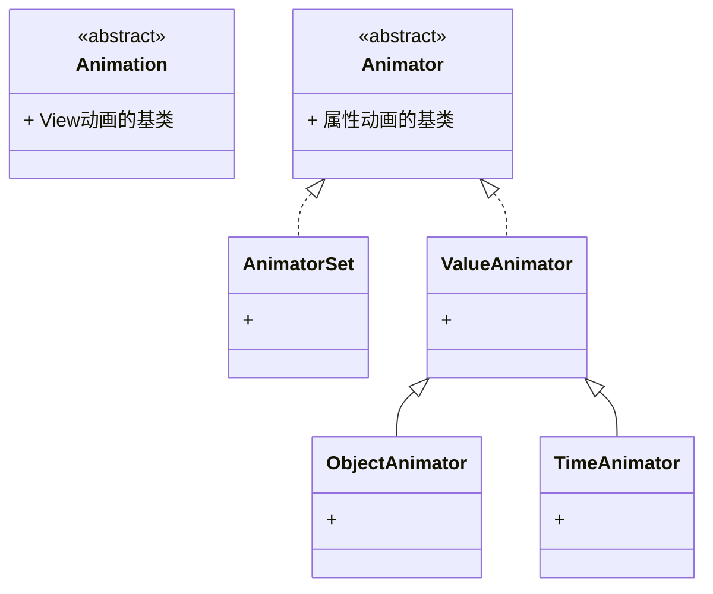

# Android Animation
Android 中的动画使得 APP 的画面不再单调，同时将动画应用于 Activity 等切换转场场景，使得应用同时具备了视觉引导的效果，总之，可谓好处多多。

常用的动画类型有：View动画、属性动画、帧动画、布局动画、转场动画等，在 5.x 以后有又新增了矢量动画，这里对其使用进行一点总结。



## View动画: Animation
View动画定义了渐变Alpha、旋转Rotate、缩放Scale、平移Translate四种基本动画，并且通过这四种基本动画的组合使用，可以实现多种交互效果。

### 通过 XML 实现动画
- 渐变view_anim_alpha.xml：
```
<?xml version="1.0" encoding="utf-8"?>
<alpha xmlns:android="http://schemas.android.com/apk/res/android"
       android:duration="2000"
       android:fromAlpha="1.0"
       android:toAlpha="0">
</alpha>
```
- 旋转view_anim_rotate.xml：
```
<?xml version="1.0" encoding="utf-8"?>
<rotate xmlns:android="http://schemas.android.com/apk/res/android"
        android:duration="2000"
        android:fillAfter="true"
        android:fromDegrees="0"
        android:pivotX="50%"
        android:pivotY="50%"
        android:toDegrees="360">
</rotate>
```
- 缩放view_anim_scale.xml：
```
<?xml version="1.0" encoding="utf-8"?>
<scale xmlns:android="http://schemas.android.com/apk/res/android"
       android:duration="2000"
       android:fromXScale="1.0"
       android:fromYScale="1.0"
       android:pivotX="50%"
       android:pivotY="50%"
       android:toXScale="0.5"
       android:toYScale="0.5">
</scale>
```
- 平移view_anim_translate.xml：
```
<?xml version="1.0" encoding="utf-8"?>
<translate xmlns:android="http://schemas.android.com/apk/res/android"
           android:duration="2000"
           android:fromXDelta="0"
           android:fromYDelta="0"
           android:toXDelta="100%"
           android:toYDelta="100%">
</translate>
```
- 在 Activity 中调用 xml 动画资源文件：
```
// Animation
public void clickToAlpha(View view) {
    Animation alphaAnim = AnimationUtils.loadAnimation(getApplicationContext(), R.anim.view_anim_alpha);
    mTargetView.startAnimation(alphaAnim);
    
    Animation rotateAnim = AnimationUtils.loadAnimation(getApplicationContext(), R.anim.view_anim_rotate);
    mTargetView.startAnimation(rotateAnim);
    
    Animation scaleAnim = AnimationUtils.loadAnimation(getApplicationContext(), R.anim.view_anim_scale);
    mTargetView.startAnimation(scaleAnim);
    
    Animation translateAnim = AnimationUtils.loadAnimation(getApplicationContext(), R.anim.view_anim_translate);
    mTargetView.startAnimation(translateAnim);
}

// AnimationSet
public void clickToSet(View view) {
    Animation setAnim = AnimationUtils.loadAnimation(getApplicationContext(), R.anim.view_anim_set);
    mTargetView.startAnimation(setAnim);
}
```

### 通过 代码 实现动画
Android系统给我们提供了```AlphaAnimation```、```RotateAnimation```、```ScaleAnimation```、```TranslateAnimation``` 四个动画类分别来实现 View 的渐变、旋转、缩放、平移动画。
同时，也提供了```AnimationSet```以组合动画。


## 属性动画: Animator
属性动画，就是改变对象 Object 的属性来实现动画效果。属性动画是对 View动画 的扩展，通过它可以实现更多漂亮的动画效果。
同时属性动画的作用对象不仅仅是View，任何对象都可以。
属性动画的作用效果就是：在一个指定的时间段内将对象的一个属性的属性值动态地变化到另一个属性值。

### ObjectAnimator
ObjectAnimator 会直接动画目标对象，因为它会调用对象对应属性的 get/set 方法，以更改对象的属性值实现动画效果。相比 ValueAnimator 极大地简化对目标对象的属性值的计算和添加效果。

通过 xml 生成动画，如，**property_animator.xml**：
```
<?xml version="1.0" encoding="utf-8"?>
<objectAnimator xmlns:android="http://schemas.android.com/apk/res/android"
                android:duration="2000"
                android:propertyName="rotationY"
                android:valueFrom="0"
                android:valueTo="360"
                android:valueType="floatType">
</objectAnimator>
```
通过代码调用加载 xml 动画资源文件：
```
    Animator animator = AnimatorInflater.loadAnimator(getApplicationContext(), 
    R.animator.property_animator);
    animator.setTarget(mImageView);
    animator.start();
```


此外，属性动画也同样可以组合使用，通过```AnimatorSet类```和```xml文件的set标签```都可以同时改变对象的多个属性，实现更加丰富的动画效果。
- 通过```AnimatorSet```创建动画集：
**AnimatorSet** 通过 before、with、after 三个方法可以组合多个属性动画:
- with 表示与给定动画同时执行
- before 在给定动画执行之前执行
- after 表示在给定动画执行之后执行

- 通过```xml文件的set标签```创建动画集，
如，**property_animator_set.xml**：：
```
<set xmlns:android="http://schemas.android.com/apk/res/android"
    android:ordering="together">
    <objectAnimator
        android:valueFrom="0"
        android:valueTo="360"
        android:propertyName="rotation"/>
    <objectAnimator
        android:duration="2000"
        android:propertyName="alpha"
        android:valueFrom="1"
        android:valueTo="0.5"
        android:valueType="floatType" />
</set>
```

然后，通过代码加载，如：
```
    AnimatorSet animatorSet = (AnimatorSet) AnimatorInflater.loadAnimator(context, R.animator.property_animator_set);
    animatorSet.setTarget(btnShow);
    animatorSet.setDuration(3000);
    animatorSet.start();
```

### ValueAnimator
ValueAnimator 是 ObjectAnimator 的父类，需要使用者主动监听动画的执行，在监听中改变视图的对应属性，进而实现动画效果。如：
```
    ValueAnimator valueAnimator = ValueAnimator.ofFloat(0, 1);
    valueAnimator.setDuration(300);
    valueAnimator.start();

    valueAnimator.addUpdateListener(new ValueAnimator.AnimatorUpdateListener() {
        @Override
        public void onAnimationUpdate(ValueAnimator animation) {
            // 动画更新过程中的动画执行值，可以根据此值的变化来关联对象的属性变化，实现属性动画
            float progressValue = (float) animation.getAnimatedValue();
        }
    });
```

### 估值器与插值器 
属性动画是如何计算属性的值的？是由类型估值器```TypeEvaluator```与时间插值器```TimeInterpolator```配合来完成的。
- 插值器
  + 根据时间流逝的百分比计算出当前属性值改变的百分比
- 估值器
  + 根据当前属性改变的百分比来计算改变后的属性值

它们之间的协调关系，简单的说就是：
1. 先由插值器根据时间流逝的百分比计算出目标对象的属性改变的百分比
2. 再由估值器根据插值器计算出来的属性改变的百分比计算出目标对象属性对应类型的值

SDK中默认带有的估值器有：IntEvaluator、FloatEvaluator、ArgbEvaluator，他们分别对应前面我们调用  ValueAnimator对象 所有对应的 ofInt、ofFloat、ofArgb 函数的估值器，分别用在Int类型，Float类型，颜色值类型之间计算。

此外，ObjectAnimator 和 ValueAnimator 还都有```ofObject```方法，它对应自定义类型的属性计算，它有一个```TypeEvaluator```类型的参数。
TypeEvaluator是一个接口，里面也只有一个抽象方法： 
```public T evaluate(float fraction, T startValue, T endValue);```
其中，fraction 范围为 0 ~ 1，表示动画执行过程中已完成程度。泛型T即为动画执行的属性类型。

当要用属性动画来执行*复杂对象*的动画过程，可以自定义 TypeEvaluator 对象并将其关联到目标对象来实现动画逻辑。

## 帧动画
帧动画，需要开发者制定好动画每一帧，系统一帧一帧的播放图片。

```
    AnimationDrawable animation = new AnimationDrawable();
    for (int i = 0; i < 7; i++) {
        Drawable drawable = getResources().getDrawable(getResources().getIdentifier("ic_fingerprint_" + i, "drawable", getPackageName()));
        animation.addFrame(drawable, 100);
    }
    mImageView.setImageDrawable(animation);
    animation.setOneShot(false);
    animation.start();
```

同样的，帧动画也可以在 xml 文件中配置，直接在工程```drawable```目录新建根为```animation-list标签```的文件：
```
<?xml version="1.0" encoding="utf-8"?>
<animation-list xmlns:android="http://schemas.android.com/apk/res/android" android:oneshot="false">
    <item android:drawable="@drawable/ic_fingerprint_0" android:duration="100"/>
    <item android:drawable="@drawable/ic_fingerprint_1" android:duration="100"/>
    <item android:drawable="@drawable/ic_fingerprint_2" android:duration="100"/>
    <item android:drawable="@drawable/ic_fingerprint_3" android:duration="100"/>
    <item android:drawable="@drawable/ic_fingerprint_4" android:duration="100"/>
    <item android:drawable="@drawable/ic_fingerprint_5" android:duration="100"/>
    <item android:drawable="@drawable/ic_fingerprint_6" android:duration="100"/>
</animation-list>
```
再使用以下代码加载执行：
```
    mImageView.setImageResource(R.drawable.frame_anim);
    AnimationDrawable animationDrawable = (AnimationDrawable) mImageView.getDrawable();
    animationDrawable.start();
```


## Reference
- [Android 动画简介](https://developer.android.com/training/animation/overview?hl=zh-cn)
- [Android属性动画](https://juejin.cn/post/6846687601118691341)
- [Android矢量图动画](https://juejin.cn/post/6847902224396484621)
- [Android过渡动画](https://juejin.cn/post/6850037271714856968)