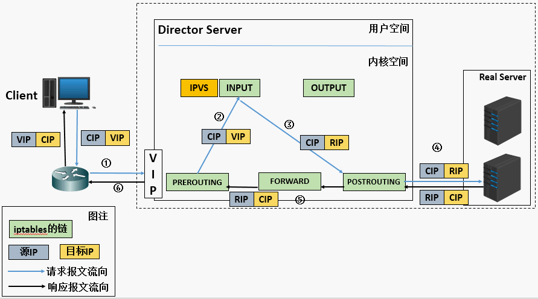

## IPVS 在 k8s 中连接保持引发的问题：

### 起因
在将业务(小部分长连接)迁移至k8s集群时, 项目能够平稳运行, 但是在测试环境发布时却经常遇到：刚刚发布成功后的1分钟左右，websocket连接出现：504 bad handshake。

这一错误引起了我们的注意：因为在做k8s部署时是通过配置 readiness 来保证服务正常可访问。同时, 遇到问题的这一服务 svcA 是单实例部署。

k8s 版本大于 1.8 时，默认采用的 ipvs。我们的集群 k8s 的底层负载采用的是 ipvs。

### 初步确认
遇到问题后, 先确认了通过lb访问、在集群内通过nodeport访问 以及 直接cluster ip访问是否正常。经确认，集群内通过nodeport不能正常访问, 直接cluster ip正常。此时可以将问题缩小到 ipvs 路由相关的内容。

经腾讯运维同学提醒，我们注意到 ipvs 的一个配置参数：persistence_timeout

### 知识点准备
- ipvs 工作模型
    + LVS DR原理详解图
        - 
    + LVS FULLNAT模式
        - 
    + LVS NAT原理详解图
        - 
    + LVS TUN原理
        - 
- 连接保持：
    + [lvs-persistent-connection](https://www.yangcs.net/posts/lvs-persistent-connection/)
- ipvs:
    + ipvs 通过ipvsadm命令和LVS内核打交道
    + 参数配置：
        ```
            配置全局参数，位于目录/proc/sys/net/ipv4/vs/下:
            获取统计信息，位于目录/proc/net/下:
        ```
        - /proc/net/ip_vs
            + 获取当前LVS内核配置，包括VS和RS相关信息；同ipvsadm -ln；
            ```
                IP Virtual Server version 1.2.1 (size=1048576) - 这里size是指连接hash表大小；
                Prot LocalAddress:Port Scheduler Flags
                    -> RemoteAddress:Port Forward Weight ActiveConn InActConn
                TCP 0ADC0108:0050 rr - vs信息，vip和vport 16进制，调度算法rr；
                    -> C0A8010B:0050 Route 1 0 0 - rs信息，rip和rport 16进制，权值为1，
                    -> C0A8010A:0050 Route 1 0 0 

                - ActiveConn是指established状态的连接个数；
                - InActConn是指非established状态的连接个数；
            ```
        - /proc/net/ip_vs_conn
            + 获取所有连接信息，建议不要用该命令，因为连接数很多时，CPU开销会很大；
            ```
                Pro FromIP FPrt ToIP TPrt DestIP DPrt State Expires
                - 用户ip和port vs ip和port rs ip和port tcp状态机状态 连接超时剩余的时间
            ```
        - /proc/net/ip_vs_stats
        - /proc/sys/net/ipv4/vs/expire_nodest_conn
            + 默认值为0，当LVS转发数据包，发现目的RS无效（删除）时，会丢弃该数据包，但不删除相应连接；这样设计的考虑是，RS恢复时，如果Client和RS socket还没有超时，则 可以继续通讯; 
            + 如果将该参数置1，则马上释放相应 连接；个人建议采用默认值，配置为0；
        - /proc/sys/net/ipv4/vs/expire_quiescent_template
            + 默认值为0，当RS的weight值=0（如，健康检测失败，应用程序将RS weight置0）时，会话保持的新建连接 还会继续调度到该RS上；
            + 如果配置为1，则马上将 会话保持的连接模板 置为无效，重新调度新的RS；如果有会话保持的业务，建议该值 配置为1；
        - /proc/sys/net/ipv4/vs/nat_icmp_send
            + 默认值为0；建议采用默认值，为0；
            + 如果置为1，当LVS收到RS发送出来的数据包，但没有找到相应连接时，则发送目的不可达（端口不可达）的ICMP给RS；
        - /proc/sys/net/ipv4/vs/sync_threshold
            + 默认值为 3 50；
            + 这个参数和连接同步相关，LVS收到3个包后，开始启动同步；之后，每收到50个包，启动一次同步；可以根据LVS的流量，可以调整连接同步的频率，从而控制同步的系统开销；

### 关键点
在问题发生时，通过 ``` ipvsadm -Ln | grep 10.111.103.161 -A3 ``` 查看ipvs路由表发现，已经无效的pod的rip依然存在，只不过weight=0。

联系上述的相关配置会发现，当服务发布时，先将新pod创建并注册rip到ipvs，再将旧pod删除，，但是但是，，旧pod删除时不是应该把对应的rip删除掉吗？

当旧pod删除时，已有连接被断开，客户端触发重连机制，但因为ipvs的连接保持特性，会依然路由到旧pod对应的rip(虽然此时weight为0)。这就是问题的根源~

持久连接（Persistence）的问题。持久连接使一个客户端在超时时间内（ipvsadmin -p参数指定，keepalived的配置文件persistence_timeout指令）会持续连接到同一台后端服务器

深究发现：1.12 的kube-proxy更改了实现：ipvs 下如果有 conn 存在就不删除 rip，只是将其权重设置为0

- 解决方案
    + 将参数 /proc/sys/net/ipv4/vs/expire_quiescent_template 设置为 1

- 注意
    + 之所以不调整 persistence_timeout 是因为，ftp 以及 ssl 等会依赖此特性，详见：[persistence](http://www.linuxvirtualserver.org/docs/persistence.html)

### 扩展
- k8s 中的 ipvs 是 NAT 模式
    + ipvs 是一个内核态的四层负载均衡，支持NAT、Gateway以及IPIP隧道模式，Gateway模式性能最好，但LB和RS不能跨子网，IPIP性能次之，通过ipip隧道解决跨网段传输问题，因此能够支持跨子网。而NAT模式没有限制，这也是唯一一种支持端口映射的模式。
    + 由于 Kubernetes Service 需要使用端口映射功能，因此kube-proxy必然只能使用ipvs的NAT模式。
- k8s 中为了流量能原路返回：
    + 由于 ipvs 的 NAT 模式是 dnat，不做snat，所以需要跟iptables配合，增加snat
        ```
            -A KUBE-MARK-MASQ -j MARK --set-xmark 0x4000/0x4000
        ```
    + k8s 的 snat 是在 mangle 表的 POSTROUTING 链上进行的，一般来说，需要开启以下参数，才能实现这一功能：
        ```
            sysctl net.ipv4.vs.conntrack=1
        ```
- ipvs是dnat，不做snat，所以如果单纯使用ipvs，会话负载均衡是可以的; 但是，k8s使用ipvs，必须跟iptables配合，还得加多个snat，这样对于ipvs来说，所有的来源ip就变成一样的了，使用会话负载均衡是否就有问题了呢？
        + 不会，因为，ipvs 工作在 PREROUTING 上，而 snat 发生在 POSTROUTING 链上
- svc有个参数 ExternalTrafficPolicy 设置为 local 时，可以避免 k8s 的跨节点路由