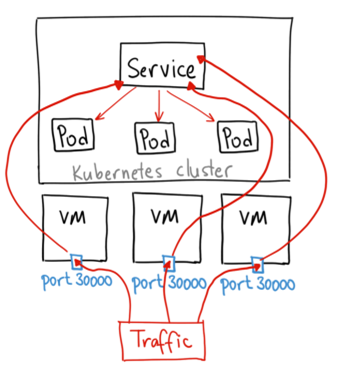
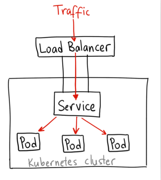
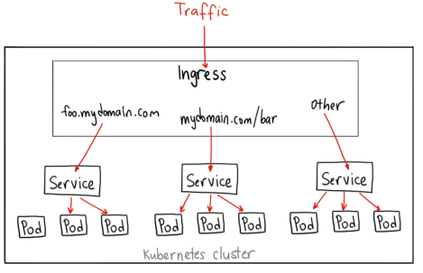

# K8S网络之集群外访问service的方式
k8s service 的 cluster ip 只能供集群内部访问使用，如果想将 service 暴露给外部该怎么办？

k8s 提供了以下几种方式来实现这个
- NodePort
- Ingress
- LoadBalancer

## NodePort
NodePort 服务是引导外部流量到 k8s 服务的最基础的方式。

正如 NodePort 这个名字所示，在所有 k8s 节点上开放一个特定端口，任何发送到该端口的流量都被转发到对应服务。这个端口可以自己指定，如果不指定的话，系统将选择一个随机端口。



这种方法有许多缺点：
- 每个端口只能是一种服务
- 端口(默认)范围只能是 30000-32767 
- 如果节点的 IP 地址发生变化(集群扩/缩容)，我们需要能处理这种情况。

基于以上原因，不建议在生产环境上用这种方式暴露服务。但是对 demo 应用等临时应用使用这种方式，无疑是很方便的，不需要申请额外的昂贵的资源。

## LoadBalancer:
LoadBalancer 是暴露 k8s service 到 internet 的标准方式。这种方式的实现，需要依赖 云提供商 的支持。通过这种方式，来自外部负载均衡器的流量将直接打到 backend pod 上，不过实际它们是如何工作的，这要依赖于云提供商。

LoadBalancer 的工作方式，是在集群外创建一个 lb (拥有独立的 ip 地址)，并且所有经过 lb 的流量转发到指定 port，经过这个 port 后流量会被转发到指定的 k8s 服务。这个过程中，没有过滤、没有路由..., 同时, 由于它工作在 Layer 4，所以几乎可以处理任意流量类型，如：HTTP, TCP, UDP, Websockets, gRPC, or whatever

LoadBalancer 方式的最大不足是，每个需要暴露给 internet 的服务都要一个拥有独立 ip 地址的 lb，并且需要为此支付费用。



## Ingress
Ingress 不同于上文的 NodePort、LoadBalancer，它事实上不是一种服务类型, 而是一种资源类型，是一个 Ingress Controller 的规则集合。而 Ingress Controller 实际上就是一个解析 Ingress 规则的集群内 service。

注意，Ingress 是规则，Ingress Controller 进行规则解析、执行，他们都没有涉及如何暴露自己到 internet，这个还是需要 Ingress Controller 借助前文讲到的 NodePort 或者 LoadBalancer 来实现。

Service Type 示例:
```

    Type=ClusterIP
    Type=NodePort
    Type=LoadBalancer
```

Ingress 示例
```
    apiVersion: networking.k8s.io/v1beta1
    kind: Ingress
    metadata:
    name: test-ingress
    annotations:
        nginx.ingress.kubernetes.io/rewrite-target: /
    spec:
    rules:
    - http:
        paths:
        - path: /testpath
            pathType: Prefix
            backend:
            serviceName: test
            servicePort: 80
```



在 k8s 集群中最常见的 ingress controller 就是 nginx，此时 Ingress Controller 的作用就是监听 Ingress 规则的变化，并解析成对应的 nginx 规则，并写入 nginx 配置(/etc/nginx.conf)。

通过使用 Ingress，我们可以做很多不同的事情，因为有很多不同类型的 Ingress controller 拥有各种各样的能力。默认的 GKE ingress controller 会为服务创建一个 HTTP(S) Load Balancer。 这就允许用基于 path 和 subdomain 的方式路由到后端服务。例如，可以通过 foo.yourdomain.com 到达 foo service，在 yourdomain.com/bar/ 下的路径路由到 bar service.

Ingress 可能是功能最强大的暴露服务的方式，但是也是最复杂的。有各种各样的 Ingress controller 的实现方式，如 the Google Cloud Load Balancer, Nginx, Contour, Istio, and more. 也有很多 Ingress controllers 的插件，如 the cert-manager 可以自动进行 SSL 认证。

Ingress 是用同一个 ip 暴露多个服务(可以通过过 L7 协议进行路由)的最有用的方式。这样的话，只需要支付一个 load balancer 的费用。同时，Ingress 附带了很多有用的特性，如：SSL、Auth、Routing, etc

# 思考
- 如果我们是云厂商的话，会怎么来实现 LoadBalancer ? 对负载均衡、源ip保留等问题如何处理

# reference
- [services-networking-ingress](https://kubernetes.io/docs/concepts/services-networking/ingress/)
- [create-external-load-balancer](https://kubernetes.io/docs/tasks/access-application-cluster/create-external-load-balancer/)
- [ingress-vs-load-balancer](https://stackoverflow.com/questions/45079988/ingress-vs-load-balancer)
