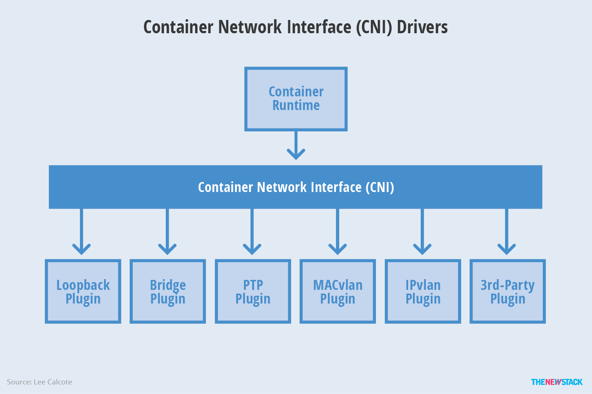
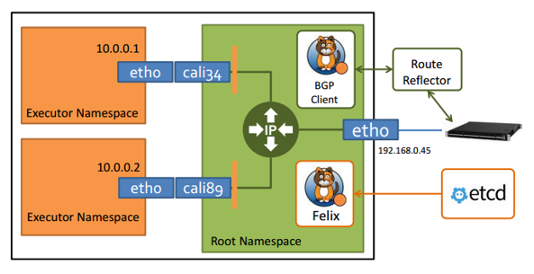

# K8S网络之网络框架
网络是 k8s 的一个核心部分，但是精准的了解其预期的工作方式可能会比较困难。总的来说，有四个不同的网络问题需要解决：
- Highly-coupled container-to-container communications
- Pod-to-Pod communications
- Pod-to-Service communications: this is covered by [services](https://kubernetes.io/docs/concepts/services-networking/service/).
- External-to-Service communications

其中，高度耦合的容器到容器通信，可以通过 pod 机制：同一个 pod 中的容器 共享 pause 容器的 network namespace，来解决。

本文主要关注 pod-to-pod 的通信，另外两个问题，后续系列再来介绍。

## 模型
假定大家已经对 k8s 的基础元素比较熟悉了。在 k8s 的网络构建过程中，对容器网络是做出了一些限制，也就是 k8s 的容器网络模型。

这些限制如下：
- 任意 pod 之间可以直接通信，无需经过地址转换(NAT)
- 任意 pod 与其宿主 node 之间是可以直接通信的，无需经过地址转换(NAT)
- 每个 pod 都拥有一个独立 ip 地址，pod 内所有容器共享一个网络命名空间

可以看出，k8s 将集群内所有 pod 都放在一个直接连通的扁平网络中，pod 之间可以通过 ip 直接访问。在一个 pod 中的应用在 选择端口、服务发现、应用配置等操作时，可以表现的像 VMs 或者 物理机 一样。

通过这样设计，k8s 网络可以很容易做到，将一个 K8s 系统为外部世界提供服务的时候，从网络的角度很容易弄清楚，外部数据怎么连接到容器内的应用。

## 方案

### 准备
#### docker 网络概述
我们知道，在启动 docker 后，docker engine 会在宿主机里新增一个网络设备：docker0 网桥(Bridge)，而创建的 docker 容器的网络默认情况下会被分配在一个以 docker0 为网关的虚拟子网中，通过 veth对 连接 docker0 和 容器内部。

总体来说，就是 docker 通过 network namespace 做了容器和宿主机的网络隔离, 再用 veth对 将容器和宿主机两个 network namespace 连接起来，并将 veth 的一端连接到 docker0 (网桥, 在node的root namespace内)，实现 容器间、和宿主机的网络互通。

#### k8s 的网络状况
对于 k8s 系统来说，支持多种 container runtime 是一件非常重要的事情，当然，Docker 只是其中之一。

而配置网络环境只是 container runtime 的一个方面。所以，当人们问“k8s 是否会支持 CNM”的时候，其实是在问“k8s 是否会在 Docker runtime 中支持 CNM drivers”。确实，k8s 尚未在 Docker runtime 中采用 CNM/libnetwork。而是对 CoreOS 提出的 Container Network Interface (CNI) 模型很感兴趣。

``` 
这里对 CNM 做个简单说明:
    CNM 是由 docker 提出的网络协议，它要解决的问题和 CNI 是重合的。目前 CNM 只能使用在 docker 中，而 CNI 可以使用在任何容器运行时。CNM 主要用来实现 docker 自身的网络问题，也就是 docker network 子命令提供的功能。 
```

为什么不用 CNM 呢？[why-kubernetes-doesnt-use-libnetwork](https://kubernetes.io/blog/2016/01/why-kubernetes-doesnt-use-libnetwork/)里有较为详细的介绍，本文只做个简单的描述。

1. Docker 的 “local”(bridge) driver 概念
    在 k8s 集群中，一般由少则 3~5 台，多则 100+ 节点组成。如果网络设计，依然像 docker 那样以 docker0 为网关就会出现问题：docker 网络是为同一台宿主机的容器通信设计的，而根据上文 k8s 的网络要求，pod 需要能跨主机与其他 pod 直接通信。

2. Docker 的 “global”(overlay) driver 概念
    依赖于 libkv 这一非常底层的 key-value 存储抽象，要在 k8s 中支持 Docker’s overlay driver, 就需要支持这一存储抽象，这会造成 k8s 本来是想通过Docker networking 来简化事情，但是却明显的更加复杂化了。

3. CNI 在设计哲学上与 k8s 保持一致(It follows the UNIX philosophy of doing one thing well)。且比 CNM 简单得多，不需要守护程序，并且可以跨平台

所以为了满足 k8s 的网络设计要求，就需要一种 CNI 插件，它实现了让不同 node 上的 pod 实现无需经过显式的地址转换(NAT)进行通信的机制。同时，由于是通过 ip 直接通信，所以 ip 不能重复，这就还需要一种 为 pod 统一分配 ip 的机制。

```
满足 k8s 网络设计要求的插件已经有很多，有兴趣的话，在官方文档上可以看看有哪些网络插件可以使用：https://kubernetes.io/docs/concepts/cluster-administration/networking/#how-to-achieve-this
```

### CNI 简介
CNI(Conteinre Network Interface) 是 google 和 CoreOS 主导制定的容器网络标准，它本身并不是实现或者代码，只是一个标准(可以理解成一个协议)。它综合考虑了灵活性、扩展性、ip 分配、多网卡等因素，旨在为容器平台提供网络的标准化。

目前存在网络方案 flannel、calico、openvswitch、weave、ipvlan 等，这些方案接口和使用方法都不尽相同，而不同的容器平台都需要网络功能，它们之间的适配如果没有统一的标准，会有很大的工作量和重复劳动。而 CNI 的出现，就是为了解决这样的问题，使得不同的容器平台(比如 kubernetes、mesos 和 rkt)能够通过相同的接口调用不同的网络组件。

这个协议连接了两个组件：容器管理系统(如 rkt 或 k8s)和网络插件。它们之间通过 JSON 格式的文件进行通信，实现容器的网络功能。具体的事情都是插件来实现的，包括：创建容器网络空间(network namespace)、把网络接口(interface)放到对应的网络空间、给网络接口分配 IP 等等。



#### CNI 设计考量
CNI设计的时候考虑了以下问题：
- 容器运行时必须在调用任何插件之前为容器创建一个新的网络命名空间
- 容器运行时必须确定这个容器应属于哪个网络，并为每个网络确定哪些插件必须被执行
- 网络配置采用JSON格式
- 容器运行时必须按顺序为每个网络执行相应的插件，将容器添加到每个网络中
- 在完成容器生命周期后，运行时必须以相反的顺序执行插件（相对于执行添加容器的顺序）以将容器与网络断开连接
- 容器运行时不能为同一容器调用并行操作，但可以为不同的容器调用并行操作
- 容器运行时必须为容器订阅ADD和DEL操作，这样ADD后面总是跟着相应的DEL。 DEL可能跟着额外的DEL，但是，插件应该允许处理多个DEL（即插件DEL应该是幂等的）。
- 容器必须由 ContainerID 唯一标识。存储状态的插件应该使用（网络名称，容器ID）的主键来完成。
- 运行时不能调用同一个网络名称或容器ID执行两次ADD（没有相应的DEL）。换句话说，给定的容器ID必须只能添加到特定的网络一次。

CNI插件
- CNI插件必须实现一个可执行文件，这个文件可以被容器管理系统调用
- CNI插件负责将网络接口插入容器网络命名空间（例如，veth对的一端），并在主机上进行任何必要的改变（例如将veth的另一端连接到网桥）。然后将IP分配给接口，并通过调用适当的IPAM(IP Address Management)插件来设置与“IP地址管理”部分一致的路由。

### 实现
#### 容器创建
接下来，我们跟随 pod 创建过程，看看 pod 的网络构建。k8s pod 的网络是这样创建的：
1. 首先 kubelet 创建基础容器 pause 生成对应的 network namespace
2. 然后 kubelet 调用网络 CNI driver，由它根据配置调用具体的 CNI 插件
3. 然后 CNI 插件给基础容器配置网络
4. 最后创建 pod 中其他容器共享使用基础容器的网络

常见的 CNI 插件实现方案有：
- 隧道方案
    + 隧道方案在IaaS层的网络中应用也比较多，将pod分布在一个大二层的网络规模下。网络拓扑简单，但随着节点规模的增长复杂度会提升。
    + 如：
        - Weave：UDP广播，本机建立新的BR，通过PCAP互通
        - Open vSwitch（OVS）：基于VxLan和GRE协议，但是性能方面损失比较严重
        - Flannel：UDP广播，VxLan
- 路由方案
    + 路由方案一般是从3层或者2层实现隔离和跨主机容器互通的，出了问题也很容易排查。
    + 如
        - Calico：基于BGP协议的路由方案，支持很细致的ACL控制，对混合云亲和度比较高。
        - Macvlan：从逻辑和Kernel层来看隔离性和性能最优的方案，基于二层隔离，所以需要二层路由器支持，大多数云服务商不支持，所以混合云上比较难以实现。

这些插件各有优势，也在互相借鉴学习优点。这里介绍下常见的 flannel、calico：

#### Flannel
flannel 是由 CoreOS 开发的一个比较简单的 overlay 网络，可能是目前最受欢迎的 CNI 插件了。一般来说，flannel 已经能够满足大多数的使用场景了，并且性能也比较好，所以，一般来说，只有在 flannel 不能满足需要的时候，才考虑使用其他的 CNI 插件。

flannel 的工作流程大致如下：
- 首先在启动 K8S Controller Manager 时，需要指定集群的 pod ip 范围：--cluster-cidr=172.16.0.0/16, 并开启为 node 分配 ip 选项：--allocate-node-cidrs=true
- Controller Manager会把为每个node分配的IP范围保存到 etcd 中 (flannel 也会使用 etcd 来存储它的状态信息)
- 新建 pod 时，flannel 会从 etcd 中取出属于该 node 的 ip 分配给 pod，再在 etcd 中记录下这个 pod 的 ip
- 这样 etcd 中就会存有一张 node ip 与 pod id 对应的“路由表”

flannel 的路由流程：
- 当 pod 在同一个 node 之内通信时，通过 docker bridge 即可
- 当 pod 需要跨 node 通信时，数据包经过 node 中的路由会到 flannel(flanneld) 中，flannel 通过 etcd 查询到目的 pod ip 的 node ip，使用flannel的Backends对数据包进行分装，发送给目的node处理。目的node拿到数据包后解开封装，拿到原始数据包，再通过node的路由送到相应的pod。

flannel 有多种不同的 Backends (如 udp，VxLan、host-gw)来进行 封包和路由，默认的也是推荐的方式是：VxLan，相对于其他的实现，它提供了较好的性能和需要较少的人工干预。


#### Calico
Calico 是一个纯三层的数据中心网络方案（不需要Overlay），并且与OpenStack、Kubernetes、AWS、GCE等IaaS和容器平台都有良好的集成。它为每个容器会分配一个可路由的IP，由于通信时不需要解包和封包，网络性能损耗小，易于排查。

Calico在每一个节点利用 Linux Kernel 实现了一个高效的 vRouter 来负责数据转发，而每个 vRouter 通过 BGP 协议负责把自己上运行的 workload 的路由信息向整个 Calico 网络内传播。

小规模部署的 Calico 网络可以直接互联，大规模下可通过指定的 BGP route reflector 来完成。 这样保证最终所有的 workload 之间的数据流量都是通过 IP 路由的方式完成互联的。Calico节点组网可以直接利用数据中心的网络结构(无论是L2或者L3)，不需要额外的NAT，隧道或者Overlay Network。



Calico主要由 Felix、etcd、BGP client 以及 BGP Route Reflector 组成
- Felix：Calico Agent，每个节点都需要运行，主要负责配置路由、配置ACLs、报告状态，确保Endpoint的连通状态
- BGP Client: 主要负责把 Felix 写入 Kernel 的路由信息分发到当前 Calico 网络其他节点，确保 Workload 间的通信的有效性
- Etcd: 分布式键值存储，主要负责存储网络信息，确保 Calico 网络状态的准确性
- BGP Route Reflector: 大规模部署时使用，作为BGP client的中心连接点, 摒弃所有节点互联的 mesh 模式，避免每个节点互联, 通过一个或者多个BGP Route Reflector来完成集中式的路由分发

Calico的不足
- 不支持多租户网络的隔离功能，在多租户场景下会有网络安全问题 
- Calico控制平面的设计要求物理网络得是L2 Fabric，这样vRouter间都是直接可达的

# 问题
- docker0、cni0、kube-ipvs0 的区别

# reference
- [Cluster Networking](https://kubernetes.io/docs/concepts/cluster-administration/networking/#how-to-achieve-this)
- [network design-proposals](https://github.com/kubernetes/community/blob/master/contributors/design-proposals/network/networking.md)
- [CNI (Container Network Interface)](https://github.com/containernetworking/cni)
- [CNM (Container Network Model) ](https://github.com/moby/libnetwork/blob/master/docs/design.md)
- [understanding-kubernetes-networking-model](https://sookocheff.com/post/kubernetes/understanding-kubernetes-networking-model/)