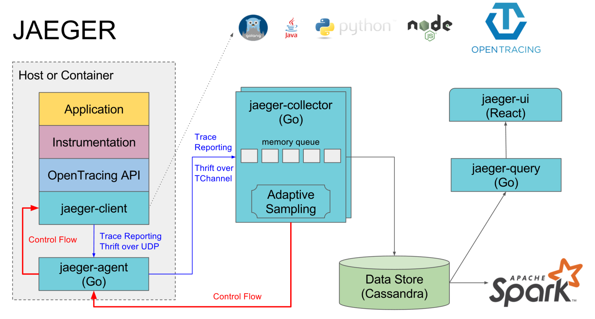

## OpenTracing 简介

- reference 
    + [The OpenTracing Semantic Specification](https://github.com/opentracing/specification/blob/master/specification.md)
    + [OpenTracing API for Go](https://github.com/opentracing/opentracing-go)
    + [从Zipkin到Jaeger，Uber的分布式追踪之道tchannel](https://blog.csdn.net/fei33423/article/details/79452948)
### opentracing 关键词
- 基本方法：Inject, Extract, 和 Carriers
    Span 可以包含很多的tags、logs和baggage，但是始终需要一个高度概括的operation name
- 名词解释
    + Trace : *一个 trace 代表了一个事务或者流程在分布式系统中的执行过程*
    + Span : *一个 span 代表在分布式系统中完成的单个工作单元。也包含其他 span 的"引用"，这允许将多个 spans 组合成一个完整的 Trace*
        ```
            每个 span 根据 OpenTracing 规范封装以下内容：
                操作名称
                开始时间和结束时间
                span Tags key:value 
                span Logs key:value 
                SpanContext
        ```
        - Tags : *Span tags(跨度标签)可以理解为用户自定义的 Span 注释。便于查询、过滤和理解跟踪数据*
        - Logs : *Span logs(跨度日志)可以记录 Span 内特定时间或事件的日志信息。主要用于捕获特定 Span 的日志信息以及应用程序本身的其他信息输出*
        - SpanContext : *SpanContext 代表跨越进程边界，传递到子级 Span 的状态。常用做在跨域API边界时的上下文传递。*
    + Baggage Items : *Baggage Items 可以理解为 trace 全局运行中额外传输的数据集合*
- 实现
    + grpc : 通过附加 tracer 的信息到 context 来实现跨越边界传递
    + http : 通过附加 tracer 的信息到 header 来实现跨越边界传递

### opentracing 实现对比
| 产品名称 | 厂商 | 开发语言 | OpenTracing标准 | 侵入性 | 时效性 |决策支持 | 可视化 | 低消耗 | 延展性 |
| :-----: | :--: | :-----: | :------------: | :----: | :---: | :----: | :----: | :----: | :--: |
| jaeger | uber | go | 完全 | 部分侵入 | 时效性高， UDP协议传输数据(在Uber任意给定的一个Jaeger安装可以很容易地每天处理几十亿spans) | 决策支持较好，并且底层支持metrics指标 | 报表不丰富，UI比较简单 | 消耗低 | jaeger比较复杂，使用框架较多。但经过uber大规模使用，延展性好 |
| zipkin | twitter | java | 部分 | 侵入性强 | 时效性好 | 决策一般(功能单一，监控维度和监控信息不够丰富。没有告警功能) | 数据报表丰富 | 系统开销小 | 延展性好 |
| skywalking | 华为 | java | 完全 | 侵入性低 | 时效性好 | 虽然调用链路更细化，但作者在性能和追踪细粒度之间保持了比较好的平衡。决策好 | 数据报表丰富 | 消耗较低 | 延展性非常好，水平理论上无限扩展 |

### jaeger

- 核心组件
    + Jaeger核心后端组件：jaeger-agent、jaeger-collector、jaeger-query
    + 其中 jaeger-agent、jaeger-collector 都可以通过分布式部署 配合 LB 很容易做到横向扩展，所以对于业务体量较大的场景很有优势
- 持久化
    + Collectors require a persistent storage backend. Cassandra 3.x (default) and ElasticSearch are the primary supported storage backends. There is ongoing work to add support for MySQL and ScyllaDB.
- 采样方式
    + 固定采样、随机采样、限流采样等，采样方式丰富
- 部署
    + all in one
        ``` 
        (不适合生产环境)
            docker run -d -e COLLECTOR_ZIPKIN_HTTP_PORT=9411 -p 5775:5775/udp -p 6831:6831/udp -p 6832:6832/udp -p 5778:5778 -p 16686:16686 -p 14268:14268 -p 9411:9411 jaegertracing/all-in-one:latest 
        ```
    + 独立部署
        ```
            docker run -d --rm -p 14268:14268 -p 9411:9411 jaegertracing/jaeger-collector /go/bin/collector-linux --es.server-urls=http://localhost:9200

            docker run -d --rm -p 5775:5775/udp -p 6831:6831/udp -p 6832:6832/udp -p 5778:5778/tcp jaegertracing/jaeger-agent /go/bin/agent-linux --collector.host-port=jaeger-collector.jaeger-infra.svc:14267

            docker run -d --rm -p 16686:16686 jaegertracing/jaeger-query /go/bin/query-linux -es.server-urls=http://localhost:9200
        ```
    + 端口说明
        ```
            端口	协议	所属模块	     功能
            5775	UDP	agent	     通过兼容性Thrift协议，接收Zipkin thrift类型数据
            6831	UDP	agent	     通过兼容性Thrift协议，接收Jaeger thrift类型数据
            6832	UDP	agent	     通过二进制Thrift协议，接收Jaeger thrift类型数据
            5778	HTTP	agent	     配置控制服务接口
            16686	HTTP	query	     客户端前端界面展示端口
            14268	HTTP	collector    接收客户端Zipkin thrift类型数据
            14267	HTTP	collector    接收客户端Jaeger thrift类型数据
            9411	HTTP	collector    Zipkin兼容endpoint
        ```
- reference
    + [jaegertracing docs](https://www.jaegertracing.io/docs/1.12/architecture/)

### zipkin

- 持久化
    + Cassandra、ElasticSearch和MySQL
- 采样方式
    + 随机概率采样
- zikpin 使用示例(可以自己实现grpc.StatsHandler来定制化功能)：
    ```
        import (
            zipkin "github.com/openzipkin/zipkin-go"
            zipkingrpc "github.com/openzipkin/zipkin-go/middleware/grpc"
            zipkinrephttp "github.com/openzipkin/zipkin-go/reporter/http"
        )

        func client() {
            opts := []grpc.DialOption{
                grpc.WithInsecure(),
                func() grpc.DialOption {
                    tracer, _ := zipkin.NewTracer(zipkinrephttp.NewReporter("http://127.0.0.1:9411/api/v2/spans"),  zipkin.WithSampler(zipkin.AlwaysSample))
                    return grpc.WithStatsHandler(zipkingrpc.NewClientHandler(tracer))
                }()
            }
            conn, err := grpc.Dial(fmt.Sprintf("%v:%v", svcData.Address, svcData.Port), opts ...)
            ...
        } 

        func server() {
            tracer, _ := zipkin.NewTracer(zipkinrephttp.NewReporter("http://127.0.0.1:9411/api/v2/spans"), zipkin.WithSampler(zipkin.AlwaysSample))
            opt = append(opt, grpc.StatsHandler(zipkingrpc.NewServerHandler(tracer)))
            ...
            wserver.Server = grpc.NewServer(opt...)
        } 
    ```

