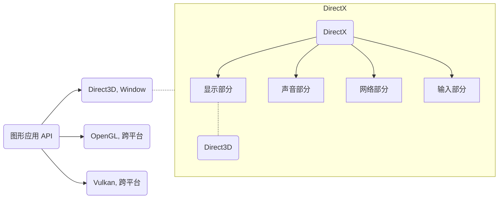
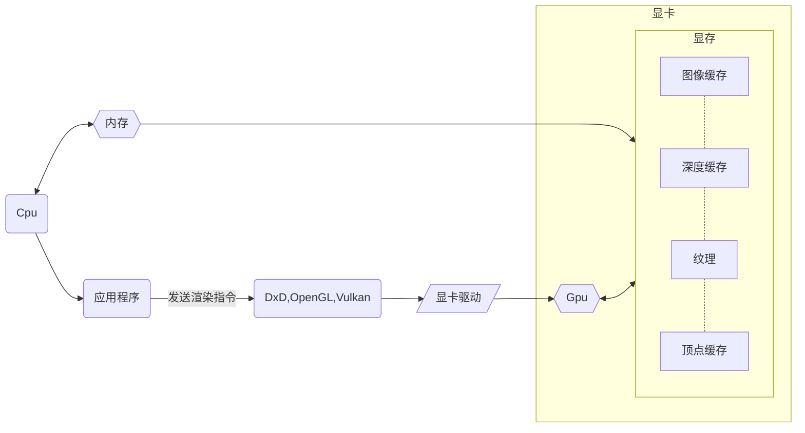

# Render
DX包含D3D，D3D是DX的主要图形处理部分，OpenGl从某方面来说是一个API。

```mermaid
flowchart LR
    GraphAPI(图形应用 API) --> D3D(Direct3D, Window)
    GraphAPI --> OpenGL(OpenGL, 跨平台)
    GraphAPI --> Vulkan(Vulkan, 跨平台)

    D3D -.- DirectX

    subgraph DirectX
        DX(DirectX) --> 显示部分 -.- DxD(Direct3D)
        DX --> 声音部分
        DX --> 网络部分
        DX --> 输入部分
    end
```

```mermaid
%% CPU、GPU、OpenGL、DX、显卡驱动间的关系
flowchart LR
    Cpu(Cpu) <--> M{{内存}} -----> 显存
    Cpu --> App(应用程序) --发送渲染指令--> Graph(DxD,OpenGL,Vulkan) --> HDD[/显卡驱动/] --> Gpu

    subgraph 显卡
        Gpu{{Gpu}}  <--> 显存
        subgraph 显存
            图像缓存-.-深度缓存-.-纹理-.-顶点缓存
        end
    end
```

## Reference
- [3D渲染相关基本概念](https://www.cnblogs.com/kekec/p/8463292.html)
- https://zhuanlan.zhihu.com/p/44821714