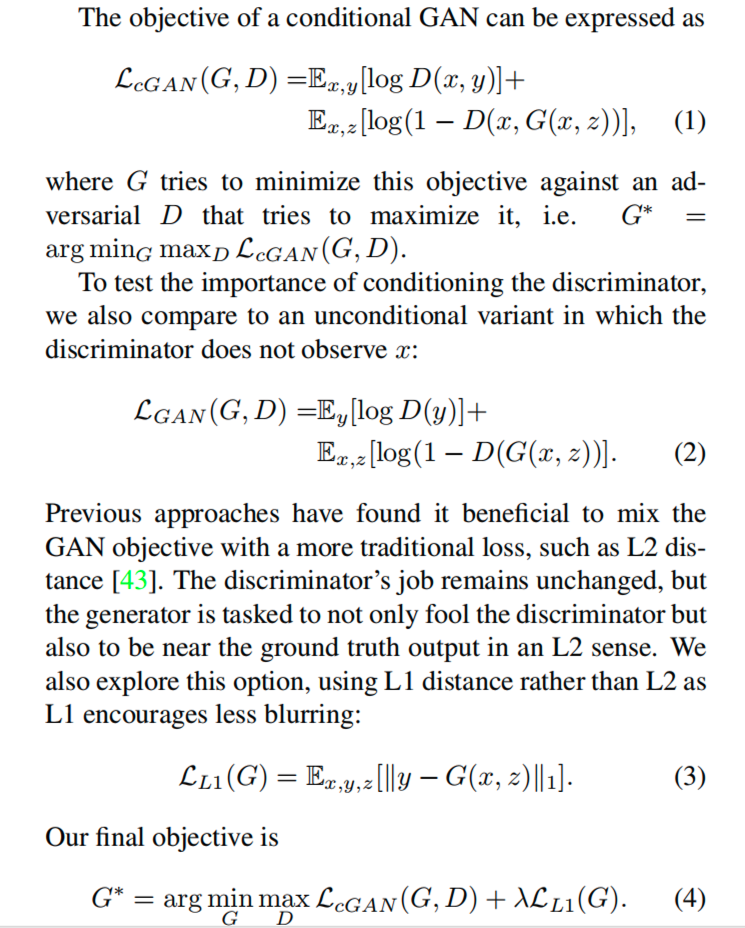

# 论文阅读摘要

## Image-to-Image Translation with Conditional Adversarial Networks
### Abstract
针对 转化输入图像到一种关联的输出(image-to-image, map pixels to pixels)类型的任务，提出了一种通用的 architecture 和 objective，只是使用不同的数据即可满足各种任务

一般来说，Conditional adversarial nets 在这类任务中有不俗的表现。这些网络不仅学习到了 输入到输出 的映射，还学习到了一个用于训练这个映射的 loss function。另外，我们证明了：这种方法在以下任务中都是卓有成效的：从 (semantic) label maps 合成照片、从图像轮廓重构完整图形、图像着色，以及其他的类似任务。而且，不用进行 parameters、loss function 的调整就可以达到比较合理的结果。

### 1. Introduction
使用 CNNs 以及针对性设计的 loss，也可以达到不错的效果。但是这要求精心的设计损失函数。如果简单的使用输入、输出的欧式距离作为损失函数，会大概率得到比较模糊的结果：这是因为为了使欧式距离最小化，网络会更倾向于将合理的输出平均化，这会造成模糊。

一般的，我们一些专业知识才能够设计出合理的损失函数，以使得 CNNs 可以有效的收敛出符合我们预期的结果。

幸运的事，通过 GANs，我们可以指定更高纬度的目标(如，使输出与现实无法区分)，就能自主学习出适合于所用数据、所期目标的 loss 函数。也就是说，GANs 可以通过使用不同的数据，自主学习到满足我们需要的损失函数。这在以前是需要使用不同的损失函数才能做到的。

本论文的主要贡献有：
1. cGANs 可以对多种 image-to-image 问题产生合理的结果
2. 提出一个简单并且足以取得良好的结果的框架，并分析几种重要的体系结构的效果。[Code is available](https://github.com/phillipi/pix2pix)

### 2. Related Work
**Structured losses for image modeling** 针对 image-to-image 转换问题建模的损失函数，通常被表达成像素级(per-pixel)的分类或回归方程式。这些方程式认为解空间是"unstructured"，也就是说每个输出的pixel被认为在条件上独立于给定输入图像的所有其他像素。

相反，cGANs会学习结构性损失。结构化的损失会惩罚输出的联合配置。理论上，cGANs的损失函数可以对输入和输出间的任何不同结构进行惩罚。

事实上，在此之前已经有很多使用 cGANSs 来解决图像生成问题。本文与他们的几个不同的地方在于 generator 和 discriminator 的框架选择上。我们的生成器使用 "U-Net"-based 框架，评判器使用了卷积网络的分离器 "PatchGAN"（它只惩罚 patch 规模的图像结构）。

### 3. Method
GANs are generative models that learn a mapping from
random noise vector z to output image y, G : z → y [24]. In
contrast, conditional GANs learn a mapping from observed
image x and random noise vector z, to y, G : {x, z} → y

#### 3.1 Objective

这里需要注意的是 z 是必须的。以往的 cGANs 使用已经意识到这点，并且通常采用 Gaussian noise 作为 z 来微调输入。

在最初的实验中，我们使用了这种策略，但没有效果，生成器好像忽略了这个噪音。相反，对于最终模型，我们仅以 dropout 的形式提供噪音，并应用于
训练和测试时的生成器的几层。

尽管采用了 dropout 噪声，我们观察到我们的网络输出的随机性依然很小。设计可产生更大随机性的条件GAN，从而捕获他们建模的条件分布的完全熵，是当前工作悬而未决的重要问题。

#### 3.2 Network architectures
1. **Generator with skips**

一个 image-to-image 转换问题的定义特征是：他们将高分辨率的输入网格映射到高分辨率的输出网格。此外，对于我们考虑的问题，输入和输出的表面外观不同，但是两者是相同基础结构的效果图。所以，输入与输出中的结构是大致对齐的。我们围绕这些事项来设计生成架构。

一些以前解决这类问题的方法是使用 encoder-decoder network。这种网络要求所有的信息流需要通过所有的层，包括瓶颈层。对于许多图像翻译问题，有很多底层信息在输入和输出之间共享，就是说，希望将这些信息直接穿梭在网络上。例如，在图像着色的情况下，输入和输出共享显著边缘的位置，

为了给生成器一种避免此类信息瓶颈的方法，我们按照“ U-Net”的一般形状添加了跳过连接。具体来说，我们在第i层和第n-i层之间添加跳过连接，其中n是层的总数。每个跳过连接仅将第i层和第n-i层的所有通道连接在一起。

2. **Markovian discriminator (PatchGAN)**
   
众所周知，L2 和 L1 loss 在图像生成任务中会产生模糊结果。尽管这些损失并不能鼓励高频率清晰度，尽管如此，它们在许多情况下仍能准确捕获低频信息。对于这里的问题，确实是这样，我们不需要全新的框架来强化低频信息的正确性，L1 已经做了。

依靠 L1 来强制低频正确性，这促使将 GAN 判别器限制为仅对高频结构信息进行建模。为了对高频信息建模，将注意力集中在本地图像 patch 中的结构就足够了。因此，我们设计了被称为 PatchGAN 的判别架构，它仅对 patch 规模的结构进行惩罚。这个判别器尝试去分类图像中的 N * N 个 patch 是真是假。我们对该图像进行卷积运算，对所有响应求平均值以提供 D 的最终输出。

下文中，我们证明了：N 可以比图像小很多，也依然可以生成高质量的结果。这是有利的，因为较小的 PatchGAN 具有较少的参数，运行速度更快，并且可以适用于任意大图像。这样的鉴别器可以有效地将图像建模为马尔可夫随机场，假设像素之间的独立性相差大于 patch 直径。

#### 3.3 Optimization and inference
了优化我们的网络，我们遵循 GAN 中的标准方法：在 D 的一个梯度下降步骤与 G 的一个步骤之间交替。如原始 GAN 论文建议的那样，不是训练 G 以使 log(1 − D(x，G(x，z)) 最小化，而是训练以最大化 log(D(x，G(x，z))。此外，我们在优化 D 的同时将目标除以2，这会降低 D 相对于 G 的学习率。我们使用 minibatch SGD 和 应用 Adam 求解器，指定参数：学习率=0.0002、β1=0.5, β2=0.999。

在推理时，我们以和训练阶段完全相同的方式运行 生成器网络。这和通常的协议不太一样，在测试阶段，我们使用了 dropout 与训练阶段相同的方式，并且我们使用测试 batch 的统计信息进行 batch normalization，而不是训练批次的汇总统计信息。这种方法进行 batch normalization 时，设置 batch size 为 1 时被称为“实例归一化”，并已证明在图像生成任务中有效。在我们的实验中，我们使用 batch size 介于1到10之间，具体取决于实验。

### 4. Experiments
为了探索 cGANs 的普遍性，我们在各种任务和数据集上测试了这种方法，包括 图形任务，例如照片生成，和视觉任务，例如语义分割：
1. Semantic labels ↔ photoo, trained on the Cityscapes dataset 
2. Architectural labels → photo, trained on CMP Facades
3. Map↔aerial photo, trained on data scraped from Google Maps
4. BW → color photos
5. Edges → photo
6. Sketch → photo
7. Day → night
8. Thermal → color photos
9. Photo with missing pixels → inpainted photo

#### 4.2 Analysis of the objective function
在 final objective 中，哪部分比较重要呢？我们进行消融研究来隔离 L1 、GAN 项的影响，以比较 cGAN 和 GAN 分别作用在输入上的效果。

论文中的 Figure 4 显示了这些变化在 two labels → photo 问题上的定性影响：
- 仅L1会导致合理但模糊的结果
- 单独使用cGAN（将 λ=0）给出了更清晰的结果，但在某些应用程序上引入了视觉瑕疵
- 将两个部分加在一起（λ= 100）减少了这些伪像

使用 FCN-score 量化这些在 cityscapes labels → photo 任务中的观察研究(论文 Table 1)：
- 基于 GAN 的目标任务得分更高，也就是说 合成的图像包含更多的可识别结构
- 在衡量输入和输出匹配度的损失函数上，cGAN 表现的要比 GAN 好的多。
  - 我们测试了从 final objective 中去掉 conditioning 部分的影响，发现，此时的损失函数不会惩罚输入和输出之间的不匹配，只关心是否输出看起来很真实。检查结果表明，生成器崩溃了，不管输入的照片如何都产生了几乎完全相同的输出。
- 另外，添加 L1 项也会鼓励 输出尊重输入，因为 L1 损失会对正确匹配输入的 ground truth 输出与可能不正确的合成输出之间的距离进行惩罚。
- 相应地，L1 + GAN 在创建尊重输入标签图的逼真渲染时也是有效的。结合所有项，L1 + cGAN 执行的同样的好。

**Colorfulness** cGANs 的一个引人注目的影响就是 它会产生 sharp images，幻想出的即使在输入标签图中不存在的空间结构。有人就开始想象 cGANs 在光谱纬度也有类似的“锐化”作用，例如，使得图像具有更加丰富的色彩。就像 L1 在不能精确定位边缘的位置时会激发模糊一样，它也会在不确定像素应采用几种可能的颜色值中的哪种时激励颜色为平均灰色。特别是，通过在可能的颜色上选择条件概率密度函数的中值，可以使L1最小。另一方面，对抗性损失原则上可以变成能够意识到灰色输出是不现实的，并鼓励匹配真实的颜色分布。

#### 4.3 Analysis of the generator architecture
U-Net 架构允许低维度信息快捷的穿越网络，这会带来更好的结果吗？通过对比 U-Net 和 encoder-decoder(简单的移除 U-Net 中的 skip connections 形成) 在 cityscape generation 任务上的表现，我们了解到：
1. 在我们的实验中，encoder-decoder 无法学习生成逼真的图像
2. U-Net 不仅在使用 cGANs 时 优于 encoder-decoder，在使用 L1 loss 时，也有更加优越的结果

#### 4.4 From PixelGANs to PatchGANs to ImageGANs
我们测试了改变鉴别器感受野的 patch size N 的各种效果，从 1×1 的 “PixelGAN” 到 286×286 的整图 "ImageGAN"。

PixelGAN 对空间清晰度没有特别的影响，但是可以增加结果的色彩。颜色直方图匹配是一个图像处理领域常见的问题，也许 PixelGAN 会是一个有潜力的轻量化解决方案。

使用 16×16 PatchGAN 足以促进锐利的输出，并获得良好的FCN得分，但也导致 tiling artifacts。70×70 PatchGAN 缓解了这些问题并获得更好的分数。缩放到超出这个范围，到完整的 286×286 ImageGAN，似乎并没有改善结果的视觉质量，并且，事实上得到了相对低的多的分数。这也许是因为 ImageGAN 比 70 × 70 PatchGAN 有更多的参数和更大的深度，从而更加难以训练造成的。

**Fully-convolutional translation** PatchGAN 的优势是固定 patch 大小的判别器可以适用于任意大的图像。我们也可以将生成器卷积的应用于比训练用的图像更大的图像上。我们在 map ↔ aerial 任务上测试了这种做法。我们在 512×512 的图片上测试了用 256×256 的图像训练得到的生成器，效果在 论文的 Figure 8 中可以看出效果还是不俗的。

#### 4.5 Perceptual validation
我们在 map↔aerial 和 grayscale→color 任务上验证了结果的 perceptual realism（感性现实主义？？？）。用志愿者来测试生成的结果，看是否能够骗过志愿者：一般情况下，我们的方法(使用 L1+cGANs)有更加优越的表现，除非别的方法是针对特定问题进行了专门设计、优化。

#### 4.6 Semantic segmentation
有条件的 GAN 似乎可以有效解决输出高度细节化或摄影类的问题，这在图像处理和图形任务中很常见。那么在视觉问题（如语义分割）上的表现如何呢？这类问题的特点是：输入比输出更复杂。

为了开始对此进行测试，我们训练了一个 cGAN（带/不带 L1 损失）用于 cityscape photo→labels 任务。论文 Figure 10 显示了定性结果，分类准确性的定量报告在论文 Table 6 中。有趣的是，训练出的不带 L1 损失的 cGAN 能够在合理程度的准确性上解决这个问题。据我们所知，这是 GAN 成功生成“标签”的首次演示，这些"标签"是具有连续变化且几乎离散的值，而不是“图像”。尽管 cGAN 取得了一些成功，但他们还远不是解决下面这个问题的最佳方法：如论文 Table 6 所示：仅使用 L1 回归可以获得比 cGAN 更好的分数。我们认为，对于视觉问题，目标（即预测接近 ground truth 的产出）可能不如图形任务那么含糊，像 L1 这样的重建损失就足够了

#### 4.7. Community-driven Research
自从最初发布论文和我们的 pix2pix 代码，Twitter社区，包括计算机视觉和图形从业人员以及视觉艺术家，都有成功地将我们的框架应用于各种新颖的图像到图像的翻译任务，远远超出了原始论文。尽管有些是基于 pix2pix 进行了修改，但是，他们证明了我们的方法作为 image-to-image 转换问题的一种通用的商品工具的前景。

### 5. Conclusion
本文的结果表明，条件对抗网络是许多 image-to-image 转换任务的有前途的方法，特别是那些涉及高度结构化图形输出的任务。这些网络可以学到适应于手头的任务和数据的 loss，这就让这些网络可以适用于各种各样的设置。

---
## Deconvolution and Checkerboard Artifacts
[Deconvolution and Checkerboard Artifacts](https://distill.pub/2016/deconv-checkerboard/)