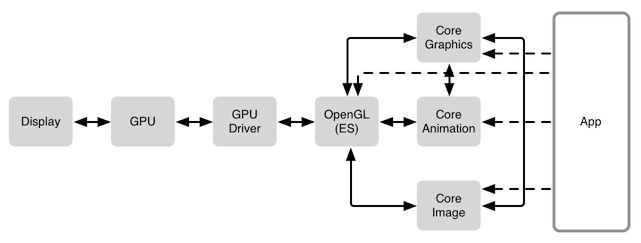
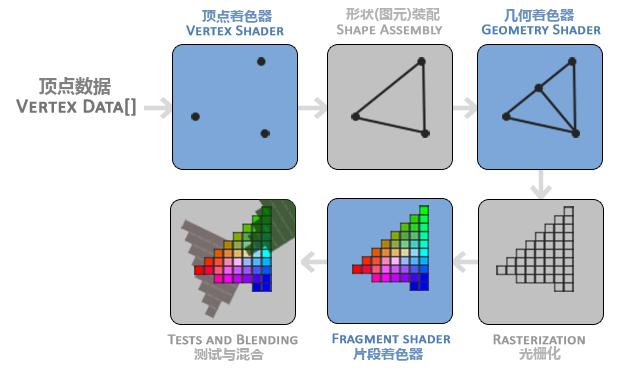
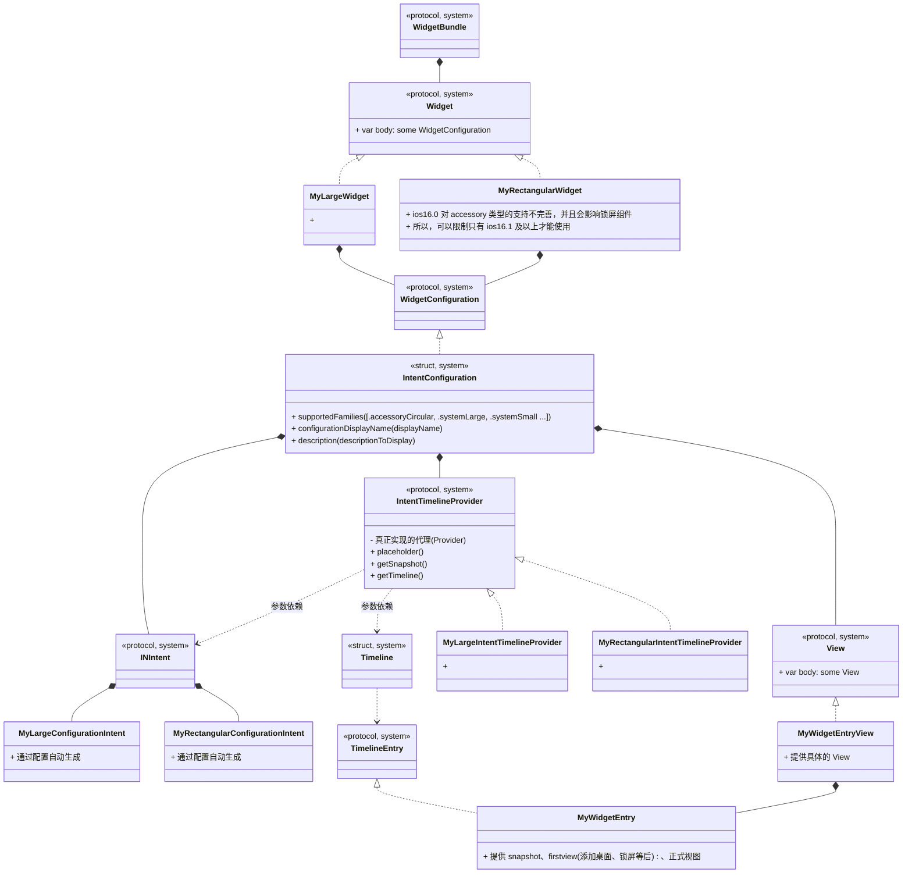
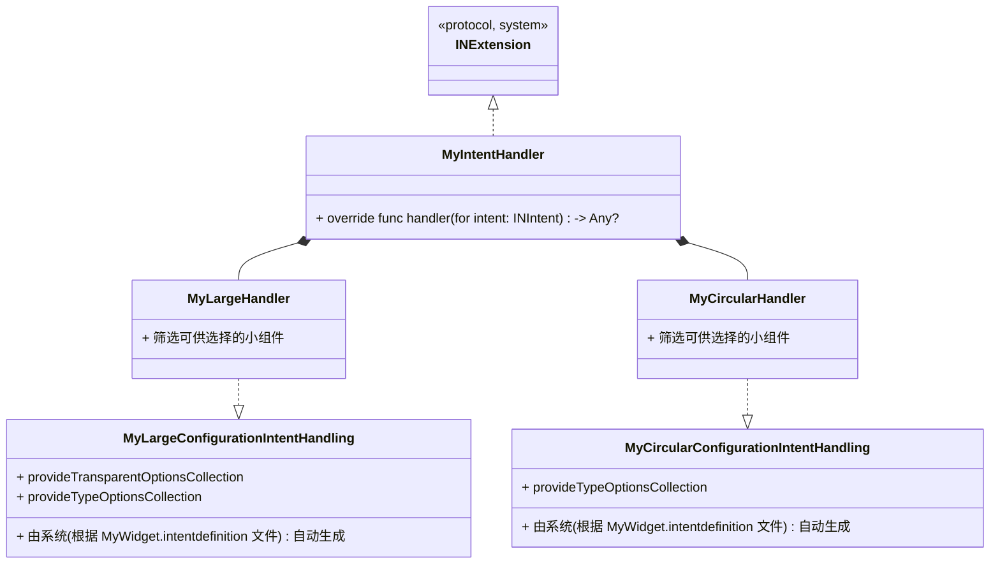

# MacOS 要点

## Rending


- Core Animation
  + Core Animation 源自于 Layer Kit，动画只是 Core Animation 特性的冰山一角。
  + Core Animation 是一个复合引擎，其职责是 尽可能快地组合屏幕上不同的可视内容，这些可视内容可被分解成独立的图层（即 CALayer），这些图层会被存储在一个叫做图层树的体系之中。
  + 从本质上而言，CALayer 是用户所能在屏幕上看见的一切的基础。
- Core Graphics
  + Core Graphics 基于 Quartz 高级绘图引擎，主要用于运行时绘制图像。
  + 开发者可以使用此框架来处理基于路径的绘图，转换，颜色管理，离屏渲染，图案，渐变和阴影，图像数据管理，图像创建和图像遮罩以及 PDF 文档创建，显示和分析。
- Core Image
  + 与 Core Graphics 相反，Core Graphics 用于在 运行时创建图像，而 Core Image 是用来处理 运行前创建的图像的。
  + Core Image 框架拥有一系列现成的图像过滤器，能对已存在的图像进行高效的处理。

### UIView 与 CALayer 的关系
CALayer 事实上是用户所能在屏幕上看见的一切的基础。而 UIKit 中的视图之所以能够呈现可视化内容，就是因为每个视图控件内部都有一个关联的 CALayer。

由于这种一一对应的关系，视图层级拥有 视图树 的树形结构，对应 CALayer 层级也拥有 图层树 的树形结构。

其中，视图的职责是 创建并管理 图层，以确保当子视图在层级关系中 添加或被移除 时，其关联的图层在图层树中也有相同的操作，即保证视图树和图层树在结构上的一致性。

> 那么为什么 iOS 要基于 UIView 和 CALayer 提供两个平行的层级关系呢？

其原因在于要做 职责分离，这样也能避免很多重复代码。在 iOS 和 Mac OS X 两个平台上，事件和用户交互有很多地方的不同，基于多点触控的用户界面和基于鼠标键盘的交互有着本质的区别，这就是为什么 iOS 有 UIKit 和 UIView，对应 Mac OS X 有 AppKit 和 NSView 的原因。它们在功能上很相似，但是在实现上有着显著的区别。

> 实际上，这里并不是两个层级关系，而是四个。每一个都扮演着不同的角色。除了 **视图树** 和 **图层树**，还有 **呈现树** 和 **渲染树**。

### 图形渲染
计算机将存储在内存中的形状转换成实际绘制在屏幕上的对应的过程称为**渲染**。渲染过程中最常用的技术就是**光栅化**。一句话总结：光栅化就是将数据转化成可见像素的过程。

#### GPU 图形渲染流水线
GPU 图形渲染流水线的主要工作可以被划分为两个部分：
- 把 3D 坐标转换为 2D 坐标
- 把 2D 坐标转变为实际的有颜色的像素

GPU 图形渲染流水线的具体实现可分为六个阶段，如下图所示。
1. 顶点着色器（Vertex Shader）
2. 形状装配（Shape Assembly），又称 图元装配
3. 几何着色器（Geometry Shader）
4. 光栅化（Rasterization）
5. 片段着色器（Fragment Shader）
6. 测试与混合（Tests and Blending）



#### 纹理（Texture）
纹理（Texture）经常被用来表现细节。纹理是一个 2D 图片（甚至也有 1D 和 3D 的纹理）。纹理一般可以直接作为图形渲染流水线的第五阶段的输入。


## Widget
### extensions


### handler
用于提供用户选择小组件时的功能支持



### 编辑页
一般来说也会提供小组件编辑页，其中需要实时显示最新的小组件预览图，这就要求：更新配置后，预览图实时更新。这与系统调用小组件更新上，功能有重叠的部分，可以通过：将 自定义的config 和 view 封装成一个 ViewHolder 然后被外部使用。

### 注意
1. 小组件申请位置权限
   + 在主工程(the containing app)项目中申请位置权限
     - 必需在主工程 的 Info.plist 文件中添加相关用途字符串
   + 将```NSWidgetWantsLocation```键添加到 widget extension 的 Info.plist 文件中
     - 类型为：Boolean
2. 小组件视图更新
   + 预览图：小组件视图可以通过 renderToImage 生成预览图
   + 实时图：更新相关配置后，可以通过系统强刷接口强制刷新
3. 小组件交互
   + 通过 小组件View 的 widgetURL 方法指定:
      - 注意：```Widgets support one widgetURL modifier in their view hierarchy. If multiple views have widgetURL modifiers, the behavior is undefined.```

 
## DynamicIsland(灵动岛)、LiveActivity(实时活动)
### 简介


// https://juejin.cn/post/7144268555779850248


### Widget控件尺寸大小
屏幕尺寸(portrait) | Small widget | Medium widget | Large widget
:-: | :-: | :-: | :-: | 
414 x 896 pt | 169 x 169 pt | 360 x 169 pt | 360 x 376 pt
375 x 812 pt | 155 x 155 pt | 329 x 155 pt | 329 x 345 pt
414 x 736 pt | 159 x 159 pt | 348 x 159 pt | 348 x 357 pt
375 x 667 pt | 148 x 148 pt | 322 x 148 pt | 322 x 324 pt
320 x 568 pt | 141 x 141 pt | 291 x 141 pt | 291 x 299 pt


## 自定义 UIView

```
//
// 一般，通过 myView.layer.cornerRadius = 10 来设置圆角
// 这里描述的是：自定义带圆角的 UIView 
//
class MyView: UIView {
    required init?(coder: NSCoder) {
        fatalError("init(coder:) has not been implemented")
    }

    init() {
        super.init(frame: .zero)
        // 会造成视图绘制异常
        // self.roundCorners([.topLeft, .topRight], radius: 10)
    }

    func buildView(tabs: [String], curTabIndex: Int = 0) {
        // 会造成视图绘制异常
        // self.roundCorners([.topLeft, .topRight], radius: 10)
    }

    override func layoutSubviews() {
        super.layoutSubviews()
        // 不在此时机设置圆角(如：在 init 中，或，init 后独立调用 buildView 中...)，会造成视图绘制异常
        self.roundCorners([.topLeft, .topRight], radius: 10)
    }
}
```


## 添加快捷方式
常见的添加快捷方式功能，将其添加到桌面，点击桌面图标打开app进入对应页面。可以实现图标美化以及快捷访问功能。

### Reference
- [iOS 添加快捷方式到桌面](https://juejin.cn/post/6847902220080414733)

## 常用小功能
### 锁死 host 
```
hosts文件被锁死，请在终端中输入下行解锁代码
  sudo chflags -hv noschg /etc/hosts 
  sudo chflags -hv nouchg /etc/hosts 
按回车, 输入电脑密码后即成功

若需要重新锁死hosts文件，请在终端中输入下行锁死代码
  sudo chflags uchg /etc/hosts
  sudo chflags schg /etc/hosts
按回车, 输入密码后即成功
```


## Reference
- [App Review](https://developer.apple.com/cn/app-store/review/)
- [苹果马甲包应用上线经验总结](https://zhuanlan.zhihu.com/p/113436475)
- [马甲包混淆工具](https://zfj1128.blog.csdn.net/article/details/95482006)
- [AppStore马甲包过审技巧](https://bbs.pediy.com/thread-221030.htm)
- [ios马甲包](https://blog.csdn.net/weixin_42325823/article/details/103769799)
- [建立一套扫描方法](https://zhuanlan.zhihu.com/p/101222974)
- [马甲包上架注意事项](http://wd.nnjjkj.com/article/22.html)
- [YJS/confuse](https://gitee.com/yanjinsheng/confuse)
- [iOS马甲包预审分析工具](https://blog.csdn.net/box_kun/article/details/124823230)
- [认识MachO](https://www.jianshu.com/p/c07e5ee89b3e)
- [AppInfoScanner](https://github.com/kelvinBen/AppInfoScanner)
- [从Mach-O看砸壳及App的安全性原理](https://www.codercto.com/a/81235.html)
- [iOS App 签名的原理](http://blog.cnbang.net/tech/3386/)
- https://www.jianshu.com/p/4e8ccb02e92d
- https://juejin.cn/post/6844904014170030087
- [Flutter 编译产物的理解](https://allenwu.itscoder.com/flutter-compile-product)


# Ios应用快速原型化探索

## 前置知识
### 要素
1. 模块化：不能循环依赖
   + Framework
     - 包管理：CocoaPods
       + 特点：包多(基本大部分都支持), 使用稍复杂，项目入侵严重
       + 依赖导入
         + CocoaPods
     - 更改包名、包结构
       + 需要同步修改工程配置文件
       + 方式：Xcode Template：工程模版、子工程模版
   + Package
     - 只支持单一语言
     - 包管理：SPM
       + 特点：包多(大部分支持，但少于CocoaPods), 使用简单，没有项目侵入性
       + 依赖导入
         + 源码、git
       + 自建版本管理
         + 可以依托 git 实现，**待实践**
     - 创建
       + 1. 在 Xcode 中选择 Swift Package
       + 2. 在命令行中写入 swift package init。命令行创建会将当前目录名称用作包名。
     - 更改包名、包结构
       + 直接修改目录结构，xcode 会自动更改项目
     - 更改引入方式
       + 动、静态库

#### Reference
- [](https://maimai.cn/article/detail?fid=1758568260&efid=LnLf4PsHKi00KjtDZ9XbuA)
- [](https://juejin.cn/post/7007987863954391054)
- [Xcode Template：工程模版、子工程模版、类文件模版](https://juejin.cn/post/6844903715296526350)

### 问题
1. 模块化
   + 模块的开发
   + 模块的使用
   + 模块的bug修复
2. 快速原型化 带来的 包判重问题

## 模块
NO. | Name | Description | Note | Others
:-:|--|:-|--|--
1 | 模版 | 1. 可以修改项目名、icon <br> 2. splash、main-page、bottom-navigator、me page、setting page、about page、privacy && termOfUse
2 | pay | 
3 | ad | 
4 | data support | | 
5 | network | post、get、download and decompress
6 | net image | 
7 | **More** | 


