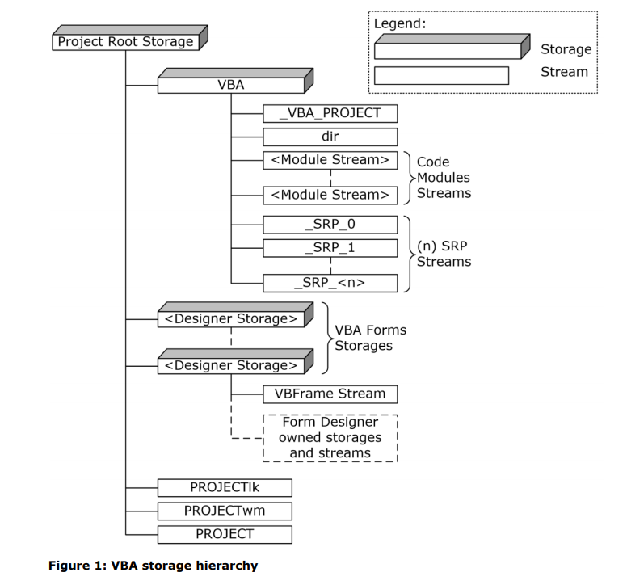

# Office 格式简析

## MS-CFB


https://blog.csdn.net/darcy_123/article/details/104925066
https://blog.csdn.net/Cody_Ren/article/details/103886098


### OLE
 OLE, Object Linking and Embedded

Office文档主要基于三种格式：ole、xml、ooxml —— ooxml 以 xml 为基础，可以理解为 zip文件。
doc、xls、ppt 三种扩展名文档属于97-2003版Office，可解析出ole格式文件。
docm、xlsm、pptm 是启用宏的Office文档，存储 Visual Basic Applications（VBA）宏代码，可解析出 xml 文件。
docx、xlsx、pptx 三种扩展名文档可解析出 xml 文件。
ppsx 是 2007 的PPT的一种格式，打开就是幻灯片播放模式。

### VBA project
VBA project 是由一系列 records 组成的结构。其中每个 record 都定义了 project 的三要素之一的部分内容。

每个 record 都是以结构开头：```ID(2 bytes) + Size(4 bytes) + ...```

project 的三要素有：project information, project references, and project items.

#### 1. project information
ole 中 VBA 存储(storage)结构如下：



其中 Project Root Storage 是一个独立的 storage。例如，OLE 文件中的 Macros storage。

- VBA Storage
    + MUST
    + description
        - 。而 SRP Streams 则是 
    + sub-structure
        + _VBA_PROJECT Stream
            + MUST
            + provides basic information about the VBA project, including the version information required to load the remainder of the structure
        + dir Stream
            + MUST
            + 指明 VBA project properties, project references, 和 module properties
            + The entire stream MUST be compressed as specified in Compression
        + "Module Stream"
            + VBA project 中的每个 module 必须拥有一个 Module Stream
            + VBA project 中 modules 的源码。此 stream 的名字由 MODULESTREAMNAME 指定。
        + SRP Streams
            + Optional
            + 指定 特定实现和版本相关 的性能缓存的流。必须是读取时忽略。写入时不得出现。
- PROJECT Stream
    + MUST
    + Project Properties, VBA project 的附加信息。
- PROJECTwm Stream
    + Optional
    + contains information for mapping module names between multibyte character set (MBCS) and UTF-16.
- PROJECTlk Stream
    + Optional
    + license information for ActiveX controls used in the VBA project.
-  Designer Storages
    + Optional
    + sub-structure
        + VBFrame Stream
            + designer module properties
            + 此 stream 的名字必须是以 UTF-16 character 0x0003 开头紧接着是  UTF-16 的 "VBFrame"。

#### 2. project references
dir Stream 中的 records 包含了 VBA project 对外部资源引用的信息。主要有三类：REFERENCECONTROL、REFERENCEREGISTERED、REFERENCEPROJECT。

#### 3. project items
VBA project 包含一系列用于嵌入 macros 的 project items。而 project item 是由多个 records 组合定义。主要有以下 5 种 project item(详见 MS-OVBA 文档): project package, document modules, procedural modules, class modules, 和 designer modules。 are items that can
contain source code as described in [MS-VBAL] section 4.2 and other user-configurable settings. 

### MS-XLS
 MS-XLS (BIFF8, Binary Interchange File Format )

包含的宏有:
- vba_project
    + OLE 的名为 vba_project 的 storage 中
- Microsoft Office Excel 4.0
    + MS-XLS 的 BIFF 结构


### MS-DOC

### MS-PPT


## OOXML
```
OOXML(Office Open XML File Formats), 
│  [Content_Types].xml //描述文档各个部分的ContentType，协助程序解析文档
│
├─docProps
│      app.xml//程序级别的文档属性，如：页数、文本行数、程序版本等
│      core.xml//用户填写的文档属性，如：标题、主题、作者等
│
├─word
│  │  document.xml//word文档的正文
│  │  fontTable.xml//word文档的页脚
│  │  settings.xml//
│  │  styles.xml
│  │  vbaData.xml//vba属性，是否auoopen，是否加密
│  │  vbaProject.bin//记录vba工程信息 ole
│  │  webSettings.xml
│  │
│  ├─theme
│  │      theme1.xml//记录样式，颜色编号，字体大小等等
│  │
│  └─_rels
│          document.xml.rels//文档间的关系
│          vbaProject.bin.rels//记录vba文件
│
└─_rels
        .rels//描述各个部分之间的关系
```
### MS-XLSX


xls && xlsx
 MS-XLS (BIFF8, Binary Interchange File Format )

https://www.loc.gov/preservation/digital/formats/fdd/fdd000395.shtml
    https://www.loc.gov/preservation/digital/formats/fdd/fdd000398.shtml
    http://officeopenxml.com/anatomyofOOXML-xlsx.php


## Reference

- [Office File Formats](https://docs.microsoft.com/en-us/openspecs/office_file_formats/ms-offfflp/8aea05e3-8c1e-4a9a-9614-31f71e679456)
- [[MS-OVBA]: Office VBA File Format Structure](https://docs.microsoft.com/en-us/openspecs/office_file_formats/ms-ovba/575462ba-bf67-4190-9fac-c275523c75fc)
- [[MS-XLS]: Excel Binary File Format (.xls) Structure](https://docs.microsoft.com/en-us/openspecs/office_file_formats/ms-xls/cd03cb5f-ca02-4934-a391-bb674cb8aa06)
- [Introducing the Office (2007) Open XML File Formats](https://docs.microsoft.com/zh-cn/previous-versions/office/developer/office-2007/aa338205(v=office.12))
- [OLE1.0 and OLE2.0 Formats](https://docs.microsoft.com/en-us/openspecs/windows_protocols/ms-oleds/fdc5e702-d09e-4344-a77f-eb079d41f23f)

- [oledump-py](https://blog.didierstevens.com/programs/oledump-py/)
    + [github-code: oledump.py](https://github.com/DidierStevens/DidierStevensSuite/blob/master/oledump.py)
- [REMnux: Analyze Documents](https://docs.remnux.org/discover-the-tools/analyze+documents)
- [0xevilc0de.com](https:0xevilc0de.com) 此博客包含一些宏病毒等的分析相关
    + [Maldoc uses template injection for macro execution](https://0xevilc0de.com/maldoc-uses-template-injection-for-macro-execution/)
    + [Excel 4 Macros – Get.Workspace Reference](https://0xevilc0de.com/excel-4-macros-get-workspace-reference/)
    + [Removing Passwords from VBA Projects](https://0xevilc0de.com/removing-passwords-from-vba-projects/)
    + [Maldoc uses RC4 to hide PowerShell script, retrieves payload from DNS TXT record](https://0xevilc0de.com/maldoc-uses-rc4-to-hide-powershell-script-retrieves-payload-from-dns-txt-record/)
    + [Maldoc uses Windows API to perform process hollowing](https://0xevilc0de.com/maldoc-uses-windows-api-to-perform-process-hollowing/)
- [malware-samples](https://github.com/jstrosch/malware-samples/tree/master/malware_analysis_exercises/2020/December)

- [Template Injection](https://sevrosecurity.com/2019/09/12/dynamic-office-template-injection-for-sandbox-bypass/)
    + [Word Doc uses Template Injection for macro execution](https://github.com/jstrosch/malware-samples/tree/master/maldocs/unknown/2020/May)
- [复合文档文件格式研究](https://www.cnblogs.com/AspDotNetMVC/p/3810839.html)

