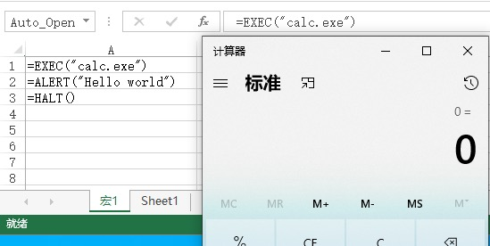
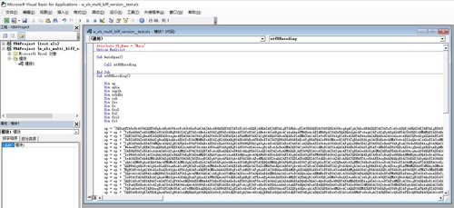
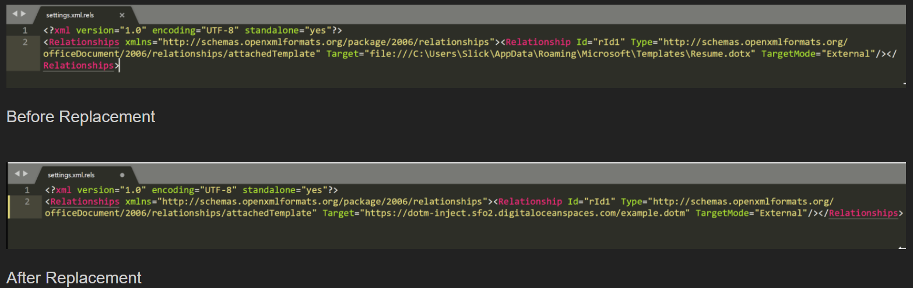
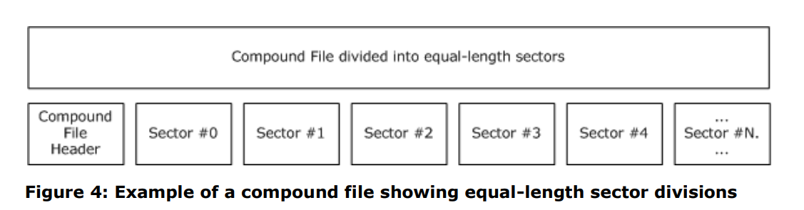
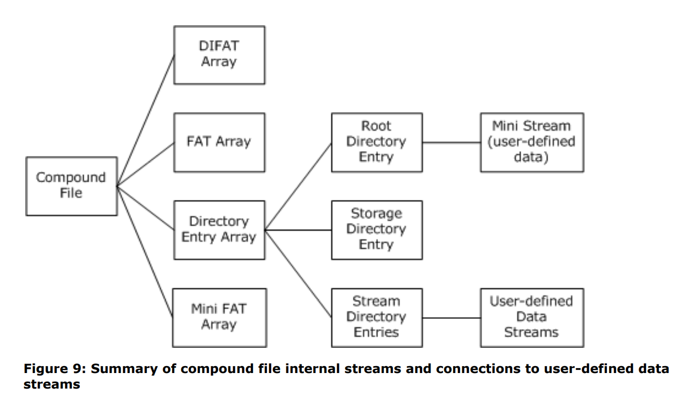
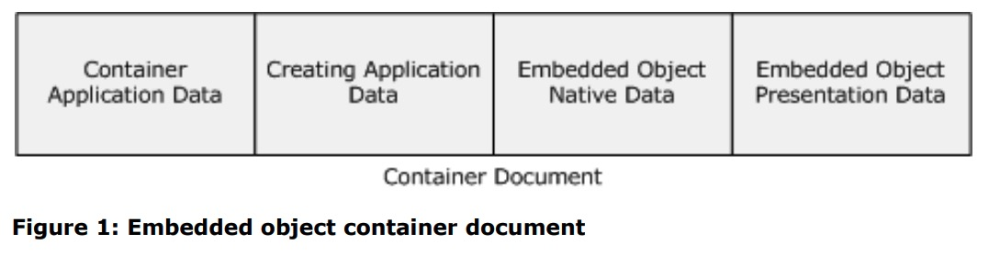
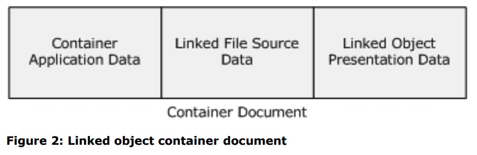
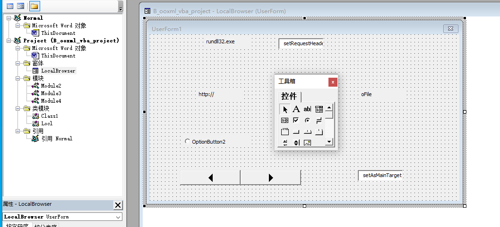
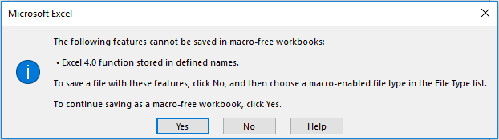

# Office 格式简析
目前常见的 Microsoft Office 格式主要分为 97 ~ 2003 和 2007 ~ 两种格式。```Microsoft Office 97 ~ 2003``` 的文件格式都是由 MS-CFB 结构来表示的 OLE 文件。```Microsoft Office 2007 ~ ```则是由 OOXML 格式的文件结构压缩而成的 zip 包来存储。

而 OOXML 又是以 XML 文件为基础的，所以，概括的说，Office文档主要基于 ole、xml、ooxml 这三种文件格式构建起来的。

常见的文件扩展名以及用途如下：
| Extensions | Usage | Remark |
| :--- | --- | --- |
| doc、xls、ppt | 属于 97-2003 版 Office | |
| docx、xlsx、pptx  | 属于 2007 ~ 版 Office 文档，但没有启用宏 | |
| docm、xlsm、pptm  | 属于启用了宏的 2007 ~ 版 Office 文档，可以存储 Visual Basic Applications（VBA）宏代码 | |
| ppsx | 是 2007 的 PPT 的一种格式，打开就是幻灯片播放模式 | |

按照我们常规的认知，一个文档应当包含以下几个部分：
1. 文档内容
   + 可能涉及对 embedded objects 或 external objects 的引用
   + 文档的展示相关：字体、页面大小、打印方式等等
2. 文档工具
   + 为了更好、更方便的操作文档内容进行编辑、展示、提示以及其他功能，而提供的一些跟文档相关的组件，如 vba、formula、animation 等等
3. 文档属性
   + 如，创作时间、作者、最后修改时间等等
4. 保护措施
   + 签名
   + 读(打开)、写 保护

## 一、Malware
由于 ms-office 文件的广泛使用，恶意软件作者对其进行了充分的挖掘、利用，催生出了一系列针对这些文档的病毒，期中常常被用于恶意目的的组件或者方式有：宏病毒、漏洞利用、嵌入文件

### 1.1 漏洞
漏洞利用是指软件自身缺陷被攻击者利用来执行高危动作，如利用 ole 的特点调用第三方组件并执行；栈溢出造成的任意代码执行漏洞(CVE-2017-11882) 等等，常见的漏洞有：
- [CVE-2017-11882]()
- [CVE-2018-0802](https://www.secpulse.com/archives/67027.html)
- [CVE-2019-0801](https://msrc.microsoft.com/update-guide/en-US/vulnerability/CVE-2019-0801)
- [CVE-2021-40444](https://bbs.pediy.com/thread-269266.htm)

### 1.2 宏病毒
宏（Macro）是 ms-office 提供的一种利用一系列独立的 office 命令来实现任务执行的自动化，以简化日常工作的工具。当前的 ms-office 是使用 Visual Basic for Applications（VBA）编写的，它是 Microsoft 的 Visual Basic 编程语言专门为 Office 服务的一种变体。VBA 可在大多数 Office 程序中使用，例如 Access，Excel，Outlook，PowerPoint，Project，Publisher，Visio 和 Word 等等。

宏病毒主要是利用 宏 来进行感染和传播。它利用宏语言的功能寄存在文档或模板中，一旦带有宏病毒的文档被打开，宏就可能会执行，而宏病毒就会被激活。

它的主要感染路径大致如下：```单个Office文档 => Office文档模板 => 多个Office文档```。

常见的宏主要存在于以下两种形式(vba && xlm)：
<center class="half">
    
    
</center>

此外，还有一种攻击方式被称为「模板注入」，实际上还是上述两种 macros 的利用，不过内容可能会随时发生变化
- 

此外，宏病毒常常用以下方式保护、隐藏自己：
1. 禁止提示信息
  ```
  On Error Resume Next                     '如果发生错误，不弹出出错窗口，继续执行下面语句
  Application.DisplayAlerts = wdAlertsNone '不弹出警告窗口
  Application.DisplayStatusBar = False     '不显示状态栏，以免显示宏的运行状态
  Options.VirusProtection = False          '关闭病毒保护功能，运行前如果包含宏，不提示
  ```
2. 屏蔽命令菜单，不许查看宏
  ```
  ' Disable或者删除特定菜单项，用来使“工具—宏”菜单失效的语句：
  CommandBars(“Tools”).Controls(16).Enabled = False
  ```
3. 隐藏宏的真实代码
  - 在“自动宏”中，不包括任何感染或破坏的代码，但包含了创建、执行和删除新宏（实际进行感染和破坏的宏）的代码；将宏代码字体颜色设置成与背景一样的白色等
  - “自动宏” 是指利用 AutoExec、AutoNew、AutoOpen、AutoClose、AutoExit 自动触发执行的宏
4. 文档密码保护
  - 打开文档时需要密码 或者 查看vba脚本时需要密码

另外，病毒作者常用**密码逃逸**手段以增加检测难度，事实上也很有效。这种方法的全称是：```VelvetSweatshop Default Password Ploy```。
- 对象：Excel 4.0 xls 97 ~ files with a compromised macro
- 表现：XLS files appear password protected but aren’t, opening automatically to install malware from compromised macros.
- 原因：Excel 会首先尝试使用默认密码 'VelvetSweatshop' 以 read-only 模式打开文件，如果失败时，再向用户要求输入密码。(This read-only technique has been known about for over 10 years.)
- Reference
  + https://threatpost.com/hackers-update-age-old-excel-4-0-macro-attack/154898/

### 1.3 Embedded
利用复合文档可以内嵌其它文档的特性，可以嵌套如：
- images、video、audio
- other streams, eg. rtf、pdf、docx ... (rtf、docx等复合文档又可以继续嵌套... MY GOD ~)

## 二、MS-CFB
经常被称为 OLE(Object Linking and Embedded)，实际上 OLE (是一种面向对象的技术)包含的内容更多，是 COM 技术的基础，而 CFB 只是 OLE 中关于文件格式的一种描述。

复合文档的物理结构比较简单：
- 

*注意：Compound File Header (512 bytes)也会独占一个 sector, 没有用到的地方填充 0.*

这里是逻辑结构：
- 

文档中的内容都以 stream 来保持具体内容，storage 来组织 stream 的结构。而这些内容在文件中的位置、查找方式、解读方式，就由 ```Directory Entry Array``` 来表达。

复合文档的结构非常类似 FAT 文件系统，storage 相当于 directory，stream 相当于 file。为了文件的快速定位，我们需要相应的分区索引表(DiFat 和 Fat)。在 复合文档中，为了节省空间，会将 sector 划分成等长的 ```short-sector``` 用于小对象(```short-stream```)的存储，而它的索引需要 ```Mini-Fat```。

由于 CFB 文件由 sectors 组成，这里统一称呼为：
- msat (master sector allocation table)，又名 DiFat
- sat (sector allocation table)，又名 Fat
- ssat (short-sector allocation table)
- stream
- short_stream

他们的功能如下：
- msat 表包含了用于构造 sat 表的 sectors 的 sid
- sat 表包含了很多 sid 链(有特定的 sid 标识链条结束)
  - 每个 sid 链上的 sectors 联合构成了一个完整的 object (如，stream、storage、directory entry array、ssat ...)的物理存储。
- ssat 表包含了很多 ssid 链(有特定的 ssid 标识链条结束)
  - 每个 ssid 链上的 short-sectors 联合构成了一个完整的 short-stream

到这里，我们大概可以想到为了解析 CFB 结构，需要知道以下几个内容：
1. Directory Entry 的结构 和 存放位置
2. msat 表在文件中的位置
3. stream 和 short-stream 的切割点：什么情况下用 stream 什么时候用 short-stream
4. short-sector 存储于哪些 sector 中
5. ssid 存储于哪些 sector 中

这些内容就存放在 Compound File Header 和 Directory Entry Root 中。

## OLE
OLE, Object Linking and Embedded。

微软在 1991 年制定的 OLE1.0 规范，主要解决多个应用程序之间的通信和消息传递问题，微软希望第三方开发商能够遵守这个规范，以使在当时的Windows平台上的应用程序能够相互协调工作，更大的提高工作效率。然而事与愿违，只有很少的软件开发商支持它。为此，微软于1993 年发布了新的规范 OLE2.0，它在原有的基础上完善并增强了以下各方面的性能：
1. OLE自动化：一个程序有计划地控制另一个程序的能力。
2. OLE控件：小型的组件程序，可嵌入到另外的程序，提供自己的专有功能。
3. OLE文档：完善了早期的混合文档功能，不仅支持简单链接和嵌入，还支持在位激活、拖放等功能。

强大的功能使得很多的开发商开始支持新的 OLE 技术，因为微软在 OLE2.0 中建立了 COM（Component Object Model即组件对象模式）规范。

OLE 相关的基础概念有：
- 容器：
  + 容器是一个客户程序，它具有申请并使用其它COM组件通过接口为其它程序实现的功能；
- 服务器：
  + 服务器通过特定的接口将自己完成的一些功能，提供给使用自己的应用程序（例如画笔程序是一个文档服务器，它提供创建并编辑BMP 图像的功能）。当打开Word，选择【插入】菜单下的【对象...】项，您可以看到在您的系统中存在哪些文档服务器，此时的Word以文档容器的身份出现。 
- 在位激活：
  + 当您双击插入的对象后发现Word的菜单有些改变成文档服务器程序的菜单，可以在当前的环境下编辑对象，这称为在位激活。

简单的说，OLE 是一种可以用来创建复杂文档的技术，这些复杂文档可以包含来自不同渠道（数据源）的信息，并保留其原始属性。例如，一个支持 OLE 的文档（例如word）能够支持嵌入的表格对象，并且嵌入的文档会保留所有原来的属性。如果用户打算编辑嵌入的数据，windows 操作系统会激活原来的应用程序（如excel）并载入这个嵌入的文档。

### OLE 格式
OLE 文件的 Property Sets 通过以下两个 stream 存储: 
- ``` "\005SummaryInformation" ``` 
- ``` "\005DocumentSummaryInformation" ```

这两个 stream 都以 PropertySetStream 结构(见 [MS-OSHARED]() 的 section3.2.1 )开头。

OLE文件中包含的常见内容主要有：
#### 1. linked or embedded object 
包含嵌入、链接对象的容器文档的逻辑布局如下图：
<center class="half">
    
    
</center>

+ OLEStream
  - OLE2.0 中，由复合文档的以 "\1Ole" 为名的 stream object 包含。OLEStream structure 表述了存储对象是用于 linked object 还是 embedded object。当此结构是为 linked object 指定 storage object 时，它还指定了对此链接对象的引用。
+ CompObjStream
  - OLE2.0 中，名为 "\1CompObj" 的流，主要用于描述 Clipboard Format、用于显示的linked object 或 embedded object 的名字。
+ Embedded Object Native Data
  - OLE1.0 中，其由 EmbeddedObject structure 的 NativeData field 指定。
  - OLE2.0 中，Native Data 的指定方式有以下两种，可以互换使用：
    + 由复合文档的以 "\1Ole10Native" 为名的 stream object 包含。如 OLENativeStream structure 的 NativeData field 所指定。
    + 由 creating application 创建的 stream objects 可以包含 native data。此类流对象是 creating application 的私有对象，未在文档中说明。
      - creating application: An application whose data is stored in or referenced by documents from other applications.
+ Embedded Object Presentation Data
  - 用于指定如何在 container application 中显示 linked or embedded object 对象
  - OLE1.0 中，其由 EmbeddedObject structure 的 Presentation field 指定
  - OLE2.0 中，由复合文档的以 "\2OlePres" 为前缀(后跟着3个十进制数字，并且最多只能有999个Presentations)的 stream objects 指定。每一个 stream 都包含一个 OLEPresentationStream structure。

#### 2. 宏
常见的 宏 有两种：vba 和 ms-excel4.0, 它们出现的主要位置有：
- vba project 
  - office97 ~ 2003: vba project storage
  - office2007 ~ : vbaProject.bin
- microsoft office excel 4.0
  - office97 ~ 2003: book\workbook stream
    - 注：主要通过 BIFF 格式保存了 formula、drawing group 等内容
  - office2007 ~ : macrosheets
    - Microsoft 365 新增 [LAMBDA function](https://support.microsoft.com/en-us/office/lambda-function-bd212d27-1cd1-4321-a34a-ccbf254b8b67)
- macro template
  - office2007 ~ : /[xx]/_rels/settings.xml.rels 中引用外部(远程)模板文件
- VbaProjectStg
  - binary powerpoint document 中用于指定一个用于 VBA project 的结构化存储

#### 3. officeart
- office97 ~ 2003:
  - worddocument、book\workbook、'powerpoint document' stream
    - Office Drawing Binary File Format (MS-ODRAW)，This file format is also known as OfficeArt.
- office2007 ~ :
  - *TODO*

#### 4. encryption and obfuscation
详见 [Office 格式简析 - Crypto](./ole_office_msoffcrypto.md)

这里需要注意的是 vba project 的保护(待确认)：
- vba project
  - 可以对其中的 stream 设置独立的密码 (未确认)
    - VBA uses a reversible encryption algorithm for selected data.
  - PROJECT Stream: ProjectProtectionState
    - ProjectProtectionState: "CMG="0705D8E3D8EDDBF1DBF1DBF1DBF1"" specifies no sources are restricted access to the VBA project. The value is obfuscated by Data Encryption (section 2.4.3).
    - ProjectPassword (section 2.3.1.16): "DPB="0E0CD1ECDFF4E7F5E7F5E7"" specifies the VBA project has no password. The value is obfuscated by Data Encryption (section 2.4.3). 
    - ProjectVisibilityState (section 2.3.1.17): "GC="1517CAF1D6F9D7F9D706"" specifies the VBA project is visible. The value is obfuscated by Data Encryption (section 2.4.3).
    - LibName: "VBE" specifies a built in name for the VBA Automation type library.

### VBA Project 格式
VBA project 是由一系列 records 组成的结构。其中每个 record 都定义了 project 的三要素之一的部分内容。每个 record 都是以结构开头：```ID(2 bytes) + Size(4 bytes) + ...```

project 的三要素有：project information, project references, and project items.

#### 1. project information
ole 中 VBA 存储(storage)结构如下：


其中 Project Root Storage 是一个独立的 storage。例如，OLE 文件中的 Macros storage。

- VBA Storage
    + sub-structure
        + _VBA_PROJECT Stream
            + MUST
            + 包含了 VBA project 的基础信息，如，版本号(用于加载此结构的剩余内容) 等
        + dir Stream
            + MUST
            + 指明 VBA project properties, project references, 和 module properties
            + The entire stream MUST be compressed as specified in Compression
        + "Module Stream"
            + VBA project 中的每个 module 必须拥有一个 Module Stream
            + VBA project 中 modules 的源码。此 stream 的名字由 MODULESTREAMNAME 指定。
        + SRP Streams
            + Optional
            + 指定 特定实现和版本相关 的性能缓存的流。必须是读取时忽略。写入时不得出现。
- PROJECT Stream
    + MUST
    + VBA Project Properties, 如 工程的目录结构、脚本类型、module的可编辑窗口的信息等等, 以及一些 VBA project 的附加信息，如：ProjectPassword、ProjectVisibilityState 等  注：[[MS-OVBA] - v20200219 的 2.3.1.3 ProjectModule]() 有脚本类型的相关说明
- PROJECTwm Stream
    + Optional
    + 包含了用于 module name 在 multibyte character set (MBCS) 和 UTF-16 之间互相映射的信息
- PROJECTlk Stream
    + Optional
    + 包含了 VBA project 中的 ActiveX controls 的 license 信息
-  Designer Storages
    + Optional
    + 每个 vba project 中的 designer module 都必定有一个与之对应的 designer storage ，此 storage 的名字由 dir stream 中相关 module 中的 MODULESTREAMNAME record 指定。
    + 每个 designer storage 必定有一个 VBFrame Stream
      + VBFrame Stream，用于描述 designer module 的属性信息，此 stream 的名字必须是以 UTF-16 character 0x0003 开头紧接着是  UTF-16 的 "VBFrame"。
    + 如果此 designer 是一个 Office Form ActiveX control, 那么此 storage 必定包含 ```[MS-OFORMS] section 2```中描述的必须 storages 和 streams。

#### 2. project references
dir Stream 中的 records 包含了 VBA project 对外部资源引用的信息。主要有三类：REFERENCECONTROL、REFERENCEREGISTERED、REFERENCEPROJECT。

#### 3. project items
VBA project 包含一系列用于嵌入 macros 的 project items。而 project item 是由多个 records 组合定义。主要有以下 5 种 project item(详见 MS-OVBA 文档): ```project package, document modules, procedural modules, class modules``` 和 ```designer modules```。


### Microsoft Office Excel 4.0
Microsoft Office Excel 4.0, 主要存在于 MS-XLS 的 book\workbook stream 中。此 stream 以 BIFF8(Binary Interchange File Format) 格式组织各个细节。

使用 Excel 4 Macros 的一些细节：
- 使用 relative named range 时，函数主体和结果之间的单元格距离必须都相同，否则可能会计算出错误的结果。
- Office 2007 ~ 中，任何带有 Excel 4 Macro 的文件都必须另存为启用宏的工作簿 (.xlsm)，尝试另存为标准 Excel 文件将触发以下错误消息:

- 任何包含数组的函数，例如 GET.WORKSPACE(37) 或 NAMES() 都应该包含在 INDEX 函数中: 如，=INDEX(GET.WORKSPACE(37),!A1)，在这个例子中，A1 包含应该检索的数组中的数字，例如如果 A1 包含值 2，它将返回 GET.WORKSPACE(37) 数组中的第二项。
- 使用 Macro Worksheet 时，工作表设置为显示公式，而不是公式的结果。可以使用 ```Ctrl + |``` 在公式视图和结果视图之间切换。

解析过程中遇到的问题：
+ RgceLoc 可以按照 RgceLocRel 来解析，以简化解析流程。
+ 解析 formula 的过程中，会遇到 "is part of a revision or not" 的分支流程，这里涉及以下三个概念：
  - UserBView Record:
  	+ fPersonalView : MUST be 0 if this is not a shared workbook.
  - Revision Stream
  	+ An instance of the Revision Stream specifies the revision logs (section 2.2.11.2) and revision records (section 2.2.11.3) for a shared workbook (section 2.2.11).
  	+ The name of this stream MUST be "Revision Log". A file MUST contain at most one Revision Stream. The Revision Stream MUST exist if the workbook is a shared workbook.
  - Revision Records
    + a series of records. 详情可以参考 [MS-XLS] 文档。
+ external references：
  - Supporting Link 包含了 Self-Referencing、Same-Sheet Referencing、External Workbook Referencing 等等类型。
+ name manager:
  + LblRecord : TODO (关联 name 和 sheet)
    - 内置名字的索引，可能由 1 或 2 字节表示
    - NameParsedFormula 可能出现 ptgRef3d 的 ixti == 0xFFFF，此时，此时的结构未被文档记录：
      - we can reproduce it: make a macro sheet in ooxml and export it to xls. 
      ```
				uint8_t ptg = uint8_t(data[cce_offset] & 0x7f);
				if (ptg == ptgRef3d || ptg == ptgRef3dA || ptg == ptgRef3dV) {
					uint16_t ixti = *(uint16_t*)(data + cce_offset + 1);
					if (ixti > 0xFF00 && record->cce >= 15 + 3) {
						assert(record->itab == 0 || record->itab == 1);
            uint16_t iscope_1base = (record->itab == 1) ? record->reserved1 : record->itab;
						uint16_t isheet_0base_a = *(uint16_t*)(data + cce_offset + 11);
						uint16_t isheet_0base_b = *(uint16_t*)(data + cce_offset + 13);
						assert(isheet_0base_a == isheet_0base_b);
						auto row = *(uint16_t*)(data + cce_offset + 15);
						auto col = (uint16_t)*(uint8_t*)(data + cce_offset + 17);
					}
				}
			}
      ```
+ Rgce 的 ACTUAL_PTG_SIZE 跟实际情况不符合

### DOC
一个 doc 文档应当由以下几个部分组成：
1. WordDocument stream
   + 有一个 FIB structure 在流的起始位置 
2. Table stream
   + 1Table 或者 0Table 流必定存在。当二者同时存在时，base.fWhichTblStm 指定的为有效流，忽略其他即可。
   + 如果文档被加密的话，会有一个 EncryptionHeader 结构在流的起始位置。反之，如果文档没有加密，则此流没有预定义的结构。
   + 存储了文档的文本信息
3. Data stream 
   + 没有预定义的结构，也不是必定存在。它包含的是 FIB 或 文件的其它部分的引用数据，也就是说如果没有引用数据的话，这个流没有存在的必要
4. ObjectPool storage
   + Object Pool storage 包含一些用于持久化 embedded OLE objects 的 storages。如果文档没有 embedded OLE objects 时，是不会出现此 storage 的。
   + 每一个位于 ObjectPool storage 中的 storage 都有一个 ObjInfo Stream (名为 "\003ObjInfo")，这个流里存放着用于描述 embedded OLE object 信息的 ODT structure。
     - embedded OLE object 相关的其他流的描述可以参考 [Embedded Object Native Data]() 相关内容
   + 每个 sub-storage 都存储了一个用户嵌入(embedded)的文件。并且，每个 sub-storage 都是以: 下划线"_" + 10个digits 组成，如 _1557814583
     - 关联引用的关键词：sprmCFOle2、sprmCPicLocation
5. Summary Information
   + Summary Information stream
   + Document Summary Information stream
   + Encrypt stream
     - 名为 encryption 的流，只有当以下两个条件同时满足才会出现：文档被 RC4 CryptoAPI 加密， 并且，EncryptionHeader.Flags 的 fDocProps 标记被置位 
6. Macros stream
   + vba project 
7. Signature
   + 参考 [MS-OFFCRYPTO](https://docs.microsoft.com/en-us/openspecs/office_file_formats/ms-offcrypto/2770c801-5f0f-4326-89e8-d6ef15b68ef1) 中的说明。
8.  Protected Content
   + 由 IRMDS 描述的方式进行保护的内容, 在 [MS-OFFCRYPTO](https://docs.microsoft.com/en-us/openspecs/office_file_formats/ms-offcrypto/278b0e42-9080-48fc-806f-7d4f6b264fb0) 有描述。

### PPT
按照 [MS-PPT] - v20210817 ：pageno 28 中 Part 1 ~ 11 的描述，即可解出完整的 ppt 文档内容。

注意：the UserEditAtom record closest to the end of the PointPower Document stream 

其中，所有用于 presentation 的文本都存储在 "PowerPoint Document" stream 中；所有用于 presentation 的 images 都存储在Pictures stream 中；不过，Embedded files 没有存储在独立的 storages，而是被融合到 "PowerPoint Document" stream 中，此外，这些 embedded files 在存储时，有些会被压缩有些却不会。

#### External Objects
Slides 可以包含连接到外部的 objects。播放 ppt 的人可以在幻灯片放映期间激活链接对象以访问外部资源。External Objects 的例子有 embedded and linked audio, linked video, embedded and linked OLE objects, 以及 hyperlinks。

也就是说 Embedded or Linked Object 在 ppt 中的存在形式就是 External Objects。

有关有 External Objects 的记录，请参阅 [[MS-PPT] External Object Types (section 2.10)]() 相关内容。简单的说，为了解析出 External Objects，我们需要关注：
- ExternalObjectStorage 0x1011 , 用于对象存储(如果有n个则会有n个此类型的 record) 
- DocumentContainer 0x03E8 , 用于描述文档对象
  + DocInfoListContainer 0x07D0 
		+ VBAInfoContainer 0x03FF
			+ VBAInfoAtom  0x0400
	+ ExObjListContainer 0x0409
		+ storage for compressed/uncompressed OLE/VBA/ActiveX control data, 如 VbaProjectStg
	+ SoundCollectionContainer
	+ DrawingGroupContainer

关于鉴别 embedded OLE object 对象的具体步骤可以参考 [[MS-PPT] 2.1.2 PowerPoint Document Stream  part 9]() 相关内容

关于鉴别 linked OLE object 对象的具体步骤可以参考 [[MS-PPT] 2.1.2 PowerPoint Document Stream  part 10]() 相关内容

### XLS
一个 xls 文件最多只能一个 Component Object Stream。
一个 xls 文件最多只能一个 OLE Stream。
一个 xls 文件最多只能一个 Control Stream。

WorkBook stream 中存储了 excel 中所有的 text 和 formulas。

#### Embedded or Linked Object
在 Excel 的 workbook 中嵌入一个文件的话，这些文件会被存储在名为 "MBD + 随机的8个十六进制数字" 的 Embedding Storages 中。

每个 Embedding Storage 都表示了一个基于 storage-based 持久化的 embedded OLE object 或 ActiveX control 对象。同时，持久化在 Embedding Storage 的对象必定有一个相关联的 Obj record 在 worksheet substream、macro sheet substream 或 dialog sheet substream 中，并且 cmo.ot == 8，pictFlags.fPrstm == pictFlags.fDde == 0。

不过不同类型的文件在 Embedding Storage 中的形式有些不一样，如：
1. 如果 embedded file 是另外一个 binary Office document, 那么这个 embedded file 中的 storages 和 streams 会被当成对应的节点原样存储在 MDB storage 中
2. 如果 embedded file 是一个 Open XML document, 那么这个 embedded file 会被完整存储在名为 "Package" 的 stream 中

一个 Link Storage 指定一个 linked OLE object 和任意其他的默认数据或表示为其建立的缓存。它的名字必定是由："LNK" + 8个十六进制数字 标识。持久化在 Link Storage 的对象必定有一个相关联的 Obj record (Obj.pictFmla.lPosInCtlStm)在 worksheet substream、macro sheet substream 或 dialog sheet substream 中，并且 cmo.ot == 8，pictFlags.fPrstm == pictFlags.fDde == 0。

## OOXML
OOXML(Office Open XML File Formats), 简单来说，OOXML 是一个基于 XML 的文档格式标准，最早是微软 Office2007 的产品开发技术规范，先是成为 Ecma(ECMA-376) 的标准，最后改进推广成为了 ISO 和 IEC (as ISO/IEC 29500) 的国际文档格式标准。也就是说，通过 OOXML 标准，我们能够在不依赖 Office 产品的情况下，在任何平台读写Office Word，PPT 和 Excel 文件。

OOXML 的主要目录结构如下所示：
```
OOXML
├── [Content_Types].xml // 描述文档各个部分的ContentType，协助解析文档
│           
├─ docProps        // ms-office 需要此内容以打开文件，而 wps 不需要
│   ├── app.xml    //程序级别的文档属性，如：页数、文本行数、程序版本等
│   └── core.xml   //用户填写的文档属性，如：标题、主题、作者等
│
├─ _rels
│   └── .rels      //描述各个部分之间的关系
│
└─ word / xl / ppt
    ├── document.xml     //word
    ├── fontTable.xml    //word，页脚
    │
    ├── workbook.xml     // xl
    ├── worksheets       // xl
    │    └── sheet1.xml
    ├── macrosheets      // xl, microsoft excel 4.0 macros
    │      ├── _rels
    │      │   └── sheet1.xml.rels
    │      └── sheet1.xml
    |
    |── presentation.xml // ppt
    |
    |── embeddings       //all, optional, 存放 embedded files
    |     ├── a
    |     └── b
    │
    |── vbaData.xml      //all, vba属性，是否auoopen，是否加密
    |── vbaProject.bin   //all, 记录 vba project 信息, ole 格式
    |
    ├─ theme             //all, 记录样式，颜色编号，字体大小等等
    │    └── theme1.xml
    │
    ├─ _rels             //all, relationships
    |    ├── settings.xml.rels   // 指定 模板 引用
    │    ├── document.xml.rels   // 使用 ID 和 URL 来定义文档各零件
    │    └── vbaProject.bin.rels // vba
    │ 
    ├── printerSettings //all, Reference to Printer Settings Data
    │      └── printerSettings1.bin
    │ 
    └─ styles.xml       //all
```


## MS-Office 的其他形式
使用 MS-Office 软件可以将 office 文件通过"另存为"保存为 xml、mhtml、html 等格式的文本文件，并且，可以再次通过 MS-Office 软件打开、编辑。

另外，这些转换而成的文本类型的文档，被加密后，是一个 ole 文件。

被转换而成的 xml 文件，在结构上保持了跟 binary 形式的 office 文件一致，并且一一对应。如，contentType 为 "application/vnd.ms-office.vbaProject" 的 binaryData 数据, 就是二进制形式的 vbaProject 内容 base64 后的结果。

这里要注意的是，在解析 binData 类型的数据时，可能会遇到 mso(ActiveMine) 文件。这是一种文件名为 *.mso 同时 MIME Types 为 application/x-mso 的结构未公开的文件格式(参考 [activemime-format](https://github.com/idiom/activemime-format))。

MSO文件是将Microsoft Office文档保存为网页时创建的宏引用文件。它包含有关原始文件中包含的宏和OLE（对象链接和嵌入）对象的信息，并且可以被创建的网页作为样式表引用。MSO文件可以用文本编辑器查看，但由于内容是编码的，因此无法读取。大多数用户只会将MSO文件作为电子邮件的附件。


## RTF
富文本格式（Rtf，rich text tormat）是微软的文本和图像信息交换指定的格式。Rtf文件可以划分为文件头和文档区两个部分组成。文件头和文档区由文本、控制字和控制符组成，同时利用{…}来表明层级关系。

> TODO:

### 检出
- hash (忽略大小写、空字符)
  - function
  - stream
- 模糊匹配
  - 简单的模式匹配
  - eg.
    - 搜索到 ：VirtualProtectEx、WriteProcessMemory、CreateRemoteThread、VirtualAllocEx
    - Shell Environ$("comspec") & " /c attrib -S -h """ & Application.StartupPath & "\K4.XLS""", vbMinimizedFocus
    - Shell ("\\jdq\cc$\b.exe")
    - If .Lines(1, 1) = "APMP" & .Lines(1, 2) <> "KILL" Then ........ End If
    - 混淆的文件：熵 ？

### 清理
- 抹除
  - function
    - 替换函数内容为空格
  - stream : 
    - 将 stream 的 size 置 0，同时抹除第一个扇区内容，断开内容扇区链
    - 一般来说，只修改 size 就可以让 office 软件无法读取相关内容。但其他杀软可能会继续报毒，毕竟 stream 的其他信息依然有效，可以在容错情况下还原出来 malicious 内容。 
    - 注意：其它部分对 macro 的引用，如：
      + doc 中 fcCmds 会通过 macro names 引用对应的宏，所以
        1. 根据需要将 document 流中的 fcCmds 和 lcbCmds 所引用的数据
        2. 粗暴的将 document 流中的 fcCmds 和 lcbCmds 都置空
- 还原
  - 还原被加密破坏的文件内容
    - 病毒感染时是有机会操作原有的正常 vba 脚本的，比如，加密（目前还没见到此类样本）。

## Reference
- [MS-Office-Extensions](https://docs.microsoft.com/zh-cn/deployoffice/compat/office-file-format-reference)
- [MS-Office File Formats](https://docs.microsoft.com/en-us/openspecs/office_file_formats/ms-offfflp/8aea05e3-8c1e-4a9a-9614-31f71e679456)
- [[MS-OVBA] - v20210817](https://docs.microsoft.com/en-us/openspecs/office_file_formats/ms-ovba/575462ba-bf67-4190-9fac-c275523c75fc)
- [[MS-OFFCRYPTO] - v20210817](https://docs.microsoft.com/en-us/openspecs/office_file_formats/ms-offcrypto/3c34d72a-1a61-4b52-a893-196f9157f083)
- [[MS-XLS] - v20210817](https://docs.microsoft.com/en-us/openspecs/office_file_formats/ms-xls/cd03cb5f-ca02-4934-a391-bb674cb8aa06)
- [[MS-DOC] - v20210817](https://docs.microsoft.com/en-us/openspecs/office_file_formats/ms-doc/ccd7b486-7881-484c-a137-51170af7cc22)
- [[MS-PPT] - v20210817](https://docs.microsoft.com/en-us/openspecs/office_file_formats/ms-ppt/6be79dde-33c1-4c1b-8ccc-4b2301c08662)
- [[MS-OLEDS] - v20210625](https://docs.microsoft.com/en-us/openspecs/windows_protocols/ms-oleds/85583d21-c1cf-4afe-a35f-d6701c5fbb6f)
- [Introducing the Office (2007) Open XML File Formats](https://docs.microsoft.com/zh-cn/previous-versions/office/developer/office-2007/aa338205(v=office.12))
- [Microsoft Office Excel 97 - 2007 Binary File Format (.xls) Specification](http://download.microsoft.com/download/5/0/1/501ED102-E53F-4CE0-AA6B-B0F93629DDC6/Office/Excel97-2007BinaryFileFormat(xls)Specification.pdf)
- [OLE1.0 and OLE2.0 Formats](https://docs.microsoft.com/en-us/openspecs/windows_protocols/ms-oleds/fdc5e702-d09e-4344-a77f-eb079d41f23f)

- [Microsoft Office Word 2003]()
  + [Microsoft Office Word 2003 Preview](https://docs.microsoft.com/en-us/previous-versions/office/aa203677(v=office.11)?redirectedfrom=MSDN)
  + [The XML Files: XML in Microsoft Office Word 2003](https://docs.microsoft.com/en-us/archive/msdn-magazine/2003/november/the-xml-files-xml-in-microsoft-office-word-2003)

- [[翻译]攻击互通性-以OLE为例](https://bbs.pediy.com/thread-218941.htm)
  - [Attacking Interoperability: An OLE Edition](https://www.blackhat.com/docs/us-15/materials/us-15-Li-Attacking-Interoperability-An-OLE-Edition.pdf)
- [宏病毒常用的一些trick](https://bbs.ichunqiu.com/thread-35164-1-1.html)
- [Old school: evil Excel 4.0 macros (XLM)](https://outflank.nl/blog/2018/10/06/old-school-evil-excel-4-0-macros-xlm/)

- [oletools](https://github.com/decalage2/oletools/tree/master/oletools)
- DidierStevens
  + [oledump-py](https://blog.didierstevens.com/programs/oledump-py/)
  + [oledump.py](https://github.com/DidierStevens/DidierStevensSuite/blob/master/oledump.py)
  + [msoffcrypto-crack.py](https://blog.didierstevens.com/2020/03/31/update-msoffcrypto-crack-py-version-0-0-5/)
- 0xevilc0de
    + [Maldoc uses template injection for macro execution](https://0xevilc0de.com/maldoc-uses-template-injection-for-macro-execution/)
    + [Excel 4 Macros – Get.Workspace Reference](https://0xevilc0de.com/excel-4-macros-get-workspace-reference/)
    + [Removing Passwords from VBA Projects](https://0xevilc0de.com/removing-passwords-from-vba-projects/)
    + [Maldoc uses RC4 to hide PowerShell script, retrieves payload from DNS TXT record](https://0xevilc0de.com/maldoc-uses-rc4-to-hide-powershell-script-retrieves-payload-from-dns-txt-record/)
    + [Maldoc uses Windows API to perform process hollowing](https://0xevilc0de.com/maldoc-uses-windows-api-to-perform-process-hollowing/)
- jstrosch
  - [malware-samples](https://github.com/jstrosch/malware-samples)
- spiderlabs
  - [spiderlabs-blog](https://www.trustwave.com/en-us/resources/blogs/spiderlabs-blog/)

- [Template Injection](https://sevrosecurity.com/2019/09/12/dynamic-office-template-injection-for-sandbox-bypass/)
    + [malware-samples: Word Doc uses Template Injection](https://github.com/jstrosch/malware-samples/tree/master/maldocs/unknown/2020/May)
- [复合文档文件格式研究](https://www.cnblogs.com/AspDotNetMVC/p/3810839.html)
- [VelvetSweatshop: Default Passwords Can Still Make a Difference](https://blogs.vmware.com/networkvirtualization/2020/11/velvetsweatshop-when-default-passwords-can-still-make-a-difference.html/)
- [REMnux: Analyze Documents](https://docs.remnux.org/discover-the-tools/analyze+documents)
