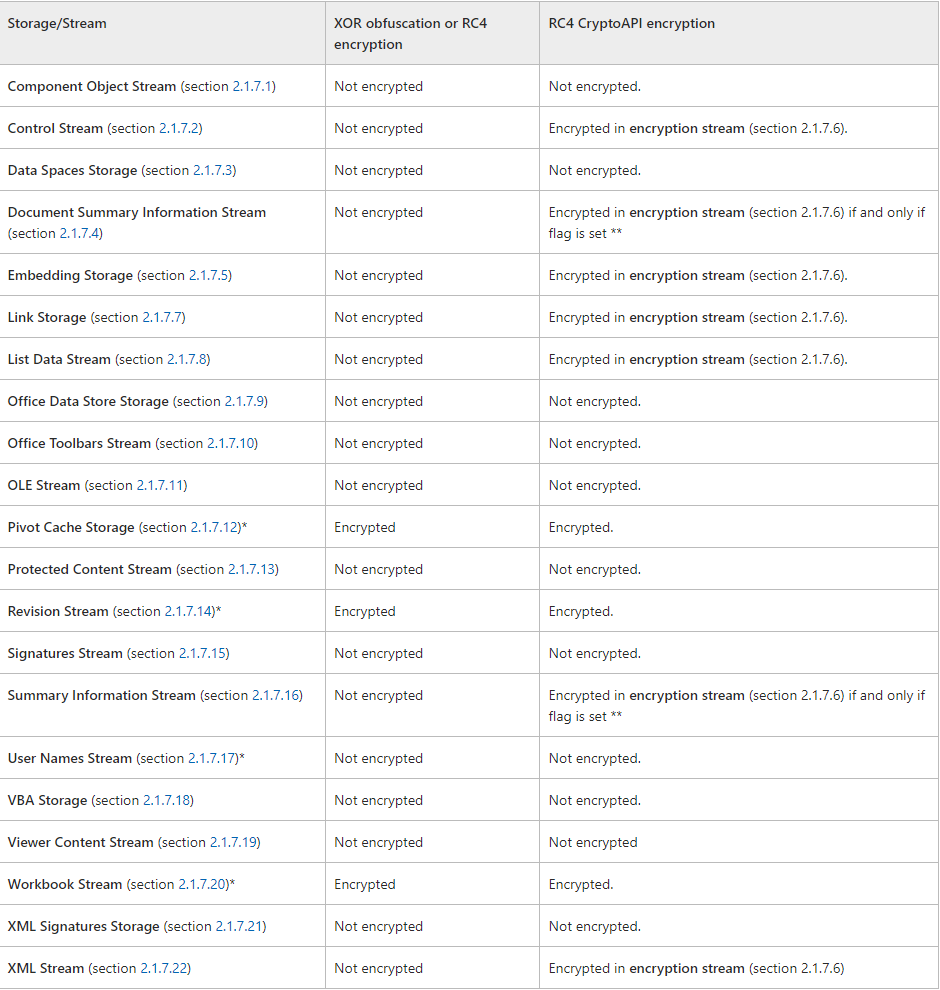

# MS-OFFCRYPTO
MS-OFFCRYPTO 只对 windows office 生效，所以有一些常见的规则约定：
+ ole 中用于指定 storages 和 streams 位置的路径使用 backslash(\) 作为分隔符
+ 以 backslash(\) 开始的路径是指 ole compound file 的 root storage 
+ Byte Ordering 默认是 little-endian

## 一、Data Spaces
data spaces 结构描述了一种存储经过某种方式转换(transformed)后的 OLE 复合文件的一致性方法。所以，该结构需要存储受保护的内容(protected content)和应用于内容的转换信息(information about the transforms)。例如，下文的 IRMDS 和 Encryption 等都是基于 data spaces 结构进行的。

data spaces 结构允许客户端应用程序描述一个或多个任意转换。每个变换表示要对原始文档内容中的一组 storages 或 streams 执行的单个任意操作。一个或多个转换可以被组合到一个 data space 的定义中，然后这个定义可以被应用到存在于 data space map 中的原始文档的任意 storages 或 streams 中。

### Information Rights Management Data Space(IRMDS)
IRMDS 主要应用于强化文档的权限管理策略。当对使用了权限管理策略的文档进行**读、写、创建**操作时，需要使用到 IRMDS structure。

IRMDS 可以被应用于以下两种类型的文档:
- Office binary documents
- ECMA-376 documents

*ECMA, European Computer Manufacturers Association；*
*ECMA376 协议代指 Office Open XML 格式*

具体的差别如下：
#### "\0x06DataSpaces\DataSpaceMap" Stream
1. Office binary document
- 至少有一个 DataSpaceMapEntry 结构
- 必须有一个 DataSpaceMapEntry 结构的 DataSpaceName 字段为 "\009DRMDataSpace"
  + 此结构中，有且只有一个 ReferenceComponents 结构，表示一个名为 "\009DRMContent" 的 stream
- 第二种 DataSpaceMapEntry 结构的 DataSpaceName 字段必须为 "\009LZXDRMDataSpace"
  + 此结构中，有且只有一个 ReferenceComponents 结构，表示一个名为 "\009DRMViewerContent" 的 stream
2. ECMA-376 document
- 有且只有一个 DataSpaceMapEntry 结构，这个结构的 DataSpaceName 字段为 "DRMEncryptedDataSpace"
  + 此结构中，有且只有一个 ReferenceComponents 结构，表示一个名为 "EncryptedPackage" 的 stream

#### "\0x06DataSpaces\DataSpaceInfo" Storage
1. Office binary document
- 必须包含一个名为 "\009DRMDataSpace" 的 stream
  + 流中必须包含一个 DataSpaceDefinition 结构，此结构有且仅有一个名为 "\009DRMTransform" 的 TransformReferences
- 可能会包含一个名为 "\009LZXDRMDataSpace" 的 stream
  + 流中必须包含一个这样的 DataSpaceDefinition 结构：有且仅有两个 TransformReferences 条目，"\009DRMTransform" 和 "\009LZXTransform"
2. ECMA-376 document
- 必须包含一个名为 "DRMEncryptedDataSpace" 的 stream
  + 流中必须含有一个 DataSpaceDefinition 结构，此结构有且仅有一个名为 "DRMEncryptedTransform" 的 TransformReferences 条目

#### "\0x06DataSpaces\TransformInfo" Storage
1. Office binary document
- 必须包含一个名为 "\009DRMTransform" 的 storage，其下必须包含一个名为 "\006Primary" 的 stream (完整路径为："0x09DRMTransform\0x06Primary")。
  + 此 stream 必定包含 IRMDSTransformInfo 结构，其内容如下：
    - TransformInfoHeader.TransformType MUST be 0x00000001
    - TransformInfoHeader.TransformID MUST be "{C73DFACD-061F-43B0-8B64-0C620D2A8B50}"
    - TransformInfoHeader.TransformName MUST be "Microsoft.Metadata.DRMTransform"
  + "\009DRMTransform" storage 同时必须包含一个或多个 end-user license streams
- 可能包含一个名为 "\009LZXTransform" 的 storage。如果此 storage 存在，则其下必须存在一个名为 "\006Primary" 的 stream
  + 此 stream 必定包含 TransformInfoHeader 结构，其内容如下：
    - TransformType MUST be 0x00000001
    - TransformID MUST be "{86DE7F2B-DDCE-486d-B016-405BBE82B8BC}"
    - TransformName MUST be "Microsoft.Metadata.CompressionTransform"
2. ECMA-376 document
- 必须包含一个名为 "DRMEncryptedTransform" 的 storage，此 storage 下必须包含一个名为 "\006Primary" 的 stream
  + 此 stream 必定包含 IRMDSTransformInfo 结构，其内容如下：
    - TransformInfoHeader.TransformType MUST be 0x00000001
    - TransformInfoHeader.TransformID MUST be ""{C73DFACD-061F-43B0-8B64-0C620D2A8B50}"
    - TransformInfoHeader.TransformName MUST be "Microsoft.Metadata.DRMTransform"
  + "DRMEncryptedTransform" storage 同时必须包含一个或多个 end-user license streams

上文中涉及到的 End-User License Stream，其中包含了缓存的 licenses 信息。这些 end-user license stream 的命名必须以 "EUL-" 为前缀，为：``` "EUL-" + "一个 base-32-encoded 的GUID" ```。

### Encryption and Obfuscation
应用于 ms-office 的加密和混淆的共有四种不同的技术：
1. XOR Obfuscation
- 对象：[MS-XLS] and [MS-DOC]
- 方法：对 Office Binary Document 的部分(storage 或 stream)执行就地混淆
- 细节：包含两种方法：Method 1 和 Method 2
  + Method 1 应用于 Excel Binary File Format (.xls) 的 structures 和 procedures
    - *文档中用于加解密的 XorArrayIndex 字段没找到来源~~~*
  + Method 2 应用于 Word Binary File Format (.doc) 的 structures 和 procedures

2. 40-bit RC4 Encryption
- 对象：[MS-XLS] and [MS-DOC]
- 方法：对 Office Binary Document 的部分(storage 或 stream)执行就地加密
- 细节：
  + 算法中的 hash 函数为 MD5
  + 除非特殊说明，否则，最大密码长度为：255 Unicode characters

3. RC4 CryptoAPI Encryption
- 对象：[MS-XLS], [MS-DOC], and [MS-PPT]
- 方法：可能会有一个 Encrypted Summary Stream 被创建，也能对其他 stream 执行就地加密
- 细节：
  + 除非特殊说明，否则，最大密码长度为：255 Unicode characters
  + SHA-1 hash 是 160 bits, 而 RC4 的 key 最大长度是 128 bits; 因此, key 必定少于或等于 128 bits。
    - 如果 key 只有 40 bits，说明这是一个非常老的版本，此时加密算法必须创建一个由 Hfinal 的前 40 bits 和 88 bits 的 0 拼接而成的 128-bit 的 key

4. ECMA-376 Document Encryption
- 对象：[ECMA-376]
- 方法：利用 data spaces 功能将 [ECMA-376] 文档加密成了 ole 中的一个 stream
- 细节：一共有三种方法，
  + Standard encryption:
    - 利用二进制(binary)类型的 EncryptionInfo 结构存储加密信息，使用 AES 作为加密算法，SHA-1 作为散列(hash)算法
  + Agile encryption: 
    - 利用 XML 存放加密信息。加密和散列算法在结构中指定，可以使用主机支持的任何加密算法。还支持数据完整性校验。
  + Extensible encryption: 
    - 此方法使用可扩展的机制来允许使用任意的第三方加密扩展模块

*注：ECMA-376 和 RC4 CryptoAPI 加密算法都使用到了 EncryptionHeader 结构*

#### ECMA-376 Document Encryption
1. "\0x06DataSpaces\DataSpaceMap" Stream
- 必须包含一个 DataSpaceMap 结构，其中有且只有一个 DataSpaceMapEntry 结构
  + 此结构的 DataSpaceName 字段为 "StrongEncryptionDataSpace"
  + 此结构中，有且只有一个 ReferenceComponents 结构，表示一个名为 "EncryptedPackage" 的 stream

2. "\0x06DataSpaces\TransformInfo" Storage
- 必须包含一个名为 "StrongEncryptionTransform" 的 storage，其下必须包含一个名为 "\006Primary" 的 stream
  + 这个流必须包含一个 IRMDSTransformInfo 结构，其内容如下：
    - TransformInfoHeader.TransformType MUST be 0x00000001
    - TransformInfoHeader.TransformID MUST be "{FF9A3F03-56EF-4613-BDD5-5A41C1D07246}"
    - TransformInfoHeader.TransformName MUST be "Microsoft.Container.EncryptionTransform".
  + 紧跟着 IRMDSTransformInfo 的是一个 EncryptionTransformInfo 结构
    - 如果 EncryptionInfo 和 EncryptionTransformInfo 中的算法不一致时，认为 EncryptionInfo 中的更加权威。
    - 如果使用 agile encryption 时，EncryptionTransformInfo 的 EncryptionName 字段必须为空字符串(0x00000000)

3. "\EncryptedPackage" Stream
- 是一个加密的 stream，它包含了完整的(压缩后的) ECMA376 原文件
  + 由 StreamSize(8 bytes) + EncryptedData(variable) 组成
  + StreamSize 指明 EncryptedData 的字节数。另外，StreamSize 的大小实际上可能会与流的大小有出入，这依赖于所用加密算法的 block size

4. "\EncryptionInfo" Stream 
- Standard Encryption
  + 包含用于初始化用于加密 "\EncryptedPackage" 流的密码学详细信息
- Agile Encryption
  + 包含用于初始化用于加密 "\EncryptedPackage" 流的密码学详细信息
- Extensible Encryption
  + ECMA-376 文档可以选择使用用户提供的自定义（可扩展）加密模块。当使用可扩展加密时，\EncryptionInfo 流的结构描述不同于标准模式，详细可以参考文档[MS-OFFCRYPTO]

#### Office Binary Document Encryption
XOR、RC4 以及 RC4 CryptoAPI 都可以应用于 Office Binary Document 文件。

详细信息见本文档关于 [xls]、[doc]、 [ppt] 的描述。

### Write Protection

#### ECMA-376 Document Write Protection
ECMA-376 文档的 write protection 在 [ECMA-376] 文档的 Part 4 中的 Sections 2.15.1.28, 2.15.1.94, 3.2.12, 和 4.3.1.17 中有详细描述。

#### Binary Document Write Protection
二进制类型 office 文档的基于 password 的 Write Protection 根据文件格式的不同具有不同的细节, 大致如下：
- .xls
  + 密码被转换成了一个 16-bit 的 password verifier, 并将其依 [MS-XLS] 文档进行存储, 同时，文档会被加密。如果用户未提供加密密码，会使用一个固定密码。
  + 使用 Write Protection 的同时，依然可以按照 Encryption 的描述进行加密
  + 详细内容参考 [MS-XLS] section 2.2.9
- .doc
  + 密码以明文形式存储，并且文档内容未被加密。
  + 详细内容参考 [MS-DOC] section 2.9.276
- .ppt
  + 密码以明文形式存储，并且文档可以被加密。如果文档被加密，但用户未提供加密密码时，会使用一个固定密码。
    - 默认密码一定是：``` \x2f\x30\x31\x48\x61\x6e\x6e\x65\x73\x20\x52\x75\x65\x73\x63\x68\x65\x72\x2f\x30\x31```
  + 使用 Write Protection 的同时，不应该(SHOULD NOT)再按照 Encryption 中描述的算法进行加密
  + 详细内容参考 [MS-PPT] section 2.4.7

另外还有 ISO Write Protection Method， 其旨在与 ISO/IEC 29500 兼容

### Digital Signatures 

#### ECMA-376 Document Digital Signatures
用于 ECMA-376 documents 的 xmldsig 数字签名 和 用于 Office binary documents 的 xmldsig 数字签名非常相似。详细内容参考 [ECMA-376] Part 2 Section 12.2.4。

#### Binary Document Digital Signatures 
二进制类型 office 文档可以使用下述方法中的任意一种进行签名：
1. CryptoAPI digital signature
   + 以二进制形式存储在 _signatures storage 中
   + 详细内容参考 [MS-OFFCRYPTO] Section 2.5.1
2.  xmldsig digital signature
   + 以 XML-Signature 语法和处理方式(详见[XMLDSig])存储在 _xmlsignatures storage 中
   + 详细内容参考 [MS-OFFCRYPTO] Section 2.5.2

## 二、XLS
这里主要关注 Encryption。

### 2.1 Password Verifier Algorithm
一些 records (Password, FileSharing, Prot4RevPass, FeatProtection, 和 FilePass) 会利用 password verifier 来锁定或解锁对 workbook 部分内容的查看或编辑。这个 password verifier 的设计主要是为了防止意外编辑，而不是安全特性。

**It is possible to remove the passwords by removing the records containing the verifier values.**

这个 verifier 的值由两个阶段计算:
- 将 Unicode 的 password 转换为当前系统的 ANSI 字符编码
  + 任何不能被转换为 ANSI 字符编码的 Unicode 字符用 0x3F 替换。
  + 这个替换动作在验证 hash 时将生成正数哈希值匹配。在某些语言环境中，这些字符可能是日常字符集的重要组成部分。
- 使用 [MS-OFFCRYPTO] 中指定的 XOR obfuscation 算法(Binary Document Password Verifier Derivation Method 1)计算出16-bit 的 password verifier 值

#### Password record
Password record 为 sheet or workbook 指定了 password verifier。如果 record 结构中的 wPassword 值为 0，则表示没有密码。

如果此 record 存在于 Globals Substream, 那么它是整个 workbook 的密码. 如果此 record 存在于 worksheet substream, chart sheet substream, macro sheet substream, or dialog sheet substream, 那么它仅仅适用于那个 sheet。

此外，workbook 中必定存在此 record，而 sheet 则当且仅当有密码时才存在此 record。

### 2.2 Encryption (Password to Open)
其 obfuscation or encryption 信息存放于 workbook 流的 FilePass Record 中。

如果使用的是 RC4 CryptoAPI 加密方式的话，某些 storages 和 streams 被存储在 Encryption Stream(详见 [MS-OFFCRYPTO] section 2.3.5.3)。这些 storages 和 streams 是否被加密等信息见下表([reference](https://docs.microsoft.com/en-us/openspecs/office_file_formats/ms-xls/0f2ea0a1-9fc8-468d-97aa-9d333b72d106))：
- 

其中带 (*) 标记的，表示这个 stream 或者 storage 中有 stream 包含 BIFF records 结构。当混淆或加密这些流中的 BIFF 记录时，有以下内容需要注意：
- record type 和 record size 一定不得混淆或加密。
- 以下这些 record 一定不能被混淆或加密：
  + BOF、FilePass、UsrExcl、FileLock、InterfaceHdr、RRDInfo 和 RRDHead
- BoundSheet8 record 的 lbPlyPos 字段一定不能被加密或混淆

*注意：上图可以看出，不止 Workbook Stream 可以包含 BIFF，User Names Stream、Revision Stream 也可以*

其中带 (**) 标记的，表示这个流当且仅当 EncryptionHeader.flags 的 0x08 bit 为 0 时，必须按照指定方式加密。(EncryptionHeader 见 [MS-OFFCRYPTO] section 2.3.5.1)。

在使用 RC4、RC4 CAPI 算法加密时，需要以 1024-byte 的块来进行。从每个 BIFF record stream 的第一个字节开始，block number 置为 0，后续每 1024-byte 增加 1。

## 三、DOC
### Encryption and Obfuscation (Password to Open)
二进制格式的 word 文件可以通过以下三种方式进行密码保护：XOR obfuscation、 RC4 encryption 以及  RC4 CryptoAPI encryption。

当 FibBase.fEncrypted 和 FibBase.fObfuscated 都为 1 时, 文件被使用 XOR obfuscation 方式进行了混淆。

当 FibBase.fEncrypted 和 FibBase.fObfuscated 都为 0 时, 文件被使用 XOR obfuscation 或 RC4 encryption 方式进行了加密。此时 EncryptionHeader 结构被存放在 Table stream 的头部 FibBase.lKey 个字节中。而具体使用哪种加密方式，则由 EncryptionHeader.EncryptionVersionInfo 结构决定。

其中，Table stream 可以是 1Table stream 或 the 0Table stream, 具体是由 Fib.base.fWhichTblStm 字段决定：值为 1 时，应为 1Table stream；值为 0 时，应为 0Table stream。

#### XOR Obfuscation
文档的 WordDocument stream、Table stream 以及 Data stream 必须使用 [MS-OFFCRYPTO] 中的 XOR Data Transformation Method 2 进行混淆，所有其他的 streams 和 storages 必须不能(MUST NOT)被混淆。

根据 [[MS-DOC] 2.2.6.1 XOR Obfuscation] 的说明，对 WordDocument stream 转换必须从流的第一个字节开始进行，但最初的 68 bytes 必须用原始的未转换的值。

#### Office Binary Document RC4 Encryption
Table stream 的头部 FibBase.lKey 个字节中以未加密未混淆的方式存储了 EncryptionHeader 结构。Table stream 的剩余部分, WordDocument stream 的超出最初的 68 bytes 的部分, 以及 Data stream 的全部，必须被加密。所有其他的 streams 和 storages 必须不能(MUST NOT)被加密。

被加密的三个流的数据必须(MUST)以 512-byte 的 blocks 的形式被加密。在流的起始位置，block number 必须被设置为 0，必须在每个 512-byte 边界处递增。注意，加密算法必须在流的第一个字节开始被执行，尽管一些字节是以未加密的形式被写入文件的。

#### Office Binary Document RC4 CryptoAPI Encryption
Table stream 的头部 FibBase.lKey 个字节中以未加密未混淆的方式存储了 EncryptionHeader 结构。Table stream 的剩余部分, WordDocument stream 的超出最初的 68 bytes 的部分, 以及 Data stream 的全部，必须被加密。

被加密的三个流的数据必须(MUST)以 512-byte 的 blocks 的形式被加密。在流的起始位置，block number 必须被设置为 0，必须在每个 512-byte 边界处递增。注意，加密算法必须在流的第一个字节开始被执行，尽管一些字节是以未加密的形式被写入文件的。

ObjectPool storage 必定不会出现。如果文件包含有 OLE objects 的话，用于 OLE objects 的 storage objects 必定(像 sprmCPicLocation 描述的那样)被存储在 Data stream 中。

> 注：
>
> ObjectPool storage: 包含多个用于 embedded OLE objects 的 storages，storages 中的每一个都一定包含一个名为 "\003ObjInfo" 的流，其中有一个用于描述 embedded OLE objects 的 ODT 结构
>
> OLE object: 支持 Object Linking and Embedding (OLE) 协议的对象

如果 EncryptionHeader.Flags 中的 fDocProps 被置位，那么 Encryption Stream 必定存在，Summary Information stream 必定不存在，一个被用作占位符的 Document Summary Information stream 必定存在。这些信息在 [[MS-OFFCRYPTO] section 2.3.5.4] 中有详细描述。

关于 Encryption Stream (名为 encryption 的 stream) 可以进一步描述：*当以下两个条件满足时，它必定存在，反之，当以下两个条件不能同时满足时，这个 stream 必定不会(MUST NOT)出现*：
1. 文档被使用 Office Binary Document RC4 CryptoAPI Encryption 方法加密
2. EncryptionHeader.Flags 中的 fDocProps 被置位

如果 EncryptionHeader.Flags 中的 fDocProps 没被置位，那么 Document Summary Information stream 和 Summary Information stream 必定没有被加密。

所有其他的 streams 和 storages 必须不能(MUST NOT)被加密。

## 四、PPTß
只支持 RC4 CryptoAPI 加密方式。

### Encryption
ppt 文档中可能有一个名字为 "EncryptedSummary" 的可选流，它只在被加密的文档中存在。当这个流存在时，也必定存在一个名为 "\0x05DocumentSummaryInformation" 的流，而名为 "\0x05SummaryInformation" 则必定不能存在。

关于 "EncryptedSummary" 这个 Encrypted Summary Stream 的详细描述见 [MS-OFFCRYPTO] section 2.3.5.4ß。

## Reference
- [[MS-Office File Formats]](https://docs.microsoft.com/en-us/openspecs/office_file_formats/ms-offfflp/8aea05e3-8c1e-4a9a-9614-31f71e679456)
- [[MS-XLS] - v20210817](https://docs.microsoft.com/en-us/openspecs/office_file_formats/ms-xls/cd03cb5f-ca02-4934-a391-bb674cb8aa06)
- [[MS-OFFCRYPTO] - v20210817](https://docs.microsoft.com/en-us/openspecs/office_file_formats/ms-offcrypto/3c34d72a-1a61-4b52-a893-196f9157f083)
