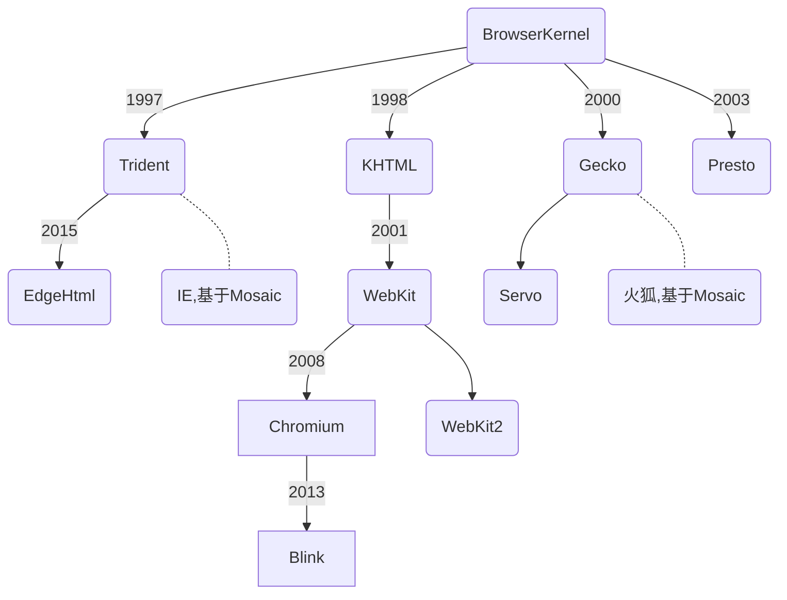

# 浏览器(Browser)

## 
浏览器 | 内核 | js引擎
--- | --- | ---
IE -> Edge | trident->EdgeHTML | JScript（IE3.0-IE8.0） / Chakra（IE9+之后，查克拉，微软也看火影么..）
Chrome | webkit->blink | V8
Safari | webkit | Nitro（4-）
Firefox | Gecko | SpiderMonkey（1.0-3.0）/ TraceMonkey（3.5-3.6）/ JaegerMonkey（4.0-）
Opera | Presto->blink | Linear A（4.0-6.1）/ Linear B（7.0-9.2）/ Futhark（9.5-10.2）/ Carakan（10.5-）

SpiderMonkey是第一款JS引擎，JavaScript之父Brendan Eich在网景的时候写的

浏览器

内核
首先得搞懂浏览器内核究竟指的是什么。

浏览器内核英文叫做：Rendering Engine，中文翻译很多，排版引擎、解释引擎、渲染引擎，现在流行称为浏览器内核，至于为什么流行这么称呼，请自行领悟。内核可以分成两部分：渲染引擎（layout engineer）或（Rendering Engine）和 JS 引擎。

内核负责取得网页的内容（HTML、XML、图像等等）、整理讯息（例如加入 CSS 等），以及计算网页的显示方式，然后会输出至显示器或打印机。

浏览器的内核的不同对于网页的语法解释会有不同，所以渲染的效果也不相同。

JS 引擎则是解析 Javascript 语言，执行 javascript 语言来实现网页的动态效果。

最开始渲染引擎和 JS 引擎并没有区分的很明确，后来 JS 引擎越来越独立，内核就倾向于单指渲染引擎。有一个网页标准计划小组制作了一个 ACID 来测试引擎的兼容性和性能。内核的种类很多，如加上没什么人使用的非商业的免费内核，可能会有 10 多种，但是常见的浏览器内核可以分这四种：Gecko、Trident、Webkit、Blink。

## Reference
- [Chromium Embedded Framework (CEF) - github](https://github.com/chromiumembedded/cef)