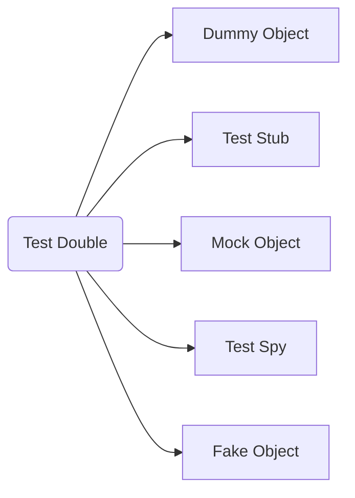

# Programming Tests
编写代码时, 应该：
1. 先, 由外而内 定义接口
2. 再, 由内而外 定义测试案例

## Test Double
这个比喻很形象："没有完备的单元测试的代码所构成的⼀个系统, 就像组装⼀架飞机, 各个配件没有分别经过严格检验, 只在最后组装好后, 再通过试飞来检验飞机是否正常⼀样"。



Name | Usage | Note
--- | --- | ---
Dummy Objects | 泛指在测试中必须传入的对象, 不对测试产出任何作用, 仅仅是为了能够调用被测对象而必须传入的对象 |
Test Stub | 接受SUT(System Under Test)内部的间接输入(indirect inputs), 并(根据测试需要)返回特定值给SUT | 1. Test Stub 的交互完全在 SUT 内部<br>2. 不返回内容给测试案例<br>3. 不对 SUT 内部的输入进行验证
Fake Object | 接受SUT内部的间接输入(indirect inputs), 并返回(事实上的)逻辑输出给SUT<br>主要用于, 当实际对象过分依赖外部环境时, 使用 Fake Object 来减少这些依赖: 如 <br>&ensp;&ensp;1. 实际对象执行需要太长时间<br>&ensp;&ensp;2. 实际对象在执行时结果不稳定。如, 网络发送数据包, 不能保证每次都成功。 | 1. Test Stub 的交互完全在 SUT 内部<br>2. 不返回内容给测试案例<br>3. 不对 SUT 内部的输入进行验证<br>4. 用来替代一个实际对象, 拥有和实际对象几乎一样的功能
Test Spy | 安插在 SUT 内部, 获取到 SUT 内部的间接输出(indirect outputs), 并将其传到外部 | Test Spy 负责获取内部的间接输出, 并返回给测试案例, 由测试案例进行验证
Mock Object | 安插在 SUT 内部, 获取到 SUT 内部的间接输出(indirect outputs), 并对其进行验证 | 外部的测试案例应当信任 Mock Object 的验证结果 

**注意**：在实际使用时, 不建议过分在意使用的是哪种 Test Double。不过在实际工作中仔细思考这些分类, 来总结提炼更好的测试框架

## 怎么写单元测试
Name | Desc | Note
--- | --- | ---
广义的单元测试 | 1. code review<br>2. 静态代码扫描<br>3. 单元测试用例编写 | 一般是指这三部分的有机组合
对象 | "单元", 基于意图的测试单位, 从一个单一的方法到一整个的类都可以是一个单元 | 针对不同粒度的测试，层次越高，测试用例应该越少
耗时 | 可以肯定的说，单测会增加开发量，但，整体交付时间和缺陷数都会减少
名称 | 测试 case 名，要明确表明测试意图，如：```Test_[func_name]_[condition]_[result]```, case 失败后，通过名字就知道哪个场景失败了
结构 | 单元测试⼀般是一个经典的三步结构：准备(环境, 如, 数据、Stub、Mock...), 调⽤, 断⾔(结果是否符合预期)
简单 | Verify One Condition per Test
独立 | 单元测试的 case 之间互不干扰
稳定 | 单元测试的 case 要结果稳定(可重入)、时间不能太长、不能对测试环境造成破坏
完备 | 好的单元测试, 用例完备且不重复
简单 | 尽量避免引⼊条件判断、循环等复杂逻辑, 极力避免因单元测试自身的bug而需要写单元测试的单元测试
测试点 | 单元测试针对的是所有单元的对外接⼝、对外⾏为(即public), ⽽不是关注于⼀些内部逻辑
测试对象 | 要保证单元测试的外部环境尽量和实际使⽤时是⼀致的, 尽量不要给单元测试开任何的后门(Mock除外)<br>也不要去测试⼀个被修改了的单元, 如, 为了测试⽅便, 继承了⼀个被测试类, 然后修改它的某些⾏为⽅便测试。


时刻牢记：1. 不要滥用mock 

### 测试案例编写
测试案例的编写，一般会将测试对象作为黑盒，只考虑其输出输出，而不关注其中间是怎样实现的。这可以测试主体功能和边界条件。同时，也要基于实现方式，组合分支条件、边界等核心方面，设计测试用例。这可以做到测试的覆盖度、边界条件等。

### 单测推广
一般单测推广过程可以分为4个阶段，分别为：
1. 会写，全员可写
2. 写的好，同时关注可测性问题，试点解决
3. 识别可测性问题，熟练使用重构方法进行重构；识别代码架构设计问题；case与业务代码同步编写
4. TDD。但这个目标是期望，不能作为必须实现的目标。


# Reference
- 《测试驱动开发》
- 《单元测试的艺术》
- 《有效的单元测试》
- 《重构, 改善既有代码的设计》
- 《修改代码的艺术》
- 《测试驱动开发的三项修炼》
- mock七宗罪
- [xUnit Test Patterns](http://xunitpatterns.com/index.html)
- [从头到脚说单测——谈有效的单元测试](https://cloud.tencent.com/developer/article/1490961)
