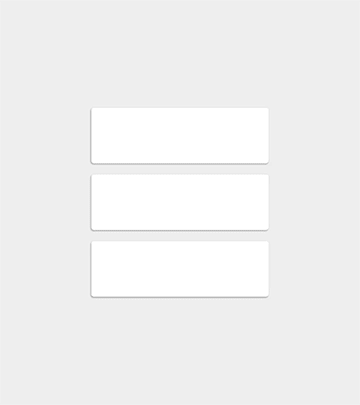
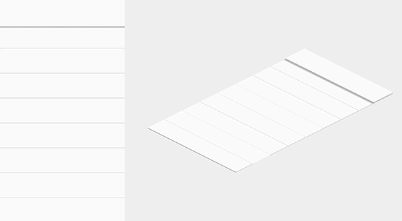

# UI 杂项

## Collection

Category | Link
--- | ---
配色 | [coolors](https://coolors.co)
配色 | [colorhunt](https://colorhunt.co)

## Android
### 屏幕

标识 | 尺寸 | DPI | 启动图标(DPI) | 菜单图标(DPI)
--- | --- | --- | --- | --- |
mdpi | 360 * 540 | 160 | 48 * 48 | 24 * 24 
xhdpi | 720 * 1280 | 320 | 96 * 96 | 48 * 48
xxhdpi | 1080 * 1920 | 480 | 144 * 144 | 72 * 72

### 颜色
在 Android 中 0x00 表示完全透明，0xFF 表示完全不透明，比较适中的透明度是 0x1E

### Material Design
[Material Design](https://www.google.com/design/spec/material-design/)，质感设计，由 Google 推出的设计语言，旨在为手机、平板、电脑等平台提供一致、更广泛的『外观和感觉』。

Material Design 的核心思想，就是把物理世界的体验带进屏幕。去掉现实中的杂质和随机性，保留其最原始纯净的形态、空间关系、变化与过渡，配合虚拟世界的灵活特性，还原最贴近真实的体验，达到简洁与直观的效果。

Material Design 是最重视跨平台体验的一套设计语言。由于规范严格细致，保证它在各个平台使用体验高度一致。

### 空间
Material Design引入了z轴的概念，z轴垂直于屏幕，用来表现元素的层叠关系。z值（海拔高度）越高，元素离界面底层（水平面）越远，投影越重。这里有一个前提，所有的元素的厚度都是1dp。

所有元素都有默认的海拔高度，对它进行操作会抬升它的海拔高度，操作结束后，它应该落回默认海拔高度。同一种元素，同样的操作，抬升的高度是一致的。

注意：这不止是设计中的概念，开发人员确实可以通过一个值来控制元素的海拔高度和投影。

### 动画
Material Design 重视动画效果，它反复强调一点：动画不只是装饰，它有含义，能表达元素、界面之间的关系，具备功能上的作用。

#### easing

动画要贴近真实世界，就要重视 easing。物理世界中的运动和变化都是有加速和减速过程的，忽然开始、忽然停止的匀速动画显得机械而不真实。考虑动画的easing，要先考虑它在现实世界中的运动规律。

#### 水波纹

#### 转场效果

所有可点击的元素，都应该有这样的反馈效果。通过这个动画，将点击的位置与所操作的元素关联起来，体现了 Material Design 动画的功能性。

通过过渡动画，表达界面之间的空间与层级关系，并且跨界面传递信息。从父界面进入子界面，需要抬升子元素的海拔高度，并展开至整个屏幕，反之亦然。

多个相似元素，动画的设计要有先后次序，起到引导视线的作用。

相似元素的运动，要符合统一的规律。

#### 细节动画 
通过图标的变化和一些细节来达到令人愉悦的效果:

### 颜色

    
    

颜色不宜过多。选取一种主色、一种辅助色（非必需），在此基础上进行明度、饱和度变化，构成配色方案。

Appbar 背景使用主色，状态栏背景使用深一级的主色或20%透明度的纯黑。

小面积需要高亮显示的地方使用辅助色。

    
    

其余颜色通过纯黑#000000与纯白#ffffff的透明度变化来展现（包括图标和分隔线），而且透明度限定了几个值。

    
    

颜色 | 普通文字 | 减淡文字 | 禁用状态/提示文字 | 分隔线
--- | --- | --- | --- | --- |
黑色 | 87% | 54% | 26% | 12%
白色 | 100% | 70% | 30% | 12%

### 文字
用途 | 小字提示 | 正文/按钮 | 小标题 | Appbar文字 | 大标题 | 超大号文字
--- | --- | --- | --- | --- | --- | ---
字号 | 12sp | 14sp(桌面端13sp) | 16sp(桌面端15sp) | 20sp | 24sp | 34sp/45sp/56sp/112sp

长篇幅正文，每行建议60字符（英文）左右。短文本，建议每行30字符（英文）左右。

### 布局
所有可操作元素最小点击区域尺寸：48dp X 48dp。

栅格系统的最小单位是8dp，一切距离、尺寸都应该是8dp的整数倍。以下是一些常见的尺寸与距离：
用途 | 距离
--- | :---:
顶部状态栏高度 | 24dp
Appbar最小高度 | 56dp
底部导航栏高度 | 48dp
悬浮按钮 | 56x56dp/40x40dp
用户头像 | 64x64dp/40x40dp
小图标点击区域 | 48x48dp
侧边抽屉到屏幕右边的距离 | 56dp
卡片间距 | 8dp
分隔线上下留白 | 8dp
大多元素的留白距离 | 16dp
屏幕左右对齐基线 | 16dp
文字左侧对齐基线 | 72dp

另外注意56dp这个数字，许多尺寸可变的控件，比如对话框、菜单等，宽度都可以按56的整数倍来设计。

还有非常多规范，不详细列举，遵循8dp栅格很容易找到适合的尺寸与距离。平板与PC上留白更多，距离与尺寸要相应增大。

### 组件（Components）
#### 底部导航（Bottom navigation）

#### 底部动作条（Bottom Sheets）

底部动作条是一个从屏幕底部边缘向上滑出的一个面板，使用这种方式向用户呈现一组功能。底部动作条呈现了简单、清晰、无需额外解释的一组操作。

通常以列表形式出现，支持上下滚动。也可以是网格式的。

    
    

#### 卡片（Cards）

卡片是包含一组特定数据集的纸片，数据集含有各种相关信息，例如，关于单一主题的照片，文本，和链接。卡片通常是通往更详细复杂信息的入口。卡片有固定的宽度和可变的高度。最大高度限制于可适应平台上单一视图的内容，但如果需要它可以临时扩展（例如，显示评论栏）。卡片不会翻转以展示其背后的信息。

在以下情况考虑使用卡片：
- 同时展现多种不同内容
- 卡片内容之间不需要进行比较
- 包含了长度不确定的内容，比如评论
- 包含丰富的内容与操作项，比如赞、滚动条、评论
- 本该是列表，但文字超过3行
- 本该是网格，但需要展现更多文字

卡片最多有两块操作区域。辅助操作区至多包含两个操作项，更多操作需要使用下拉菜单。其余部分都是主操作区。

圆角 | 正文字体 | 标题 | 扁平按钮 | 内容留白 | 卡片间留白 | 屏幕边界与卡片间留白
--- | --- | --- | --- | --- | --- | --- | --- |
2dp | 14/16sp | 24/24+ sp | Roboto Medium, 14sp, 10sp 字间距 | 16dp | 8dp | 8dp

    
    

#### 纸片（Chips）
纸片是一种小块的用来呈现复杂实体的块，比如说日历的事件或联系人。它可以包含一张图片，一个短字符串(必要时可能被截取的字符串)，或者是其它的一些与实体对象有关的简洁的信息。

Chips 可以非常方便的通过托拽来操作。通过按压动作可以触发悬浮卡片(或者是全屏视图)中的 Chip 对应实体的视图，或者是弹出与 Chip 实体相关的操作菜单。

狭小空间内表现复杂信息的一个组件，比如日期、联系人选择器。

#### 提示框（Dialogs）

Dialogs 用于提示用户作一些决定，或者是完成某个任务时需要的一些其它额外的信息。 Dialog 可以是用一种 取消/确定 的简单应答模式，也可以是自定义布局的复杂模式，比如说一些文本设置或者是文本输入 。

一些复杂的操作，尤其是每个决策都需要相关解释说明的情况下是不适合使用 Dialog 形式的。

Dialog 包含了一个标题(可选)，内容 ，事件。
- **标题**：主要是用于简单描述下选择类型。它是可选的，要需要的时候赋值即可。
- **内容**：主要是描述要作出一个什么样的决定 。
- **事件**：主要是允许用户通过确认一个具体操作来继续下一步活动。

#### 分隔线（Dividers）
Dividers 主要用于管理和分隔列表和页面布局内的内容，以便让内容生成更好的视觉效果及空间感。示例中呈现的分隔线是一种弱规则，弱到不会去打扰到用户对内容的关注。

1. 列表中有头像、图片等元素时，使用内嵌分隔线，左端与文字对齐; 没有头像、图标等元素时，需要用通栏分隔线:

2. 图片本身就起到划定区域的作用，所以相册列表不需要分隔线:

3. 谨慎使用分隔线，留白和小标题也能起到分隔作用。能用留白的地方，优先使用留白。分隔线的层级高于留白。

4. 通栏分隔线的层级高于内嵌分隔线

#### 网格（Grids）
网格列表是一种标准列表视图的可选组件。网格列表与应用于布局和其他可视视图中的网格有着明显的区别。

一般来说，网格只能垂直滚动。单个瓦片不支持滑动手势，**也不鼓励使用拖放操作**。网格中的单元格间距是2dp或8dp。

网格由单元格构成，单元格中的瓦片用来承载内容。瓦片可以横跨多个单元格:

瓦片内容包括主要内容（primary content）和次要内容(secondary content)。主要内容是有着重要区别的内容，典型的如图片。次要内容可以是一个动作按钮或者文本。

#### 列表（Lists）
列表作为一个单一的连续元素来以垂直排列的方式显示多行条目。

列表由单一连续的列构成，该列又等分成相同宽度称为行（rows）的子部分。行是瓦片（tiles）的容器。瓦片中存放内容，并且在列表中可以改变高度。

如果列表项内容文字超过3行，请改用卡片。如果列表项的主要区别在于图片，请改用网格。

列表包含主操作区与副操作区。副操作区位于列表右侧，其余都是主操作区。在同一个列表中，主、副操作区的内容与位置要保持一致。

主操作区与副操作区的图标或图形元素是列表控制项，列表的控制项可以是勾选框、开关、拖动排序、展开/收起等操作，也可以包含快捷键提示、二级菜单等提示信息。

在同一个列表中，滑动手势操作保持一致。

#### 菜单（Menus）

注意：菜单到上下留出8dp距离。

#### 进度和动态（Progress & activity）
线形进度条只出现在纸片的边缘:

环形进度条也分时间已知和时间未知两种:

加载详细信息时，也可以使用进度条:

#### Snackbars & toasts

Snackbars至多包含一个操作项，不能包含图标。不能出现一个以上的Snackbars。

Snackbars在移动设备上，出现在底部。在PC上，应该悬浮在屏幕左下角。

不一定要用户响应的提示，可以使用Snackbars。非常重要的提示，必须用户来决定的，应该用对话框。

Snackbars不能遮挡住悬浮按钮，悬浮按钮要上移让出位置。

Snackbars的留白比较大，24dp。

toasts和Snackbars类似，样式和位置可以自定义，建议遵循Snackbars的规则设计。

#### 副标题（Subheaders）

小标题是列表或网格中的特殊瓦片，描述列表内容的分类、排序等信息。

滚动时，如果列表较长，小标题会固定在顶部，直到下一个小标题将它顶上去。

存在浮动按钮时，小标题要让出位置，与文字对齐。

#### Tabs

在一个 app 中，tabs 使在不同的视图和功能间探索和切换以及浏览不同类别的数据集合起来变得简单。

tab文字要显示完整，字号保持一致，不能折行，文字与图标不能混用。

#### 文本字段（Text fields）
文本框可以让用户输入文本。它们可以是单行的，带或不带滚动条，也可以是多行的，并且带有一个图标。点击文本框后显示光标，并自动显示键盘。除了输入，文本框可以进行其他任务操作，如文本选择（剪切，复制，粘贴）以及数据的自动查找功能。

简单一根横线就能代表输入框，可以带图标:

激活状态和错误状态，横线的宽度变为2dp，颜色改变:

输入框点击区域高度至少48dp，但横线并不在点击区域的底部，还有8dp距离。

输入框提示文字，可以在输入内容后，缩小停留在输入框左上角; 整个点击区域增高，提示文字也是点击区域的一部分:

通栏输入框是没有横线的，这种情况下通常有分隔线将输入框隔开:

右下角可以加入字数统计。字数统计不要默认显示，字数接近上限时再显示出来。

通栏输入框也可以有字数统计，单行的字数统计显示在同一行右侧:

错误提示显示在输入框的左下方。默认提示文本可以转换为错误提示:

字数限制与错误提示都会使点击区域增高:

同时有多个输入框错误时，顶部要有一个全局的错误提示:

输入框尽量带有自动补全功能:

#### 工具提示（Tooltips）
提示只用在小图标上，文字不需要提示。鼠标悬停、获得焦点、手指长按都可以触发提示。

触摸提示（左）和鼠标提示（右）的尺寸是不同的，背景都带有90%的透明度:

#### Steppers

#### 导航（Navigation）
Tabs:

Bottom navigation bar 1:

Bottom navigation bar 2:

Navigation drawer:

#### 导航抽屉（Navigation drawer）
侧边抽屉从左侧滑出，占据整个屏幕高度，遵循普通列表的布局规则。手机端的侧边抽屉距离屏幕右侧56dp。

侧边抽屉支持滚动。如果内容过长，设置和帮助反馈可以固定在底部；列表较短不需要滚动时，设置和帮助反馈跟随在列表后面；抽屉收起时，会保留之前的滚动位置:

#### 通知（Notifications）

#### 权限（Permissions）

#### 设置界面（Settings）

设置和帮助反馈通常放在侧边抽屉中。如果没有侧边抽屉，则放在Appbar的下拉菜单底部。设置界面只能包含设置项，诸如关于、反馈之类的界面，入口应该放在其他地方。

## Reference
1. https://www.cnblogs.com/weekbo/p/9018121.html

使用 `style` 属性修改文字的背景色:
红色
绿色
蓝色
颜色值
颜色值
