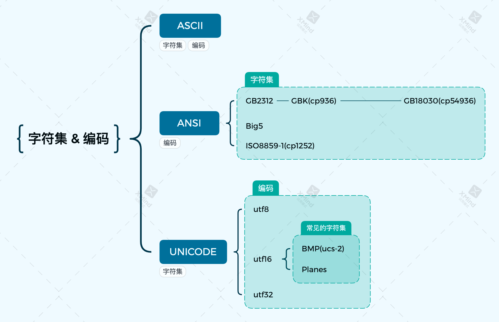
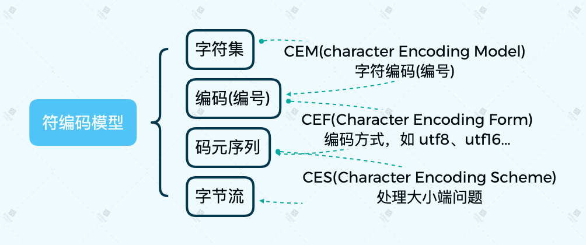

# 字符集 & 编码

## ASCII

## ANSI
注意 code page 的使用。code page 主要用于解决 字节与字符的快速对照，也就是直接将 字节与某种字符集的字符编码之间相互映射。

## Unicode
其中 utf8 和 utf16 都是变长编码，只不过 utf16 可以完整的表达 BMP (基础平面) 中的所有字符，所以一般都认为其固定为 2bytes(这个美丽的错误源自 windows 的 unicode 定义, 它其实是 ucs-2)。

utf16 和 utf32 则因为 byte-order 问题，必定需要在文档开头通过 BOM 头指明字节序。utf8 按照设计原理来看，是没有 byte-order 问题的，不过微软还是给其定义了 BOM 头。

## Coding-Model
统一码(Unicode)和通用字符集(UCS)所描述的编码系统，提出了全新的编码思路，它将字符集与字符编码的概念更为细致地分解为了以下几个方面：
1. 有哪些字符；
2. 这些字符的编号是什么；
3. 这些编号如何编码成一系列逻辑层面有限大小的数字，即码元序列；
4. 这些逻辑层面的码元序列如何转换为(即映射为)物理层面的字节序列(即字节流)；
5. 在某些特殊的传输环境中(比如Email中)，再进一步将字节序列进行适应性编码处理。

这几个方面作为一个整体，构成了现代字符编码模型。现代字符编码模型之所以要分解为这么几个方面，其核心思想是创建一个能够用不同方式来编码的通用字符集。注意这里的关键词：“不同方式”与“通用”。