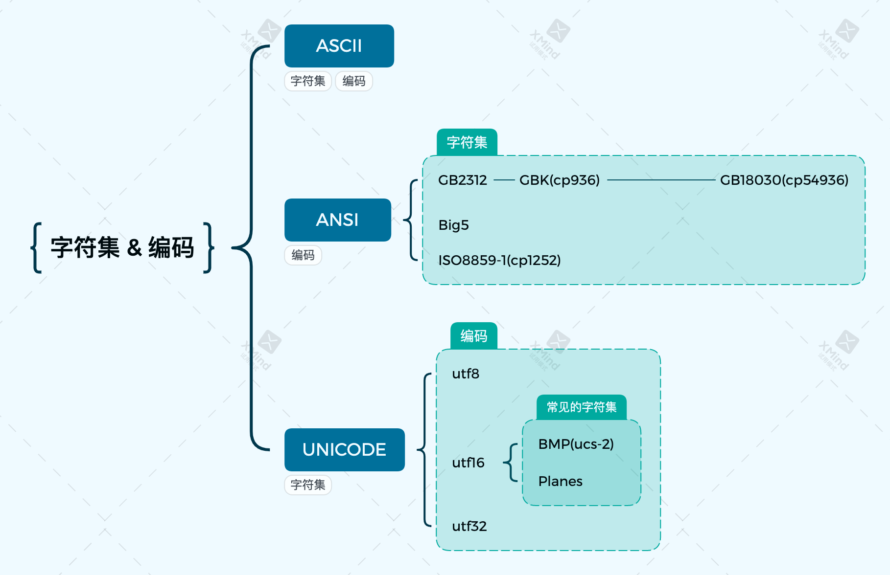
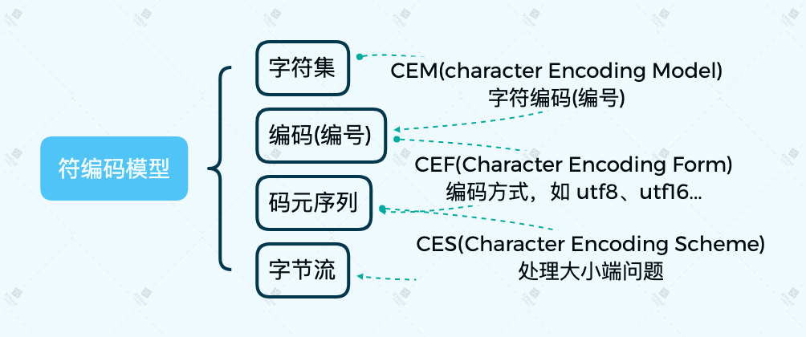
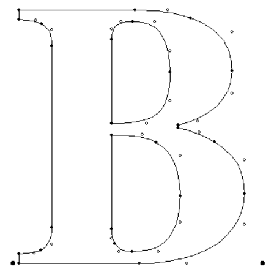
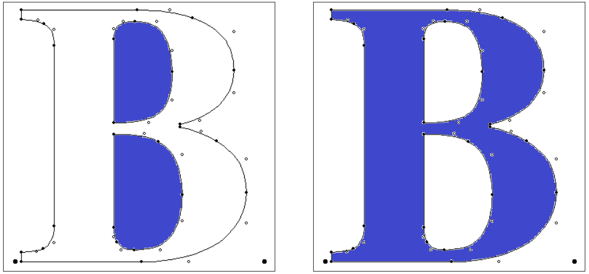
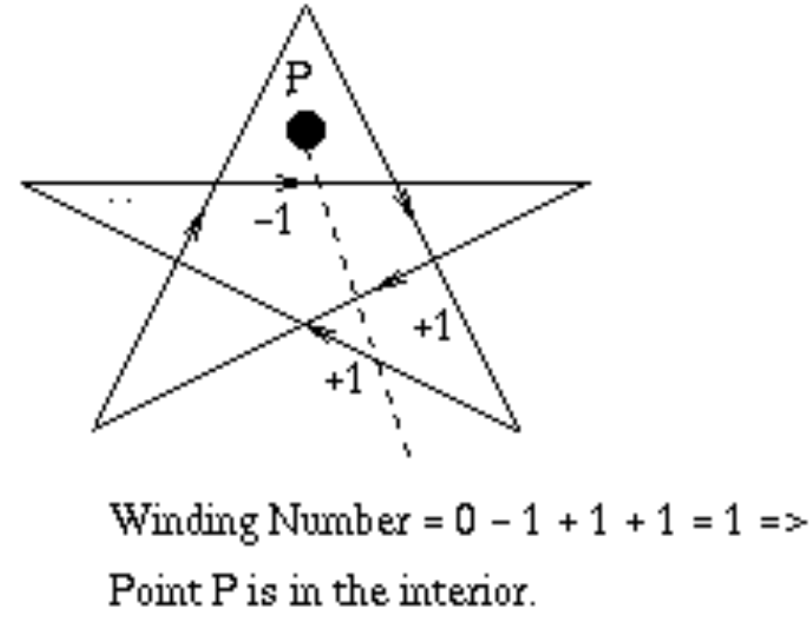
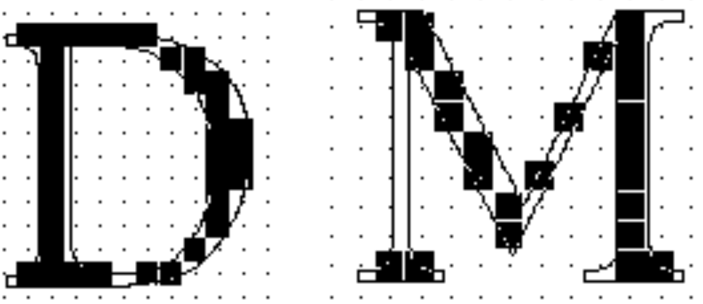

# 字符集 & 编码

## ASCII
ASCII 是 ANSI 的一部分，仅使用 0x00 ~ 0x7F，是目前最普及的一种字符编码，它扎根于我们的互联网，操作系统，键盘，打印机，文件字体和打印机等。

## ANSI
ANSI是一种字符编码方式，为使计算机支持更多语言，通常使用 0x00~0x7f 范围的1 个字节来表示 1 个英文字符。超出此范围的使用0x80~0xFFFF来编码，即扩展的ASCII编码。

注意 code page 的使用。code page 主要用于解决 字节与字符的快速对照，也就是直接将 字节与某种字符集的字符编码 之间相互映射。

其中常见的字符集，如GB2312、GBK、GB18030、Big5、Shift_JIS 等都属于此编码方式。

### 中文 
#### GB2312
GB2312 或 GB2312-80 是中国国家标准简体中文字符集, 由中国国家标准总局发布, 1981 年 5 月 1 日实施。

GB2312 对任意一个图形字符都采用两个字节表示，并对所收汉字进行了"分区"处理，每区含有 94 个汉字/符号，分别对应第一字节和第二字节。这种表示方式也称为区位码: 
- 01-09 区为特殊符号
- 16-55 区为一级汉字，按拼音排序
- 56-87 区为二级汉字，按部首/笔画排序
- 10-15 区及 88-94 区则未有编码

GB 2312 的编码范围为(分别为首字节、尾字节): 0x21H ~ 0x77, 0x21 ~ 0x7EH。这与 ASCII 有重叠，通行方法是将 GB 码两个字节的最高位置 1 以示区别，所以最终的编码范围为: 0xA1 ~ 0xF7, 0xA1 ~ 0xFE。

#### GBK
GBK 即汉字内码扩展规范，K 为汉语拼音 Kuo Zhan（扩展）中"扩"字的声母。英文全称 Chinese Internal Code Specification。

GBK 向下与 GB 2312 完全兼容，向上支持 ISO 10646 国际标准，在前者向后者过渡过程中起到的承上启下的作用。

GBK 采用双字节表示，总体编码范围为(分别为首字节、尾字节): 0x81 ~ 0xFE, 0x40 ~ 0xFE，剔除 XX7F 一条线。

#### GB18030
GB18030 与 GB2312 和 GBK 兼容，共收录汉字70244个。GB18030 编码是一二四字节变长编码:
- 单字节，其值从 0 到 0x7F，与 ASCII 编码兼容
- 双字节，第一个字节的值从 0x81 ~ 0xFE，第二个字节的值从 0x40 ~ 0xFE(不包括0x7F)，与 GBK 标准兼容
- 四字节，第一个字节的值从 0x81 ~ 0xFE，第二个字节的值从 0x30 ~ 0x39，第三个字节从0x81 ~ 0xFE，第四个字节从 0x30 ~ 0x39

## Unicode
其中 utf8 和 utf16 都是变长编码，只不过 utf16 可以完整的表达 BMP (基础平面) 中的所有字符，所以一般都认为其固定为 2bytes(这个美丽的错误源自 windows 的 unicode 定义, 它其实是 ucs-2)。

utf16 和 utf32 则因为 byte-order 问题，必定需要在文档开头通过 BOM 头指明字节序。utf8 按照设计原理来看，是没有 byte-order 问题的，不过微软还是给其定义了 BOM 头。

## Coding-Model
统一码(Unicode)和通用字符集(UCS)所描述的编码系统，提出了全新的编码思路，它将字符集与字符编码的概念更为细致地分解为了以下几个方面：
1. 有哪些字符；
2. 这些字符的编号是什么；
3. 这些编号如何编码成一系列逻辑层面有限大小的数字，即码元序列；
4. 这些逻辑层面的码元序列如何转换为(即映射为)物理层面的字节序列(即字节流)；
5. 在某些特殊的传输环境中(比如Email中)，再进一步将字节序列进行适应性编码处理。

这几个方面作为一个整体，构成了现代字符编码模型。现代字符编码模型之所以要分解为这么几个方面，其核心思想是创建一个能够用不同方式来编码的通用字符集。注意这里的关键词：“不同方式”与“通用”。

---
---
---

# 字体文件
常见的字体文件有：ttf、otf 等。常见的字形方式：bitmap、矢量图。其中，矢量图字形可以转化为 bitmap 字形，如 freetype 字体库可以加载 ttf 字体并生成字符位图（bitmap）。

## 一、TTF
### 1. 简介
ttf，TrueType Font，渲染较快的矢量字实现方案。一般通过轮廓进行描述：

TTF为每个字符保存了一系列的点以及点的连接顺序：
- on-curve（图中的实心点）
- off-curve（图中的空心点）

组成TTF字形的两种线型：
- 线段（on-curve ~ on-curve）
- 二次贝塞尔曲线（on-curve ~ off-curve ~ on-curve）
    + 多段的贝塞尔曲线，可以省略掉两个 off-curve 中间的 on-curve，例如右下角的两个off-curve

### 2. 字形光栅化
矢量字符是通过轮廓进行描述的，自然带来一个问题，如何着色呢？

#### 非0环绕数法则
对每个像素的中心计算**非0环绕数**来判断要不要上色：
- 从点p向外作任意方向的一条射线，多边形的边从左到右经过射线时环数减1，多边形的边从右往左经过射线时环数加1，最后环数不为0，即表示在多边形内部。

这种方法的不足之处在于，当字号较小时带来的走样问题：

## 二、Reference
- [TrueType-Reference-Manual](https://developer.apple.com/fonts/TrueType-Reference-Manual/)