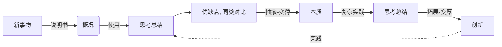
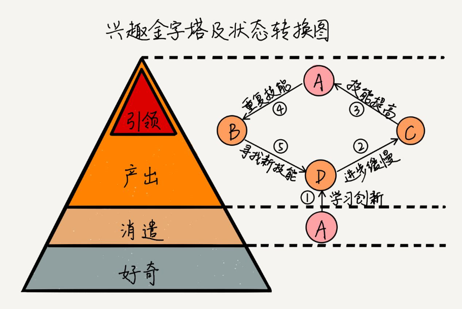

# EVOLVE
> ***道本质 术方法***

## 品牌建设：
- 领域专家以及创新(专利/贡献)
- 个性化展示
    + GitHub、name、logo
- 结果导向(擅长)

## 认知
内容付费靠什么来赚钱？其实就是将知识或是技能通过有偿分享的模式来进行赚钱。

很多人都会觉得：“我不行，我什么都不会，我没有什么擅长的。” 。这是很多人对自己的一个认知误区。

这个***世界是不对称的***。正是因为不对称，所以产生了各种需求，由此产生了各种赚钱的机会。

这种不对称，分为资源不对称，信息不对称，认知不对称:
1. 资源不对称: 你有的，别人没有。
        
    这样，你就可以将你有的，通过售卖或是租用的形式来赚钱。比如，你有一套房或是有一个单反等等，平时闲置着，那么你就可以将其销售或是租给别人使用，将原本闲置的东西换成灵活的钱。

2. 信息不对称: 你知道的，别人不知道。

    比如，几年前，有个人制作了一本电子书，教大家在美国亚马逊网站上传电子书来赚钱。这本电子书也就是40多页，其实就是将在亚马逊网站上传电子书的流程截图说明而已，很多内容都是官网中就有了。他将这本书的售价定位49元，轻松销售几千乃至上万套。他就是利用了信息不对称来赚钱。

3. 认知不对称: 你会的，别人不会。

    比如，你在KTV唱歌挺好听，虽然没有达到歌手的级别，仅仅只是在KTV唱歌好听的行列。但这也没有关系，要知道，有多少人羡慕你呢？有多少人因为在KTV唱歌难听，不敢张嘴唱歌而苦恼呢？你可以将自己如何练习的方法整理出来，可以是文章，也可以录制成视频或是音频。你制作这套课程也许花费了1个礼拜的时间，定价19元。这样，这套课程就能为你持续赚钱，不用再需要反复的重新制作了，更不用再去占用你的时间了。
 
---

## Ⅰ 认识自我

> 想让别人接受的一切都是商品，包括我们自己

> 如果说内功是成功的基石，那么外势就是成功的杠杆

> 持经达变: 变化是常态，唯一不变的就是变化自身

### 内功
+ 体现在：解决问题能力，依赖以下能力：
    - 学习能力
    - 精益能力
    - 协作能力
    - 领导能力

+ 成长的体现: 
    - 技术、视野(包括人脉、认知)

#### 1 自省
- 复盘
    + tips: 自我反思 --- 有始有终，不要虎头蛇尾
        - 始(为什么要做); 终(成果如何，复盘、形成方法论，扩大成果，这一步只占5%但很重要)
- 表达自己 --- STAR 法则：Situation(情境)、Task(任务)、Action(行动, 指方案和做法)、Result(结果, 指效果和意义)
    + tips: 结果先行
- 处理问题 --- 归纳演绎: WHY(为什么)、HOW(怎么做)、WHAT(做成了什么)
    + tips: 5Why分析法

#### 2 做事
***极致(ONE MORE STEP)*** 、 ***Plan B***

- 靠谱：自己表达的每一个观点，都要有支撑(数据、详情等)
- 维度：高维度思考、看待问题
- 思路：分治、迭代

#### 3 学习
- 方法：忆、思、说、写、用
    + 影响因素：有关自身的好奇心、逻辑性、操控力，和有关环境的挑战、榜样和反馈
- 目标：化繁(发散)为简(抽象), 由简入繁; 举一反三, 融会贯通
    + 系统化: 点 -> 面 -> 体
    + 结构化(建立专家体系, 方法论)、系统化, 同时, 重视基础、细节
- 途径
    + 多读书，涨经历: 以形成对未来的预判能力



```
>> 概况：解决什么问题，每个点做到什么程度
>> 实践 - 先主干后枝叶, 由基础到上层建筑
>> 思考 - 由本质到细节, 由框架到全面
>> 拓展 - 规模由小到大时, 量变引发质变
```

#### 4 沟通、协作、领导
```
好胜人，耻闻过，骋辩给，眩聪明，厉威严，恣强愎，此六者，君上之弊也.
                                   - 《资治通鉴· 唐纪四十五·德宗建中四年》
```
- 沟通是必备技能：**口头沟通 <--- (二者的权衡) ---> 文字沟通**

- 方法：
    - 共情(同理心)
        - 利益分享：F.A.B
            + 关注对方的需求, 达成自己的目标
        - 换位思考
    - 空杯心态，多交流，有助于自我进化
        + 控制情绪、自我认知、谦逊(空杯心态 虚怀若谷)
    - 识人
        + ?

#### 5 兴趣

目标：有能力促使兴趣和擅长的发展，并使他们逐渐重合。

### 外势
#### 1 影响力
- 个人输出，带来的影响

--- 

## Ⅱ 经验
- 责任感：主动挖掘, 主动承担
    + 角色转变：规则制定者
- 先说(答案)先死：答案==承担责任
    + ?
- 危机感：日子一天天好一年年变坏：反之亦如此
- 目标感：当你忙的像牲口一样时，你需要停下来想想看为什么了
- 人更习惯选择题，而不是思考题
- 具体的批评有助成长, 抽象的批评有打压意味
- 选人更重要一点，选择后选择相信
- 考验情商：问最喜欢的人，次之，问最讨厌的人（？）

--- 

## Ⅲ 事
### 2.1 道
- 科技发展方向: 自动化 + 智能化
    + 需求 ---> 设计 ---((声明式)数据 + 算法)---> 产品 
- 量化 => 实践 => 反馈 => 迭代
    + "你如果无法度量它，就无法管理它" ("If you can't measure it, you can’t manage it") - 管理学大师-彼得德鲁克

### 2.2 术
> 世界观主要解决世界"是什么"的问题，方法论主要解决"怎么办"的问题

### 2.3 工作
#### 2.3.1 定位
- 想清楚定位：壁垒
- 技术 & 业务
    + 技术支持业务：别把技术太当回事，别不把技术当回事
    + 像CEO一样思考(高维思考)

#### 2.3.2 工作量预估
- 方法
    + 二的幂次方为单位(小时)
    + 乐观 + 悲观 系数结合进行预估
        - 提需求的人会相对乐观，实现需求的人会相对悲观，所以需要融合
    + 80%的工作量，预留20%的临时插入工作
- 因素
    + 人 : 内因(愿景) + 外因

------

## Ⅳ、其他
## 4.1 著名的知识
- 世界不是按领域来划分的，是按照挑战组织的
- 三种推理方式
    - 归纳推理、演绎推理、类比推理
- 黄金圈法则：what(表象) how(方法) why(为什么,本质)
    + What - How - Why : 实现深入细节「1->0.1」
    + Why - How - What : 实现构思创造「0->1」
- 第一性原理
    + 第一性原理又称“第一原理”。古希腊哲学家亚里士多德提出的一个哲学术语："每个系统中存在一个最基本的命题,它不能被违背或删除"
    + 埃隆·马斯克(特斯拉汽车CEO)的应用：回溯事物的本质, 颠覆固化认知, 重新思考怎么做
- mece原则
    + 可以用于构建知识树
- PDCA 循环
    + 其含义是将质量管理分为四个阶段，即计划（plan）、执行（do）、检查（check）、行动（Action）
- 东西方意识差异
    + 西方：上帝 创造 人
    + 东方：人 升级成 神  ：自我中心意识强、要面子
### 4.2 著名的问题
- 零知识证明: 认证理论的一个重要协议
- 拜占庭将军问题
- 两富翁在不互相透露具体财产的情况下，比较谁更富有

------

## V、推荐书单
- 金字塔原理
- 奈飞文化手册
- 高效能人士的七个习惯
- 好好说话
- 原则