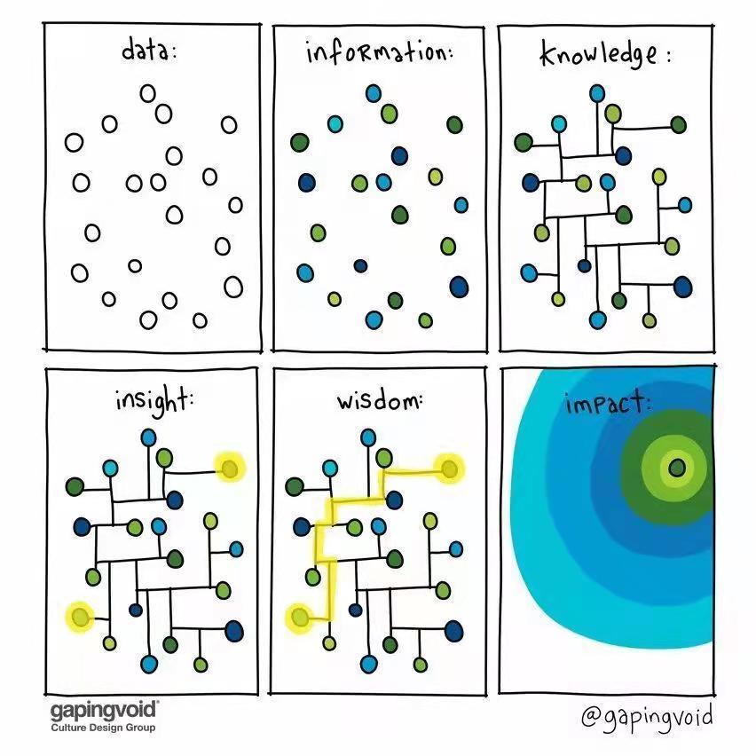
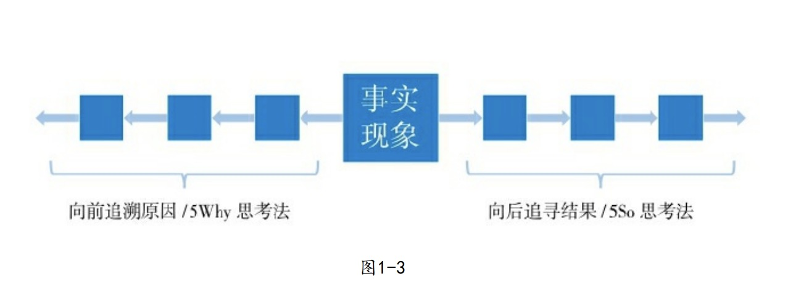
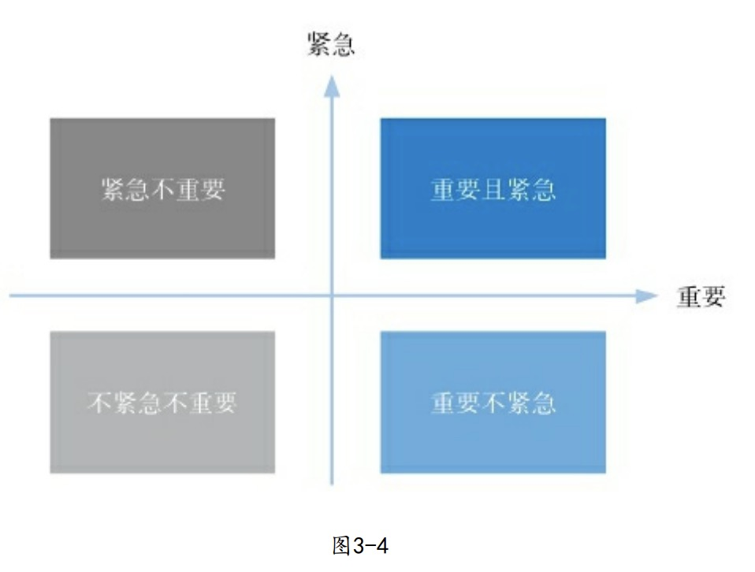
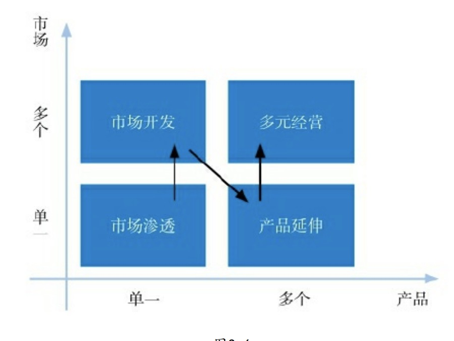

**深度思维**是数据(表象)转化为**认知**的有效工具

# 深度思维
特点：
1. 较长的思维逻辑链
2. 突破自我为中心的局限性，灵活切换看问题的视角
3. 在繁杂的信息流中保持思维能力
4. 以宏观视角分析问题，认知事物所处的生态特性、事物长期趋势等

训练：
1. 深度思维的学习要像知识点一样有**明确的、可操作的内容**，不能仅仅停留在某种理念的基础上。

技术大师：(主要用于处理日常工作的具体事物，就像一个个小工具，能让你高效的解决问题)
1. 思维逻辑链
2. 换位思维
3. 可视化思维
4. 流程思维

思维的格局：(能让你站在更高、更广的视角看待问题，以更深刻更巧妙的方式解决问题)
5. 生态思维
6. 系统思维
7. 大势思维
8. 兵法思维
9. 慢即是快

《深度思维》一书无法概括深度思维的全部(实际上任何人都无法穷尽所有的思维方法)，有很多思维方法并没有被纳入到本书中来。

## 第一章 思维逻辑链

- 5Why
  + 诞生自丰田汽车
- 5So 
  + 《深度思维》作者开发

逻辑链条概率传导

## 第二章 换位思维
如果不懂别人是怎么想的，你的努力或许会白费。你需要建立共同认知、
克服自我中心，才能自如切换视角进行换位思维，将深度思维的功效发挥到极
致。

换位思维，简单的说就是，如果我是他，会怎么想。但，这有个关键条件，得和别人有共同的认知系统。

- 六顶思考帽 (爱德华·德·波诺)
  - 全局分析、客观事实、感性直觉、乐观思考、保守行事、创新思维。

## 第三章 可视化思维
矩阵分析法
- 艾森豪威尔矩阵
    
- 安索夫矩阵
    
- 创造自己的矩阵类思维工具

工作仪表盘
- 为了让这些重要事项能够经常出现在我们的
工作记忆里，我们需要一个外部的提醒——这就是仪表盘的运作方式。

总的来说，可视化思维的核心在于其原理而不是形态，只要懂得原
理就能自行开发工具，并且千变万化。

## 第四章 流程化思维
### 秘籍思维的谬误
伟大的成就不是因为有某种秘籍，而是来源于对流程的掌控和优化。你需要识别流程的结构、类型，并学会全流程优化的方法，这才是在真实世界里成长为高手的方法。

秘籍型思维的谬误，似乎从未远离人群。秘籍型思维的本质，是把复杂的东西过于简单化，企图用一个相对简单的秘籍去代替复杂的成功规律。

秘籍型思维的可怕之处在于，他有一部分是正确的。有些时候，一些特定的方法真的是太管用了，一定时间内确实可以"一招鲜吃遍天"，让人短时间内感到无比的兴奋---但从长期来看，这些对单一方法的依赖会让人不再成长。

回拉关系有用吗？有用，真的有用，情商高、会说话也一样，确实有用。所以当家长、前辈、导师们宣称这些秘籍万能的时候，很多人真的容易相信，因为能举出太多的例子来证明这些东西多么有用。一个原本只是有一定作用的东西，被放大成了万能的、唯一的，于是你把全部的希望都押在了一个东西上，继而放弃了对其他事物的观察和学习，最终无可避免的走向失败，这就是秘籍的危险之处。

简单的说，秘籍思维会人为放大某些方法的用处，如果一个东西只有一分用处，而你却误认为它有三分。

秘籍型思维代表了简单情境下个别方法和要点对全局的决定性影响，它往往与复杂的现实生活不符，尤其与经过互联网改造的现代复杂商业社会不符。

### 全流程优化
全流程优化，在平凡中创造奇迹的方法。

一件复杂的事情往往由多个流程、步骤组成，把每一个流程、步骤都进行优化，做到(接近)最好，就叫"全流程优化"。

**全流程优化具有复利属性。** 在计算成本时适用的是加法，而计算成果时适用的是乘法。也就是说，做的好就是全流程优化，对应复利；做不好就成了全流程损耗，对应"复亏"。

- 思考：
  1. 以电商店铺为例，尝试分析全流程优化
  2. 因为全流程优化的复利属性，互联网相对传统行业流程更长，兴衰发展更加迅速

现在我们都知道全流程优化非常重要，但有时我们没有那么多资源做全流程优化，只能暂时优化一部分流程，那该怎么办？这时候要借助艾森豪威尔矩阵，而某个流程的重要程度可以从：损益程度、影响广度、扩散度这三个方面来衡量。

## 第五章 生态思维
嵌在生态中的个体，将被生态所推动。当你研究一个事物时，不仅要分析个体，更要观察整个生态、洞察期中复杂的规律。

**个体 ---> 环境 ---> 生态**

生态思维的核心原理：
- 由于生态中的事物是广泛关联的，所以个体事物的发展趋势、状态变化和各种选择并不是随机的，也不是完全独立自主决定的，而是受到整个生态的影响。因此，思考某个事物的时候，不应当仅仅思考这个个体，还应思考他所处的整个生态--他周围的环境以及他与环境的关系。

思考：游戏主播带货场景，带什么货？

### 衍生模型I：淘金模型
淘金模型，竞争再激烈也能赢的思维方式。

十九世纪中前期的美国西部淘金梦中，你应该去，但不是去淘金，而是去卖牛仔裤。

淘金模型的本质是一个共生模型。你会看到其他人，不是只看到竞争者，而是要看到生态中的共生可能性。

思考：老龄化社会的到来，有什么机会？

### 衍生模型Ⅱ：森林模型
不是天才的人，如何应对强大的对手

森林模型的本质：
森林模型的本质上是一个生态位模型。生态位是指物种在生态中所处的位置，包括空间、时间、食物种类等因素。生态位思维的核心原理是：当你遭遇强者竞争时，除了与其死拼以外，还可以选择避开他的(时间、空间、食物等)位置。

思考：互联网创业，如果BAT也来做你这个类似的产品，该怎么办？

### 衍生模型Ⅲ：池塘模型
如何突破发展的瓶颈

在一个池塘生态中，水草要和藻类争夺养料，蜉蝣生物要避免被小鱼吃掉，小鱼又要躲避大鱼，大鱼之间这要相互竞争食物和繁殖空间。它们的竞争最终造就了池塘的生机。这就是池塘模型，它的本质是平台模型。

你很容易理解平台公司的好处：开淘宝店的未必赚钱，但淘宝平台本身一定赚钱。但，一般人习惯于在别人的平台上活动，但却未思考过或许可以制造一个自己的平台。为什么？一个很重要的原因是：平台看起来太大了。

但我们要意识到，平台不仅是一个结果，也是一种思维：太平洋固然是一个生态，家门口的小池塘也是一个生态。

生态思维告诉你，不要把目光仅聚焦在一个事物上，而要观察思考它的生态，既包括周围的环境，也包括它与周围事物的关系。这一思路的改变，常常能让人豁然开朗、大梦初醒。

思考：游戏主播带货场景，当越来越多的主播带货时，怎么办？

## 第六章 系统思维
在更高的层面上解决问题

在复杂的情境中，传统的因果关系被颠覆，微观层面的静态分失效了。你需要站在更高的层面上，以更宏观的、系统的高度去看待和解决问题。