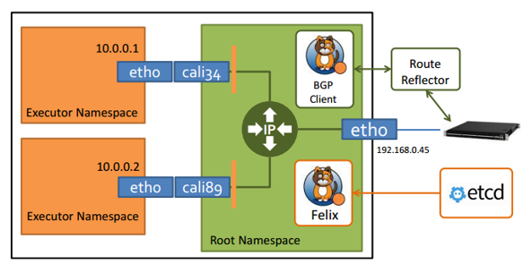

# Devops 持续交付

## 第01讲 持续交付到底有什么价值？
- 定义
    + 持续集成 : 从编码到构建再到测试的反复持续过程
    + 持续部署 : 将可交付产品，快速且安全地交付用户使用的一套方法和系统
    + 持续交付 : 包含 持续集成、测试自动化 以及 持续部署，囊括 开发、测试、部署、运维、运营 等等
- 持续交付的隐性价值
    + 对：cto、team leader、产品经理、程序员 而言
        - 技术选型、标准落地、部门协作、知识传承、关注业务、节奏平稳、提高工作效率和质量
- 如何评估持续交付的价值
- 常见的持续交付平台架构
    + 

## 第02讲 影响持续交付的因素有哪些？
- 影响因素
    - 组织和文化因素
    - 流程因素
    - 架构因素
```
    康威定律：组织结构决定软件架构
```

## 第03讲 持续交付和DevOps是一对好基友
- 认识 DevOps
    + 一组技术
        - 包括自动化运维、持续交付、高频部署、Docker 等内容
        - Docker，就是为了解决 DevOps 所提倡的“基础设施即代码”
    + 一个职能
    + 一种文化
    + 一种组织架构
- 总结
    + DevOps本质其实是一种鼓励协作的研发文化
    + 持续交付与 DevOps 所追求的最终目标是一致的，即快速向用户交付高质量的软件产品
    

## 第04讲 一切的源头，代码分支策略的选择
- 分支策略
    + 主干开发（Trunk Based Development，简称 TBD）
        - Google 和 Facebook 都在用主干开发
        - 特性
            + 没有 feature branch，所以都在主干开发，减少分支合并的麻烦
            + 使用 feature toggle(特性切换) 保证不成熟功能不会被发布
                - 特性切换太多会导致逻辑混乱、代码更脆弱，更难测试、理解和维护、更难提供技术支持，而且更不安全。
                    + 代码更脆弱：特性切换会将 未经测试的代码引入生产环境 它们引发的问题可能会在无意间暴露出来
            + 可能会出现 一粒老鼠屎坏了一锅粥 的现象
        - 集成效率高，冲突少，但对团队个人的开发能力有较高要求
    + 分支开发(branch model)
        - Git Flow(hotfix、release) -> Github Flow(pull request) -> Gitlab Flow(生产、环境以及发布分支)
        - 有利于并行开发，需要一定的流程保证，能保证主干代码质量

## 第05讲 手把手教你依赖管理
- 举例
    + 操作系统的依赖管理工具：
        - 比如 CentOS 的 yum，Debian 的 apt，Arch 的 Packman，macOS 的 Homebrew； 
    + 编程语言的依赖管理工具：
        - 比如 Java 的 Maven，.Net 的 nuget，Node.js 的 npm，Golang 的 go get，Python 的 pip，Ruby 的 Gem

## 第06讲 代码回滚，你真的理解吗？
- 方式
    + roll back 到过去的某个版本
    + 新增commit，移除对应功能
- reset --hard 的使用

## 第07讲 “两个披萨”团队的代码管理实际案例
- “两个披萨”团队
    + 在亚马逊内部有所谓的“两个披萨”团队
    + 指的是团队的人数不能多到两个披萨饼还不够吃的地步
    + 就是说，团队要小到让每个成员都能做出显著贡献，并且相互依赖，有共同目标，以及统一的成功标准，这样团队的工作效率才会高。
- 使用 gitlab---issue---feature branch 开发模式

## 第08讲 测试环境要多少？从现实需求说起
- 问题
    + 测试环境结构
    + 好的测试环境标准
- 环境模型(五套环境)
    + 开发环境
        - user：开发
    + 功能测试环境
        - user：测试
    + 验收测试环境
        - user：产品经理、测试
    + 预发布环境
        - user：测试、运维
        - 特点: 应用已经进入了生产网络，和真实的生产应用共享同一套数据库等等基础设施。
        - 方式：a: 金丝雀发布，使用真实流量机器; b: 一组不接入真实流量的机器
    + 生产环境

## 第09讲 测试环境要多少？从成本与效率说起
- 成本
    + 机器资源成本
    + 管理成本：配置、测试数据等
    + 流程成功：沟通成本、测试成本等
- 效率
    + 在抽象公共环境的基础之上，可以通过泳道的方式隔离相关测试应用
    + 降低配置复杂度

## 第10讲 让环境自己说话，论环境自描述的重要性
- 问题
    + 环境配置是非常复杂的，直接影响你的环境治理能力，而环境治理能力又直接影响着持续交付的能力。
- 自描述
    + 通过环境标准化，利用环境的自描述文件，让环境能讲清楚自己的作用、依赖，以及状态，而不是由外部配置来解释这些内容。

## 第11讲 “配置”是把双刃剑，带你了解各种配置方法
- 各种配置
    + 构建时配置
    + 打包时配置
    + 运行时配置
        - 配置中心
            + apollo ：https://github.com/ctripcorp/apollo
- 痛
    + 回滚配置

## 第12讲 极限挑战，如何做到分钟级搭建环境？
市场上主流的开源配置管理工具有 Puppet、Chef、Ansible、SaltStack 等
并行、缓存池

## 第13讲 容器技术真的是环境管理的救星吗？
- 容器优点
    + 帮我们重新定义了交付标准： 容器技术统一了软件环境和软件代码，交付产物中既包括了软件环境，又包括了软件代码。
- 不可变基础设施（Immutable Infrastructure）
    - 理念：
        + 对于容器来说，遵循的是不可变基础设施的理念，也就是说任何变化，包括代码、环境、配置的变更，都需要重新制作镜像，产生一个新的版本。
    - 问题：
        + 会将原本简单的修改，复杂化，如：只是想安装curl，但是却要重新生产镜像

## 第14讲 如何做到构建的提速，再提速！
- 方法
    + 升级硬件资源
    + 搭建私有仓库
        - 使用 createrepo 搭建 CentOS 的 yum 仓库； 
        - 使用 Nexus 搭建 Java 的 Maven 仓库； 
        - 使用 cnpm 搭建 NodeJS 的 npm 仓库；
        - 使用 pypiserver 搭建 Python 的 pip 仓库； 
        - 使用 GitLab 搭建代码仓库； 
        - 使用 Harbor 搭建 Docker 镜像仓库
    + 使用本地缓存
    + 规范构建流程，通过异步方式解决旁支流程的执行；
    + 善用构建工具，根据实际情况合理发挥的工具特性。
    
## 第15讲 构建检测，无规矩不成方圆
- 检测
    + 环境：软件版本、编译工具版本、操作系统等
    + 依赖：依赖关系检查
    + ...

## 第16讲 构建资源的弹性伸缩
- 持续集成工具
    + Travis CI、Circle CI、Jenkins CI
- Jenkins Master 高可用架构的
    + 单个 Jenkins Master 
        - 目前普遍的 Jenkins 搭建方案是：一个 Jenkins Master 搭配多个 Jenkins Slave。
        - 单个 Jenkins Master 在任务量大时，会成为系统中的瓶颈
    + 多个 Jenkins Master
        - 对jenkins封装，自定义高可用多master架构
- Jenkins Slave 弹性伸缩方案
    + 构建环境：容器化
    + 资源伸缩
        - 通过容器化，与kubernetes 结合

## 第17讲 容器镜像构建的那些事儿
- docker hub
    + https://hub.docker.com/
- 用容器来构建容器镜像有两种方式：(主要依据：使用宿主的docker daemon 还是容器内独立 docker daemon)
    + Docker Out Of Docker（DooD）
    + Docker In Docker（DinD）

## 第18讲 如何做好容器镜像的个性化及合规检查？
- 容器镜像个性化
    +总结了以下三种方法： 自定义环境脚本； 平台化环境选项与服务集市； 自定义镜像发布。
- 合规检查
    + 比对各个 layer，是否有官方base镜像的layer
    + 工具：
        - CoreOS Clair，Docker Security Scanning，Drydock，...

## 第19讲 发布是持续交付的最后一公里
- 部署 和 发布
    + 应用被部署，并不代表就是发布了，比如旁路运行（dark launch）方式
    + 发布：rollout，部署：deploy
- 发布系统期望
    + 一个易用、快速、稳定、容错力强，必要时有能力迅速回滚
- 单节点部署流程
    + download: 下载新的版本，不执行覆盖； 
    + markdown: 通知上游调用方，自己现在为暂停服务状态； 
    + install : 运行命令 load 变更重启服务；
    + verify  : 验证服务的健康状况以及预热； 
    + markup  : 通知上游调用方，自己服务恢复正常。
- 集群部署方式：
    + 灰度发布
        - 蓝绿发布
            + 发布新版本到一套新的集群，验证通过后，流控处理把流量引入新机器，待全部流量切换完成，等待一段时间没有异常的话，老版本服务器下线。
        - 滚动发布
            + 从集群服务器中挑选一批，停止上面的服务并更新为新版本，进行验证，验证完毕后接入流量。重复此步骤，直到遍历完所有机器。
        - 金丝雀发布
            + 从集群中挑选特定服务器或一小批符合要求的特征用户，对其进行版本更新及验证，随后逐步更新剩余服务器。
    + 灰度发布系统：
        - Tars : https://github.com/ctripcorp/tars

## 第20讲 Immutable！任何变更都需要发布
- 不可变基础设施(Immutable Infrastructure)
    + 前提：无状态
    + 保证: 环境、顺序、配置这些基础设施在测试环节和生产环节的一致性
    + 与虚拟机的本质差异点

## 第21讲 发布系统一定要注意用户体验
- 发布系统组成：
    - 1 张页面展示发布信息
        + 能够展示发布当时的绝大多数信息、数据和内容，这个页面既要全面，又要精准
    - 2 个操作按钮简化使用
        + 页面上最多同时展示两个按钮：发布、中断、重试
    - 3 种发布结果
        + 成功、失败、中断
    - 4 类操作选择
        + 开始发布、停止发布、发布回退、发布重试
    - 5 个发布步骤
        + 同第19讲中的'单节点部署流程'
    - 6 大页面主要内容
        + 集群、实例、发布日志、发布历史、发布批次(分批次发布)、发布操作(操作按钮集中的区域)

## 第22讲 发布系统的核心架构和功能设计
- 核心
    + DeploymentConfig
    + Deployment
    + DeployBatch
    + DeployTarget
    + 发布状态流转
- 功能
    + 服务降级、熔断机制

## 第23讲 业务及系统架构对发布的影响
- 影响
    + 单机单应用还是单机多应用？
    + 增量发布还是全量发布？
    + 如何控制服务的 Markup 和 Markdown？
    + 检查、预热和点火机制(点火：verify流程的自动化)
    + 如何保证堡垒流量？
        - 软负载 + header中附加堡垒标记，保证堡垒机的流量只在上下游服务的堡垒机中流转。

## 第24讲 如何利用监控保障发布质量？
- 监控
    + 用户侧监控，关注的是用户真正感受到的访问速度和结果； 
    + 网络监控，即 CDN 与核心网络的监控；
    + 业务监控，关注的是核心业务指标的波动； 
    + 应用监控，即服务调用链的监控，一般在框架层面统一定义解决方案； 
    + 系统监控，即基础设施、虚拟机及操作系统的监控。

## 第25讲 代码静态检查实践
- 测试管理
    + 代码静态检查
    + 破坏性测试
    + Mock 与 回放
- 静态检查平台
    + SonarQube
- 静态检查工具
    + FindBugs、PMD 和 Checkstyle

## 第26讲 越来越重要的破坏性测试
- 维度
    + 单点维度：
    + 系统维度：压测、暴力测试、阻断链路等
- 混沌工程
    + Netflix : Chaos Monkey

## 第27讲 利用Mock与回放技术助力自动化回归
- 持续交付中的测试难点
    + 测试数据的准备与清理
    + 分布式系统的依赖
    + 测试用例的高度仿真
- 方案
    + Mock
        - 说明
            + 如果某个对象在测试过程中依赖于另一个复杂对象，而这个复杂对象又很难被从测试过程中剥离出来，那么就可以利用 Mock 去模拟并代替这个复杂对象。
        - 基于对象和类的 Mock
            + Mockito 或者 EasyMock。
            + 通常用在单元测试阶段
        - 基于微服务的 Mock
            + Weir Mock 和 Mock Server
    + 回放
        - 说明
            + 记录实际用户在生产环境的操作，然后在测试环境中回放。
        - 拦截记录用户操作方案：
            + 在统一的 SLB 上做统一的拦截和复制转发处理。
                - 容易影响自身路由服务
            + 在集群中扩容一台服务器，在该服务器上启动一个软交换负责复制和转发用户请求，而真正的用户请求，仍由该服务器进行处理。
                - 结合云平台，使用时申请服务器，不需要时释放，风险低
        - 方案
            + 按照正常的操作记录时间间隔，按记录顺序回放
            + 压缩操作记录的时间间隔，按记录顺序，形成压力回放

## 第28讲 持续交付为什么要平台化设计？
- 持续交付最核心的五大部分内容，包括：
    + 配置管理、环境管理、构建集成、发布及监控、测试管理。
- 平台化
    + 自己搭台，让其他人唱戏
- 持续交付平台核心模块
    + 代码管理
        - 常与代码审核、静态扫描和分支管理等模块相联系；
    + 集成编译
        - 常与依赖管理、单元测试、加密打包等模块相联系；
    + 环境管理
        - 常与资源申请、配置管理、路由管理等模块相联系；
    + 发布部署
        - 需要监控模块和流控模块的支持
- 标准先行
    + 研发任何系统，首先要记住一句话：“标准先行”
    + 对持续交付平台的设计来说，最重要的标准是定义各个模块交付产物的标准。

## 第29讲 计算资源也是交付的内容
- 云计算

## 第30讲 持续交付中有哪些宝贵数据？
- 系统优化
    + 数据说话，从数据角度分析找到优化方向
- 系统指标
    + 稳定性指标
    + 性能指标
    + 持续交付能力成熟度指标

## 第31讲 了解移动App的持续交付生命周期
## 第32讲 细谈移动APP的交付流水线（pipeline）
- 发布快车模式
    + 定期发车
## 第33讲 进阶，如何进一步提升移动APP的交付效率？
- 优化交付流程：针对开发、构建、测试、发布进行优化
- 优化构建方式：
    - 扁平化依赖管理
    - 二进制交付
- 优化发布方式:
    - 测试用户集，需要定期更换

## 第34讲 快速构建持续交付系统（一）：需求分析
- 对各个主要模块的具体需求： 
    + 代码与配置：需要 code review，以及静态代码扫描；
    + 构建与集成：能同时支持 Jar、War、Docker，以及 App，版本管理可追溯，支持高并发；
    + 打包与发布：同时支持 Jar、War、Docker、App 的发布，以及统一的部署标准；
    + 自动化测试：通过 TestNG 驱动，实现全自动测试。

## 第35讲 快速构建持续交付系统（二）：GitLab 解决代码管理问题
- gitlib 安装
    + 使用官方的 Docker 镜像或一键安装包 Omnibus 安装 GitLab
- 目的
    + 自己动手实际搭建一套 GitLab，以及配套的 Sonar 服务

## 第36讲 快速构建持续交付系统（三）：Jenkins 解决集成打包问题
- jenkins 安装
    + gitlab
    + maven
    + pipeline

## 第37讲 快速构建持续交付系统（四）：Ansible 解决自动部署问题
- 配置管理工具
    + Ansible、Chef、Puppet、Salt
    + Ansible Tower : 一个可视化工具，可以帮助更好地管理整个部署过程
- 持续交付平台
    + 直接考虑搭建持续交付平台 Spinnaker
    + Spinnaker 是 Netflix 的开源项目，致力于解除持续交付平台和云平台之间的耦合。

## 第38讲 持续交付专栏特别放送 | 答疑解惑
- 如何处理数据库发布和回滚？
    + 对数据库变更满足以下要求时，基本上就没有回滚需要了： 
        - 第一，与业务相关的，只能新增字段，不能删除字段，也不能修改已有字段的定义，并且新增字段必须有默认值。
        - 第二，对于必须要修改原有数据库结构的场景，则必须由 DBA 操作，不纳入持续交付流程。
- Immutable
    + k8s + docker
- 破坏性测试
    + DR演练(灾难恢复)
- GitLab HA
    + Sharding

## 第39讲 持续交付专栏特别放送 | 高效学习指南
- 推荐
    + 持续交付：发布可靠软件的系统方法
    + 凤凰项目
    + 官方文档。这里我有一个建议，就是在学习和运用开源系统和工具时，要先通读官方文档。这些文档都是作者心血和智慧的结晶，从中你定可以收获颇丰。
- 建议
    - 持续交付体系中涉及到很多开源软件，如果你想做好持续交付，那就一定要去理解它们，而不只是使用它们。

## 第40讲 结束语 | 越痛苦的事，越要经常做
- 越痛苦的事，越要经常做
    + 第一痛，要比架构师懂得多
    + 第二痛，要比开发人员动作快
    + 第三痛，要比 QA 团队眼睛尖
    + 第四痛，要比运营人员“心脏大”
        - 顶得住压力、受得住委屈
    + 第五痛，要比产品经理还会“吹”
        - 做持续交付，真的要足够会包装自己。因为你要推广你的系统、要找到你的种子用户；你要讲道理、讲技术、做演示，讲 PPT。这些技能，真的是缺一不可。

## END
 - reference
    + [依赖治理、灰度发布、故障演练，阿里电商故障演练系统的设计与实战经验](https://mp.weixin.qq.com/s?__biz=MjM5MDE0Mjc4MA==&mid=2650996320&idx=1&sn=0ed3be190bbee4a9277886ef88cbb2e5)
    + [压测1](https://zhuanlan.zhihu.com/p/28355759)
    + [压测2](https://www.infoq.cn/article/jd-618-upgrade-full-link-voltage-test-program-forcebot)