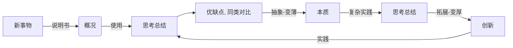

# 思考总结
## I 知行合一
知：指导行
行：反馈知

1. 知行存在于各个方向、层面、维度，并互相影响
   - 小到晚饭吃什么，大到人生目标；以及怎么提升沟通技巧、怎么提升领导力、怎么提高收入...等等
2. 此外，我们要意识到(或大或小的)不同的知和行都有各自的**道**和**术**(道本质, 术方法)
   - *世界观主要解决世界"是什么"的问题，方法论主要解决"怎么办"的问题*
   - 如，5Why 思维方式帮助我们挖掘更深层次的知，流程思维方式帮助我们高效的行

### 知
> 简单到复杂的逐步梳理形成认知、智慧

随着**知**的深入，复杂度发生变化，思考维度也从点、线、面发展到多维、高维：
1. **个体(客观存在) ---> 环境 ---> 生态 ---> 系统 ---> 大势(时来天地皆同力)**
2. **我们无法控制自身之外的其它任何事物**
    + 持经达变: 拥抱变化，变化是常态，唯一不变的就是变化自身

### 行
> Just Do It

*君子性非异也，善假于物也。*


## II 关于思维
好的思维方式为**知**提供更好的分析
对的思维方式为**行**指导高效的路径


## III 关于沟通
```
好胜人，耻闻过，骋辩给，眩聪明，厉威严，恣强愎，此六者，君上之弊也.
                                   - 《资治通鉴· 唐纪四十五·德宗建中四年》
```

沟通是必备技能：**口头沟通 <--- (二者的权衡) ---> 文字沟通**

常见的方法有：
- 共情(同理心)
  + 利益分享(F.A.B)：关注对方的需求, 达成自己的目标
  + 换位思考
- 空杯心态(谦逊, 虚怀若谷)
  + 多交流，有助于自我进化
  + 控制情绪

### 学会讲好一个故事 
>  摘自<你如何听懂我说的话>(黄执中)
+ 讲好一个故事的三大原则
  - 简单
  - 具体
    + 在2000年世纪之交的时候，基本上所有的国家领导人发表讲话的时候，都是说一些假大空的愿景和展望，但是新加坡领导人的一个讲话，让人印象深刻，他说在未来3年，我们希望每个厕所都有厕纸。哎哟，好具体啊，16年过去了，我已经不记得中国领导人、美国领导人在那个时候讲了什么，但唯独记得住，新加坡领导人说的那番话。
  - 意外
    + 意外有两种实操手法，叫造冲突和设悬念

### SCQA法则
SCQA法则，一个讲故事屡试不爽的逻辑。所谓的SCQA法则，就是场景-冲突-问题-解决方案；比如下面的故事：
```
    Situation: 520快到了，我想买个戒指，向女朋友求婚
    Conflict: 不过买戒指的钱不够
    Question: 我该怎么凑足不够的那笔钱
    Auswer: 找高中的一个铁哥们借
```

### STAR法则
STAR法则，一个表达自己的好方法
```
    Situation(情境)
    Task(任务)
    Action(行动, 指方案和做法)
    Result(结果, 指效果和意义)
```
tips: 结果先行


## IV 关于影响力
> 想让别人接受的一切都是商品，包括我们自己

影响力包括对外、对内两部分：
- 大部分人提到影响力，会提到一个技术人员在外部被多少技术会议邀请，有多少技术文章被其他人引用和认可。其实对外影响力的目标是作用在对内影响力上。
- 通过对业界的影响力以及方案判断和决策不断的验证，建立管理层对于技术团队整体的信任。这样在决策和预判过程当中，技术管理者的技术基因才可能有话语权，可以让公司以合适的技术节奏和技术路线来发展，避免过少或者过多的技术投入影响业务。
- 对于员工的影响力，是员工发自心底的一呼百应，通过准确的技术判断、正确的管理决策、合适的领导方法让员工信服决策者而不是因为职位的高低而去执行。这样才可以打造一个积极向上、海纳百川的产品技术团队。

### 个人品牌
什么是"个人品牌"？简单来说，就是一个人带给别人的印象，以及所影响的人的范围。

我们说一个人个人品牌很好，通常是说他在某一方面有专长，有权威，另外就是他还影响和帮助了很多人。从这个角度出发，技术人可以从下面几个维度思考，打造自己的个人品牌或者影响力：
- 通过社交媒体多发表观点，尤其是针对热点事件，让自己在关键时刻不缺位。但是这个方式也有自己的副作用，如果在社交媒体上过于活跃，比如在每个群里都能看到他在说话，好像随时都在响应大家，可能会给人留下没有专注于本职工作的印象。学会“隐藏自己的实力”，多发表有见地和有理有据的内容，可以作为自己使用社交媒体的礼仪之一。
- 多参与有品质的会议，并发表演讲，或者写“博客 / 公众号”也是不错的办法。因为不论是一个 45 分钟的分享，还是一个 2000 字的文章，都代表着你对一个问题的深入思考，这在现在已经泛滥的浅层信息流中是比较稀有的东西，自然会受到更多人的关注。需要注意的是，不要一个内容到处讲，要克制，就好像武侠小说里面的剑客，不是随意拔剑的，剑一出手，必定置敌人于死地。如果是公司需要自己多露面，那么至少每次讲的内容要有 30% 的更新。
- 出书，可能是当前最有效的建立个人品牌的方法，尤其是和一些有品牌的出版社合作。通常情况下，越是难度高的产出，越容易受人肯定。如果说公众号代表一个人当下的深入思考，出书则代表一个人对过去一段时间的深入总结，而且还要花费数月把它形成文字写出来，是代表着一种严肃的，真实的付出。


## V 关于领导力
> 领导力，就是"成事"的能力

领导力，也就是"成事"的能力，对最终结果负责是级领导力的最高体现。领导力就是用各种各样的方法、人员、影响力、号召力、决策力将一个事情从 0 到 1 的能力，如果把事情做成 0.99，都不是领导力的体现。

### 知
培养领导力需要着眼于从以下几种能力和素质：
- 能成事的能力
- 决策力
  + 迅速拍板并为结果负责的能力
    - 大家所理解的决策，经常是给老板三个方案，老板从中拍板一个最好的，然后让大家去执行。其实实际情况并不是这样的，作为一个高级管理者，经常能看到下属遇到一些困难的球(问题)，大家想尽一切办法去接着这个球，好接的球基层、中层管理者都搞定了，出现在你面前的一定都是"仙人球"。所以，技术管理者看到的情况，经常不是"两好选其优"，而是"两害取其轻"。通俗的讲，面前两坨翔，一坨大的一坨小的，让你必须选一坨吃，如果你不迅速确定，这两坨马上各自增长一倍。
- 沟通力
  + 倾听与准确反馈的能力
	- 简单地说，沟通力，就是在合适的时间对合适的人用合适方法说合适的事情。体现在，对外交流、对上沟通(像CEO一样思考问题、数据说话)、对下沟通等。
- 影响力
  + 号召管理层和员工一致行动的能力。"职位不是别人给的，而是自己挣出来的"，这句话就是影响力的真实表现。
- 商业思维
- 技术前瞻(战略层次)

### 行
谨记：*宰相必起于州府，猛将必发于卒伍*

徐直军说过，站在管理者的角度来讲，绩效管理就是要让你的下属都愿意跟着你一起干。
		
领悟团队开发文化：多讨论、用白板，勤跟踪，要闭环。
		
SMART

小公司如同轻骑兵（敏捷、速度、攻击），大公司如同重骑兵（稳扎稳打，防御，安全，集团军）
		
流程的思想精髓是什么呢？ 先僵化、再优化、再固化。 像华为一样，用流程解放管理


## VI 关于不对称
内容付费靠什么来赚钱？其实就是将知识或是技能通过有偿分享的模式来进行赚钱。

很多人都会觉得：“我不行，我什么都不会，我没有什么擅长的。” 。这是很多人对自己的一个认知误区。

***世界是不对称的***。正是因为不对称，所以产生了各种需求，由此产生了各种赚钱的机会。

这些不对称分为:
1. 资源不对称: 你有的，别人没有
2. 信息不对称: 你知道的，别人不知道
  + 几年前，有个人制作了一本电子书，教大家在美国亚马逊网站上传电子书来赚钱。这本电子书也就是40多页，其实就是将在亚马逊网站上传电子书的流程截图说明而已，很多内容都是官网中就有了。他将这本书的售价定位49元，轻松销售几千乃至上万套。他就是利用了信息不对称来赚钱。
3. 认知不对称: 你会的，别人不会


## VII 关于价值与价格  
我们常常认为工资的高低似乎和你的技能、经验呈一个正比关系。而这仅仅是一个表象，那么它的实质是什么呢？

**工资不是用来支付给技能的，而是支付给责任的。责任越大，工资越高**

对于管理岗位，因为经理人不属于个人贡献者，所以其工资的一部分通常和团队绩效绑定，称为绩效奖金。这个奖金一般在管理岗的全部薪酬中的百分比会随着薪酬的增加而增加，比如：高层可能占到 50%，而中层占到 20%-30%。

前 Intel CEO 安迪·格鲁夫说过：**每一份工作所包含的最大价值都是有限的，不管一个人在这个职位上待了多久，最后总会达到薪资的上限。** 这个上限就是岗位工资范围的天花板。而外部市场会提供一些工资立即涨 50% 甚至翻倍的机会。此时，先不要自大的以为你的价值被低估了，很可能是外部公司出现了岗位空缺，空缺的岗位职责实际可能比你在当前公司的职责更大，也就是说你还要考虑自己能否承担得起。

### 程序员的成本
程序员有两个成本：
- 技能成本：专注于提供技术和服务本身所占用的时间和注意力
- 传递成本：让你潜在的"客户"知道你所能提供的技术和服务的价值占用的时间和注意力

市场上的商品有两种销售方式：
- 卖的更多：大型卖场，薄利多销
- 卖的更贵：奢侈品，相对成本一百倍的毛利

程序员提供的技术服务因为无法卖的更多，所以只有一种选择，像奢侈品一样卖的更贵，前提是学会像奢侈品牌一样思考。

### 发展与变化
真正认识你价值的人，最终会成为你价值的一部分。


## VIII 关于兴趣

目标：有能力促使兴趣和擅长的发展，并使他们逐渐重合。

## IX 关于行
> 归纳演绎: WHY(为什么)、HOW(怎么做)、WHAT(做成了什么)

### 1. 学习
- 方法：忆、思、说、写、用
    + 影响因素：有关自身的好奇心、逻辑性、操控力，和有关环境的挑战、榜样和反馈
- 目标：化繁(发散)为简(抽象), 由简入繁; 举一反三, 融会贯通
    + 系统化: 点 -> 面 -> 体
    + 结构化(建立专家体系, 方法论)、系统化, 同时, 重视基础、细节
- 途径
    + 多读书，涨经历: 以形成对未来的预判能力



```
>> 概况：解决什么问题，每个点做到什么程度
>> 实践 - 先主干后枝叶, 由基础到上层建筑
>> 思考 - 由本质到细节, 由框架到全面
>> 拓展 - 规模由小到大时, 量变引发质变
```

### 2. 做事
***极致(ONE MORE STEP)*** 、 ***Plan B***

- 靠谱：自己表达的每一个观点，都要有支撑(数据、详情等)
  + 量化 => 实践 => 反馈 => 迭代
    - "If you can't measure it, you can’t manage it"(你如果无法度量它，就无法管理它) - 管理学大师-彼得德鲁克
- 维度：高维度思考、看待问题
- 思路：分治、迭代

### 3. 势
> 如果说内功是成功的基石，那么外势就是成功的杠杆

### 4. 定位
- 想清楚定位：独特价值、壁垒
- 技术 & 业务
    + 技术支持业务：别把技术太当回事，别不把技术当回事
    + 像CEO一样思考(高维思考)
- 科技发展方向: 自动化 + 智能化
    + 需求 ---> 设计 ---((声明式)数据 + 算法)---> 产品 

### 5. 工作量预估
影响工作量预估的主要因素是人：内因(愿景) + 外因

常用的方法：
+ 二的幂次方为单位(小时)
+ 乐观 + 悲观 系数结合进行预估
  - 提需求的人会相对乐观，实现需求的人会相对悲观，所以需要融合
+ 80%的工作量，预留20%的临时插入工作


## X 自省、归纳
### 1. 自省
+ 内功体现在：解决问题能力，依赖以下能力：
    - 学习能力
    - 精益能力
    - 协作能力
    - 领导能力
+ 成长的体现: 
    - 技术、视野(包括人脉、认知)
+ tips: 自我反思 --- 有始有终，不要虎头蛇尾
  - 始(为什么要做); 终(成果如何，复盘、形成方法论，扩大成果，这一步只占5%但很重要)
### 2. 经验
- 责任感：主动挖掘, 主动承担
    + 角色转变：规则制定者
- 先说(答案)先死：答案==承担责任
    + ?
- 危机感：日子一天天好一年年变坏：反之亦如此
- 目标感：当你忙的像牲口一样时，你需要停下来想想看为什么了
- 人更习惯选择题，而不是思考题
- 具体的批评有助成长, 抽象的批评有打压意味
- 选人更重要一点，选择后选择相信
- 考验情商：问最喜欢的人，次之，问最讨厌的人（？）
### 3. 著名的知识
- 三种推理方式
    - 归纳推理、演绎推理、类比推理
- 黄金圈法则：what(表象) how(方法) why(为什么,本质)
    + What - How - Why : 实现深入细节「1->0.1」
    + Why - How - What : 实现构思创造「0->1」
- 第一性原理
    + 第一性原理又称“第一原理”。古希腊哲学家亚里士多德提出的一个哲学术语："每个系统中存在一个最基本的命题,它不能被违背或删除"
    + 埃隆·马斯克(特斯拉汽车CEO)的应用：回溯事物的本质, 颠覆固化认知, 重新思考怎么做
- mece原则
    + 可以用于构建知识树
- PDCA 循环
    + 其含义是将质量管理分为四个阶段，即计划（plan）、执行（do）、检查（check）、行动（Action）
- 东西方意识差异
    + 西方：上帝 创造 人
    + 东方：人 升级成 神  ：自我中心意识强、要面子
- 如何从一个工程师思维，转变成一个产品经理的思考。
	+ 项目目标 => 商业目标
### 4. 著名的问题
- 零知识证明: 认证理论的一个重要协议
- 拜占庭将军问题
- 两富翁在不互相透露具体财产的情况下，比较谁更富有

## XI 推荐阅读
- 《金字塔原理》
- 《高效能人士的七个习惯》
- 《好好说话》
- 《原则》
- 《我是这样拿到风投的》
- 《人人都是产品经理》

** TO BE CONTINUE XIII XIV XV **
