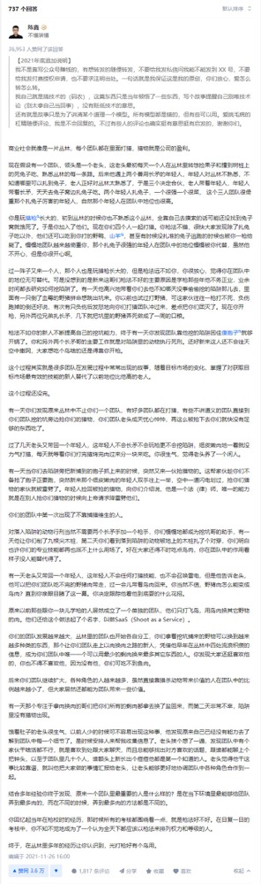
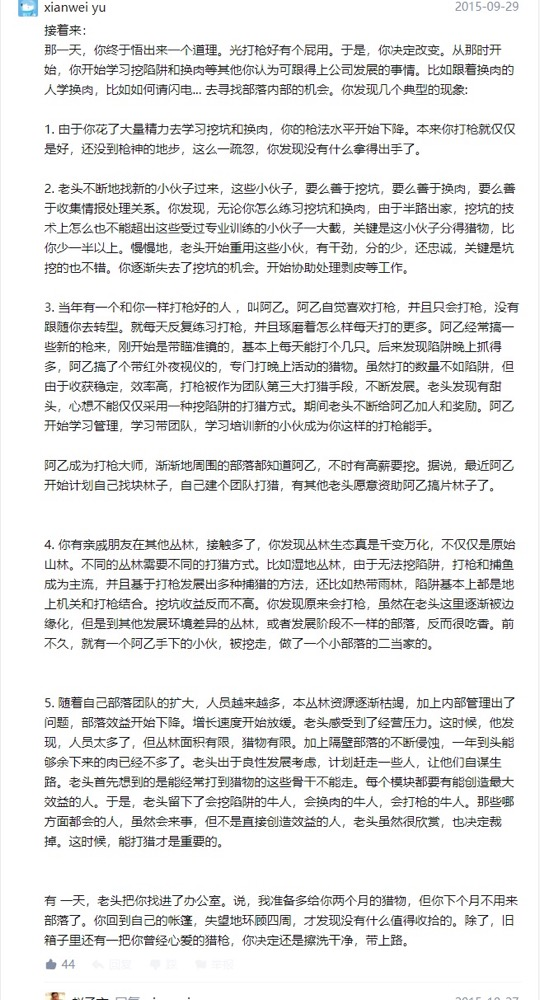

# Skill and Communication

## 不完美的故事

## 思考与总结
专长 ---> (逐渐变化的环境下的)解决问题能力 ---> 善于创造多赢局面

如果“会来事儿”的意思是说“善于创造多赢局面”的话，那这事儿还真的值得好好研究，好好实践。

如果不是, 就别死磕了, 这属于非得用自己的劣势去跟别人的优势竞争, 这样就永远在追赶, 赶不上的。不如换条道,发展垂直领域的能力这个混社会的硬通货, 让自己加入到社会大系统里, 如果你能给别人提供价值, 又不依附于某个特定的系统, 你就不需要会来事儿也可以过得很好了。

# Reference
- https://www.zhihu.com/question/20940082