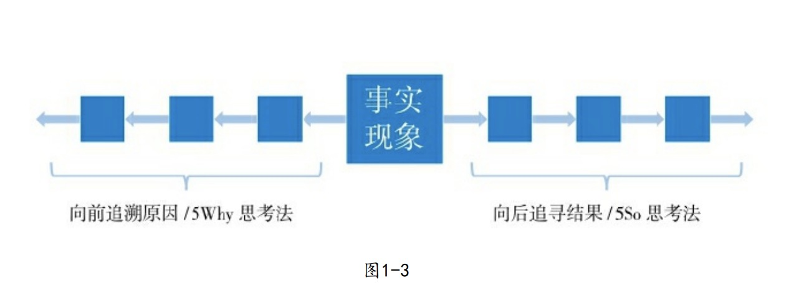
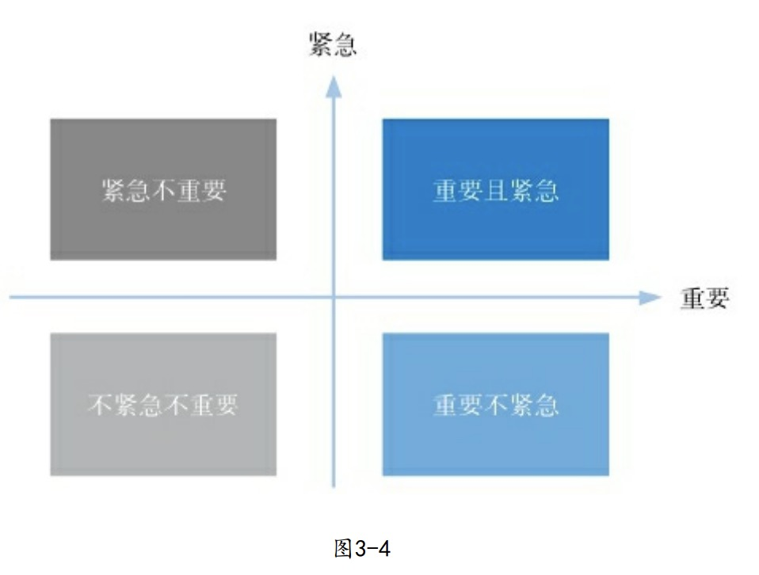
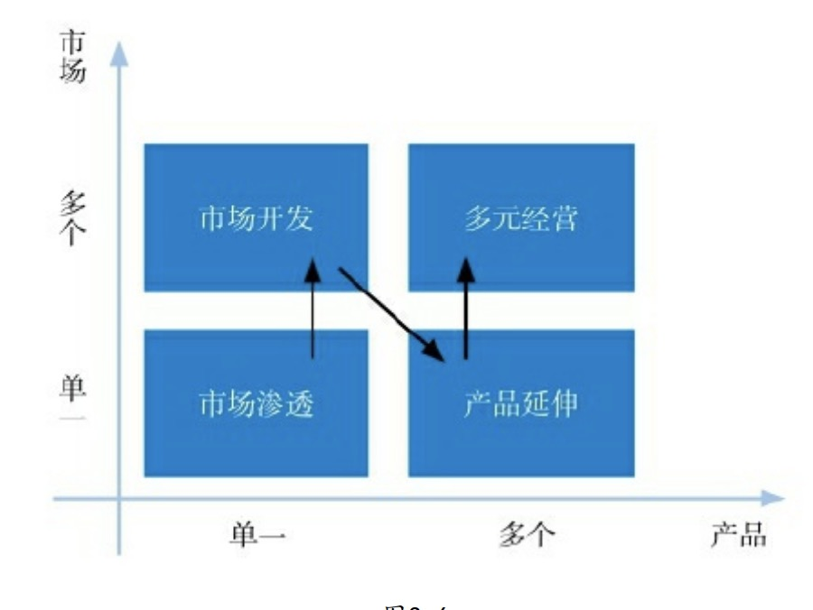
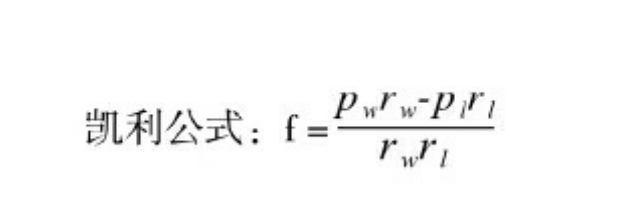
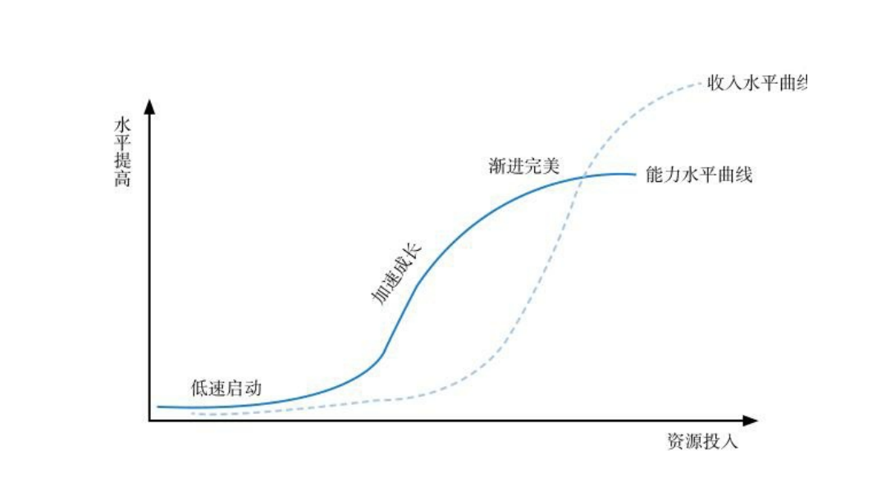
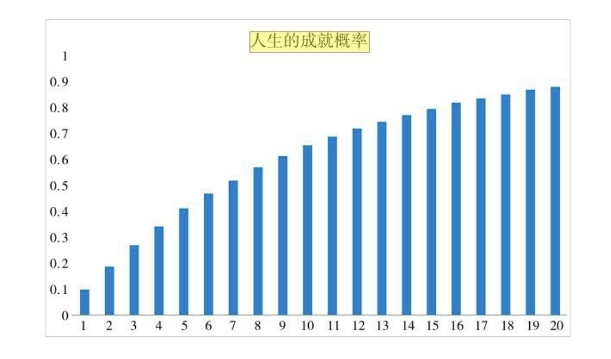

# 深度思维
特点：
1. 较长的思维逻辑链
2. 突破自我为中心的局限性，灵活切换看问题的视角
3. 在繁杂的信息流中保持思维能力
4. 以宏观视角分析问题，认知事物所处的生态特性、事物长期趋势等

训练：
1. 深度思维的学习要像知识点一样有**明确的、可操作的内容**，不能仅仅停留在某种理念的基础上。

技术大师：(主要用于处理日常工作的具体事物，就像一个个小工具，能让你高效的解决问题)
1. 思维逻辑链
2. 换位思维
3. 可视化思维
4. 流程思维

思维的格局：(能让你站在更高、更广的视角看待问题，以更深刻更巧妙的方式解决问题)
5. 生态思维
6. 系统思维
7. 大势思维
8. 兵法思维
9. 慢即是快

《深度思维》一书无法概括深度思维的全部(实际上任何人都无法穷尽所有的思维方法)，有很多思维方法并没有被纳入到本书中来。

## 第一章 思维逻辑链

- 5Why
  + 诞生自丰田汽车
- 5So 
  + 《深度思维》作者开发

逻辑链条概率传导

## 第二章 换位思维
如果不懂别人是怎么想的，你的努力或许会白费。你需要建立共同认知、
克服自我中心，才能自如切换视角进行换位思维，将深度思维的功效发挥到极
致。

换位思维，简单的说就是，如果我是他，会怎么想。但，这有个关键条件，得和别人有共同的认知系统。

- 六顶思考帽 (爱德华·德·波诺)
  - 全局分析、客观事实、感性直觉、乐观思考、保守行事、创新思维。

## 第三章 可视化思维
矩阵分析法
- 艾森豪威尔矩阵
    
- 安索夫矩阵
    
- 创造自己的矩阵类思维工具

工作仪表盘
- 为了让这些重要事项能够经常出现在我们的
工作记忆里，我们需要一个外部的提醒——这就是仪表盘的运作方式。

总的来说，可视化思维的核心在于其原理而不是形态，只要懂得原
理就能自行开发工具，并且千变万化。

## 第四章 流程化思维
### 秘籍思维的谬误
伟大的成就不是因为有某种秘籍，而是来源于对流程的掌控和优化。你需要识别流程的结构、类型，并学会全流程优化的方法，这才是在真实世界里成长为高手的方法。

秘籍型思维的谬误，似乎从未远离人群。秘籍型思维的本质，是把复杂的东西过于简单化，企图用一个相对简单的秘籍去代替复杂的成功规律。

秘籍型思维的可怕之处在于，他有一部分是正确的。有些时候，一些特定的方法真的是太管用了，一定时间内确实可以"一招鲜吃遍天"，让人短时间内感到无比的兴奋---但从长期来看，这些对单一方法的依赖会让人不再成长。

回拉关系有用吗？有用，真的有用，情商高、会说话也一样，确实有用。所以当家长、前辈、导师们宣称这些秘籍万能的时候，很多人真的容易相信，因为能举出太多的例子来证明这些东西多么有用。一个原本只是有一定作用的东西，被放大成了万能的、唯一的，于是你把全部的希望都押在了一个东西上，继而放弃了对其他事物的观察和学习，最终无可避免的走向失败，这就是秘籍的危险之处。

简单的说，秘籍思维会人为放大某些方法的用处，如果一个东西只有一分用处，而你却误认为它有三分。

秘籍型思维代表了简单情境下个别方法和要点对全局的决定性影响，它往往与复杂的现实生活不符，尤其与经过互联网改造的现代复杂商业社会不符。

### 全流程优化
全流程优化，在平凡中创造奇迹的方法。

一件复杂的事情往往由多个流程、步骤组成，把每一个流程、步骤都进行优化，做到(接近)最好，就叫"全流程优化"。

**全流程优化具有复利属性。** 在计算成本时适用的是加法，而计算成果时适用的是乘法。也就是说，做的好就是全流程优化，对应复利；做不好就成了全流程损耗，对应"复亏"。

- 思考：
  1. 以电商店铺为例，尝试分析全流程优化
  2. 因为全流程优化的复利属性，互联网相对传统行业流程更长，兴衰发展更加迅速

现在我们都知道全流程优化非常重要，但有时我们没有那么多资源做全流程优化，只能暂时优化一部分流程，那该怎么办？这时候要借助艾森豪威尔矩阵，而某个流程的重要程度可以从：损益程度、影响广度、扩散度这三个方面来衡量。

## 第五章 生态思维
嵌在生态中的个体，将被生态所推动。当你研究一个事物时，不仅要分析个体，更要观察整个生态、洞察期中复杂的规律。

**个体 ---> 环境 ---> 生态 ---> 系统**

生态思维的核心原理：
- 由于生态中的事物是广泛关联的，所以个体事物的发展趋势、状态变化和各种选择并不是随机的，也不是完全独立自主决定的，而是受到整个生态的影响。因此，思考某个事物的时候，不应当仅仅思考这个个体，还应思考他所处的整个生态--他周围的环境以及他与环境的关系。

思考：游戏主播带货场景，带什么货？

### 衍生模型I：淘金模型
淘金模型，竞争再激烈也能赢的思维方式。

十九世纪中前期的美国西部淘金梦中，你应该去，但不是去淘金，而是去卖牛仔裤。

淘金模型的本质是一个共生模型。你会看到其他人，不是只看到竞争者，而是要看到生态中的共生可能性。

思考：老龄化社会的到来，有什么机会？

### 衍生模型Ⅱ：森林模型
不是天才的人，如何应对强大的对手

森林模型的本质：
森林模型的本质上是一个生态位模型。生态位是指物种在生态中所处的位置，包括空间、时间、食物种类等因素。生态位思维的核心原理是：当你遭遇强者竞争时，除了与其死拼以外，还可以选择避开他的(时间、空间、食物等)位置。

思考：互联网创业，如果BAT也来做你这个类似的产品，该怎么办？

### 衍生模型Ⅲ：池塘模型
如何突破发展的瓶颈

在一个池塘生态中，水草要和藻类争夺养料，蜉蝣生物要避免被小鱼吃掉，小鱼又要躲避大鱼，大鱼之间这要相互竞争食物和繁殖空间。它们的竞争最终造就了池塘的生机。这就是池塘模型，它的本质是平台模型。

你很容易理解平台公司的好处：开淘宝店的未必赚钱，但淘宝平台本身一定赚钱。但，一般人习惯于在别人的平台上活动，但却未思考过或许可以制造一个自己的平台。为什么？一个很重要的原因是：平台看起来太大了。

但我们要意识到，平台不仅是一个结果，也是一种思维：太平洋固然是一个生态，家门口的小池塘也是一个生态。

生态思维告诉你，不要把目光仅聚焦在一个事物上，而要观察思考它的生态，既包括周围的环境，也包括它与周围事物的关系。这一思路的改变，常常能让人豁然开朗、大梦初醒。

思考：游戏主播带货场景，当越来越多的主播带货时，怎么办？

## 第六章 系统思维
在更高的层面上解决问题

在复杂的情境中，传统的因果关系被颠覆，微观层面的静态分失效了。你需要站在更高的层面上，以更宏观的、系统的高度去看待和解决问题。

系统思维则要求我们时常留意各个部分之间的关系，认为系统并不等于部分之和。

静态的事物理解起来更容易一些，但动态的系统才是世界频繁展现出的样貌。

从更宏观的角度解决问题：利用系统思维做出大胆的反常的决定。

良性循环是怎么样构建出来的：设计系统结构，做一只无形的大手。

颠覆线性因果，系统结构带来反常规的智慧。

## 第七章 大势思维
与宏大的趋势相比，个人的力量是渺小的，只有借助趋势的力量才能在人生中乘风破浪。如何识别趋势并站在趋势之中，是每个想要成就自己的人所要学习的重要课题。

时来天地皆同力。真正伟大的力量是时代的趋势。

趋势，是因为某种内在规律而导致的未来的大概率或者必然走向。

抓住趋势的本质：发现趋势不是瞎猜，是掌握规律。大势思维是对各类宏观规律的具体认知。

越是强大、深刻的规律，就越能造就宏大的、确定性的趋势。
1. 马太效应
   + 马太效应的厉害之处在于，它往往比其他规律更加强大。当它和其它规律起冲突的时候，往往能够覆盖、推翻其他规律。
2. 人口变化
   + 人是一切文明与社会经济活动的根基。如果说什么规律能够造就大级别的趋势，那么与人口有关的规律必然是期中之一。
   + 与人口有关的规律也是非常强大的---比如人口数量与人口结构---当它与其他规律冲突的时候，往往也能够推翻其他规律而保证自己的留存。
   + 思考，可以思考日本和印度的发展趋势。

大的趋势，大家都能很容易察觉到，既然大家都知道这件事情, 那我知道了又能怎么样呢？能有什么机会呢？

比如二胎政策会让婴幼儿用品产业复苏，老龄化趋势则造就了医疗和养老行业的机会，这些简单的结论很多人都知道了。那么你能够根据这个趋势得出些什么新的东西吗？要大多数人想不到的才有机会。

这个问题也是造成很多人不愿意去关注人口趋势(以及其他趋势)变化的重要原因，以为只能得到一些大家都知道的、显而易见的知识，没太多应用价值。这个问题，是大势思维在现实生活中得到应用的真正瓶颈。

人们很容易看懂一些简单的规律，但不太容易经过精细的思维加工推导出相对复杂的衍生结论。那些被人民广泛知道的简单规律和知识无法带给你特殊的优势，只有少数人通晓的道理才能让你夺得先机。

如果你想思考出一般人不知道的结论，你就需要用到复杂的思维方法了。

以中国的人口规律为例。看完中国的人口年龄结构，只能想到婴儿用品和养老医疗这些路人皆知的事情？没关系，我们试一试把多种思维方法和人口趋势结合起来使用，看看能不能得到什么重要的，真正能指导现实生活的结论。

- 马太效应与人口规律
  + 小城镇会越发缺少活力，甚至会产生"老人城"、"老人村"，由此带来小城镇的房产会快速贬值...
- 生态思维与人口规律
  + 中国的老年人越来越多，但养老和医疗产业的准入门槛太高，我们还有其他机会吗？
  + 受益于一辈子的储蓄、保险以及房产增值等，这些老年人不缺钱，那他们的休闲娱乐是否会多元化？麻将、广场舞、旅游？以旅游为例，60岁的老人还能有精力去旅游，而70岁的老人可能才需要养老护理。也就是说，老年旅游甚至比养老护理来的更早。
- 淘金模型
  + 养老和医疗产业的准入门槛太高，但我们可以从周边入手：养老护理包括场地建设、设备购买、护理人员招聘培训等多个部分。普通人物理拿出几千万上亿的资金入场，但可以从中挑选一些资金投入较低的环节入手，如：护理人员招聘，可以通过劳务中介、代理招聘、中低端猎头等形式。如果你去做一个护理行业的专业性招聘网站或劳务公司，你就成了养老产业大公司的好帮手，与他们共生。
- 逻辑思维链与人口规律
  + 二胎政策放开后，迎来了一批新生儿。我们试着通过5Why、5So法综合使用，看看能发现婴幼儿用品市场的哪些新特性。
  + 会发现：目前的新生儿有很多是有生育想法的妇女的存量消化，这些人的财富比以前会更多，教育观念也会更强...
  + 就是说：婴幼儿的增速是否稳定尚不确定，需要持续关注；中高端产品更受欢迎；科学教养相关行业会有很好的发展机会。

思考：当下AI的大势扑面而来时，你能发现什么机会呢？

## 第八章 兵法思维
人生如打仗，打仗要懂兵法。兵法思维讲述的是这样一些思维模式：如何规避风险，捕捉机会，掌握主动权，以确保在漫长的人生中获得总体上最优的发展。

一次次大大小小的战斗汇聚成了这一场生命的战争。兵法思维，首推《孙子兵法》。

绝大多数兵书都是讲战争的具体技术，而《孙子兵法》则是讲战争之"道"。我们命运的战争不是枪林剑雨，而是学业、人脉、求职、创业等。这些战争需要的是道，而非术。即我们不用持刀枪进退杀伐，而要将深刻的智慧应用于生活，设计自己的人生胜负手。

- 胜兵先胜而后求战，败兵先站而后求胜
  + 但在某些领域，如投资、创业等，要确定必胜是不可能的。这时候，我们可以考虑借助 凯里公式 
- 善战者，致人而不致于人
  + 致人而不致于人，简单的说就是要主动不要被动
- 胜可知，而不可为也
  + 机会未到时，积极准备先保证自己的不败，但不可妄动；时机到来时，要准确识别并抓住它
    - 投资界有句名义：最难的不是交易，而是不交易

## 第九章 慢即是快
在这个鼓吹少年得志的时代里，对于出身平凡、缺乏资源、没有背景的人来说，专注做好一件事才是大概率的生存知道。慢即是快，这是技术，也是心法。

### 为什么需要专注
投入和产出，从来都不是成正比的。我们要意识到，大部分的投入都是不能产生直接价值的。

可以看到，当你最初投入一些资源的时候，你的能力水平并没有得到飞速提升，更无法因此获得收入。即便再投入一点资源进入快速提升区间，获得了一定的能力成长后，其收入水平也非常一般。只有当投入了大量资源进入高原期以后，收入水平才能迎来真正的大幅增长。

对于那些智力、知识积累、技术水平、人脉、资金等资源本就不出众的人来说，如果他们把有限的资源分散到不同的领域，那么每一个领域都会停留在低速启动区间，他将永远面临较低收入，以及随之而来的各种烦恼。所以，普通人最好的策略就是专注，把所有的力量集中到一点，在一个领域冲进能力的高原区域，并得到金钱上的自由。这是一条对于普通人来说风险最低、成功率最高的道路。

总之，对于资质、背景都很普通的人来说，专注努力是最佳策略。相应地，当你的资源越丰厚、天赋越高时，你进行资源整合、跨界发展、多元化经营的空间也就越大，成功率也就越高---但依然不可高估。

### 为什么专注很难做到
其中有两个问题最有共性：
1. 如果自己倾尽全力投入的大方向就是错的怎么办？
   + 需要借助深度思维格局篇来帮助确定正确方向
2. 加速成长末期的技术难度
   + 需要借助深度思维技术篇来帮助突破技术难度

### 精神图腾
在这个鼓吹少年得志的时代，我更偏爱大器晚成。

精神图腾 --- 大气晚成司马懿。

平均来讲，人的一生每三年就会有一次机会。3年这个数据是经过社会检验的，如工作2-3年后，初级管理职位是一次机会；工作3-4年后，中级管理职位是一次机会...

根据概率公式，我们可以知道，越到后面，成功的概率越大。没有资源，不是天才，你的命运最大的胜算其实就是概率和时间。

如果说努力和方法开启了成就的可能，专注让这个可能有了一定的提高，那么漫长的生命和时间则将这个概率提高到了可以接受的程度，让你第一次有了对抗命运的主动权。