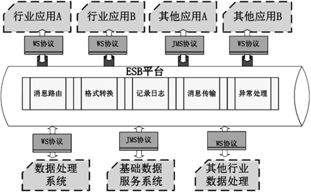
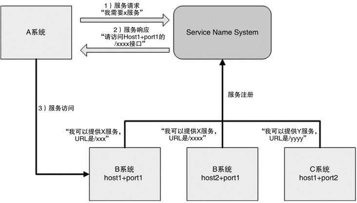
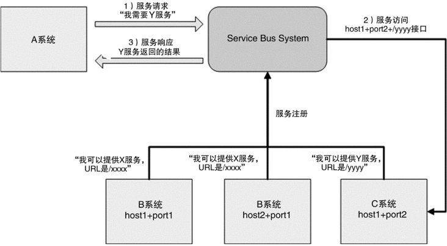
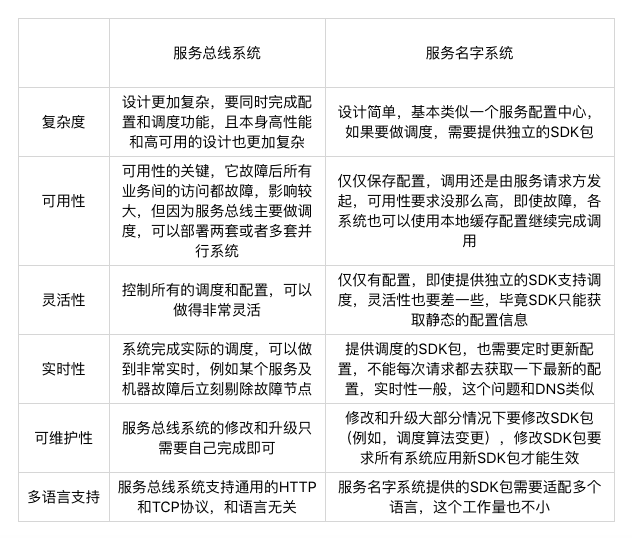
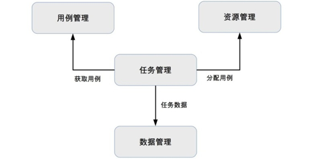

## ARCHITECTURE
> Architecture is like teenage sex， everybody talks about it， nobody really knows what is it。

> 架构是一门平衡的艺术

### 概况
- 简述
    + 业务驱动技术，技术解决业务问题。
    + 不同的技术，通过树状结构，组合在一起，形成了一个完整的架构解决方案，有效完成业务的目标。
- 权利
    + 所有的架构分拆，都应该是形成树状的结果
		- 因为：切分出来的部分的负责人，对这个部分的权利和义务必须是对等的。架构师没有话语权，还架什么构
	    - 架构师必须是一个组织的领导人，有权利调动这个组织的架构，才能够更好的发挥架构师的作用
- 责任
    + 找问题
        + 找出问题的主体，是做架构的首要问题。架构师都要有这个自觉：发现问题永远都比解决问题来的更加重要。
            - 我们一定要明白，任何找上架构师的问题，绝对都不是真正的问题，因为如果是真正的问题的话，提问题的人肯定都能够自己解决了
                + 两个问题：如果问题不解决，究竟谁会有利益的损失？如果问题解决了，究竟谁会有收益，谁的收益最大？
    + 找技术
        + 准确识别采用什么技术的能力，也是架构师所要具备的能力之一。
	        - 这就要求了解这项技术解决的是谁的问题？什么问题？
                + 例子：比如当我们需要一个锤子时，手边正好没有，但是却有一只高跟鞋，勉强也可以替代锤子。但是长期来看，这么用不划算，因为价格、耐用性、维护成本相差很多。

--------------------------------------------------------------------------------------------

<h1 id="h" ></h1>

## 目录
- [ARCHITECTURE](#architecture)
  - [概况](#概况)
- [目录](#目录)
- [开篇](#开篇)
- [01 | 架构到底是指什么？](#01--架构到底是指什么)
- [02 | 架构设计的历史背景](#02--架构设计的历史背景)
- [03 | 架构设计的目的](#03--架构设计的目的)
- [04 | 复杂度来源：高性能](#04--复杂度来源高性能)
- [05 | 复杂度来源：高可用](#05--复杂度来源高可用)
- [06 | 复杂度来源：可扩展性](#06--复杂度来源可扩展性)
- [07 | 复杂度来源：低成本、安全、规模](#07--复杂度来源低成本安全规模)
- [08 | 架构设计三原则](#08--架构设计三原则)
- [09 | 架构设计原则案例](#09--架构设计原则案例)
- [10 | 架构设计流程：识别复杂度](#10--架构设计流程识别复杂度)
- [11 | 架构设计流程：设计备选方案](#11--架构设计流程设计备选方案)
- [12 | 架构设计流程：评估和选择备选方案](#12--架构设计流程评估和选择备选方案)
- [13 | 架构设计流程：详细方案设计](#13--架构设计流程详细方案设计)
- [14 | 高性能数据库集群：读写分离](#14--高性能数据库集群读写分离)
- [15 | 高性能数据库集群：分库分表](#15--高性能数据库集群分库分表)
- [16 | 高性能NoSQL](#16--高性能nosql)
- [17 | 高性能缓存架构](#17--高性能缓存架构)
- [18 | 单服务器高性能模式：PPC与TPC](#18--单服务器高性能模式ppc与tpc)
- [19 | 单服务器高性能模式：Reactor与Proactor](#19--单服务器高性能模式reactor与proactor)
- [20 | 高性能负载均衡：分类及架构](#20--高性能负载均衡分类及架构)
- [21 | 高性能负载均衡：算法](#21--高性能负载均衡算法)
- [22 | 想成为架构师，你必须知道CAP理论](#22--想成为架构师你必须知道cap理论)
- [23 | 想成为架构师，你必须掌握的CAP细节](#23--想成为架构师你必须掌握的cap细节)
- [24 | FMEA方法，排除架构可用性隐患的利器](#24--fmea方法排除架构可用性隐患的利器)
- [25 | 高可用存储架构：双机架构](#25--高可用存储架构双机架构)
- [26 | 高可用存储架构：集群和分区](#26--高可用存储架构集群和分区)
- [27 | 如何设计计算高可用架构？](#27--如何设计计算高可用架构)
- [28 | 业务高可用的保障：异地多活架构](#28--业务高可用的保障异地多活架构)
- [29 | 异地多活设计4大技巧](#29--异地多活设计4大技巧)
- [30 | 异地多活设计4步走](#30--异地多活设计4步走)
- [31 | 如何应对接口级的故障？](#31--如何应对接口级的故障)
- [32 | 可扩展架构的基本思想和模式](#32--可扩展架构的基本思想和模式)
- [33 | 传统的可扩展架构模式：分层架构和SOA](#33--传统的可扩展架构模式分层架构和soa)
- [34 | 深入理解微服务架构：银弹 or 焦油坑？](#34--深入理解微服务架构银弹-or-焦油坑)
- [35 | 微服务架构最佳实践 - 方法篇](#35--微服务架构最佳实践---方法篇)
- [36 | 微服务架构最佳实践 - 基础设施篇](#36--微服务架构最佳实践---基础设施篇)
- [37 | 微内核架构详解](#37--微内核架构详解)
- [38 | 架构师应该如何判断技术演进的方向？](#38--架构师应该如何判断技术演进的方向)
- [39 | 互联网技术演进的模式](#39--互联网技术演进的模式)
- [40 | 互联网架构模板：“存储层”技术](#40--互联网架构模板存储层技术)
- [41 | 互联网架构模板：“开发层”和“服务层”技术](#41--互联网架构模板开发层和服务层技术)
- [42 | 互联网架构模板：“网络层”技术](#42--互联网架构模板网络层技术)
- [43 | 互联网架构模板：“用户层”和“业务层”技术](#43--互联网架构模板用户层和业务层技术)
- [44 | 互联网架构模板：“平台”技术](#44--互联网架构模板平台技术)
- [45 | 架构重构内功心法第一式：有的放矢](#45--架构重构内功心法第一式有的放矢)
- [46 | 架构重构内功心法第二式：合纵连横](#46--架构重构内功心法第二式合纵连横)
- [47 | 架构重构内功心法第三式：运筹帷幄](#47--架构重构内功心法第三式运筹帷幄)
- [48 | 再谈开源项目：如何选择、使用以及二次开发？](#48--再谈开源项目如何选择使用以及二次开发)
- [49 | 谈谈App架构的演进](#49--谈谈app架构的演进)
- [50 | 架构实战：架构设计文档模板](#50--架构实战架构设计文档模板)
- [总结](#总结)
- [END](#end)

<h1 id="h" ></h1>

[_页首_](#h)
## 开篇
- 架构师的核心能力还是技术能力，过硬的技术才是良好沟通的基础
- 架构设计的思维和程序设计的思维差异很大
    + 架构设计的关键思维是判断和取舍，程序设计的关键思维是逻辑和实现
- 本课程的目的
    + 清楚地理解架构设计相关的概念、本质、目的
    + 掌握通用的架构设计原则
    + 掌握标准的架构设计流程
    + 深入理解已有的架构模式, 熟练使用并创新
- 架构的主要复杂性
    + 高可用性、高性能、可伸缩、可扩展、安全性、稳定性、可维护性、健壮性等

<h1 id="1" ></h1>

[_页首_](#h)
## 01 | 架构到底是指什么？
- 系统与子系统、模块与组件、框架与架构
    - 系统与子系统
        + 二者只是角度(规模)不一样，子系统是系统的一部分, 一个系统可能是另一个更大系统的子系统
            - 系统: 由一群有关联的**个体**组成的, 这些个体按照指定的**规则**运作，产生了**新的能力**。
            - 例如，汽车能够载重前进，而发动机、变速器、传动轴、车轮本身都不具备这样的能力。
    - 模块和组件
        + 两个概念在实际工作中很容易混淆, 其实它们都是系统的组成部分，只是从不同的角度拆分系统而已
            - 模块: 从逻辑的角度来拆分系统后，划分模块的主要目的是业务上职责分离
            - 组件: 从物理的角度来拆分系统后，划分组件的主要目的是技术上单元复用。
                + 其实，“组件”的英文 component 也可译为“零件”，这样更容易理解一些，“零件”是一个物理的概念，具备“独立且可替换”的特点。
    - 框架与架构
        + 框架(Framework)关注的是“规范”，架构(Architecture)关注的是“结构”。从英文名字可以看出不同之处。
            - 架构可以以不同的角度进行分解，如：业务逻辑、物理部署、开发规范等。这就是 IBM 的 RUP 将软件架构视图分为著名的“4+1 视图”的原因。
                + 例如，可以思考下 “学生管理系统” 的架构
                    - 业务逻辑：登录注册、个人信息 以及 个人成绩，物理：nginx、web服务器 以及 数据库，开发规范: MVC 架构
            - 作者将架构重新定义为：软件架构指软件系统的顶层结构。
                + 架构需要明确: 一群关联个体, 以及个体运作和协作的规则。
        + 理解
            - 框架是一种约束，而架构侧重于方向的指导
            - 架构的结果是系统，系统是利用一系列个体(子系统、模块等)和规则达到既定目标。

<h1 id="2" ></h1>

[_页首_](#h)
## 02 | 架构设计的历史背景
- 架构是为了解决复杂性
    + 演化史
        - 机器语言 -> 汇编语言 -> 高级语言 -> 第一次软件危机与结构化程序设计 -> 第二次软件危机与面向对象 -> 软件架构
    + 而只有规模较大的软件系统才会面临软件架构相关的问题，例如：系统规模庞大，内部耦合严重，开发效率低，后续修改和扩展困难, 容易出问题且很难排查和修复；
    + 随着软件系统规模的增加，计算相关的算法和数据结构不再构成主要的设计问题；当系统由许多部分组成时，整个系统的组织，也就是所说的“软件架构”，导致了一系列新的设计问题。
- 思考题
    + 为何结构化编程、面向对象编程、软件工程、架构设计最后都没有成为软件领域的银弹？
        - 思考: 唯一不变的是变化本身, 业务会随着时间越来越复杂

<h1 id="3" ></h1>

[_页首_](#h)
## 03 | 架构设计的目的
- 目的
    + 解决软件系统复杂度带来的问题
        - 复杂度包含了业务复杂度、资源、成本、进度、团队状态等因素，并且尽量量化
        - 一般的一个架构师一般可以支撑20人以上的开发团队
- 简单的复杂度分析案例
    + 设计一个大学的学生管理系统，其基本功能包括登录、注册、成绩管理、课程管理等。
- 思考题
    + 按照“架构设计的主要目的是为了解决软件复杂度带来的问题”这个指导思想来分析一下你目前的业务系统架构

    
<h1 id="4" ></h1>

[_页首_](#h)
## 04 | 复杂度来源：高性能
- 高性能带来的复杂度主要体现在两方面
    + 单台计算机内部为了高性能带来的复杂度
        - 需要考虑如多进程、多线程、进程间通信、多线程并发等技术点
            + 例如，Nginx 可以用多进程也可以用多线程，JBoss 采用的是多线程；Redis 采用的是单进程，Memcache 采用的是多线程，这些系统都实现了高性能，但内部实现差异却很大。
    + 多台计算机集群为了高性能带来的复杂度
        - 例如，淘宝"双11"，春节微信红包等
        - 方案
            + 任务分配
                - 集群中每个主机的工作内容一样，都是完整任务流程
                    + 当流量特别高时，任务分配器(如，lvs、nginx、F5等)也会成为瓶颈
            + 任务分解
                - 将复杂任务拆解出子任务，再对子任务做高性能
                    + 拆分粒度过细，会带来其他的复杂性。如，调用链太长影响性能等
                - 优点：
                    + 简单的系统更加容易做到高性能
                    + 可以针对单个任务进行扩展，更有针对性
                - 例如
                    + 微信后台架构从逻辑上将各个子业务进行了拆分，包括：接入、注册登录、消息、LBS、摇一摇、漂流瓶、其他业务（聊天、视频、朋友圈等）。
- 思考题
    + 你所在的业务体系中，高性能的系统采用的是哪种方式？目前是否有改进和提升的空间？

    
<h1 id="5" ></h1>

[_页首_](#h)
## 05 | 复杂度来源：高可用
- 核心：冗余备份与失效转移
    + 主备：冷备、热备、温备
    + 具体实践的过程中，存在一个本质的矛盾：通过冗余来实现的高可用系统，状态决策本质上就不可能做到完全正确。
- 场景
    - 计算高可用
        + 有一个特点就是无论在哪台机器上进行计算，同样的算法和输入数据，产出的结果都是一样的
    - 存储高可用
        + 难点不在于如何备份数据，而在于如何减少或者规避数据不一致对业务造成的影响。
        + 存储与计算相比，一个本质上的区别：将数据从一台机器搬到到另一台机器，需要经过线路进行传输。
            - 线路传输的速度是毫秒级别，同一机房内部能够做到几毫秒；分布在不同地方的机房，传输耗时需要几十甚至上百毫秒。
                + 例如，从广州机房到北京机房，稳定情况下 ping 延时大约是50ms，不稳定情况下可能达到 1s 甚至更多。
- 高可用状态决策
    + 独裁式
    + 协商式
        - 协商式决策指的是两个独立的个体通过交流信息，然后根据规则进行决策，最常用的协商式决策就是主备决策。
            + 协商式决策的架构不复杂，规则也不复杂，其难点在于，如果如果两者的信息交换出现问题（比如主备连接中断），此时状态决策应该怎么做。
    + 民主式
        - 民主式决策指的是多个独立的个体通过投票的方式来进行状态决策。例如，ZooKeeper 集群在选举 leader 时就是采用这种方式
            + 容易产生脑裂，且选举算法复杂
                - 为了解决脑裂问题，民主式决策的系统一般都采用“投票节点数必须超过系统总节点数一半”规则来处理。
                    + 这种方式虽然解决了脑裂问题，但同时降低了系统整体的可用性，即如果系统不是因为脑裂问题导致投票节点数过少，而真的是因为节点故障，此时系统也不会选出主节点，整个系统就相当于宕机了
- 思考题
    + 高性能和高可用是很多系统的核心复杂度，你认为哪个会更复杂一些？理由是什么？

<h1 id="6" ></h1>

[_页首_](#h)
## 06 | 复杂度来源：可扩展性
- 设计具备良好可扩展性的系统，有两个基本条件：正确预测变化、完美封装变化
- 正确预测变化
    + 唯一不变的是变化
    + 复杂性在于：不可能每点都考虑可扩展性，也不能不考虑扩展性，所有的预测都有出错可能性
    + 预测更多的是靠自己的经验、直觉
- 应对变化
    + 封装变化，隔离不变
        - 这也是'设计模式'的思想, '规则引擎'亦是如此
        - 封装变化常用的方式：提炼出一个“抽象层”和一个“实现层”, 抽象层对外提供相对稳定的接口，实现层根据具体业务定制开发。
    + 注意：
        - 太灵活会造成混乱
- 思考题
    + 你在具体代码中使用过哪些可扩展的技术？最终的效果如何？

<h1 id="7" ></h1>

[_页首_](#h)
## 07 | 复杂度来源：低成本、安全、规模
- 低成本的复杂度体现在：引入新技术或创造新技术
    + 引入新技术。主要复杂度在于需要去熟悉新技术，并且将新技术与已有技术结合；
    + 开创新技术。主要复杂度在于需要去创造全新的理念和技术，或组合现有技术或完全创新
        + 往往只有“创新”才能达到低成本目标，如：
            - Linkedin 为了处理每天 5 千亿的事件，开发了高效的 Kafka 消息系统。
            - 新浪微博将传统的 Redis/MC + MySQL 方式，扩展为 Redis/MC + SSD Cache + MySQL 方式，SSD Cache 作为 L2 缓存使用，既解决了 MC/Redis 成本过高，容量小的问题，也解决了穿透 DB 带来的数据库访问压力（来源：https://www.infoq.cn/article/weibo-platform-archieture）
- 安全的复杂度体现在：功能安全和架构安全
    + 功能安全(其实就是“防小偷”, 本质是漏洞)
        - 常见的 XSS 攻击、CSRF 攻击、SQL 注入、Windows 漏洞、密码破解等，本质上是因为系统实现有漏洞。
    + 架构安全(其实就是“防强盗”, 本质是故意破坏)
        - 如 DDOS。传统的架构安全主要依靠防火墙，防火墙最基本的功能就是隔离网络，通过将网络划分成不同的区域，制定出不同区域之间的访问控策略来控制不同信任程度区域间传送的数据流。
- 规模的复杂度体现在：量变引起质变
    - 功能越来越多
        + 假设系统间的功能都是两两相关的，系统的复杂度 = 功能数量 + 功能之间的连接数量. 随着功能的增多，复杂度近乎指数的增长。
    - 数据越来越多
        + MYSQL单表一般推荐在 5000 万行左右。如果因为业务的发展，单表数据达到了 10 亿行，就会产生很多问题，例如：
            - 添加索引、修改表结构会很慢，可能需要几个小时，这几个小时内数据库表是无法插入数据的，相当于业务停机了。
            - 即使有索引，索引的性能也可能会很低，因为数据量太大。
            - 数据库备份耗时很长。
        + 如果拆表，则会带来：怎么拆？拆了之后事务和查询等使用方式？等复杂度
- 思考题
    + 学习了 6 大复杂度来源后，结合你所在的业务，分析一下主要的复杂度是这其中的哪些部分？是否还有其他复杂度原因？

<h1 id="8" ></h1>

[_页首_](#h)
## 08 | 架构设计三原则
- 三原则：合适 > 演化 > 简单
    + 合适原则
        - 合适优于业界领先
        - 真正优秀的架构都是在企业当前人力、条件、业务等各种约束下设计出来的，能够合理地将资源整合在一起并发挥出最大功效，并且能够快速落地。
        - 常见的失败原因
            + 没那么多人，却想干那么多活
            + 没有那么多积累，却想一步登天
                - 业界领先的方案其实都是“逼”出来的！
            + 没有那么卓越的业务场景，却幻想灵光一闪成为天才
                - 没有qq的用户量，却按照qq的体量进行设计
    + 简单原则
        - 简单由于复杂：
            + 越来越精细、越来越复杂是正常的演化，但一步到位时会大大增加复杂度和不可控程度
            + 架构是在指导演化方向和范围，尽可能的简单时会更健壮
        - 《UNIX 编程艺术》总结的 KISS（Keep It Simple, Stupid!）原则一样适应于架构设计。
    + 演化原则
        - 演化优于一步到位
        - 根据环境的变化，演化架构进行适应当前阶段
- 思考题
    + 这三条架构设计原则是否每次都要全部遵循？是否有优先级？谈谈你的理解，并说说为什么。

<h1 id="9" ></h1>

[_页首_](#h)
## 09 | 架构设计原则案例
- 案例
    + 淘宝网 和 QQ
- 思考题
    + 搜索一个互联网大厂（BATJ、TMD 等）的架构发展案例，分析一下其发展过程，看看哪些地方体现了这三条架构设计原则。
- reference
    + <淘宝技术这十年>

<h1 id="10" ></h1>

[_页首_](#h)
## 10 | 架构设计流程：识别复杂度
- 识别复杂度
    + 将主要的复杂度问题列出来，然后根据业务、技术、团队等综合情况进行排序，优先解决当前面临的最主要的复杂度问题。
        - 设计的目标应该以峰值来计算。峰值一般取平均值的 3 倍。
    + 常见系统的性能量级需要烂熟于心
        - 例如nginx负载均衡性能是3万左右，mc的读取性能5万左右，kafka号称百万级，zookeeper写入读取2万以上，http请求访问大概在2万左右。

<h1 id="11" ></h1>

[_页首_](#h)
## 11 | 架构设计流程：设计备选方案
- 备选方案
    + 以3-5个为佳
        - 少于3个，则显得思路狭隘(可以防止思维狭隘，目光短浅，思维盲区等决策陷阱); 多于5个则浪费精力
    + 备选方案之间要差异明显
        - 例如，主备方案和集群方案差异就很明显，或者同样是主备方案，用 ZooKeeper 做主备决策和用 Keepalived 做主备决策的差异也很明显。但是都用 ZooKeeper 做主备决策，一个检测周期是 1 分钟，一个检测周期是 5 分钟，这就不是架构上的差异，而是细节上的差异了，不适合做成两个方案。
    + 备选方案的技术不要局限于已经熟悉的技术方案
        - 设计架构时，架构师需要将视野放宽，考虑更多可能性。
- 备选方案不宜过于详细
    + 备选阶段关注的是技术选型，而不是技术细节，技术选型的差异要比较明显
    + 备选方案过于详细的缺点：
        - 耗费了大量的时间和精力。
        - 将注意力集中到细节中，忽略了整体的技术设计，导致备选方案数量不够或者差异不大。
        - 评审的时候其他人会被很多细节给绕进去，评审效果很差。

<h1 id="12" ></h1>

[_页首_](#h)
## 12 | 架构设计流程：评估和选择备选方案
- 360 度环评
    + 具体的操作方式为：列出我们需要关注的质量属性点，然后分别从这些质量属性的维度去评估每个方案，再综合挑选适合当时情况的最优方案。
        - 常见的方案质量属性点有：性能、可用性、硬件成本、项目投入、复杂度、安全性、可扩展性等。
- 案例: 业务消息的可靠传输
    + 方案环评
        
    + 结论：最终选择备选方案 2，原因有：
        排除备选方案 1 的主要原因是可运维性; 并且 Kafka 的主要设计目标是高性能日志传输，而我们的消息队列设计的主要目标是业务消息的可靠传输。
        排除备选方案 3 的主要原因是复杂度，目前团队技术实力和人员人员规模（总共 6 人，还有其他中间件系统需要开发和维护）
        备选方案 2 的优点就是复杂度不高，也可以很好地融入现有运维体系，可靠性也有保障。
    + 方案二缺点：
        - 性能、成本、看起来不优雅
- 思考题
    + RocketMQ 和 Kafka 有什么区别，阿里为何选择了RocketMQ ？

<h1 id="13" ></h1>

[_页首_](#h)
## 13 | 架构设计流程：详细方案设计
- 详细方案设计就是将方案涉及的关键技术细节给确定下来
    + 深度理解关键细节点，避免因为遗漏了某个关键技术点或者关键的质量属性造成方案的执行出现问题
    + 通过分步骤、分阶段、分系统等方式，尽量降低方案执行复杂度
- 架构师需要做哪些技术验证，或者研究到什么深度以后，才能判断该技术是否适合呢？
    + 基本原理，优点缺点，关键设计点，架构师至少要安装过，编写demo体验过，确定选型后，要进行性能和可用性测试例如es的索性设计就是关键设计点

<h1 id="14" ></h1>

[_页首_](#h)
## 14 | 高性能数据库集群：读写分离
- 高性能数据库集群的两种方式：读写分离、分库分表
- 读写分离
    - 实现
        + 搭建主从集群，主负责读写，从只负责读，通过复制主机数据到从节点到达数据一致。
        + 业务服务器将写操作发送给主节点，读操作分散到从节点。
        + 注意：
            - 是主从集群，不是主备集群
    - 复杂度
        + 主从复制延迟
            1. 写操作后的读操作指定发给数据库主服务器
                - 对业务的侵入和影响较大
            2. 读从机失败后再读一次主机(二次读取)
            3. 关键业务读写操作全部指向主机，非关键业务采用读写分离
        + 分配机制
            - 程序代码封装
                - 程序代码封装指在代码中抽象一个数据访问层（所以有的文章也称这种方式为“中间层封装”），实现读写操作分离和数据库服务器连接的管理
                    + 目前开源的实现方案中，淘宝的 TDDL（TTaobao Distributed Data Layer，外号: 头都大了）是比较有名的。
            - 中间件封装
                + 中间件对业务服务器提供 SQL 兼容的协议，业务服务器无须自己进行读写分离。
                + 对于业务服务器来说，访问中间件和访问数据库没有区别，
                    + 现在 MySQL 官方推荐 MySQL Router
                    + 奇虎 360 公司也开源了自己的数据库中间件 Atlas，Atlas 是基于 MySQL Proxy 实现的
- 分库分表
    + 见下节内容

- 思考题
    + 数据库读写分离一般应用于什么场景？能支撑多大的业务规模？
        - 读写分离适用单机并发无法支撑并且读的请求更多的情形。在单机数据库情况下，表上加索引一般对查询有优化作用却影响写入速度，读写分离后可以单独对读库进行优化，写库上减少索引，对读写的能力都有提升，且读的提升更多一些。
        - 不适用的情况:
            + 1 如果并发写入特别高，单机写入无法支撑，就不适合这种模式。
            + 2 通过缓存技术或者程序优化能够满足要求

<h1 id="15" ></h1>

[_页首_](#h)
## 15 | 高性能数据库集群：分库分表
- 分库分表：原因
    + 单个数据库服务器存储的数据量不能太大。
        + 当数据量达到千万甚至上亿条的时候，单台数据库服务器的存储能力会成为系统的瓶颈，主要体现在这几个方面：
            - 数据量太大，读写的性能会下降，即使有索引，索引也会变得很大，，性能同样会下降。
            - 数据文件会变得很大，数据库备份和恢复需要耗费很长时间
            - 数据文件越大，极端情况下丢失数据的风险越高（例如，机房火灾导致数据库主备机都发生故障）。
- 分库
    + join 操作问题、事务问题、成本问题 
        - 业务分库后，原本在同一个数据库中的表分散到不同数据库中，导致无法使用 SQL 的 join 查询。
        - 原本在同一个数据库中不同的表可以在同一个事务中修改，业务分库后，表分散到不同的数据库中，无法通过事务统一修改。虽然数据库厂商提供了一些分布式事务的解决方案（例如，MySQL 的 XA），但性能实在太低，与高性能存储的目标是相违背的。
- 分表
    + 垂直分表 
        - 垂直分表引入的复杂性主要体现在表操作的数量要增加。原来只要一次查询就可以的，现在要两次或者多次查询。
    + 水平分表
        - 路由、join操作、count()操作、order by()操作
- 实现
    + 分库分表具体的实现方式也是“程序代码封装”和“中间件封装”，但实现会更复杂。
        - 读写分离实现时只要识别 SQL 操作是读操作还是写操作，通过简单的判断 SELECT、UPDATE、INSERT、DELETE 几个关键字就可以做到
        - 分库分表的实现除了要判断操作类型外，还要判断 SQL 中具体需要操作的表、操作函数（例如 count 函数)、order by、group by 操作等，然后再根据不同的操作进行不同的处理。
- 思考题
    + 你认为什么时候引入分库分表是合适的？是数据库性能不够的时候就开始分库分表么？
- utility
    + 如果使用hash进行分表的话，为什么大多方案推荐2的n次方作为表的总数，除了收缩容易还有什么好处吗？
        - 这个是hash函数实现的一个技巧，当计算hash值的时候，普通做法是取余操作，例如h%len，但如果len是2的N次方，通过位操作性能更高，计算方式为h & (len-1)
    + 针对mysql，发现如果字段有blob的字段，select 不写这个字段，和写这个字段，效率差异很大，这个是什么原因？
        - blob的字段是和行数据分开存储的，而且磁盘上并不是连续的，因此select blob字段会让磁盘进入随机IO模式

<h1 id="16" ></h1>

[_页首_](#h)
## 16 | 高性能NoSQL
- NoSQL 
    + NoSQL != No SQL，而是 NoSQL = Not Only SQL
    + 本质上是牺牲 ACID 中的某个或者某几个特性，因此我们不能盲目地迷信 NoSQL 是银弹，而应该将 NoSQL 作为 SQL 的一个有力补充，
- 常见的 NoSQL 方案分为 4 类
    + K-V 存储：解决关系数据库无法存储数据结构的问题，以 Redis 为代表。 
    + 文档数据库：解决关系数据库强 schema 约束的问题，以 MongoDB 为代表。
    + 列式数据库：解决关系数据库大数据场景下的 I/O 问题，以 HBase 为代表。
    + 全文搜索引擎：解决关系数据库的全文搜索性能问题，以 Elasticsearch 为代表。
        - 传统的关系型数据库通过索引来达到快速查询的目的，但是在全文搜索的业务场景下，索引也无能为力，主要体现在：
            + 全文搜索的条件可以随意排列组合，如果通过索引来满足，则索引的数量会非常多。
            + 全文搜索的模糊匹配方式，索引无法满足，只能用 like 查询，like 查询是整表扫描，效率非常低。

<h1 id="17" ></h1>

[_页首_](#h)
## 17 | 高性能缓存架构
- 缓存系统
    + 缓存穿透: 查询一定不存在的数据时, 查询回源db。流量大(大量的不存在数据请求)时db被压垮
        - 布隆过滤器、缓存空值(生命周期短)
    + 缓存击穿：缓存一种非常“热点”的数据，在某个时间点过期的时候，恰好在这个时间点对这个Key有大量的并发请求过来，瞬间把后端DB压垮
        - 互斥锁(mutex key)、不过期(但后台多线程刷新)
    + 缓存雪崩：设置缓存时采用了相同的过期时间，导致缓存在某一时刻同时失效，请求全部转发到DB，DB瞬时压力过重雪崩
        - 多副本，并且每个副本设置不同的过期时间(在指定范围内随机)
        - 双key策略：要缓存的key过期时间是t，key1没有过期时间。当读取不到key时就返回key1的内容，然后触发一个同时更新key和key1的事件
- 缓存的更新
    + 1. 同步刷新缓存：当更新了某些信息后，立刻让缓存失效。
        - 这种做法的优点是用户体验好，缺点是修改一个数据可能需要让很多缓存失效
    + 2. 适当容忍不一致：例如某东的商品就是这样，我查询的时候显示有货，下单的时候提示我没货了
    + 3. 关键信息不缓存：库存，价格等不缓存，因为这类信息查询简单，效率高，关系数据库查询性能也很高
- 思考题
    + 分享一下你所在的业务发生过哪些因为缓存导致的线上问题？采取了什么样的解决方案？效果如何？

<h1 id="18" ></h1>

[_页首_](#h)
## 18 | 单服务器高性能模式：PPC与TPC
- 单服务器高性能模式：PPC 与 TPC
    + PPC 是 Process Per Connection 的缩写，其含义是指每次有新的连接就新建一个进程去专门处理这个连接的请求，这是传统的 UNIX 网络服务器所采用的模型。
        - 一般情况下，PPC 方案能处理的并发连接数量最大也就几百。
    + TPC 是 Thread Per Connection 的缩写，其含义是指每次有新的连接就新建一个线程去专门处理这个连接的请求。
- 为什么说门户网站是海量连接常量请求的情况？
    + 海量连接：连接的用户很多
    + 常量请求：每个用户请求数量不多，大部分都是看完一篇文章再去点击另外的文章
- 思考题
    + 什么样的系统比较适合本期所讲的高性能模式？原因是什么？
        - 常量连接常量请求：例如内部运营系统，管理系统

<h1 id="19" ></h1>

[_页首_](#h)
## 19 | 单服务器高性能模式：Reactor与Proactor
- Reactor与Proactor
    + IO操作分两个阶段
        - 1、等待数据准备好(读到内核缓存)
        - 2、将数据从内核读到用户空间(进程空间)
        - 一般来说1花费的时间远远大于2
    + 1上阻塞2上也阻塞的是同步阻塞IO
    + 1上非阻塞2阻塞的是同步非阻塞IO，这讲说的Reactor就是这种模型 
    + 1上非阻塞2上非阻塞是异步非阻塞IO，这讲说的Proactor模型就是这种模型

<h1 id="20" ></h1>

[_页首_](#h)
## 20 | 高性能负载均衡：分类及架构
- 高性能集群的复杂性主要体现在:
    + 需要增加一个任务分配器，以及为任务选择一个合适的任务分配算法。
- 负载均衡分类，常见的负载均衡系统包括 3 种：
    + DNS 负载均衡
    + 硬件负载均衡
        - 目前业界典型的硬件负载均衡设备有两款：F5 和 A10。
        - 优点
            + 功能强大：全面支持各层级的负载均衡，支持全面的负载均衡算法，支持全局负载均衡
            + 性能强大：软件负载均衡支持到 10 万级并发已经很厉害了，硬件负载均衡可以支持 100 万以上的并发。
            + 稳定性高：
            + 支持安全防护：
        - 缺点: 贵、扩展能力差(可以配置但无法定制)
    + 软件负载均衡。
        - 常见的有 Nginx 和 LVS、Haproxy，其中 Nginx 是软件的的 7 层负载均衡，LVS 是 Linux 内核的 4 层负载均衡
            + Ngxin 的性能是万级，一般的 Linux 服务器上装一个Nginx 大概能到 5 万 / 秒；LVS 的性能是十万级，据说可达到 80 万 / 秒；而 F5 性能是百万级     
        - 优点：简单、便宜、灵活
        - 缺点：性能一般
- 组合的基本原则为：
    + DNS 负载均衡用于实现地理级别的负载均衡；硬件负载均衡用于实现集群级别的负载均衡；软件负载均衡用于实现机器级别的负载均衡。
- 思考题
    + 假设你来设计一个日活跃用户 1000 万的论坛的负载均衡集群，你的方案是什么？设计理由是什么？
        - dau --> 10h/day + 单用户请求 --> qps、tps --> 峰值 ~ qps * (3-5) --> 以峰值来设计

<h1 id="21" ></h1>

[_页首_](#h)
## 21 | 高性能负载均衡：算法
- 负载均衡算法：
    - 轮询
    - 加权轮询
        + 解决不同服务器处理能力有差异的问题
    - 负载最低优先
        + 站在服务器的角度来进行分配的
    - 性能最高优先
        + 站在客户端的角度来进行分配的
- 思考题
    + 微信抢红包的高并发架构，应该采取什么样的负载均衡算法？谈谈你的分析和理解

<h1 id="22" ></h1>

[_页首_](#h)
## 22 | 想成为架构师，你必须知道CAP理论
- CAP
    + Consistency、Availability、Partition Tolerance
        - 对某个指定的客户端来说，读操作保证能够返回最新的写操作结果。
        - 非故障的节点在合理的时间内返回合理的响应（不是错误和超时的响应）
        - 当出现网络分区后，系统能够继续“履行职责”
    + 适合于：有互联和数据共享的分布式系统、关注的是对数据的读写操作
- note
    + 分布式系统理论上一定会存在 P，所以不可能选择 CA 架构，只能选择 CP 或者 AP 架构

- 思考题
    + 基于 Paxos 算法构建的分布式系统，属于 CAP 架构中的哪一种？谈谈你的分析和理解。
        - paxos算法实现的系统是cp，根据Raft的论文描述，工程上目前还没有完全实现paxos算法的系统

<h1 id="23" ></h1>

[_页首_](#h)
## 23 | 想成为架构师，你必须掌握的CAP细节
- CAP 关键细节点
    + CAP 关注的粒度是数据，而不是整个系统。
        - C 与 A 之间的取舍可以在同一系统内以非常细小的粒度反复发生，而每一次的决策可能因为具体的操作，乃至因为牵涉到特定的数据或用户而有所不同。
    + CAP 是忽略网络延迟的。
    + 正常运行情况下，不存在 CP 和 AP 的选择，可以同时满足 CA。
        - CAP 理论告诉我们分布式系统只能选择 CP 或者 AP，但.其实这里的前提是系统发生了“分区”现象。如果系统没有发生分区现象，也就是说 P 不存在的时候（节点间的网络连接一切正常），我们没有必要放弃 C 或者 A，应该 C 和 A 都可以保证，这就要求架构设计的时候既要考虑分区发生时选择 CP 还是 AP，也要考虑分区没有发生时如何保证 CA。
    + 放弃并不等于什么都不做，需要为分区恢复后做准备。
- ACID 是数据库管理系统为了保证事务的正确性而提出来的一个理论，ACID 包含四个约束，
    + Atomicity（原子性）
        - 一个事务中的所有操作，要么全部完成，要么全部不完成，不会在中间某个环节结束
    + Consistency（一致性）
        - 在事务开始之前和事务结束以后，数据库的完整性没有被破坏。
    + Isolation（隔离性）
        - 数据库允许多个并发事务同时对数据进行读写和修改的能力。隔离性可以防止多个事务并发执行时由于交叉执行而导致数据的不一致。事务隔离分为不同级别，包括读未提交（Read uncommitted）、读提交（read committed）、可重复读（repeatable read）和串行化（Serializable）
    + Durability（持久性）
        - 事务处理结束后，对数据的修改就是永久的，即便系统故障也不会丢失。
- BASE 核心思想是即使无法做到强一致性（CAP 的一致性就是强一致性），但应用可以采用适合的方式达到最终一致性。
    + BASE 是指基本可用（Basically Available）
        - 分布式系统在出现故障时，允许损失部分可用性，即保证核心可用。
    + 软状态（ Soft State）
        - 允许系统存在中间状态，而该中间状态不会影响系统整体可用性。这里的中间状态就是 CAP 理论中的数据不一致。
    + 最终一致性（ Eventual Consistency）
        - 系统中的所有数据副本经过一定时间后，最终能够达到一致的状态。
    + note
        - BASE 理论本质上是对 CAP 的延伸和补充，更具体地说，是对 CAP 中 AP 方案的一个补充。
        - BASE 理论考虑了延时；要求在分区期间牺牲一致性，但分区故障恢复后，系统应该达到最终一致性性

- 思考题
    + 假如你来设计电商网站的高可用系统，按照 CAP 理论的要求，你会怎么设计？

<h1 id="24" ></h1>

[_页首_](#h)
## 24 | FMEA方法，排除架构可用性隐患的利器
- FMEA (Failure mode and effects analysis, 故障模式与影响分析)
    + 在架构设计领域，FMEA 的具体分析方法是：
        - 给出初始的架构设计图。
        - 假设架构中某个部件发生故障。
        - 分析此故障对系统功能造成的影响。
        - 根据分析结果，判断架构是否需要进行优化。
- FMEA 分析的方法其实很简单，就是一个 FMEA 分析表，常见的 FMEA 分析表格包含下面部分。
    + 功能点
        - 指的是从用户角度来看的，而不是从系统各个模块功能点划分来看的
    + 故障模式
        - 故障模式指的是系统会出现什么样的故障，包括故障点和故障形式。需要特别注意的是，这里的故障模式并不需要给出真正的故障原因，，我们只需要假设出现某种故障现象即可，例如 MySQL 响应时间达到 3 秒。
        - 故障模式的描述要尽量精确，多使用量化描述，避免使用泛化的描述。例如，推荐使用“MySQL 响应时间达到 3 秒”，而不是“MySQL 响应慢”。
    + 故障影响
        - 当发生故障模式中描述的故障时，功能点具体会受到什么影响。故障影响也需要尽量准确描述。例如，推荐使用“20% 的用户无法登录”，而不是“大部分用户无法登录”。
    + 严重程度
        - 严重程度指站在业务的角度故障的影响程度，一般分为“致命 / 高 / 中 / 低 / 无”五个档次。严重程度按照这个公式进行评估：严重程度 = 功能点重要程度 × 故障影响范围 × 功能点受损程度。
    + 故障原因
    + 故障概率
        - 这里的概率就是指某个具体故障原因发生的概率。一般分为“高 / 中 / 低”三档即可
    + 风险程度
        - 风险程度就是综合严重程度和故障概率来一起判断某个故障的最终等级，风险程度 = 严重程度 × 故障概率。
    + 已有措施
        - 针对具体的故障原因，系统现在是否提供了某些措施来应对，包括：检测告警、容错、自恢复等。
    + 规避措施
        - 规避措施指为了降低故障发生概率而做的一些事情，可以是技术手段，也可以是管理手段。例如：
            + 技术手段：为了避免新引入的 MongoDB 丢失数据，在在 MySQL 中冗余一份。 
            + 管理手段：为了降低磁盘坏道的概率，强制统一更换服务时间超过 2 年的磁盘
    + 解决措施
        - 解决措施指为了能够解决问题而做的一些事情，一般都是技术手段。例如：
            + 为了解决密码暴力破解，增加密码重试次数限制。
            + 为了解决拖库导致数据泄露，将数据库中的敏感数据加密保存。
            + 为了解决非法访问，增加白名单控制。
    + 后续规划
- FMEA实践
    + 假设我们设计一个最简单的用户管理系统，包含登录和注册两个两个功能，其初始架构是：
        - MySQL 负责存储，Memcache（以下简称 MC）负责缓存，Server 负责业务处理。
    + FMEA 分析后，能够有什么样的发现，下表是分析的样例
        
    + 经过上表的 FMEA 分析，将“后续规划”列的内容汇总一下，我们最终得到了下面几条需要改进的措施：
        - MySQL 增加备机。MC 从单机扩展为集群。MySQL 双网卡连接。
- 思考题
    请使用 FMEA 方法分析一下 HDFS 系统的架构，看看 HDFS 是如何应对各种故障的，并且分析一下 HDFS 是否存在高可用问题。

<h1 id="25" ></h1>

[_页首_](#h)
## 25 | 高可用存储架构：双机架构
- 双机架构：单机即可解决数据存储情况下，保证高可用
- 复杂性主要体现在如何应对复制延迟和中断导致的数据不一致问题
    + 数据如何复制？ 各个节点的职责是什么？ 如何应对复制延迟 和 复制中断？
- 双击切换：要实现一个完善的切换方案，必须考虑这几个关键的设计点：
    + 主备状态判断
        - 状态传递的渠道
        - 状态检查的内容
    + 切换决策
    + 数据冲突解决
- 常见架构:(根据传递渠道不同)
    + 互联式、中介式、模拟式、主主复制

<h1 id="26" ></h1>

[_页首_](#h)
## 26 | 高可用存储架构：集群和分区
- 数据集中集群
    + 一主多备、一主多从
    + 复杂度
        - 主机如何将数据复制给备机
            + 主备和主从架构中，只有一条复制通道，而数据集中集群架构中，存在多条复制通道。多条复制通道首先会增大主机复制的压力，某些场景下我们需要考虑如何降低主机复制压力，或者降低主机复制给正常读写带来的压力。
        - 备机如何检测主机状态
            + 在数据集中集群架构中，多台备机都需要对主机状态进行判断，而不同的备机判断的结果可能是不同的，如何处理不同备机对主机状态的不同判断，是一个复杂的问题。
        - 主机故障后，如何决定新的主机
            + 而在数据集中集群架构中，有多台备机都可以升级为主机，但实际上只能允许一台备机升级为主机，那么究竟选择哪一台备机作为新的主机，备机之间如何协调，这也是一个复杂的问题。
- 数据分散集群
    + 数据分散集群指多个服务器组成一个集群，每台服务器又会备份一部分数据。
    + 复杂度：均衡、容错、可伸缩性
- 数据分区
    + 前面我们讨论的主要考虑当部分硬件可能损坏的情况下系统应该如何处理，但对于一些影响非常大的灾难或者事故来说，有可能所有的硬件全部故障。例如，新奥尔良水灾、美加大停电，这时候需要基于地理级别的故障来设计高可用架构，这就是数据分区架构产生的背景。
    + 数据分区的备份方式：集中式备份、互备式、独立式备份

<h1 id="27" ></h1>

[_页首_](#h)
## 27 | 如何设计计算高可用架构？
- 复杂度：任务管理
- 高可用方式
    + 主从、主备、集群(对称集群、非对称集群)

<h1 id="28" ></h1>

[_页首_](#h)
## 28 | 业务高可用的保障：异地多活架构
- 异地多活架构可以分为：
    + 同城异区
    + 跨城异地
        - 引入了一个看似矛盾的地方：数据不一致业务肯定不会正常，但跨城异地肯定会导致数据不一致。
            + 重点还是在“数据”上，即根据数据的特性来做不同的架构。如果是强一致性要求的数据，例如银行存款余额、支付宝余额等，这.类数据实际上是无法做到跨城异地多活的。
    + 跨国异地
        - 为不同地区用户提供服务
        - 只读类业务做多活
            + 例如，谷歌的搜索业务，由于用户搜索资料时，这些资料都已经存在于谷歌的搜索引擎上面，无论是访问英国谷歌，还是访问美国谷歌，搜索结果基本相同，并且对用户来说，也不需要搜索到最新的实时资料，跨国异地的几秒钟网络延迟，对搜索结果是没有什么影响的。
- 思考题
    + 假设我们做了前面提到的高可用存储架构中的数据分区备份，又通过自动化运维能够保证 1 分钟就能将全部系统正常启动，那是否意味着没有必要做异地多活了？
        - 备份系统平常没有流量，如果直接上线可能触发平常测试不到的故障。
        - 再实时的系统也会有数据延时，如果涉及到金融这种系统，仍然是不敢直接切换的。
        - 系统运行过程中会有很多中间数据，缓存数据等。系统不经过预热直接把流量倒过来，大流量会直接把系统拖垮

<h1 id="29" ></h1>

[_页首_](#h)
## 29 | 异地多活设计4大技巧
- 核心
    + 采用多种手段，保证绝大部分用户的核心业务异地多活！
- 技巧
    + 保证核心业务的异地多活
    + 保证核心数据最终一致性
        - 因此异地多活架构面临一个无法彻底解决的矛盾：业务上要求数据快速同步，物理上正好做不到数据快速同步，因此所有数据都实时同步，实际上是一个无法达到的目标。
            + 尽量减少异地多活机房的距离，搭建高速网络
            + 尽量减少数据同步，只同步核心业务相关的数据
            + 保证最终一致性，不保证实时一致性
    + 采用多种手段同步数据
        - 数据同步是异地多活架构设计的核心，幸运的是基本上存储系统本身都会有同步的功能。例如，MySQL 的主备复制、Redis 的 Cluster 功能、Elasticsearch 的集群功能。但有时候仅使用这些功能是不够的，需要拓开思路。
    + 只保证绝大部分用户的异地多活

<h1 id="30" ></h1>

[_页首_](#h)
## 30 | 异地多活设计4步走
- 业务分级
    + 挑选出核心的业务，只为核心业务设计异地多活，降低方案整体复杂度和实现成本。
- 数据分类
    + 唯一性、实时性、数据量、可丢性、可恢复性、
- 数据同步
    + 存储系统同步
        - 几乎主流的存储系统都会有自己的同步方案；缺点是这类同步方案都是通用的，无法针对业务数据特点做定制化的控制。
- 异常处理
    + 多通道同步
    + 同步和访问结合
    + 日志记录
    + 用户补偿

<h1 id="31" ></h1>

[_页首_](#h)
## 31 | 如何应对接口级的故障？
- 核心思想：优先保证核心业务和优先保证绝大部分用户
- 应对策略：降级、熔断、限流、排队
    + 降级的目的是应对系统自身的故障，而熔断的目的是应对依赖的外部系统故障的情况
    + 限流则是从用户访问压力的角度来考虑如何应对故障。限流指只允许系统能够承受的访问量进来，超出系统访问能力的请求将被丢弃。
- 思考题
    + 如果你来设计一个整点限量秒杀系统，包括登录、抢购、支付（依赖支付宝）等功能，你会如何设计接口级的故障应对手段？

<h1 id="32" ></h1>

[_页首_](#h)
## 32 | 可扩展架构的基本思想和模式
- 架构可扩展模式：包括分层架构、SOA 架构、微服务和微内核等
    + 如何避免扩展时改动范围太大，是软件架构可扩展性设计的主要思考点
- 可扩展模式的核心就是拆分，常见的拆分思路有如下三种。
    + 面向流程拆分：将整个业务流程拆分为几个阶段，每个阶段作为一部分。分层架构。
    + 面向服务拆分：将系统提供的服务拆分，每个服务作为一部分。SOA、微服务。
    + 面向功能拆分：将系统提供的功能拆分，每个功能作为一部分。微内核架构。

<h1 id="33" ></h1>

[_页首_](#h)
## 33 | 传统的可扩展架构模式：分层架构和SOA
- 分层架构
    + 例如，C/S 架构、B/S 架构，常见的是 3 层架构（例如，，MVC、MVP 架构）
    + 分层架构设计最核心的一点就是需要保证各层之间的差异足够清晰，边界足够明显
    + 分层架构之所以能够较好地支撑系统扩展，本质在于隔离关注点（separation of concerns），即每个层中的组件只会处理本层的逻辑。
    + 分层时要保证层与层之间的依赖是稳定的，才能真正支撑快速扩展
- SOA(Service Oriented Architecture)
    
    + 三要素：服务、ESB(Enterprise Service Bus)、松耦合
    + SOA 使用 ESB 来屏蔽异构系统对外提供各种不同的接口方式，以此来达到服务间高效的互联互通。
    + SOA 更多是在传统企业（例如，制造业、金融业等）落地和推广，在互联网行业并没有大规模地实践和推广。
        - SOA 解决了传统 IT 系统重复建设和扩展效率低的问题，但其本身也引入了更多的复杂性。SOA 最广为人诟病的就是 ESB，ESB 需要实现与各种系统间的协议转换、数据转换、透明的动态路由等功能。esb集中化的管理带来了性能不佳，厚重等问题。
        - 想一下 SOA 的提出背景就可以发现，企业在应用 SOA 时时，各种异构的 IT 系统都已经存在很多年了，完全重写或者按照统一标准进行改造的成本是非常大的，只能通过 ESB 方式去适配已经存在的各种异构系统。
- 思考题
    + 为什么互联网企业很少采用 SOA 架构？

<h1 id="34" ></h1>

[_页首_](#h)
## 34 | 深入理解微服务架构：银弹 or 焦油坑？
- SOA 和微服务对比：
    + 从以下几方面考虑：服务粒度、服务通信、应用场景
- 微服务陷阱
    + 服务划分过细，服务间关系复杂
    + 服务数量太多，团队效率急剧下降
    + 调用链太长，性能下降
    + 调用链太长，问题定位困难
    + 没有自动化支撑，无法快速交付
    + 没有服务治理，微服务数量多了后管理混乱
        - 主要表现在：服务路由、服务故障隔离、服务注册和发现

<h1 id="35" ></h1>

[_页首_](#h)
## 35 | 微服务架构最佳实践 - 方法篇
- 服务粒度
    + 一般来说，3个人开发一个服务为佳：既能够形成有效的讨论、也可以形成一个稳定的团队备份
    + 基于上述策略，计算出拆分后合适的服务数量
- 拆分方法
    + 基于业务逻辑拆分
    + 基于可扩展拆分
        - 拆分成稳定服务和变动服务，可以提升项目快速迭代的效率，避免在开发的时候，不小心影响了已有的成熟功能导致线上问题。
    + 基于可靠性拆分
        - 避免非核心服务故障影响核心服务
        - 核心服务高可用方案可以更简单
        - 能够降低高可用成本
    + 基于性能拆分
- 基础设施
    
- 思考题
    + 参考文章中提到的方法，思考一下你所在的业务微服务架构是否还有可以改进和提升的空间？

<h1 id="36" ></h1>

[_页首_](#h)
## 36 | 微服务架构最佳实践 - 基础设施篇
- 基础设施
    - 自动化测试
        + 涵盖的范围包括代码级的单元测试、单个系统级的集成测试、系统间的接口测试，系统间的接口测试是基础保障。
    - 配置中心
    - 接口框架
        + 微服务提倡轻量级的通信方式，一般采用 HTTP/REST 或者 RPC 方式统一接口协议。但在实践过程中，光统一接口协议还不够，还需要统一接口传递的数据格式。
    - API网关
        + API 网关是外部系统访问的接口，所有的外部系统接⼊系统都需要通过 API 网关，主要包括接入鉴权（是否允许接入）、权限控制（可以访问哪些功能）、传输加密、请求路由、流量控制等功能。
    - 服务发现
    - 服务容错
        + 常见的服务容错包括请求重试、流控和服务隔离。通常情况下，服务容错会集成在服务发现和服务路由系统中。
    - 服务监控
        + 微服务节点级的监控和信息收集
    - 服务追踪
        + 服务完整流程跟踪分析
        + 绝大部分请求跟踪的实现技术都基于 Google 的 Dapper 论文《Dapper, a Large-Scale Distributed Systems Tracing Infrastructure》。
    - 服务安全
- 思考题
    + 给你一个由 10 位 Java 高级软件工程师组成的开发团队，采用自研的方式，完成所有的微服务基础设施开发，你预测需要多长时间？理由是什么呢？

<h1 id="37" ></h1>

[_页首_](#h)
## 37 | 微内核架构详解
- 微内核架构（Microkernel Architecture），也被称为插件化架构（Plug-in Architecture），是一种面向功能进行拆分的可扩展性架构
- 微内核架构包含两类组件：核心系统（core system）和插件模块（plug-in modules）
    + 关键技术有：插件管理、插件连接和插件通信
        - 插件连接指插件如何连接到核心系统。通常来说，核心系统必须制定插件和核心系统的连接规范，然后插件按照规范实现，核心系统按照规范加载即可。
- 常见的两种微内核具体实现：
    + OSGi Open Services Gateway initiative 是一个插件化的标准
    + 规则引擎
        - 执行引擎解析配置好的业务流，执行其中的条件和规则，通过这种方式来支持业务的灵活多变。如：Esper，Drools
        - 一般流程：
            + 开发人员将业务功能分解提炼为多个规则，将规则保存在规则库中
            + 业务人员根据业务需要，通过将规则排列组合，配置成业务流程，保存在业务库中。 
            + 规则引擎执行业务流程实现业务功能。

<h1 id="38" ></h1>

[_页首_](#h)
## 38 | 架构师应该如何判断技术演进的方向？
- 技术演进的模式: 基于业务发展阶段进行判断
- 技术创新会推动业务发展，而业务发展也会逼迫技术进步
- reference
    + <淘宝技术十年>

<h1 id="39" ></h1>

[_页首_](#h)
## 39 | 互联网技术演进的模式
- 互联网业务发展一般分为几个时期(不同时期的差别主要体现在两个方面：复杂性、用户规模)：
    + 初创期、
        - 互联网业务刚开始一般都是一个创新的业务点，这个业务点的重点不在于“完善”，而在于“创新”，只有创新才能吸引用户；初创期的业务对技术就一个要求：“快”，能买就买，有开源的就用开源的。
    + 发展期、
        - 当业务推出后经过市场验证如果是可行的，则吸引的用户就会越来越多，此时原来不完善的业务就进入了一个快速发展的时期。
        - 因此会有越来越多的新功能不断地加入到系统中。一般会有以下几个阶段：堆功能期、优化期、架构期
    + 竞争期
        - 当业务继续发展，已经形成一定规模后，一定会有竞争对手开始加入行业来竞争，当竞争对手加入后，大家互相学习和模仿，业务更加完善，也不断有新的业务创新出来，而且由于竞争的压力，对技术的要求是更上一层楼了。
        - 当系统数量越来越多，到了一个临界点后就产生了质变，主要体现在：重复造轮子、系统交互一团乱，解决方案如下：
            + 平台化: 目的在于解决“重复造轮子”的问题。
            + 服务化: 目的在于解决“系统交互”的问题，常见的做法是通过消息队列来完成系统间的异步通知，通过服务框架来完成系统间同步调用
    + 成熟期。 
        - 技术上能做的大动作其实也不多了，更多的是进行优化。

<h1 id="40" ></h1>

[_页首_](#h)
## 40 | 互联网架构模板：“存储层”技术

- 互联网架构模板中的存储层技术
    + SQL
        - 单表 
        - 分库分表 
            + 中间件
                - 技术要求很高，要将分库分表做到自动化和平台化，不是一件容易的事情。所以一般是规模很大的公司才会自己做。例如百度的 DBProxy、淘宝的 TDDL。中小公司建议使用开源方案，例如 MySQL 官方推荐的 MySQL Router、360 开源的数据库中间件 Atlas
        - 平台化
            + 当 SQL 服务器越来越多，如果每个业务都基于统一的数据库中间件独立部署自己的 SQL 集群，就会导致新的复杂度问题，具体表现在：
                - 数据库资源使用率不高，比较浪费。
                - 各 SQL 集群分开维护，投入的维护成本越来越高
            + 大公司此时一般都会在 SQL 集群上构建 SQL 存储平台，，以对业务透明的形式提供资源分配、数据备份、迁移、容灾、读写分离、分库分表等一系列服务，例如淘宝的 UMP（Unified MySQL Platform）系统。
    + NoSQL
        - 单库
        - NoSQL集群
            + NoSQL 方案一般自己本身就提供集群的功能，例如 Memcache 的一致性 Hash 集群、Redis 3.0 的集群，
        - 平台化
            + 资源动态按需动态分配：
            + 资源自动化管理：例如
            + 故障自动化处理
    + 小文件存储
        - 一般在1M以下，但数据量巨大。典型的小文件存储有：淘宝的 TFS、京东 JFS、Facebook 的 Haystack
    + 大文件存储
        - 包含业务上的大数据(youtube的视频内容等)、海量的日志数据
            + 说到大文件，特别要提到 Google 和 Yahoo，Google 的 3 篇大数据论文（Bigtable/Map- Reduce/GFS）开启了一个大数据的时代，而Yahoo 开源的 Hadoop 系列（HDFS、HBase 等），基本上垄断了开源界的大数据处理

    
- 思考题
    + 既然存储技术发展到最后都是存储平台，为何没有出现存储平台的开源方案，但云计算却都提供了存储平台方案？
        - 代价、价值

<h1 id="41" ></h1>

[_页首_](#h)
## 41 | 互联网架构模板：“开发层”和“服务层”技术
- 开发层技术
    + 开发框架
        - 互联网公司一般会指定一个大的技术方向，然后使用统一的开发框架，这样可以节省沟通和团队协作成本。例如，Java 相关的开发框架 SSH、SpringMVC、Play，Ruby 的 Ruby on Rails，PHP 的 ThinkPHP，Python 的 Django 等。
    + web服务器
    + 容器
        - [腾讯万台规模的 Docker 应用实践](https://www.infoq.cn/article/tencent-millions-scale-docker-application-practice)
        - [新浪微博红包的大规模 Docker 集群](https://www.infoq.cn/article/large-scale-docker-cluster-practise-experience-share)
- 服务层技术：服务层的主要目标其实就是为了降低系统间相互关联的复杂度。
    + 配置中心
        - 将所有配置集中在一个平台操作，效率高；同时可以制定配置规则检查，避免手误造成损失
        - 常用“系统标识 + host + port”来标识唯一运行实例
    + 服务中心
        - 两种实现方式：服务名字系统（Service Name System） 和 服务总线系统（Service Bus System）
            
            
            
    + 消息队列
- 思考题
    + 使用统一的开发框架和开发语言可以让团队开发效率更高，但这样做会带来什么问题？如何解决？
        - 开发框架和开发语言，都是有场景限制的，尺有所短，寸有所长
        - 将业务服务化，对外提供统一的API接口
        - 在业务规模小的时候采用单一语言单一框架，当规模大了还是应该有一定的灵活性，有一个主力的语言和框架，合适的工作用合适语言和框架，而微服务架构的比较适合混合语言和架构的模式

<h1 id="42" ></h1>

[_页首_](#h)
## 42 | 互联网架构模板：“网络层”技术
- 站在网络层的角度整体设计架构，而不是某个具体网络的搭建。
    + 负载均衡
        - DNS、Nginx 、LVS 、F5
    + 多机房
        - 同城、跨城、跨国
        - 目的：灾备
    + 多中心
        - 要求高：要求每个中心都同时对外提供服务，且业务能够自动在多中心之间切换，故障后不需人工干预或者很少的人工干预就能自动恢复。
            + 多中心设计的关键就在于“数据一致性”和“数据事务性”。目前没有很成熟的且通用的解决方案，需要基于业务的特性进行详细分析和设计

        - 正因为多中心设计的复杂性，不一定所有业务都能实现多中心，目前国内的银行、支付宝这类系统就没有完全实现多中心，不然也不会出现挖掘机一铲子下去，支付宝中断 4 小时的故障。

- utility
    + 两地三中心，是指同城两个机房是双活，异地机房是备份，当同城两个机房都挂掉，异地机房不能接管业务，只能用来备份恢复

<h1 id="43" ></h1>

[_页首_](#h)
## 43 | 互联网架构模板：“用户层”和“业务层”技术
- 用户层技术
    + 用户管理
        - 单点登录SSO(目前最成熟的开源单点登录方案当属 CAS)、OAuth2.0
    + 消息推送
    + 存储云 和 图片云
        - 普通的文件基本上提供存储和访问就够了，而图片涉及的业务会更多，包括裁剪、压缩、美化、审核、水印等处理，因此通常情况下图片云会拆分为独立的系统对用户提供服务。
- 业务层技术
    + 主要挑战：系统越来越庞大，业务越来越多，业务层会越来越复杂
    + 拆分、合并：合久必分、分久必合，符合高内聚低耦合原则
- 思考题
    + 虚拟业务域划分的粒度需要粗一些还是要细一些？你建议虚拟业务域的数量大概是多少，理由是什么？

<h1 id="44" ></h1>

[_页首_](#h)
## 44 | 互联网架构模板：“平台”技术
- 运维平台
    + 职责：资源配置、部署、监控、应急
    + 核心设计要素：标准化、平台化、自动化、可视化
- 测试平台
    + 测试平台的核心目的是提升测试效率，从而提升产品质量，其设计关键就是自动化
    
    + 用例管理
        - 为了能够重复执行测试用例，测试平台需要将用例管理起来，管理的维度包括业务、系统、测试类型、用例代码。例如，网购业务的订单系统的接口测试用例。
    + 资源管理
        - 管理执行测试所需的运行环境, 包括硬件（服务器、手机、平板电脑等）、软件（操作系统、数据库、Java 虚拟机等）、业务系统（被测试的系统）
    + 任务管理
        - 任务管理的主要职责是将测试用例分配到具体的资源上执行，跟踪任务的执行情况。任务管理是测试平台设计的核心，它将测试平台的各个部分串联起来从而完成自动化测试。
    + 数据管理
        测试任务执行完成后，需要记录各种相关的数据（例如，执行时间、执行结果、用例执行期间的 CPU、内存占用情况等），这些数据具备下面这些作用：展现当前用例的执行情况、作为历史数据，方便后续的测试与历史数据进行对比，从而发现明显的变化趋势。作为大数据的一部分，可以基于测试的任务数据进行一些数据挖掘。
- 数据平台
    + 数据平台的核心职责主要包括三部分：数据管理、数据分析和数据应用
- 管理平台
    + 管理平台的核心职责就是权限管理，主要分为两部分：身份认证、权限控制，
- 思考题
    + 运维平台或者测试平台，有的公司是由中间件团队负责开发，有的是运维和测试团队自己开发，你觉得两种方式各有什么优缺点，分别适用什么场景呢？

jira+gitlab+jenkins+nexus+bearychat 最简单的DevOps 平台。如果将生产环境完全交给运维团队的话，个人觉得这个应该可以称为开发平台。输入的是需求，输出的是各种工件。

<h1 id="45" ></h1>

[_页首_](#h)
## 45 | 架构重构内功心法第一式：有的放矢
- 系统的架构是不断演化的，少部分架构演化可能需要推倒重来，但绝大部分的架构演化都是通过架构重构来实现的。相比全新的架构设计来说，架构重构对架构师的要求更高，主要体现在：
    + 业务已经上线，不能停下来
    + 关联方众多，牵一发动全身
        - 架构重构涉及的业务关联方很多，不同关联方的资源投入程度、业务发展速度、对架构痛点的敏感度等有很大差异，如何尽量减少对关联方的影响，或者协调关联方统一行动，是一项很大的挑战；而如果是新设计架构，则在新架构上线前，对关联方没有影响。
    + 旧架构的约束
        - 在旧的架构基础上进行，会限制架构师的技术选择范围；新架构必须考虑如何将旧架构产生的数据转换过来。
- 期望通过架构重构来解决所有问题当然是不现实的
    + 所以架构师的首要任务是从一大堆纷繁复杂的问题中识别出真正要通过架构重构来解决的问题，集中力量快速解决，而不是想着通过架构重构来解决所有的问题。
    + 对于刚接手一个新系统的架构师或者技术主管来说，一定要控制住“新官上任三把火”的冲动，避免摊大饼式或者运动式的重构和优化。
- 重点
    + 总之，架构重构需要架构师既要说得动老板，也镇得住同事；既要技术攻关，又要协调资源；既要保证业务正常发展，又要在指定时间内完成目标……总之就是十八般武艺要样样精通。
    + 架构师需要透过问题表象看到问题本质，找出真正需要通过架构重构解决的核心问题，从而做到有的放矢，既不会耗费大量的人力和时间投入，又能够解决核心问题。
- 思考题
    + 分析一下你目前开发的系统，你觉得需要架构重构吗？原因和理由是什么？

<h1 id="46" ></h1>

[_页首_](#h)
## 46 | 架构重构内功心法第二式：合纵连横
- 上下游沟通协调
    + 在沟通协调时，将技术语言转换为通俗语言，以事实说话，以数据说话，是沟通的关键！
- 其他相关或者配合的系统的沟通协调
    + 问题：主要的阻力来自“这对我有什么好处”和“这部分我这边现在不急”
    + 解决方案；换位思考、合作双赢、关注长期

<h1 id="47" ></h1>

[_页首_](#h)
## 47 | 架构重构内功心法第三式：运筹帷幄
- 问题
    + 通常情况下，需要架构重构的系统，基本上都是因为各种历史原因和历史问题没有及时处理，遗留下来逐渐积累，然后到了一个临界点，，各种问题开始互相作用，集中爆发！到了真正要开始重构的时候，架构师识别出系统关键的复杂度问题后，如果只针对这个复杂度问题进行架构重构，可能会发现还是无法落地，因为很多条件不具备或者有的问题没解决的情况下就是不能做架构重构
- 重构: 分段实施
    + 重构的做法，其实就是“分段实施”，将要解决的问题根据优先级、重要性、实施难度等划分为不同的阶段，每个阶段聚焦于一个整体的目标，集中精力和资源解决一类问题。这样做有几个好处:
        - 每个阶段都有明确目标，做完之后效果明显，团队信心足，后续推进更加容易。
        - 每个阶段的工作量不会太大，可以和业务并行。
        - 每个阶段的改动不会太大，降低了总体风险。
    + 策略
        - 优先级排序
        - 问题分类
            + 将问题按照性质分类，每个阶段集中解决一类问题。
        - 先易后难
            + 将问题按照性质分类，每个阶段集中解决一类问题
        - 循序渐进
            + 每个阶段的实施：最少 1 个月，最长不要超过 3 个月
- 思考题
    + 如果一个架构重构项目最后规划要 2 年才完成，你会怎么处理？
        - 太久

<h1 id="48" ></h1>

[_页首_](#h)
## 48 | 再谈开源项目：如何选择、使用以及二次开发？
软件开发领域有一个流行的原则：DRY，Don’t repeat yourself。
- 选择
    + 聚焦是否满足业务、
    + 聚焦是否成熟
        - 版本号、使用的公司数量、社区活跃程度
    + 聚焦运维能力
        - 开源项目日志是否齐全、是否有维护工具可以看到系统运行状况、是否有故障检测和恢复的能力
- 使用
    + 深入研究，仔细测试
        - 通读开源项目的设计文档或者白皮书，了解其设计原理。
        - 核对每个配置项的作用和影响，识别出关键配置项。
        - 进行多种场景的性能测试
        - 进行压力测试，连续跑几天，观察 CPU、内存、磁盘 I/O 等指标波动
        - 进行故障测试：kill、断电、拔网线、重启 100 次以上、切换等
    + 小心应用，灰度发布
    + 做好应急，以防万一
- 二次开发
    + 保持纯洁，加以包装
        - 内外全改的缺点：投入太大、失去了跟随原项目演进的能力(差异太大导致源项目的改动无法合并到自己的分支)
    + 发明你要的轮子
        - 没有完全适合你的轮子！
        
    

<h1 id="49" ></h1>

[_页首_](#h)
## 49 | 谈谈App架构的演进
- 复习一下我的专栏所讲述的架构设计理念
    + 架构是系统的顶层结构
    + 架构设计的主要目的是为了解决软件系统复杂度带来的问题。
    + 架构设计需要遵循三个主要原则：合适原则、简单原则、演化原则。
    + 架构设计首先要掌握业界已经成熟的各种架构模式，然后再进行优化、调整、创新。
- App架构演进
    + web app、原生App、Hybrid App、组件化 & 容器化、跨平台 App
        + 组件化 & 容器化
            - [微信 Android 客户端架构演进之路](https://www.infoq.cn/article/wechat-android-app-architecture)
            - [Atlas：手淘 Native 容器化框架和思考](https://www.infoq.cn/article/shoutao-atlas)
        + 跨平台
            - Flutter
- 思考题
    + 你认为 App 架构接下来会如何演进？谈谈你的思考和分析。

<h1 id="50" ></h1>

[_页首_](#h)
## 50 | 架构实战：架构设计文档模板
- 备选方案模板：目的是供选择一个方案落地实施
    + 需求介绍：主要描述需求的背景、目标、范围等
    + 需求分析：主要全方位地描述需求相关的信息 
        - 5W: Who(利益干系人)、When、What(产出)、Why(需要解决的问题)、Where(应用场景)
        - 1H：关键业务流程。
        - 8C: 指的是 8 个约束和限制，Constraints，包括性能 Performance、成本 Cost、时间 Time、可靠性 Reliability、安全性 Security、合规性 Compliance、技术性 Technology、兼容性 Compatibility
    + 复杂度分析：包含高可用、高性能、可扩展等
    + 备选方案：至少 3 个备选方案，每个备选方案需要描述关键的实现，无须描述具体的实现细节
    + 备选方案评估: 备选方案 360 度环评, 注意备选方案评估的内容会根据评估会议的结果进行修改
- 架构设计模板：目的是详细描述细化方案
    + 总体方案
        - 总体方案需要从整体上描述方案的结构，其核心内容就是架构图，以及针对架构图的描述，包括模块或者子系统的职责描述、核心流程
    + 架构总览
        - 架构总览给出架构图以及架构的描述
    + 核心流程
    + 详细设计
        + 详细设计需要描述具体的实现细节
        + 高可用、高性能、高可扩展
        + 安全设计
        + 其他设计
            - 其他设计包括上述以外的其他设计考虑点，例如指定开发语言、符合公司的某些标准等，如果篇幅较长，也可以独立进行描述]
        + 部署方案
            - 部署方案主要包括硬件要求、服务器部署方式、组网方式等
    + 架构演进规划
        - 通常情况下，规划和设计的需求比较完善，但如果一次性全部做完，项目周期可能会很长，因此可以采取分阶段实施，即：第一期做什么、第二期做什么，以此类推

<h1 id="ea" ></h1>

[_页首_](#h)
## 总结
> 关于如何在专业领域内提升：著名的“10000 小时定律”
> 坚持梦想、坚持学习、坚持(持续)输出

- 架构师的内功主要包含三部分：判断力、执行力、创新力
    - 判断力：能够准确判断系统的复杂度在哪里，就像武侠高手一样，能准确地看出对手的破绽和弱点。
    - 执行力：能够使用合适的方案解决复杂度问题，就像武侠高手一样，能选择合适的招式或者方法打败对手。
    - 创新力：能够创造新的解决方案解决复杂度问题，就像武侠世界里，小一些的创新是创新招式，而武学宗师能够创立新的武学或者心法
- 从程序员到架构师的成长之路，总的指导原则是(以上三方面的能力主要来源)：经验、视野、思考
- 技术成长之路分为：
    + 工程师
        - 在别人的指导下完成开发，基础技能积累阶段
    + 高级工程师
        - 独立完成开发，包括需求分析、方案设计、编码实现，其中需求分析和方案设计已经包含了“判断”和“选择”，只是范围相对来说小一些，更多是在已有架构下进行设计。
        - 积累方案设计经验，简单来说就是业务当前用到的相关技术的设计经验。
        - 高级工程师阶段相比工程师阶段，有两个典型的差异：深度(how -> why)、理论(成熟的设计经验)
    + 技术专家
        - 某个领域的专家，通俗地讲，只要是这个领域的问题，技术专家都可以解决。
        - 技术专家与高级工程师的一个典型区别就是，高级工程师主要是在已有的架构框架下完成设计，而技术专家会根据需要修改、扩展、扩展、优化架构。
        - 从高级工程师成长为技术专家，主要需要“拓展技术宽度”，因为一个“领域”必然会涉及众多的技术面。常见的拓展技术宽度的方法有：
            + 学习业界成熟的开源方案、研究业界的经验分享
        - 需要注意的是，拓展技术宽度并不意味着仅仅只是知道一个技术名词，而是要深入去理解每个技术的原理、优缺点、应用场景
    + 初级架构师
        - 典型特征就是能够“独立完成一个系统的架构设计”，可以是从 从 0 到 1 设计一个新系统，也可以是将架构从 1.0 重构到 2.0。
        - 初级架构师和技术专家的典型区别是：架构师是基于完善的架构设计方法论的指导来进行架构设计，而技术专家更多的是基于经验进行架构设计。
            + 简单来说，即使是同样一个方案，初级架构师能够清晰地阐述架构设计的理由和原因，而技术专家可能就是因为自己曾经这样做过，或者看到别人这样做过而选择设计方案。
    + 从技术专家成长为初级架构师，最主要的是形成自己的“架构设计方法论".主要的手段有：
        - 系统学习架构设计方法论，包括订阅专栏或者阅读书籍等
        - 深入研究成熟开源系统的架构设计，这个手段在技术专家阶段也会用到，但关注点不一样，同样是研究开源系统，技术专家阶段聚焦于如何更好地应用开源项目；初级架构师阶段聚焦于学习其架构设计原理和思想，例如 Kafka 的文档中就有关于消息队列架构设计的分析和取舍。
        - 结合架构设计方法论，分析和总结自己团队甚至公司的各种系统的架构设计优缺点，尝试思考架构重构方案。
    + 中级架构师
        - 典型特征是“能够完成复杂系统的架构设计”，包含高性能、高可用、可扩展、海量存储等复杂系统，例如设计一个和 Kafka 性能匹敌的消息队列系统、将业务改造为异地多活、设计一个总共 100 人参与开发的业务系统等。
        - 中级架构师与初级架构师的典型区别在于系统复杂度的不同，
        - 从初级架构师成长为中级架构师，最关键的是“技术深度和技术理论的积累”，
    + 高级架构师
        - 典型特征是“创造新的架构模式”
        - 高级架构师与中级架构师相比，典型区别在于“创造性”，高级架构师能够创造新的架构模式，开创新的技术潮流。

<h1 id="eb" ></h1>

[_页首_](#h)
## END
- recommend
    + 《unix网络编程卷1》《tcp/ip协议卷1》《unix高级编程》《linux系统编程》《高性能mysql》
- 两种高效的服务器设计模型：
    + Reactor和Proactor模型
- SSO(Single Sign On)流程
    + https://www.cnblogs.com/ywlaker/p/6113927.html
- MVC
    + https://draveness.me/mvx
- 微服务
    + 微服务架构的理论基础 - 康威定律
- 架构师的核心能力：
    + 抽象，提炼，把握关键，预测未来，当然还有沟通（撕逼）😃
- 学习开源项目：以我学习 Elasticsearch 为例，具体的做法是：
    + 搭建一个单机伪集群，搭建完成后看看安装路径下的文件和目录，看看配置文件有哪些配置项，不同的配置项会有什么样的影响。
    + 执行常用的操作，例如创建索引，插入、删除、查询文档，查看一下各种输出
    + 研究其基本原理，例如索引、分片、副本等，研究的时候要多思考，例如索引应该如何建，分片数量和副本数量对系统有什么影响等。
    + 和其他类似系统对比，例如 Solr、Sphinx，研究其优点、缺点、适用场景。
    + 模拟一个案例看看怎么应用。例如，假设我用 Elasticsearch 来存储淘宝的商品信息，我应该如何设计索引和分片。
    + 查看业界使用的案例，思考一下别人为何这么用；看看别人测试的结果，大概了解性能范围。
    + 如果某部分特别有兴趣或者很关键，可能去看源码，例如 Elasticsearch 的选举算法
    + 如果确定要引入，会进行性能和可用性测试。