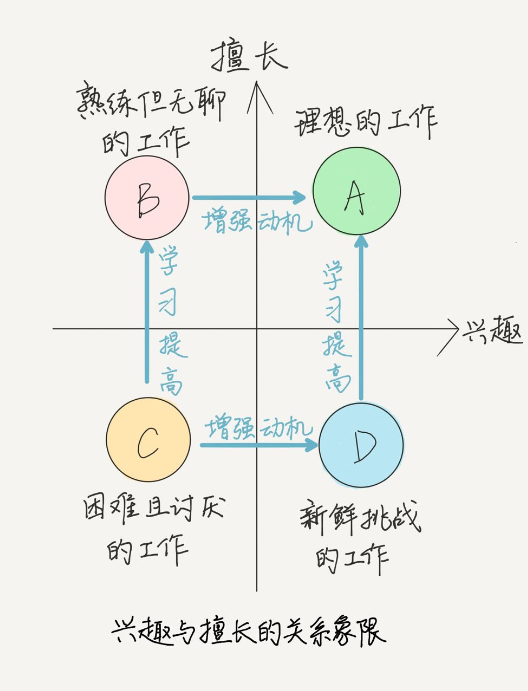
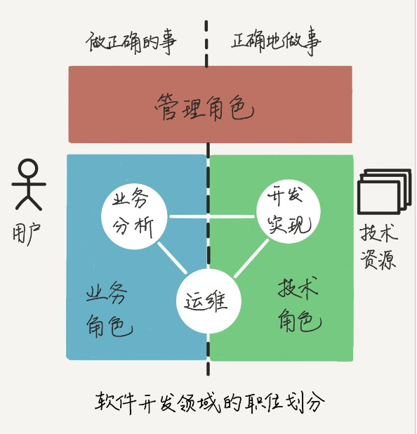
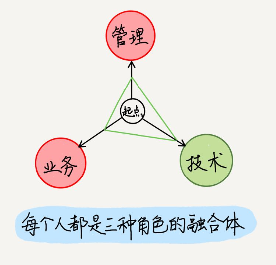
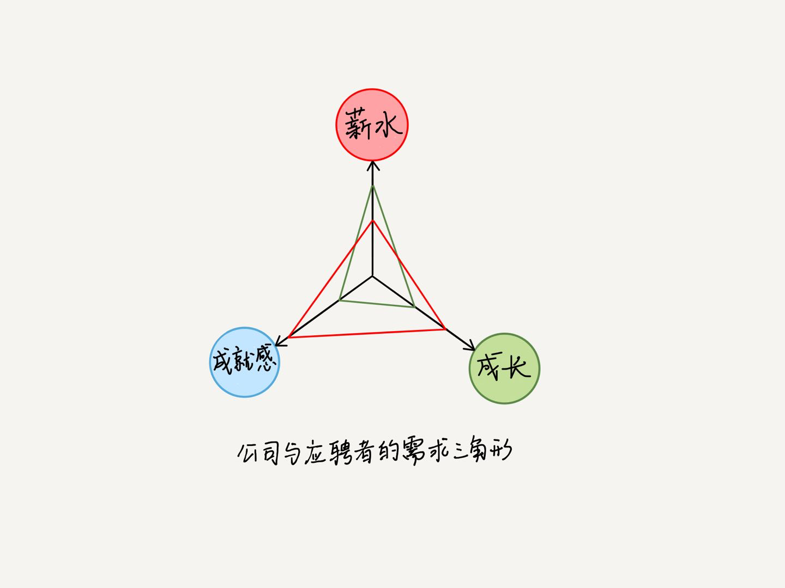
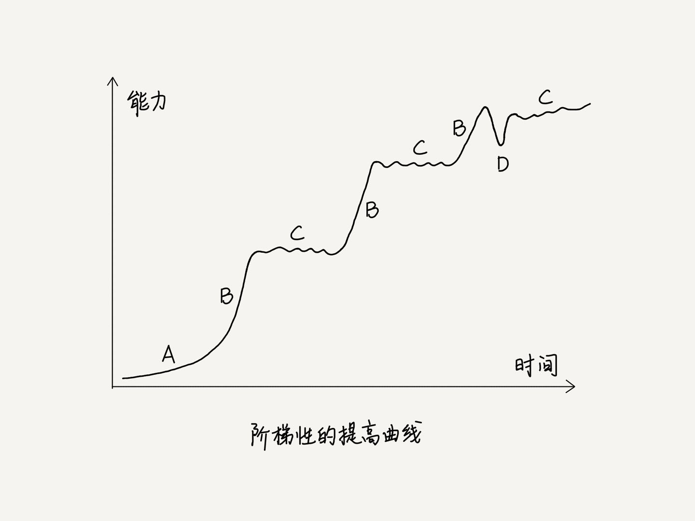
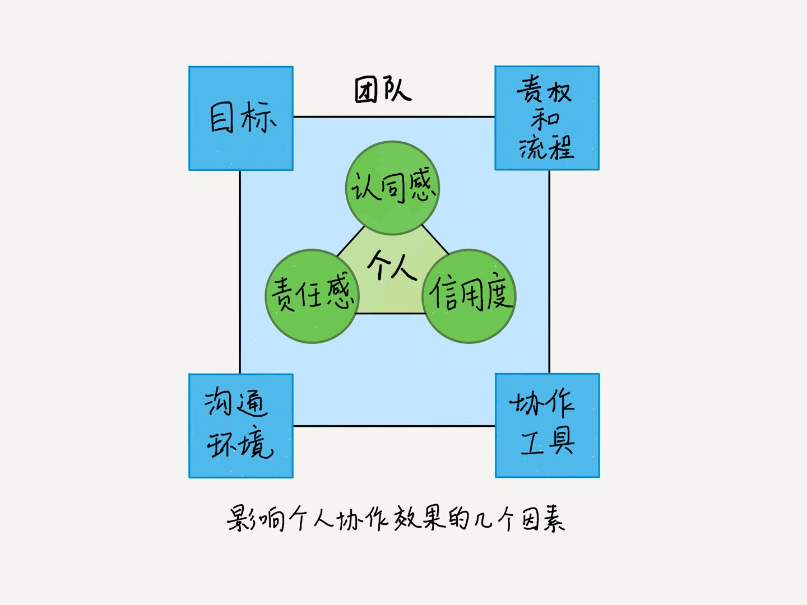
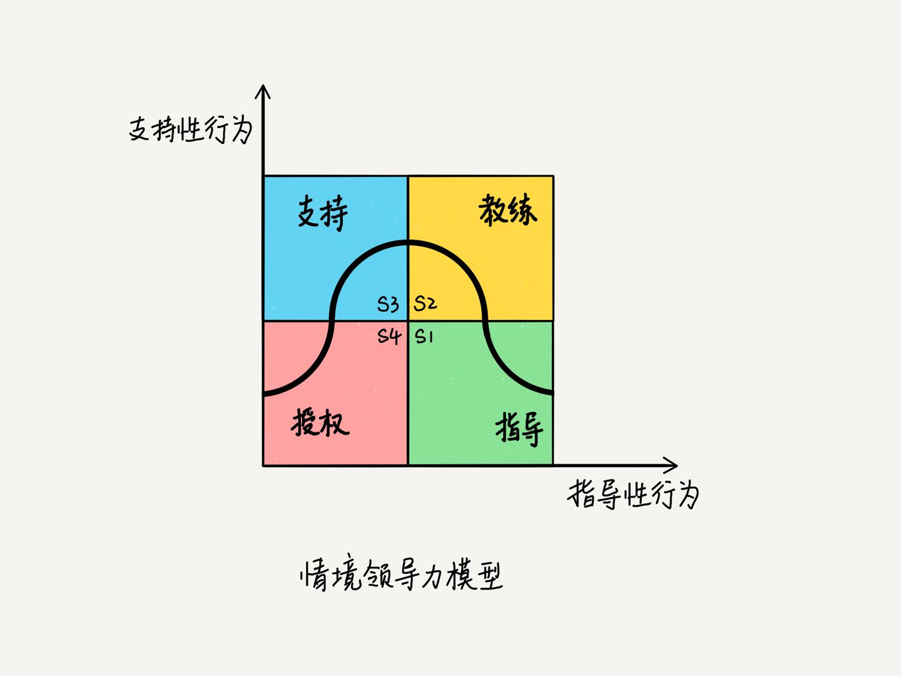
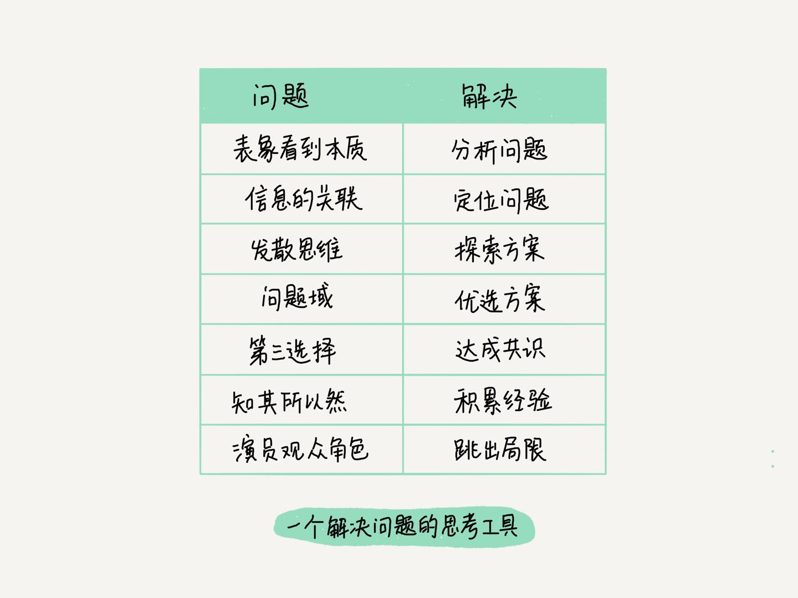
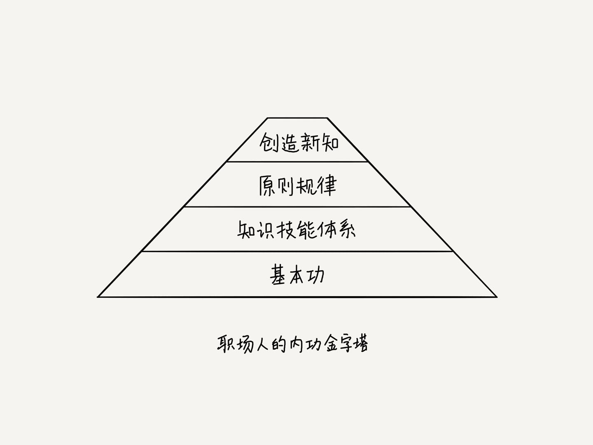

> 面试现场 - 极客时间

需要关注的，应该是应聘者的优点。缺点每个人都有，但是要把工作做好的话，首先凭的是优点。如果优点能发挥到位，缺点能够被其他的因素补足，那这个人就是合适的。

优点发挥得足够强，就可以弥补缺点，除非你的舞台不合适。

所以，面试的核心，对于应聘者，是想方设法让面试官认可自己对职位有用的那些优点。

在这个专栏里，我想要做两件事：
1. 竖一面放大镜，带你看清自己的能力结构（而不仅仅只是关注技术层面），明白培养这些能力的关键因素，并且启发你在自身经历中寻找反映这些能力的素材和故事。
2. 搭一座桥，一座在面试官和求职者中间，让沟通更直接、更到位的桥。让你能够分析面试问题的意图，用有价值、有亮点的经历或观点去回答，让面试官轻而易举地看出你的能力和价值。

# 01 | 公司到底想要什么样的人？
应聘者的素质模型(基于冰山模型), 根据面试关注的要素划分为四个层次：经验、技能、潜力和动机。
1. 经验(Experience)
- 做过什么
- 经验是指工作经历的对象和产出，体现为专业相关的知识和思维结构（Idea），用来指导思考和行为。
    + 经验的时长，不一定跟能力强弱直接挂钩，同样的工作内容重复 100 遍，与 10 遍相比，能力增强不了多少。
    + 但是在众多的职位描述中，公司把经验要求写成“至少 3 年的 XXX 经验”，这种写法相当普遍，因为这基于一个普遍认知：一个智力中等的候选人，在一个技术拓展速度适中的工作中，3 年就可以达到独立、熟练工作的程度；如果是“5 年”，那就能带领别人完成工作了。
2. 技能(Skill)
- 会什么
- 技能是做事的能力，体现一个人的专业性。技能可以让你基于已有的经验，运用新的工具、技术达成产出，形成新的经验。具体到软件产品研发领域，技能有技术、业务、管理等多个方面。

经验和技能，都是你习得的“现货”，但是技能分高低，表现在：
+ 产生 idea 的技能：针对问题，基于经验，收集、理解、分析和制定新的方案（idea），涉及理解、思考、沟通等过程。
+ 执行 idea 的技能：运用工具，把方案（idea）应用到实践，从而解决问题。除了用到理解、思考、沟通，还需要协作团队、管理资源，甚至领导和影响他人。

3. 潜力(Potential)
- 如果你承认潜力，那么就说明你有成长型思维，有成长思维的人认为：技能是可以通过努力获得的，关键是要保持好奇心，平时爱思考、总结、尝试，愿意接受挑战，不怕错误和失败。
4. 动机(Motivation)
- 要想做成事儿，动机的作用非常重要。而且，“动机”决定着应聘者的潜力发挥、技能习得和经验形成，也就是说，动机决定着素质模型上面的三层。
- 按动机区分了三类员工：自燃型(自我驱动)，点燃型(需要激励)，阻燃型(当一天和尚撞一天钟)，

总体来说，在应聘者的素质模型中，经验、技能、潜力和动机是下层决定上层的关系。技能形成经验，潜力决定技能增长速度，动机又决定潜力、技能和经验的发挥。

面试中对这四层的要求，因职位要求不同而不同。

如果是招有经验的人选，希望他入职后就能快速接手工作，会较多关注他的经验和技能层面。而对于校园招聘，因为学生普遍缺乏经验和技能，对其动机和潜力等基本素质的考查就成了重点。

# 02 | 想要成功面试，先要弄懂面试过程
1. 确定是填补空缺还是新增职位，提前预知工作的难度
    - tips: 搞清楚应聘职位是补坑，还是新增，有利于你进一步评估工作难度和胜任度
2. 收集和筛选简历
3. 面试
4. 签 Offer
5. 试用转正。

# 03 | 面试官的面试逻辑是什么？
面试官的目的，就是找到适合职位要求的候选人，而职位要求，最终体现在素质模型的四层当中。

小提示：什么情况下，面试官会判定一个应聘者面试失败呢？有两种情况：一、发现他不适合；二、不清楚他是否适合。也许，你会觉得第二种情况有点不通情理，但事实就是有些被拒绝的应聘者，其实并没有被发现致命的缺点，只是没有被发现突出的优点而已。当然，不够资深的面试官，采用的面试方法和问题可能不够恰当，导致看不清应聘者的能力，但他的补救方法通常是把精力转到下一个候选人身上，除非没有其他候选人了。
所以，应聘者需要有意识地寻找机会，向面试官展示自己的能力，而不要仅以面试官的提问为纲。

总地来说，尽管不同的面试官有不同的判断标准和原则，但是方法都差不多：观察和提问。

### 观察
你不仅要关注沟通内容，更要注意自己的整体形象和举止。

### 提问
问题一般是由浅入深，并且问题之间是有逻辑关系的。一般是这样的提问模型：表层事实 -> 深度细节 -> 感受和观点

这些问题的一个基本原则是：基于过去的行为（行为面试法）。你也要用经历去作答。一般的回答，是只停留在原则上，而让人眼前一亮的回答，是会用具体事例描述细节的。这样面试官才能了解你真正的做法、想法、质量，而不是认为你在照本宣科。

在细节的描述上，可以使用 STAR 法则：
- Situation, 情境, 指要解决的问题和背景
- Task, 任务, 指要承担的责任和角色
- Action, 行动, 指方案和做法
- Result, 结果, 指效果和意义

在面试官充分了解了某段经历和技能之后，可能会继续问下一层的问题：感受和观点。这也是考查你的潜力和动机，包含事后的总结和改进有没有到位，是否具有成长型思维。比如“这段经历你感觉最折磨人的地方是什么？”“你满意这个方案么？” “你学会了什么？”“为什么你当时要接手这个任务？”“你怎么评价你的队友？”这类问题很难回答。你的回答会包含大量的价值观、性格品质等信息，如果之前没有总结过的话，你的回答可能没有深度，而且如果只是表态的内容（比如“我为了团队愿意做任何事”），没有事例去讲的话，也不会让面试官感动和信服。

#### 问题背后的意图
正因为面试官的问题之间是有逻辑关系的，并非孤立和没来由的，所以我们得到一个启示：碰到意外的问题，不要意外，先想下为什么面试官问这个问题。

#### 小练习
用自己做过的一个项目任务，试着回答下这几个问题：
- 为了完成这个任务，你用到了哪些新的技能或者工具？（表层事实）
- 你是如何用这项新技能或者工具完成任务的？（深度细节）
- 你如何和同事合作的呢？请用一个事例说明一下。（深度细节）
- 这个任务中，你最有成就感的地方是什么呢？（感受和观点）
- 什么因素，是你完成这个任务的关键呢？（感受和观点）


# 04 | 现在的你，到底该不该换工作
换工作，不只是换一下职位这么简单，你还要适应新项目的技术栈、业务环境、公司流程和团队文化等等，而且，如果你是跨行业，那么你连行业经验都要重新积累。这个沉没成本是巨大的。

所以在换工作前，你一定要想一想，是什么导致你对目前的工作不满意呢？马云曾说：一、钱，没给到位；二、心，委屈了。我觉得还有一条：路，堵住了。也就是说，你在这里的发展到头了。

事实上，这三点是衡量工作满意度的三个指标：“钱”是物质保障水平，“心”是精神满足水平，“路”是能力发展通道，而能力有了发展可以进一步提升前两条。

对于该不该换工作，我的建议是先从物质保障、精神满足和能力发展三个角度看自己的满意度，再从下面三个方面评价一下你的工作：
- 可接受的薪酬
    + 但不要只拿薪水来定义工作的好坏；
- "合适"的事，做的事是否有挑战、有发展，不要只看公司大小，团队更重要；
- "合适"的人，团队的信息共享程度，决定了配合度，而且一个好老板也很重要。
    + 好老板，我认为应该具备以下三个特点：
        1. 开拓业务，不止于守住眼前的“一亩三分地”，还有着强烈的攻城拔寨的斗志。
        2. 打造团队，营造开放共享、赏罚分明的环境。
        3. 是个好教练。

# 05 | 喜欢或擅长的工作，你该选哪一个？
这样的情境其实很常见：一份工作做久了，所需要的技能越来越擅长，渐渐成为重复性劳动的时候，你没有了新鲜感和成就感，就难免会失去兴趣；而对于看起来很感兴趣的另外一份工作，你又担心自己不擅长，做不来，不敢轻易转换。

上篇我们讨论了工作满意度的评价因素“钱”“事”“人”，今天我们把兴趣和擅长单独拿出来讨论，看看选工作时一个常见的困境：一个擅长但不感兴趣，一个感兴趣却不擅长，该选哪个呢？别急，我们先来看看兴趣和擅长的关系。



简单来说：动机会影响你的兴趣强弱。缺少动机，兴趣减弱，条目会在坐标系中左移；增强动机，兴趣增强，条目会右移。通过有效学习，工作项会上移。

总地来说，感兴趣的，我们有意愿做好；擅长做的，我们有能力做好。

而且，意愿和能力会随着工作的内容和难度的变化互相影响： 
- 当前不擅长的，将来会因为兴趣而擅长；
- 当前不感兴趣的，将来可能会因为擅长而感兴趣。


所以，选择兴趣或擅长时，可以参考以下原则。
- 稳定原则：选择兴趣或擅长，不能只看当前的状态。要发展到产出层看，而不是只在好奇层和消遣层，这是因为产出层的兴趣和擅长（包括引领层）才是稳定的、深刻的，对你有重要意义的。
- 小步快跑原则：不管选什么工作，技能跨越的难度对你而言，不能太大，也不能太小，否则就容易失去兴趣，从而停滞不前。

全球著名的商业咨询公司盖洛普通过长达 25 年，对超过 200 万人的数据统计和调查，提出了著名的“优势理论”：只有充分发挥一个人的优势，才有可能在工作中达到持续完美的业绩表现。这启发我们，为了做出好的业绩，对于发展到产出层的兴趣，如果还不擅长，那可以考虑其他擅长的工作了。

本文的主旨，是希望让你看清兴趣和擅长的发展过程，使你既不浅尝辄止，也不至于死守不放。

你要做的，不仅是在兴趣和擅长中做选择，更重要的是，要有能力促使兴趣和擅长的发展，使他们逐渐重合。

# 06 | 职业规划一：你真的想好要怎么发展了吗？
这个问题，牛人有所想，有所不想

如果你在十几年前问我这个问题，我会一脸羞愧：“这个……没想过。”后来，我也问过几个身边的牛人：
```
问：“你刚工作的时候，是不是就有创业做 CEO 的目标了？”
答：“没有呀，后来我看到机会才动手。做着做着，就觉得该弄出点不一样的事情了。”
问：“你还是程序员的时候，怎么给自己定目标做技术总监的？”
答：“我要成天想这个，就当不上总监了。能力够了，机会自然是你的了。”
问：“你原来搞技术，现在是自媒体大 V，这是规划好的么？”
答： “不，是意外，从来没想过做自媒体。”
看起来，大佬们一开始也不知道自己要发展的方向呀。等等，是不是我的问题有毛病？以上对话中，我还用下面的问法问过：
问：“你刚工作的时候，做了些什么，对你后来创业有帮助呢？”
答：“你知道，我比较喜欢掌控个事，另外呢，我工作中注重两方面，一个是开拓视野，另一个是积累资源……”
问：“你觉得你是怎么一步一步从程序员，做成技术总监的？”
答：“这个要注意技术深度和宽度，一点一点地扩展，同时把关注点扩展到技术的应用价值上。”
问：“从架构师到自媒体大 V，有什么联系么？”
答：“表面上看，完全是两件事，但是它们都用到了我的知识体系和表达能力，而且都是在帮助别人，都能带给我成就感。”
```
你看，换了个问法就能得到干货了，把问将来的目标，改成问当下的做法。这说明：这几位牛人，并不是一开始都能把将来的路想明白，但是，也并不是什么都不想，只顾低头工作。那么问题来了，“想要怎么发展”，该想什么，不该想什么呢？

职业发展问题，有三个要素：当下（AsIs）、愿景（ToBe）和过程（How）。所以，你需要思考下面三个问题：
我的愿景是什么样子？我当下是什么样子？我要做什么，才能从当下走到愿景？

当我们思考愿景的时候，都会思考哪些层面的内容呢？首先是心理愿景，其次是职业愿景，最后是能力素质资源愿景。
- “心理愿景”体现你“要什么”
- “职业愿景”体现你“做什么”
    + 职业包含四个维度：行业、公司、职位和级别。不同职业的社会地位、经济收入、劳动付出都不同，这些会影响到第一层说的心理愿景。所以你看，如果你把心理愿景先定好了，那职业的性质也就有设定了。
- “能力素质资源愿景”体现你“能做什么”

总体来看，以上三个层面中，心理愿景会受职业愿景的影响，你可以通过选择合适的职业来达到心理愿景；而职业愿景的达成，其实又是在拼能力素质资源（一些靠关系的咱不提哈）。因此，当你构建愿景的时候，应该留意最基本的那个方面：能力素质资源愿景，是它决定了职业愿景和心理愿景。

回味一下开篇的那些对话，那些牛人一开始也看不清多年后要从事什么职业，只有心理愿景。他们的关键动作是，基于当下的条件，先选择能力方向，确定能力发展路线，在发展中选择时机调整职业。

这个过程中，他们逐渐调整和接近心理愿景，获得满足感、成就感。这正是职业规划的五个步骤：
- 构建心理愿景：确定你想要什么。
- 选择或调整能力方向： 比如具体选择哪种技术、哪种业务（行业）、什么领域的管理等等。
- 发展：你怎么一步一步发展这些能力？
- 选择或调整职业：有了这些能力素质资源之后，你要继续当前职业，还是要换个职业？
- 反馈：工作中获得的心理满意度，和心理愿景对比，反馈到能力、发展、职业的活动中，对其调整，或者调整心理愿景本身。

纵观整个循环过程，可以看出，职业规划，你要直接规划的不是职业变动，职业变动是结果，要直接规划的是能力素质资源的发展和提高。

我非常欣赏 IBM 一位超级大牛的名言：“要让职业发展追着你走，而不是你追着职业发展走。” 其含义是说，你如果能力不到位，只追求职位升级是徒劳的，如果你有很强的能力，在公平开放的公司文化中，自然就会有合适的职位和机会让追着你走让你升级。

# 07 | 职业规划二：程序员后来都去干啥了？

我们在上图中间画一条分割线，把软件产品团队除了管理人员，一分为二，靠近用户一端的这组角色，包括产品经理、业务分析师、业务运营等职位，作用是确保产品功能体现客户价值，也就是“做正确的事”，这组角色是业务角色；而靠近技术资源一端的这组角色，包括架构师、开发、测试和系统运维人员等，负责高效高质地做出产品，也就是“正确地做事”，这组角色是技术角色。另外，在这两组角色之外，还有一组管理角色，包括项目经理、部门经理等职位，负责业务战略、项目执行、团队管理等。这样一来，我们就把软件产品团队的角色分为三类：业务角色、技术角色、管理角色。

虽然这三类角色的目标都是为用户递交高质量、高价值的产品服务，但各自有明显不同的关注点，他们的思维模式也不一样。为了让你更清楚地了解他们的不同，我举个例子。比如我们让这三类人分别解释一下“圆”这个图形：
技术人会说：拿一条绳子，按住一头不动，另一头转一圈，画出的轨迹，就是圆。（他在强调用什么工具技术来画圆。）
搞业务的人则会说：这个图形就像十五的月亮，每段线条都很光滑，很完美，生活中有很多地方用到它。（ 他在用形象化的语言解释圆的外观、属性，以及应用价值。）
搞管理的人则会把技术和业务两人叫到一起，对技术人说：“你要用什么样的绳子？这么做费不费劲？”对业务的人说：“你的说法倒是可以验证他画得好不好，可是，十五那天要是阴天你就没法验证了。” （他不关注怎么画圆，但是关注画圆的资源，最终的质量、验证方法，还有风险。）

你看到了么，技术角色关注的是设计实现，业务角色关注的是功能价值，而管理角色关注的是质量、过程控制和风险。

下面我们一起详细讲讲这三类角色。
1. 技术角色
“T”型人才：纵向有技术深度，横向有技术广度，他们对新技术有敏锐的嗅觉，关注、掌握甚至引领技术发展的动态和趋势。
2. 业务角色
业务角色把用户价值翻译成产品功能，保证产品团队做正确的事。

用户是多种多样的，其原始需求和痛点也是多样的、多变的，很多时候，甚至用户自己也不清楚需求是什么，到底痛在哪里。假如用户想要一种更快的交通工具，但是他没见过汽车，就只能指着满街的马车，说想要一匹更快的马了，然后还说最好不要拉臭臭，因为他的痛点之一是现在街上马粪太多太臭。产品经理如果只理解字面意思，最后的产品也许就是穿着纸尿裤的赤兔马了。

所以，优秀的业务角色能够换位思考，就是有同理心，能站在用户角度考虑问题，也能站在技术人员的角度理解问题

我觉得业务人员的发展有如下几个阶段：
- 初级的业务人员，参与需求分析和产品功能设计，通过对用户心理和行为的调研，选用恰当的 UI/UX 元素和设计原则，并和技术人员沟通可行性，构建产品原型，同时满足技术成本要求，又提升用户满意度。这时，他关注的是交互设计和用户体验，即这样的操作设计能多好地实现既定功能。
- 产品经理则主导业务分析和负责整个产品设计，推动产品的实现和运营，参与产品 Idea 的产生过程，对市场分析和产品生命规划有一定的了解。贡献在于甄别真正有价值的问题，定义产品功能和优先级，确保解决用户问题，创造用户价值，并通过产品价值指标来衡量和验证。这要求产品经理具备价值判断能力和很强的沟通能力。
- 发展到产品总监级别，要主导市场分析和产品规划，掌握用户群体的属性，负责产品 Idea 的产生，进行产品全生命周期管理，要求有丰富的行业知识和深刻的市场洞察。此时已经兼具业务和管理职责了。
再往上就该是公司老总级别了，主抓公司战略，业务方向和市场布局。负责整个公司的运作。

3. 管理角色
这里有必要区分一下管理和领导的概念。以上说的是管理（Management），是有具体头衔的职位，管理具体事务或者人；而领导（Leading），是从管理中分离出来的影响他人的行为，不一定有具体头衔。也就是说，即使你是一个技术人员，不是部门经理，也可以在团队中具有领导力（Leadership），你的技术权威，可以影响他人的决定和行动。

尽管管理者们的管理风格多种多样，但是有一个基本的特质是：有条理（Organized），也就是善于安排事情的优先级和组织过程，目的是保持秩序，使过程可控。一个 Organized 团队中，角色分工明确，工作先后有序，大家配合默契，资源随用随取，流程清晰简洁，成功率很高，能够最大限度地降低不确定性。

所以想想自己，即使还没有管理的头衔，就日常的事情来说，你是否趋向“有条理”呢？

### 角色融合

当我们刚开始工作的时候，会着力在一种角色上发展。但是发展到越高的阶段，越会发现只有一种角色的眼光和技能是不够的。拿架构师来说，如果眼里没有业务和用户，即使采用的技术再好再新，不能解决用户问题，也不是好的架构师。另外，如果架构师没有管理思维，无法在团队中发挥技术影响力，就不能把设计的精华落实到产品中去，也不能带出精兵强将来。

技术、业务和管理的角色，本身没有好坏之分，只是关注点不同，你需要根据自身特点，选择适合的发展方向。

# 08 | 如何让你的简历更受青睐
很多面试官都承认，如果看到一份中意的简历，会用“发现优点”的眼光在面试中对待这位应聘者；相反，如果看到一份差强人意的简历，会用“排除缺点”的眼光在面试中考查应聘者。简历给面试官造成的“第一印象”起着非常重要的作用

那么，怎样的简历更容易受到招聘人员的青睐呢？我认为，简历首先要“有价值”、“易匹配”和“没硬伤”；如果你还想让招聘人员对它刮目相看，就一定要做到“有亮点”

### 有价值
对招聘人员来讲，简历“有价值”，是指他能看到要找的信息。什么信息呢？还记得第一篇说过的应聘者素质模型么？包括你的经验、技能、潜力和动机四个方面。接下来，我说说如何在这四个方面体现价值。
- 经验，包括专业经验、管理经验和行业经验等等。
    + 职位描述里会清楚地列出经验要求，比如“做过 3 年以上 Java Web 开发”“负责过 50 人以上规模的团队管理”“有金融风控管理经验”等。你需要在自己的经历中寻找匹配的经验，总结相关成果，提炼出自己的贡献和业绩。
- 技能：包括专项技术能力、管理能力、沟通表达能力、协作能力等等，不同的职位，有不同的技能要求。
    + 能在职位描述里也有清晰的表述，比如“具有较强的业务分析能力，能够快速理解和分析复杂的业务逻辑”“流利的英语口语”等。
- 潜力，技能提升的能力，
    + 潜力是职位描述中可选的内容，比如“学习能力强”“有成长型思维”等。你需要通过提炼自己经历中的事例并将其精炼成一句话来展现这些特点和品质。比如：“一个月学习 Python，率先引入 XX 框架，提高功能测试覆盖率到 70%。”这句话，既包含技能，又包含学习和应用能力，还有工作成果，显示了你的潜力。
- 动机。
    + 动机决定了做事的内因，招聘人员通过对动机的考查，来看其稳定性和工作意愿。

简历中最重要的内容是：技能和项目经历。

技能，需要按照领域分类，以列表的形式呈现在简历里。同时，要标明技能等级。等级可以用“精通”“熟练”等词标识，或者用工作年数标识。把最对口、最熟练的技能往前放。那些只是了解，还没有使用过的技能，可以不列，否则面试的时候被问到也很尴尬。

项目经历，体现你的工作资历和能力价值。每一段项目经历，都有其独特性，都有价值点可挖。但是，很多简历这块并没有写好。我总结出下面一种写法，一段项目经历可以用下面的结构来描述：为了 < 某某问题、某某目标 >。要突出复杂性；我采用了 < 某某方法、技能、流程 >。要突出创新性；达成了 < 某某成果、意义 >。要突出提高。

举个例子。为了吸引读书 App 的用户成为收费会员，我们 5 人小组，用两个月的时间，做出“消费对比”功能，其中最复杂的是预测模型。我负责模型选型，采用了组合预测模型，解决了预测消费的复杂性，并且优化权度，提高了准确性，使得 App 上线后，入会人数月均增加了 60%。

### 没硬伤
“没硬伤”是指简历没有显著的问题。这里有一些常见的毛病，可能是很多人会犯的。
- 内容不真实、页面太花哨、笔误、内容导致歧义或误解、职业发展不衔接、换工作太频繁。

# 有亮点
做到“有价值”“易匹配”和“没硬伤”，只是让你的简历合格，若要达到优秀的标准，就必须做到“有亮点”。

所谓“亮点”，就是和别人相比，让招聘人员觉得你出类拔萃、与众不同的地方。例如:
- 如果你是应届毕业生，拿到全国数学建模大赛的奖项、在知名公司的实习经历都是亮点。
- 作为 Java 程序员，参加过开源项目开发，得星过百，是亮点；
- 作为技术人员，拥有国家专利，发表过技术文章，也是亮点。

这些例子中的亮点，是大家公认的耀眼的成绩。如果你说“我没有那么耀眼的成绩怎么办”，也没关系，你可以尝试在项目经历、个人经历和兴趣爱好中，找出影响较大的事项，寻找“过程性”“生活化”的亮点，比如：
- 坚持每天晨跑，说明你很有毅力；
- 喜欢看电影，习惯给看过的每部影片写影评，说明你喜欢思考总结、爱分享；
- 半年成功减肥 20 斤，说明你肯吃苦、意志强。

小提示：尽量把你的亮点总结成简练的一句话，尽量加上数字来说明它的影响和意义。例如：从学校毕业，我保持了每月至少读 4 本书的习惯。

另外，如果简历里中加入了可交互、可展示的内容，更能显出你的能力与众不同。例如，成果 Demo 的链接、个人项目的 GitHub 链接、技术博客链接等。

# 09 | 经历没有亮点可讲？你需要做份“详历”
### 如何找亮点？
很多人都说难于发现自己经历的亮点。这是个普遍的现象，类似于“知识的诅咒”：你对做过的项目虽然了如指掌，却不容易看到哪些是别人认为了不起的价值，也总结不出当初用了哪些醒目的技能。正所谓“不识庐山真面目，只缘身在此山中”。

但是也不是没有办法，下面我们就一起来看看如何跳出这座山，换一下视角，尝试找找那些有价值和有亮点的地方。

1. 转换角度找价值
    - 这是要回答“我为谁、解决了什么问题”。

你可以考虑以下方面：
- 公司角度。
    + 项目为公司贡献了多少收入？降低了多少成本？完善了哪些产品和服务？对公司品牌和竞争力有什么影响？解决了老板的什么问题？
- 客户角度。
    + 你的工作为客户解决了什么问题？假如你是客户，最有用的功能是哪些部分？客户对你的工作满意么？
- 团队角度。
    + 你的工作，完成了项目使命吗？对资源配置有什么影响？对产品质量和人才培养有没有促进作用？别人可以享受到什么好处？对团队凝聚力和战斗力有什么作用吗？
- 个人角度。
    + 做完这个项目，你最大的成就感是什么？有哪些值得自豪的？这些收获和自豪，是源自物质，还是精神，还是成长？

哪怕你从以上角度仅仅找出一点价值，也是了不起的。然后，你还要进一步分析自己的工作和这个价值点之间的关系，把两者联系起来，然后你会发现尽管工作是平凡或者琐碎的，在全局看来，却是必不可少的一环。接下来你需要分析工作的过程，找出是由什么技能和动机推动完成的。

2. 量化结果找提高
    + 这是要回答“我在哪方面做了什么提高”。

项目开始之前会对项目结果设定一些目标，其中包含度量指标和度量方法，用来看结果的质量和完成度。

3. 复盘过程找创新
    + 这是要回答“我的做法有什么与众不同”。

创新不一定是发明专利，也不一定是开创新算法之类的大创新，任何不拘泥于前人的条条框框，灵活运用，让工作更顺畅、更简单的做法，都可以称为创新。

创新包括新工具的引入、算法的改进、流程的简化、协作的优化，等等。这些轻巧的、灵活的创新，对工作的提高带来潜移默化的作用，展示了你工作中关注细节、精益求精、持续提高的精神，是面试官非常看重的亮点。

4. 回顾挑战找动机
    + 这是要回答“我解决了什么挑战”。

回想过去一段时间内（一年或者一个季度），有没有什么时刻，自己内心充满了紧张？这段紧张表明你碰到了挑战，请把这个挑战找出来，仔细分析：
- 哪些方面给你造成了挑战和压力：是工作量，还是工作难度？
- 难在哪里？是复杂的技术？是复杂的沟通？是新队伍、新项目，还是陌生的领域？
- 你做了什么，才缓解了压力？
- 这段挑战过后，心里有哪些满足感？这和你当初接受这个挑战时的期望吻合么？
- 如果接下来还有这样的挑战，你会选择继续么？

以上问题，是为了探索选择挑战的动机。如果工作中，没有遇到什么挑战（这是不是说明你一直待在舒适区呢），你可以转向生活中去寻找。比如你坚持长跑，或者成功减肥，甚至坚持参加公益活动，也都能显示出你的某些价值观、性格层面的动机。面试官选择应聘者时，经验和技能是重要因素，但他们更看重的，是应聘者的动机。有个说法，叫“论态度招人，论资质培养人”。你对工作的热情，源于动机。把你的价值观和追求，融合到经历中，总结成亮点，也非常不错。

以上四个方面的分析，实际上是你深入了解工作的过程。你明确了每个项目对全局的意义，梳理了重要的工作成果以及度量指标，回顾了工作的过程和难点，以及用到的流程、工具、技能等资源，发掘了自己的工作动机。更重要的是，你仔细思考了每个工作环节为什么要这么做，能做什么提高。这种对工作细节的把握，本身就是亮点。只有优秀员工才会思考这些，你现在已经做到了。

### 把亮点汇总到详历
上面从价值、结果、创新和动机四个方面，讨论了找亮点的角度和思路。接下来，你需要逐个分析这些亮点，对照能力素质模型中的四层，看能反映出你的哪些特质。这是个自省自知的过程。

然后，你要把亮点和相关经历融合在一起，总结成故事（澄清一下，这里说的故事，可不是杜撰的故事，是截取具有完整性的一段真实经历）。每个故事可以选择下面的结构来组织：
- 开头，“有段经历，正好遇到了这个问题……”。（讲清问题背景）
- 发展，“一般的做法是做不到的，因为……”。（讲问题的复杂性和挑战）
- 高潮，“我一开始用到……后来……”。（讲解决方案的形成过程）
- 结局，“成果是……”。（讲结果、影响、意义）

详历主要有三个作用：
- 有助于职业规划，可视化技能体系、经验分布和成长路径。
- 是定制简历的母版。
- 提供面试素材。当被问到“这个项目最大的提高是什么”，或者“你失败的一次沟通是怎样的”，你可以从准备好的详历中，快速选取恰当的故事，讲给面试官。

在详历中，你可以按照时间顺序，以项目为单元，组织故事，也可以按照能力维度来组织故事。而且，一开始构建详历时，不求一次把过去的所有经历都提炼出故事，可以重点考虑下面的经历：
- 受人瞩目的、引以为豪的成果，你是如何做到的？
- 提高和创新的部分，你是怎么做的？
- 最困难、最复杂、最有挑战的部分，你是怎么样做的？
- 从技术、业务和管理三方面，找出自己提高的地方，你是怎么提高的？

### 总结
总结一下今天的内容。今天，我从价值、结果、创新和动机四个方面，讨论了找亮点的角度和思路：转换角度找价值、量化结果找提高、复盘过程找创新、回顾挑战找动机。通过这个过程，我希望能够加深你的工作认知，让你更加了解自己在工作中的表现。当你把含有亮点的故事，按照项目集结到详历中，可以更加方便地针对某招聘职位定制简历，并为面试问答提供切实而丰富的素材，而且还有助于你更好地制定和调整职业规划。

# 10 | 面试紧张怎么办？
在面试这个场景下，求职者和面试官的权力是不对等的，因为很多人有下面的想法：
```
    面试要去公司的主场；
    面试官可以海阔天空问，但是我不能随心所欲答，稍有不慎，就会空手而归；
    我的能力不一定满足人家的要求；
    给不给 Offer，也是面试官说了算；
    即使拿了 Offer，也是要去给他服务的，拿人家工资的。
```

在这种压力下的对话，怎么会不紧张呢？

但不妨换个角度考虑这个问题，面试其实和相亲差不多，面试看似权力在面试官，其实是双向选择。假如求职者是相亲的小伙子，职位就是相亲的姑娘，面试官就是姑娘她妈。你一定知道，相亲不是只有丈母娘挑小伙子，小伙子也在挑姑娘（和他未来的丈母娘)。

因此，首先你要明白面试是双向选择的过程，虽然这种选择权利的不对等暂时存在，但是如果碰到合适的应聘者，面试官也担心人家看不上这个职位, 所以，只要你有能力，能在面试中尽量表达出来，你的权力反转时机马上就到。

再从主观的角度来看，求职者面试的紧张程度与其对职位的期待程度成正比，与其对自身的自信程度成反比。


时刻谨记，你的目的是向面试官尽可能真实地展示你的工作和思考，把他看重的那部分给出足够的细节，赢得认可。适度的紧张，反而有利于你保持思维活跃。

# 11 | 面试答疑（一）：说说你面试中的一些困惑
# 12 | 如何做好开场：给自我介绍加“特效”
自我介绍一般是面试的正式开始，差不多是必答题。但是很多应聘者表达得像白开水，平淡无味。你的自我介绍怎么样呢？不妨思考下面几个问题，它们多少能反映你的准备是否充分，回答是否到位。
- 你针对不同公司、不同职位的自我介绍有什么不同么？
- 介绍中间你被面试官插嘴纠偏过么？
- 面试官有没有专心听你的介绍？
- 面试官听你介绍的时候，表情有没有什么变化？有没有中间记下些什么？
- 接下来面试官的提问是新话题，还是继续延伸你介绍中的某个点？

自我介绍对应聘者的意义
- 首先，自我介绍是塑造第一印象的重要部分。
- 其次，自我介绍是暖场。
- 再次，自我介绍是你第一次有机会掌握话语的主动权。

所以，自我介绍是应该精雕细琢的关键环节。那么如何做好自我介绍，甚至为它“特效”加身呢？我们先得了解面试官想从中得到什么。

### 面试官能从自我介绍里得到什么
面试官期待从应聘者的自我介绍里，听到下面这些信息：
- 经历概括，从而了解你的职业发展路径。 应聘者在这么短的时间内提及的项目、角色和职位，肯定是他觉得非常重要的，面试官接下来会重点考查。
- 经验和技能总结，从而简单评价应聘者的经验面和技能等级。同样，对于重点提及的经验和技能，后面要考查。
- 表达风格和气场。面试官知道自我介绍基本都是提前准备好的，这个回答体现不了多少临场的语言组织能力，但却可以看出应聘者的表达风格：是富有激情的、沉稳平静的，还是小心谨慎的？也可以感受到应聘者的气场：是张扬、自信、谦逊，还是自卑？
- 简历内容之外的信息，比如职业规划、跳槽动机、其他亮点等。这部分的发挥，往往会起到意想不到的效果。

面试官不想听，或者不会在意的一些自我介绍信息有下面这些：
- 简单地重复简历上的条目；
- 自己的主观自评；
- 用口号化的语言来表白对这份工作的向往；
- 项目和技术细节（此时还没到考查细节的时候，面试官会打断你）；
- 其他与个人经历不相关的信息。

成功的自我介绍，应该达到下面三层效果：
- 满足面试官对信息的期待；
- 产生好感；
- 记住你。

#### 第一层，满足面试官对信息的期待
这是对自我介绍的基本要求，把个人信息、主要经历、经验和技能有条理地组织起来，有逻辑地讲出来。这考验你的逻辑表达能力。

如何组织经历呢？
对于经历丰富的应聘者，需要找出多段经历的关联性和发展变化，形成连贯的职业发展和能力上升路线。经历需要注意精简，比如把有关联的内容合并到一起描述。例如：“我先后在两家公司，做过 4 年业务分析师、2 年产品经理和 2 年人力经理，负责过 B2B 和 B2C 系统的业务分析和产品设计，以及 10 人团队的部门管理。因为感觉目前在公司能力提升有限，向往外企的管理文化，所以来应聘您公司的经理职位……”

#### 第二层，产生好感
这是通过第一层里有价值的内容，与面试官的友好互动，让面试官产生好感，引发更多的沟通欲望。

#### 第三层，记住你
自我介绍时可以选择一两个亮点加进去。注意，这些亮点，要有细节。细节能让自我介绍更生动、更让人信服，让你令人印象深刻。

这里说的细节不是几百字的起因经过结果，细节可以是精炼的数字或者例证。比如“我把 XX 算法开源到 GitHub 上，得到了 100 个星评”（如果面试官是 HR，你要想好怎样解释 100 个星代表什么含义）。
细节还可以是升华的感受或者评价。比如“完成了这个挑战，不仅对高并发有了深刻的理解，还意识到自己尚有潜力可挖，实在应该感谢 XX 当初把我硬推到这个职位，我觉得要想快速提高自己，就要不怕挑战。而且，你要想到自己的成长，还要想到团队的需要。”
细节还可以是转折和波澜。比如“本来项目进展很顺利，可突然一个核心开发提出离职。我采取了两方面的行动，才解决了问题……”这样的细节，能引导话题，形成铺垫，留下一个悬念，待面试官在接下来的面试过程中追问。

今天，我讨论了自我介绍在面试中的重要性，展示了面试官想要在自我介绍中了解什么，不想了解什么，并提出自我介绍要达到“满足面试官信息期待”“产生好感”和“记住你”的特效。

我建议灵活运用这些方法，让你的自我介绍不再是流水账，而是生动地划重点、讲故事，把你对职业的理解和对工作的热情，清晰得表达出来，和面试官形成内容和情感的双重互动，让他开始有意愿了解你，接近你，为接下来的问答，开一个好局。

# 13 | 你真能讲明白技术吗?
技术的水有多深？
我们先说技术可以从哪些方面来讲，看看技术的水有多深。
技术是为了解决问题而生的。本质上，技术就是解决问题的方法。问题规模越大，难度越复杂，就要引入多种技术。这些技术组合搭配起来，构成该解决方案的一棵“技术树”。其实，每一个分支和叶子都有多种可选的技术，随着更多的创新出现，这些分支和叶子也在演变，使得整体方案在空间和时间上，能更高效更节省地解决问题。我们对这些分支和叶子技术点的了解和运用，甚至对它们演变的推动，都体现了我们的经验和技能。

那么，一个技术领域，我们需要阐述哪些层面呢？我觉得可分两个维度，一个是技术的设计维度（从技术内部看），另一个是技术的应用维度（从技术外部看）

从两个维度讲清技术.jpeg

1. 应用维度
问题这层，用来回答“干什么用”。
技术规范，回答“怎么用”的问题，反映你对该技术使用方法的理解深度。
最佳实践回答“怎么能用好”的问题，反映你实践经验的丰富程度。
市场应用趋势：这层回答“谁用，用在哪”的问题，反映你对技术应用领域的认识宽度。

2. 设计维度
目标：为了解决用户的问题，技术本身要达成什么目标。比如，Java 多线程要在优先级调度、锁、信息同步等方面达成怎样的目标，才能更好地实现并发。这层定义“做到什么”。
实现原理层回答“怎么做到”的问题。把实现原理弄懂，并且讲清楚，是技术人员的基本功。
优劣局限层回答“做得怎么样”的问题。对技术优劣局限的把握，更有利于应用时总结最佳实践，是分析各种“坑”的基础。
演进趋势：技术是在迭代改进和不断淘汰的。了解技术的前生后世，分清技术不变的本质，和变化的脉络，以及与其他技术的共生关系，能体现你对技术发展趋势的关注和思考。这层体现“未来如何”。

你有多懂面试官？
只听懂面试官说的字面意思，不一定能给面试官满意的答案。很多时候，应聘者并不能准确理解面试官想要听的点。

注意表达方法
回答提问时还应注意选用适当的表达方法，展示你的表达能力。这里，我给你一些建议
结构化表达，帮助面试官梳理信息逻辑。
可视化。用画图或者演示的方法，直观形象地表达复杂的技术问题。
举例子和做类比。
对比。
讲故事。如果你能找到一段相关经历，讲述该技术的应用或者学习细节，展示你学以致用的能力，效果会非常好。

总结一下今天的内容。我提到了将技术问题讲明白的两个重点：把握技术的维度，和如何更懂面试官，使他更满意你的回答。

总之，能把一个复杂的技术问题，深入浅出地讲明白，非常考验你对技术的理解深度，和表达能力，你需要通过平时对技术的积累，和表达能力的锻炼来不断提高。

# 14 | 怎样展示你在项目中的重要性？
面试中除了专项技术问答，另一个重头戏是“盘问”应聘者做过的项目。面试官通过了解你的项目工作，可以看到你和团队的协作过程、工作成果，以及你起到的作用，从而更准确地判断你的经验、技能、潜力和动机。

面试官的问题往往是这样开始问的：
- “看你做的项目不少，请介绍一个你认为最能表现你能力的项目吧。”
- “XX 项目看起来挺复杂的，能否详细介绍下复杂在哪里，你的贡献又是什么？”
- “XX 项目你做的时间很长，说说你都有哪些收获吧。”

这些都是开放性问题，应聘者的回答，常常有两个主要毛病。
- 做事浮于表面：
    + 做的工作不少，都想提一下，没有详略，不能在某个价值点上讲出深度。这种表现会让面试官觉得，你仅仅在浅层或者在外围干活儿，而很少或者没有深入解决过核心的项目问题。
- 能力单薄：
    + 细讲某一项目环节时，你只专注在项目问题的某一部分上，不能以完整的视角复盘解决方案，只具有任务级别的工作能力。比如，只清楚自己的模块实现，至于上下游过来的数据含义都不了解，也不知道自己写的代码是服务于什么业务问题。这会让面试官觉得，虽然你能编写代码，但没有协作意识，你很大程度上依赖别人完成分析调研，甚至连测试数据都要给你准备好，你才能完成任务级别的工作，这样表现出来的能力很单一。

那么，怎么才能表达出对项目的重要性呢？你需要既展示项目级别的贡献和能力，又展示对项目关键问题的推动作用。我从以下三个层面来讨论：
- 首先，前提是你要全面深入地了解项目，尤其是你负责的部分。这很好理解，因为如果你发挥了重要作用的话，你肯定对这部分了如指掌，甚至明察秋毫。
- 其次，你做出了项目结果。这是体现项目完成度的重要部分，是你重要性的最好证明，这是显性的。
- 最后，你推动了项目进展，这是隐性的。

### 项目结构
当被要求讲述某个项目时，很多应聘者上来就直接讲复杂的项目方案，这是不可取的。因为面试官在不了解项目背景和问题的情况下，很容易听糊涂，而且也不容易领悟到设计方案的精妙，除非面试官指明只听方案部分。

那么，要介绍一个完整的项目，应该包含几个部分呢？我总结为目标、方案、团队和过程。
- 目标，解释为什么要做这个项目，为了什么人，解决什么问题。
- 方案，包括业务功能设计方案和技术设计方案
- 团队，包括团队层级和角色。
    讲清这块内容，能反映出你的协作意识，对于项目经理，这块是一定要介绍清楚的，因为这里包含着项目沟通复杂度和大量的管理风险。而对于业务角色和技术角色，你能讲清直接合作的角色和自己的关系，就基本可以了。
- 过程，即软件开发过程，是适用于产品方案的复杂过程。
    即使你对产品方案很了解，但是做出来可能很难，这就是为什么即使拿到了芯片的图纸，依然做不出芯片的原因。从软件过程的描述中，面试官可以看到你的学习能力、协作意识和领导力。所以，即使是个开发人员，我作为面试官，也要问他项目开发用的是瀑布模型还是敏捷模型，团队角色在什么时候、用什么工具和资源、做什么动作，以及是如何协作的。

### 项目结果
项目结果，是指项目做到的产出，以及这些产出的质量和意义，其中属于你贡献的部分要着重讲。

你心目中的项目结果都有什么呢？代码、文档？这里我大致把项目结果分为两类。
- 可见的部分。
    + （1）产品、服务、产品说明文档等；（2）代码、运行环境、生产线（CI/CD pipeline）；（3）各种过程说明性和控制性文档（需求分析、设计、代码规范、团队契约等）等实物。
- 不可见的部分。
    + 比如，投入产出情况、项目完成质量、在线系统运行状况、各种业务数据监控指标、过程控制指标，等等。想一想，你平时关注哪些指标呢？

对项目结果的展示，有两个角度是面试官最关注的：做得好的和做得不好的。
- 做得好的部分，要把做法和提高之间的因果关系说出来，以明确哪些做法要继续保持，适合在什么样情况下应用；
- 做得不好的部分，重点展现你如何思考，有什么方法可以避免或改进。这是种反省能力，是你持续提高的动力，是面试官关注的一个重点

把可见产出和不可见的项目指标讲清楚，可以体现出你“结果导向”的做事思想。结果导向，能够让团队更明确、更高效地达成项目目标，提高项目生产力，做更有价值的产出。

### 项目推进
讲好项目结构和项目结果，面试官就已经清楚了项目的基本情况，以及你的主要工作和产出。但是面试官可能还有个疑问：你在项目中是领头羊呢，还是拖后腿的呢？这对于判断你在项目中的重要性，是最关键的一问。

虽然你的项目角色是相对固定的，但是你对项目的推进作用却是可以超越角色的。

哪怕你只是个“小角色”，但是你的一句话，却给团队点破了一层很重要的窗户纸，项目困境一下就解开了，此时你起到的是推进作用；
你可能是个架构师，但其实你只是在平庸地做些常规的设计，你的设计并不能让产品更出色，此时你没有创新和引领，只是在发挥执行作用；
甚至你在工作中敷衍、拖延和不配合，使得项目延期、产品出错、团队士气下降，此时你在“拖后腿”

从哪里体现自己对项目的推进作用呢？想想在项目遭遇危机和挑战的时候，大家一筹莫展，你做过什么：有没有提出过缓解或解决困难的建议，主动采取过什么行动。这些建议和行动，有可能是改善技术方面的，也可能是改善流程和团队沟通的，甚至可能是增强客户关系或争取到领导支持的。总之，如果有，即使只是一点点，也是对推进项目有意义的贡献。把这点讲出来，让面试官意识到你的影响力，判断你对项目的重要性，从而推测你在新职位、新环境里的表现。

### 总结
展示你在项目中的重要性，首先，需要讲明白项目结构，包括项目目标、方案、团队和过程，这表明你对项目总体有把握，对细节有掌控；其次，要讲清项目结果，重点放在你所做的提高和不足上，提高展示你的能力和贡献，不足展现你积极思考、持续进步；再次，从项目危机和挑战中展示自己的影响力。

以上内容涉及很多项目方面，不要误会，你在讲项目的时候，没必要都讲出来，时间不允许。你的讲述可以按照面试官的面试逻辑来：先概略讲表层事实，看面试官对哪部分更感兴趣，然后再展示深度细节，最后升华成观点感受。

有些人可能进项目组没几个月，就觉得已经掌握了开发技能，没什么可以学的了，进而感到厌烦，甚至想换工作。其实，这很可能是只看到了工作表面，此时不妨问自己几个问题：
- 有没有意识到背后的用户、业务、方案、团队、过程？
- 有没有想过当前方案的合理性和不合理性？
- 为了做得更好，在技术上如何改进？过程上呢？团队角色分工上呢？甚至组织结构上呢？
以上问题，可以帮助你更深层地了解工作，发掘工作的意义，给自己一个把工作做出彩儿的机会。

从现在做起吧，把手头的工作做扎实，超出领导的期待，在做好本职工作的同时，关注项目全局的业务、团队和管理活动，尝试从总体上思考如何做好工作。随着时间与经验的积累，你会发现自己的话语权会变得越来越重，甚至逐渐成了领路人

# 15 | 如何认识自己的优缺点？
面试官经常会问这样一个问题： “你认为自己最大的优点和缺点分别是什么？” 这个问题看起来简单，但是我很少听到眼前一亮的回答。

面试官问你的优缺点时，至少希望你的回答是：
- 真实的。你要用真实的经历、大家的反馈、实实在在的结果来证明你的优缺点，而不是只靠表白。
- 走心的。你要融入自己的真情实感，加入观点和感悟。这是在说你自己，不是说别人。如果你平时就很在意自己的优缺点，在意自己的做事结果和别人对你的评价，怎么可能会说得肤浅平淡，甚至千篇一律呢？

询问优缺点的意图面试中，为什么经常要问你的优缺点，这个问题背后的意图是什么呢？大致有 3 点：
1. 看你的自省自知能力；
    - 自省自知能力，是一种自己看到自己，给自己反馈的能力。当我们自己能清楚地意识到自己的想法、行为，及其优劣得失，察觉自己的思维模式，才能产生认可、改变、优化、创新的想法和动力。
2. 看你和职位的匹配度；
    - 与职位的匹配度，是说你的优缺点对面试的职位来说是不是合适。(优点和缺点都是相对于具体场景和工作对象而言的，不同的职位，有不同的素质要求。)
3. 完善或者印证对你的评价。

由上面的内容，我们可以很自然地引出一些回答这类问题的原则：
- 有理有例。（让面试官信任你的自省自知能力）
- 优缺点与职位匹配。（给公司带来价值）
- 表述与表现匹配。（表里如一，前后一致）

### 如何自知自省
如何自知自省，找到优缺点优缺点，从哪里找呢？可以到“应聘者素质模型”的四层内容中去找：经验、技能、潜力、动机。

优缺点怎么找呢？可以从三个层面来看。
- 首先是问自己，也称为“内部反馈”：
    + What：这段时间 / 这个事情，我哪里做得好，哪里做得不好？
    + How：我是怎么做到这么好（或者不好）的？这是技能和经验方面的自省。
    + Why：我这么做出于什么目的？这个目的是对谁好，对谁不好？长期看呢？这是在自省动机。

    以上反映出我的什么优点和缺点？
- 其次是问别人，也称为“外部反馈”：
    + What：你看到我做出来什么结果？哪里做得好，哪里做得不好？
    + How：你看到我是怎么做的？

    以上反映出我的什么优点和缺点？

小提示：在讲优缺点时，一定要是你真实的感受和体验，否则你就不能加入真情实感，也不能融入你的观念和理解，就打动不了面试官。

# 16 | 透过兴趣爱好，面试官可以看出什么？
北宋文学家欧阳修说过：“视其所好，可以知其人焉。”

在没有利益驱动和外力监督的情况下，你把精力投放到什么事情上，能把这件事做到什么程度，反映了你内心的追求，以及坚持和努力的程度。

我认为面试官问兴趣爱好的主要意图在于：
- 推测你的动机，包括价值观、性格和特质，避免应聘者和职位、团队文化有冲突。
- 看你在没压力的状态下，能够把喜欢的事做到怎样。

兴趣爱好应该讲什么呢？兴趣爱好，是你内心需要的真实写照。
1. 讲兴趣点，体现动机
    - 总结来说就是，讲出你觉得这个爱好哪里有意思，怎么做更有意思，才能反映出你的动机、价值观和性格。
2. 讲产出和如何产出
    - 一个高质量地回答兴趣爱好的角度：讲产出层，甚至引领层的表现，以及你是如何做到的。简单地说，就是看你能不能把爱好玩儿出产出，能不能做到极致

# 17 | 如何让你的回答更到位？
小提示：在高效的面试对话中，应聘者应该能够快速找准面试官的意图，用简练精准的语言，切中要害，满足面试官的期待，从而推进对话纵深发展。

能回答到位，其实原理上很简单：先弄清对方想要什么，也就是意图；再给出对方想要的。前者靠聆听，后者靠简洁精准地表达。

### 分析问题的意图
在听到面试官的问题之后，你首先要分析面试官的意图。怎么分析呢？不妨试着问自己几个问题：
- 他的问题表面上问的是什么？要熟知这个问题域的构成元素，才能清楚“题眼”是什么。
- 他为什么要问这个问题？我之前说过，“面试的问题从来不是孤立和随意的”。想想面试官之前提出的问题，和这个提问有没有联系？他之前的反应是满意、怀疑，还是否定？这个问题是面试官要印证或者补充哪些方面的考量么？
- 他是在考查我的哪些能力？

### 简洁精准地表达
回答的效果，由低到高可以有三个层次：
- 最初级的效果是“贴题”，就是说你理解面试官问题的字面意思，不痛不痒地提供了一些贴题，但没有太多价值的信息，面试官据此对你能力的判断，可能仅仅是“做过，但看不出做得好不好”。
- 更好的效果是“解题”。你不仅理解了问题的字面意思，还能发掘到问题背后对应的考查点，能够提供更多有价值的信息，面试官可以看出你做事的具体效果，据此判断出你的能力级别。但这也仅是“挠到了面试官的痒处”，但“还没有挠爽”。
- 最好的效果是“升华”。这时候，你不仅能理解问题背后的真实考查点，还能结合自身的经历，举一反三、抽象升华，表达有思想的见解，引发对方的共鸣。这时，面试官一定“非常爽”，对你的评价也一定不错。

要做到精准表达，还有几个小技巧：
- 指代清晰。用代词要小心，如果不能让对方顺畅地理解指代的是什么，那就不要用代词。
- 避开歧义。
- 少用不确定的语气。否则会让对方怀疑你的自信心，进而怀疑你所说内容的准确性
- 说出表达结构的连接词。
    + 比如，“原因有三条，第一条……中间一条……最后一条……” 。句群之间的逻辑关系结构也要明确，比如，“这个问题的现象是……原因是……所以结论是……我们要做的就是……这样的好处是……”。这样做是为了提醒对方当前的句群属性，即使他前面走神儿没听到，也能明白当前内容与整个话题的关系。这时，你的头脑一定要清楚当前的逻辑，区分要讲的内容在句群中的逻辑位置，不能想到什么说什么，乱了逻辑。
- 结果先行。先抛出你的核心观点，用最快的时间引起面试官的兴趣，然后再展开说过程、原因等等。否则你说了 5 分钟，还没到结论，面试官可能已经走神儿了

能做到回答简洁精准，你就胜过一多半的竞争者了。如果再有一些独到的见解，那就更了不起了。这些见解，往往是在丰富的经验基础上，用归纳演绎法，在“5W2H”（Why - 目的、What - 用什么方法、Where - 在哪儿、When - 什么时候、Who - 谁、How much - 花费成本、How - 怎么做）的角度上得到的“有洞见”的结论。不过，真知灼见靠的是平日的学习、思考和积累，非一日之功，这里我就不多说了。

# 18 | 被面试官问住了怎么办？
再资深的面试官，有时候也会做出错误的决定，那就是把 Offer 发给了只善于表达，甚至善于表演的人，而拒绝了“只会闷头干活”的人。

有些面试官看到了流利的表达、新奇的观点和动人的表白，很容易就会喜上眉梢，但却因此忽略了对工作基础和实践结果的考查。因此，性格外向的应聘者面试成功率更高，可是一旦工作起来，又容易出现团队表面虚假繁荣，但是背后客户怨声载道的情况。

问题出在哪里呢？是在面试的问答上：对于面试官问的问题，同样知识面的应聘者，可能回答效果完全不同。

今天的话题，主要针对被记忆类和分析类问题问住的时候，回答时怎么才能尽量挖掘和传达出更多有用的信息。
- 如果完全不知道问的是什么，就坦然承认，同时内心也不要难过；
- 如果部分知道问的信息，除了承认自己的水平之外，还要用变换范围和维度的方法，向面试官表露自己的整体水平；
- 对于以前用过、做过，但是突然想不起来的知识点或者经历的记忆类问题，按照技术结构模型的八个方面，以及“常识 - 做法 - 扩展”的思路来辅助回忆；
- 如果你从没有想过面试官的分析类问题，那就把问题转化为“记忆 + 分析”两步，来逐步提取和思考出答案；
- 对于不愿说的话题，则需要你根据实际情况，调整一下表达的开放程度，展示适当的细节。

在面试现场，虽然面试官掌握着主动权，但是如果应聘者发现面试官问偏了，不利于展示自己应有的实力，可以适当提醒面试官，改变问题方向，除非面试官坚持原来的问题。

总之，当面试局面不利于应聘者表达时，应聘者应该抓住一些空隙，适度地做些改变，而不是一直被动地听之任之。有些强势的面试官反感应聘者挑话题，但是只要你不是反客为主，而是合理地表达出职位所需的技能，省了面试官的“事”，岂不是很好？

# 19 | 应该如何向面试官提问？
临近面试结束，面试官很可能会问你：“有什么问题问我们吗？” 从我的经验来看，大多数应聘者并没有把这个提问环节重视起来，或者在这一块有很多困惑，不知道该问什么好。

### 面试官为什么要让你提问？
面试官之所以让应聘者提问，一是表达对应聘者的尊重，显示平等的对话关系；二是通过你的关注点，了解你的需求和动机，进而判断当下的职位是否适合你；三是通过审视你提的问题，考查你的思考广度和深度，以及经验能力。

小提示：当面试官让你提问时，千万别觉得面试要结束了，就随便敷衍了事。

面试中，面试官让你主导对话的机会不多，第一次是自我介绍，第二次就是让你提问的环节。这是你获取信息和表现主动权的一次好机会，你可以借此：
- 获取关于团队、职位或者项目的一手信息，这是你在网上或者从朋友同学那里拿不到的。这些信息对你判断当前职位的匹配度非常重要。
- 表现自己的思考方式、认知水平和经验能力，以此提升面试效果，锦上添花。

### 提问原则
既然是面试环节中的提问，那么问题主要涉及三方面内容：应聘者需要的、面试官需要的、职位需要的。
- 应聘者需要的，是与其个人利益、职业发展相关的信息，包括但不限于本次面试结果、薪酬待遇、工作内容和环境、职业发展等信息。
- 面试官需要的，是招人所必备的信息。为了招到合适的人，招聘方要经历从写职位描述（Job Description）、收集简历、笔试面试，到发 Offer 等过程，所需信息包括但不限于人才市场、招聘渠道、职位需求、应聘者的素质和稳定性、招聘成本、法律法规等信息。甚至哪个竞争对手正在裁员，HR 也要了解，以便收集更多对口的简历。
- 职位需要的信息，包括公司、团队、角色责任、技能要求、工作压力、发展机会等。这些代表了职位本身的客观需要。

建议的提问原则是：应聘者的问题，最好是与职位相关的，并且是应聘者、面试官都关注的信息。

一般情况下，下面的问题是比较安全的：
- 有关团队的现状和发展前景，要解决的挑战和问题等
- 有关项目或产品的业务、价值、技术栈、流程工具等。
- 有关职位的工作对象、工作环境、方法工具等。
- 该职位的考核标准、职位期望

### 如何让提问为面试加分
注意到以上的安全范围，能使你的提问至少不减分，但是要做到加分，还得注意下面一些事项。
- 尽量展示正向的态度和观点，适当表示负面的担忧和建议。
- 问合适的人。你要区分面试官的角色，是 HR，还是技术负责人，还是团队负责人。不同的角色，承担的任务不同，对职位的理解也不同。如果是技术问题，就要问技术负责人；团队发展前景的问题，就要问团队负责人。
- 问题带着自己的洞见。比如，“对于全球团队来说，由于时区不同，往往加班沟通。您团队有这种情况么？讨教一下有没有好办法解决一下。”这个问题的确说出了跨时区团队的一个痛点，反映了提出者对全球团队的沟通有经验和思考，并且积极寻求解决方案。
- 注意情势。前面提到，你要根据前面面试部分的自我评价，采用合适的问题弥补或者提升面试效果。如果你感觉自己的强项在前面没有考查到，可以在这时提及。
- 问题面不要太宽泛，让人抓不住你的关注点。
- 问题要简洁精准，不要有恭维或者冗余。问题提出去，要聆听面试官的回答，反馈你的理解，或者引出下一个问题。这个过程要避免对抗，避免问题把对方逼到窘境。

最后， 还有一点很重要，那就是注意自己表达时的态度，态度的核心是诚恳和尊重。好的表达状态，就像与朋友真诚地对话。彼此尊重，言辞诚恳，会促进面试双方信息的有效沟通。

# 20 | 怎么谈薪水比较好？
在“04 | 现在的你，到底该不该换工作”一文中，我提到了衡量工作满意度的三个因素：薪水（物质保障水平）、成就感（精神满足水平）、成长（职业发展速度）。根据对这三者的满意水平，我画了一个三角形，这个三角形就是选 Offer 的大局观。签 Offer，就是要追求这个三角形面积最大。

但是对于要应聘的公司，你对入职后事业感和成长因素没有具体的认识，也不准确，而薪水却很好量化比较。所以，好 Offer 的条件，就成了对于大局不错的那个职位，尽量把薪水谈高点。这是应聘者谈薪水的原则。

### 招聘方定薪水的原则
雇主要在一定的预算范围内招个好员工。
- 公司除了付给你薪水，还在一定程度上，满足你对“成就感”和“成长”的需要。
- 薪水，属于激励因素。

所以，理智的雇主，不会一味压低你的薪水，而是考虑公司的薪酬体系和市场水平，兼顾“成就感”“成长性”，给出符合应聘者价值（不是应聘者期待），带有激励作用的薪水。这是雇主定薪水的原则。


从双方的谈薪原则可以了解到，在“薪水”“成就感”“成长”空间里，雇主会给应聘者画一个三角形（请不要理解成画饼，两码事哈）。我将公司和应聘者的需要分别用一个三角形来表示，图中红色三角形代表了雇主提供的条件，而绿色三角形代表了应聘者对该职位的期望。可以看到，这两个三角形是有差异的。谈 Offer，实际上就是在谈这两个三角形，使它们尽量靠拢。

审视这两个三角形的构成，限定到特定公司的薪酬体系里：
- 薪水和你的贡献价值成比例，你让公司觉得你对职位贡献的价值越高，可能得到的薪水也越高，从而扩大绿色三角形。
- 成就感和成长，与公司、团队、老板，以及职位做的事情、发展空间相关，公司要让你尽可能多地了解这些方面的优势，从而扩大给你的红色三角形，而不是只靠拉高薪水。

经过双方充分沟通，两个三角形尽可能地靠拢，你情我愿，Offer 也就谈拢了。否则，即使签了 Offer，双方的期待存在差异，矛盾迟早会在工作中暴露出来。

矛盾会有哪些方面呢？
- 如果应聘者谈成的薪水比其他同事高，但过了工作适应期，贡献度却比其他同事低。这种薪水倒挂现象，是一种矛盾。
- 如果雇主以低薪把应聘者招进来，但是其他的承诺没有兑现，导致应聘者失望，但是顾忌履历上出现频繁跳槽的问题，只好屈就一时。这样的工作心态和工作质量都不会好，公司也不会满意，其实雇主是在陪了夫人又折兵。
- 还有一种矛盾不是发生在薪水上，应聘者对薪水满意，但是工作一段时间后，发现工作不是自己期望的样子，没有成就感，能力也没有成长。但是碍于薪水还不错，只好边工作边期待转机。时间一长，就成了温水煮青蛙。几年过去，薪水比市场落后了，自己的竞争力也不在了。

所以，谈清楚这两个三角形，双方达成期待和给予的一致，是谈 Offer 的重要内容，不要给以后的工作留隐患。

### 怎么谈薪水
相信你在投简历之前，就给自己设定了一个薪水预期。这跟市场就业环境、职位薪资水平、个人经验能力，以及你当前的薪水等因素有关。

在我们内心设定了薪水期望，通过面试也产生了对彼此的兴趣，明确了谈薪水的对象之后，就可以谈薪水了。这是个互相了解对方心中三角形的过程，包括：
- 深入了解这个职位要求你必须做到什么，以及达到优秀的话，需要做到什么。
- 强调你能为公司做什么，带来什么价值。了解职位的发展空间，以及对你的成长期望。
- 表达你的发展诉求，以及所需要的资源和支持。了解该职位的薪酬水平，和薪水发展水平。
- 着眼大局，而不是眼下的数字。
- 表达你的薪水期望。有些同学不好意思提自己的薪水期望值，其实是因为对自己的价值不自信，不晓得自己“值”多少。随着经验能力的积累，和对公司需求的了解，这种价值自信会越来越强。

面试官希望在以上的沟通中，双方都能真诚大方有底线，本着尊重负责的态度，看两个三角形的接近程度。注意，不是每次谈 Offer 都能成功的，即使谈不拢，也可以保留将来合作的机会。

面试官问期望薪资，你是不是要得越高越好？一般来说在 1.3 ~ 2 倍之间，具体要结合实际的情况考虑。

# 21 | 面试答疑（二）：面试问答环节的一些思考
1. 关于转行的几个问题
从我的个人经验出发，来和你聊聊面试官对此的顾虑是什么。
- 没有直接的岗位经验来证明你的能力，你能干好这个工作么？（经验和能力因素）
- 在前一个职位形成的习惯和定势，会不会让你不适合新岗位，影响你在新岗位上的成长？（潜力因素）
- 你已经有一定资历了，还能像新手一样，虚心且投入地从头学起么？（动机因素）
- 如果从头开始学起，你愿意拿新手级别的工资么？（动机因素）
- 是不是前一个职位干不好，才不得已转岗？（技能和动机因素）

接下来，我们看如何解决面试官的以上顾虑。我的建议有：
- 找到之前岗位和应聘岗位的相似之处，包括工作内容、所需技能，从而挖掘出有衔接的经历，来证明能够胜任新工作
- 除了展示对新工作的支撑点，也要分析冲突点。
- 不管有没有支撑点，都需要展示你的做事态度，也就是工作动机。
    +即使你在前一个岗位上没有出色表现（这很可能是你转行的原因），但是只要诚信、负责、用心、敬业地对待每一个细节，如果碰到合适你的工作，你就能大放异彩。我们知道，动机是把工作做好的一个重要因素。
- 展示转行原因和决心。
    + 你可能是因为个人爱好或者擅长而转行，也或者是迫不得已，但你必须先想清楚转行是为了什么，这里面有什么挑战，以及如何应对这些挑战。
- 表达合理的薪酬期望。

2. 关于自我介绍
面试中，尽量不要给面试官你要控场的感觉。我经历的应聘者控场的情况有：
- 说起来滔滔不绝，不顾面试官提醒；
- 强行改话题，“数据库我不熟，我们还是聊回 Java 吧……”；
- 否定面试官的提问，“你问的这个太基础了，项目上用不到，真正用到的是……”。

3. 面试中被“碾压”
为了探测应聘者的能力水准，面试官需要加大问题难度，来测出其技能极限，而不仅仅是职位所需的技能水平。所以，有回答不上来的问题是很正常的。但是如果每个问题都被碾压，那要么说明自己水平有限，要么说明面试官要求太高。

提到“打压快感”，请允许我为合格的面试官开脱一下。他们应该不是为了快感，而可能是在进行压力测试，看你在压力状态下是否还能高效冷静地表现。

紧张的一个重要原因是“敌对情绪 + 弱势自评”，也就是把认为强势的一方看成“敌人”。所以什么时候你不把对方当成强势的敌人，而当成朋友了，紧张就能缓解一大半。“打压快感”等词，说明你潜意识里就已经把面试官推到对立面了。

话说回来，如果面试官一直在一个你不懂的领域周旋，你可以通过坦诚相告自己在这块的能力和经验，并问询实际工作中对这块的要求程度，表明你的学习能力等方式，尽量消除你的这份能力差距带来的影响。

4. 关于回答的系统性
> 面试官说我思维偏点状，让我培养全局思维。我不明白：面试官问什么，我就回答什么，为什么说我是点状思维呢？
看过“16 | 你真能讲明白技术吗”之后，不知道你是否感受到，解释一个知识点，可以从多个角度来讲。展开的角度，直接显示了你的知识面和认知深度：从内部原理到外部应用，从问题出发讲多个可选方案，从技术出发讲若干应用场景；还可以把多个点，通过不同的维度，串起来讲，讲体系的横向对比，纵向发展史，等等。如果你遇到了上面这位朋友的类似问题，可以想一想你在面试时是怎么回答的。

另外，如果面试官要你分析和解决一个问题，那就更复杂了：
- 一个方案，不要只考虑成功的一面，还要考虑到失败后的应对方法。
- 进而，选择和评判标准不要只按正反两种情况分析，而应该是灰度的。
- 不要只按自己的视角去分析，应该考虑到影响的多方受众，换位思考。
- 对于边界模糊的问题，是不是需要放到具体的情景中去讨论，才能有的放矢。相反的，对于回答问题的范围，如果加了不恰当的假设条件，把问题局限在某一个点上，是不是不能展示自我的全局视野。
- 多个问题的回答中不要出现自相矛盾，观点前后要照应。

5. 讲个人的，还是全局的
> 如果不从自己的角度，而是从整个公司或者团队的角度，讲述一些技术或者方案的改进，是否可以给面试加分？
能从全局角度讲清事情，说明你心有大局，关注总体，是个好事。先总后分是一个好的方案讲解思路。但是注意，一定要明确指出你的贡献和创新在哪里，这是为了区分出滥竽充数的一部分人。碰到那些只说“我们怎么怎么”的应聘者，我会问“哪块是你做的，哪块是你的创新”。如果不了解你的部分，我怎么能确定你的经验和能力呢？

6. 关于数据流向
> 最近面试被问到几次“数据流向”，但是面试官好像都不太满意我的回答，不知道该如何表达这部分内容。
数据流，应聘者一般都很难讲好，因为太复杂:
- 数据流基于数据模型，数据模型其实反映的是业务模型；
- 数据流，本身反映的是业务流，以及技术模块之间的数据交互。

所以讲数据流前，得先让听者明白业务模型和业务流程，还有技术架构。这些都不是三言两语就能讲清楚的，因为复杂，只好简化或隐藏一些结构去讲，但如果简化不当，反倒隐藏了重要细节，让别人听不懂。

说一下我的建议，可以从两方面讲数据流向：
- 在系统模块中，数据是如何从数据库、中台、消息中间件、缓存，最终流向前端的？这种场景中的数据流向，主要考查的是对系统架构的理解，同时也能扩展出整个数据流中的各个技术点，可能涉及异步、响应式，或者双向绑定等。总之这个问题再结合扩展，可以很好地考查你技术的深度。
- 在上下游系统中的数据流向，这考查的是你对上下游业务的理解程度，看你对自己做的事情是否有全局观，是否知道自己所做事情的意义以便更好地理解业务和需求。这很像那个小寓言故事，有人问两个砌砖的工人“你们在干什么”，一个答在搬砖，另一个答在建教堂。不同的回答，给面试官的感受是完全不同的。

建议你在平时的工作中也时常思考这个问题，它会帮你脚踏实地地往宽度和深度上拓展自己。

7. 关于技术和业务发展方向的选择
> 当前公司重业务和沟通，技术含量很低。做了一年后，技术能力明显下降，导致现在就在考虑要不要去做市场和需求了。怎么选择呢？
我们在“09 | 职业规划二：程序员后来都去干啥了”一文中提到，每个角色做到资深水平，都需要具有技术、业务和管理三方面的技能成分，只不过这三方面的比例不同而已。

所以，在我们主做某个角色的时候，其他两方面都尝试一下也不错，但是要保证你的主技能有成长。像这位朋友描述的情形，需要综合考虑这三方面，对于你既定的职业发展方向，评估现在的环境带给你什么障碍，抑或是带来了什么新机会。

想发展为技术领导者的朋友，需要具备三方面的基本功：扎根技术，着眼业务，懂得管理。

# 22 | 怎样体现你的学习能力强？
从今天开始，我们进入“贯通篇”，主要讨论工作中几种重要的能力：
- 学习能力：你怎样把不会的事情做出来。
- 精益能力：你怎样把事情越做越好。
- 协作能力：你怎样配合大家一块把事情做好。
- 领导能力：你怎样带领大家互相配合把事情做好。
- 解决问题的能力：更综合的能力，看你“成事”的能力有多大。

### 学什么
你可能有这样的体会：我在学校里成绩很优秀，工作中却不是优秀员工，可我的学习能力不算差呀，为什么会这样？
原因之一可能是：你接收新知识的能力强，但是运用新技能的能力需要提高。也就是平时说的，虽然考试是高手，但是动手能力差。

总体来说，学习包括知识和技能两方面：
- 学校里主要学知识，学知识需要掌握思考方法。
- 工作中要学习的，除了知识，还有技能。

小提示：工作的前几年，我一直在质疑，学校里学的那么多东西工作中用不上，为啥还学。直到有一天，我看到一个清华毕业的同事，可以比我快一倍读完一篇晦涩的英文安全标准，然后当场准确地梳理出我们软件的安全问题，我才意识到学校里培养的阅读、理解、分析能力有多么重要，以及以此为基础的学习能力更是会让人受用一生。

### 学习的过程
我们是如何学习知识与技能的呢？学习就是学和习的过程：学是接收和理解，习是练习和运用。
- 接收，包括选择和获取学习内容。工作中，应该基于工作需要，选择学习内容，而不应该因应付工作而停止了学习。
- 理解，是把接收来的新信息与大脑中的已知信息建立连接的过程。通过多角度思考，你把新信息和已知信息建立的连接越多，理解得就越充分。当某段思维从已知信息出发，能联通到新信息时，就说明它已经融入你的知识网，变为已知了。
- 练习，是在加强和扩展新信息与已知信息的连接，加强理解。
- 运用，是指遇到实际问题时，检索大脑的认知结构，形成思路，最终操控工具来解决问题。问题的结果，作为反馈，使你的认知结构得到修正和优化。

最近读到一篇文章，讲到学习的 85% 原则。学习中如果全是新知识，太难，会陷入停滞；如果全是老知识，太简单，又会丧失兴趣。所以我们说，学习中的挑战不能太大，也不能太小，要达到让你跳起来能够得着的程度。

那到底学习中新旧知识的比例是多少才合适呢？研究者根据人工智能的神经网络学习试验，得出这个比例的数字是：15.87%！也就是说，从舒适区向学习区的前进中，保持 15.87% 的“新鲜率” （85% 原则），会让你的学习速度最快。这说明，学习中要温故而知新，而且要进行刻意练习。

### 学习要素及其考查方法
学习的要素，是影响学习过程和效果的重要因素，也是表征你学习能力的指标。学习要素可以从内在因素和外在环境两个角度来看：内在因素包括好奇心、逻辑性、操控力，与学习者自身相关；外在因素包括挑战、榜样、反馈。

1. 好奇心
面试官一般会怎么检查你的好奇心呢？有多个方法：
- 看你遇到不懂的问题时的第一反映，如果是先自己研究，而不是去问别人，不靠别人喂现成的，那你对解决问题有好奇心。
- 看思考深度。当被问到“为什么会这样” “它俩的本质区别是什么”“为什么不能这么做”等问题，回答是“不为什么，本来就那样呀”，就说明你缺少深入思考。
- 看关注的问题，当被问到“你最近在思考什么问题”“你有什么困扰么”“你问我一个你不明白的问题吧”，如果回答是“没有什么困惑”“还好啦”，这说明要么你没有好奇的点，要么没敞开心扉。

2. 逻辑性
逻辑性是学习能力的基石。把新知识融入已知体系，要经过逻辑分析；新知识的运用过程也需要逻辑分析。

逻辑性的判断方法比较简单，丢给你一篇文章，看你 10 分钟后能讲出多少内容，是按什么逻辑组织的。前面提到的那个实习生，我就曾让她在 10 分钟内上网学习冰壶的比赛规则，然后讲讲致胜策略，除了考验她获取信息的能力，还有逻辑思维和表达的能力。

3. 操控力
操控力是把你的方法和技能，放到实际问题中去实践的能力。

好比说，你看了 10 小时游泳教学视频，要诀烂熟于心，但依然下水就沉，这就是因为你没有练习操控。对应到编程中，把某个框架用活用好，让它恰当地解决你的实际问题，也是操控力的一种表现。所以，这是你应该着力去表达的内容。

我曾经这样考查应聘者：你用 15 分钟，上网找一个方案，让我们 20 人的全球团队能顺畅地做一次头脑风暴。这个题目针对的是不清楚头脑风暴怎么做的应聘者，是道综合题目。既考验他能否快速了解什么是头脑风暴，又考验他为异地同步做头脑风暴如何做工具选型。如果他能找到多个方案，并能简单比较出优劣，那就相当不错了。

4. 挑战
挑战是外部环境给你的学习机会。你应该能把挑战进行拆分，使你能通过学习，各个击破，而不至于面对整个挑战，难得要死。面试官怎么考查你面对挑战的能力呢？可以问以下问题：
- “这个项目最大的挑战是什么？”
- “面对这个困难，你做了什么？”
- “这段时间，你受过最大的苦是什么？”（这个问题，不局限在看挑战上。）

你的回答中，要重点展示如何学习新方法，解决新问题、新挑战。

5. 榜样
榜样是你向谁学习，向什么目标学习。只有精英才能塑造精英。作为程序员，榜样可以有两类：
- 找身边杰出的程序员做榜样、做师傅。一定要找跟自己拉开档次的人，因为只有把你这个发展阶段看得很清楚的人，才能给你高屋建瓴的意见。如果有的大牛忙于“大事”，没时间带你，那就跟他一起吃饭，或者“顺路”上下班，总之，只要你愿意“追”他，总能找到机会。
- 看优秀的代码和书籍文章。去 GitHub 上找优秀的开源项目，找兴趣相投的同学搭伴读代码，并研讨心得，是提升编程能力的好方法。书籍和技术牛人的博客文章也会让你大有收获。

6. 反馈
反馈是外界对你的学习过程和效果的响应。反馈要随时随地。

高质量的反馈，是学习效果提升的关键。假如大夫只管开药，不清楚病人的服药效果，那他靠什么来调整药方，使药效更好呢？

### 学习能力的表现
在面试中，除了展示你如何利用以上要素进行学习以外，还可以谈谈你在学习能力上的表现。我简单说下。
- 记
- 思。把信息在大脑里创建和加强连接的过程，同样有助于记忆。不同信息间的连接越多越广，越能够加深理解，融会贯通。思考角度越多，就越能举一反三。要思考出为什么是，为什么不是，思考出边界和极限，联系和区别，还要思考那些把自己问住的问题。比如：为了避免有人开会迟到，我要弄个惩罚措施。问：“惩罚是有效的方式吗？如果不用惩罚，还能怎么办？”问住自己，是在用更优秀的自己帮助现在的自己去成长。把你的所思所想告诉面试官，让他觉得你是个勤学善思的人。
- 说。把多条连接的信息有逻辑关系地讲出来。往往你以为自己想通了，其实不一定说得清。尤其与听众有交互的情况下，更考验你脑中信息的连接程度，也就是理解得有多透彻。有人说，最好的学习手段，就是教别人。（说的另一面是问，问出好问题，为理解透彻照亮了道路。）
- 写。把所学的东西写在纸上。这比说更难，书面语言要求更高的逻辑性，会更促进知识结构的扩充和优化。所以，如果你擅长写博客，而且还得了不少赞的话，会更受面试官欣赏。我提倡把工作亮点、收获感悟写出来，补充到详历中，也是同样的出发点。
- 用。就是运用。有些人懂很多道理，但还是不会解决问题，是因为那些道理在大脑里是孤岛，没跟已知的知识体系连接起来，用的时候，思路连通不过去。运用，是面试官最看重的，因为实际问题有唯一性，把问题的特殊性和复杂性讲出来，反映你运用新知识新技能的能力，能体现你的真本事。

### 总结
今天我们主要讨论了学习能力，也就是知识的“学”和技能的“习”。通过了解学习的过程，我总结出学习的六要素：有关自身的好奇心、逻辑性和操控力，和有关环境的挑战、榜样和反馈。最后讲到学习的五种表现：记思说写用。其间，我们还了解了面试官的考查方法。

自媒体和知识付费的兴起，对知识传播的颠覆在于：降低了精华知识的共享和学习门槛。每一位资深人士，都可以快速分享自己多年的经验和感悟；而每个人都有机会，随时随地接触到这些精华。这导致两个结果：
- 一是年轻人的职业成熟度成长加快，使得职场老人压力巨大；
- 第二是年轻人的职业成熟度分化提前发生，爱学善学的人，将很快把那些进入职场就停止学习的同龄人甩在后面。原来工作十年才能显出的职业成熟度差异，现在也许五年就能分出高下了。

这意味着，必须学习提高。职场老人不想被新人过早地替换，需要持续学习；而职场新人要想获得竞争优势，更要加紧学习。当优秀的知识和经验唾手可得的时候，就看谁行动快，谁学习能力强了。有些书把学习能力列为所有能力的基础。是呀，学习能力太重要了，因为它决定着我们的将来。

# 23 | 怎么体现你能把工作越做越好？
无论面试，还是工作中，我们经常听到一些人对工作的抱怨，比如糟糕的项目有层出不穷的问题、项目质量已经没有了提升空间、工作单调无聊难出成绩……这其实表明这些人陷入了一些困境：如何把糟糕项目变好；对于已经变好的项目，如何寻找提升空间；项目长期不做提升，就退化成无聊工作，进而很难再出成绩。

如何走出这些困境呢？这涉及今天我要讲的一种能力：精益能力。这种能力恰恰是公司相当看重的。

### 精益能力：让个人更优秀，让工作更卓越
精益能力，原指企业生产中去除浪费、持续改善的能力。我把它用在劳动个体身上，来表示把工作越做越好的能力。上一篇讲的学习能力，是指如何把不会做的工作，通过学习做出来；这一篇则进一步讲，对于已经会做的工作，如何做得更好。

对精益能力的考查，我一般从三个方面来看：想不想精益、如何找到提高目标，以及如何提高。下面分别阐述。
- 动机：想不想持续提高
    + 想不想持续提高，是个动机问题。你首先要有上进心态，勇于自我否定，探索新路子。其次你要有开放的心态。
- 如何找到持续提高的目标
    + 有了精益的动机，还要明确精益的目标。我经常问应聘者“你是怎么发现要提高的地方的”，借此看他有没有主动探求问题的意识，会不会逃避问题。
    
我根据平时的经验，列出了寻找提高点的四种方法：
- 梳理产品问题。
    + 这是最明显的可以提高的地方，对于糟糕项目更是明显，但是要看应聘者是不是能抓大放小，从众多问题中挑出关键问题重点提升。什么问题更亟待提高呢？这要看管理层给项目立的指标，如果指标是关注用户价值，则用户提出的问题或者影响用户价值的问题优先考虑；如果指标是降低运营成本，则影响运营成本的问题优先考虑；还有性能问题、可用性问题、数据问题、基础设施问题等等。
- 识别重复动作。
    + 对于运维、服务类工作，重复性操作多，费时费力。正如开篇提到的问题中，工作已经变得单调无聊，如何找到提高的点呢？
        - 一个好解决的方法是：如果发现一个任务被手动重复执行，那就考虑是不是可以通过自动化的方法，减少手动操作的时间。
- 识别等待。
    + 等待是资源浪费的一种主要表现形式。精益生产的目标之一，就是减少浪费。
- 建立指标体系，找到平庸点。
    + 这是符合结果导向的做法。当我们学习采纳了来自外界的新技术新实践之后，往往沉浸在喜悦中，但这些新做法可能并没有让我们明显感觉到提高作用，也许是这些做法并不适合我们，也许是我们没有用好。对于成熟的项目也是如此，我们难以发现隐藏在项目中的低效和平庸的地方。怎么办呢？可以对产品和生产过程按一定的指标进行度量，通过指标监控来发现软件质量和生产过程问题，从而进行有针对性的改进。

### 如何提高
应聘者找到要提高的点之后，接下来就考查他如何实现提高。一般有两种思路，一个是打补丁，一个是翻新。
- 打补丁，或许不能解决长期问题，但是对紧急问题是个短平快的解决办法。而且对于一些老旧的维持类项目，在没有更多资源投入的情况下，大改核心结构不现实，打补丁是不得已的办法。
- 翻新，是需要勇气和投入的，建造一个新世界容易，改造一个旧世界难。对于复杂的系统，既要保证业务的正常运行，还要尽快从底层翻新成功，对技术和管理都是很大的挑战。我面试中碰到这样的项目，会如获至宝般问下去，这也是我学习的好机会。

无论是打补丁，还是翻新，无论是对技术、业务还是管理，都可能会引入新的理念和方法。这就用到上一篇文章中所讲的“学习能力”了，而且基于学习能力，对新方法的掌握，要做到守、破、离。
- 守，是要按照该方法的原则，一丝不苟地执行，达到熟练应用；
- 破，是掌握了该方法的基础上，根据自己项目的特殊性，试着突破原有规范，裁剪和改进原有做法，使其更适应项目的具体情况；
- 离，在更高层次得到新的认识并总结，创造出更好的做法，另辟新境界。

破和离，都有创新的过程。这给我们的启发是：应聘者在讲自己如何采纳一项新技术时，不仅要讲自己是如何学习和应用的（那只是照猫画虎，没什么特别难的），还要讲如何根据项目的特殊性，做适当的裁剪和改制，产生了一些“妙用”，让这个方法“长”到这个项目身上；而且在长期应用中，是否升华成独到的方法，形成独创。

这里有个困境。即使我们保持精益动机，践行守破离的原则，持续不断地努力，但是产品或者能力的提升，并不能一直保持直线上升，提升总会在某个阶段变得异常困难，甚至停滞。实际上，提高曲线是阶梯性的，正如下图所示。这是为什么呢？



因为当正确地引入一项新技术之后，经过守破离的过程，会给项目带来一个跳跃式的“质”的提升，但之后基于此技术的熟练和优化，只能带来微小的“量”的提升，甚至停滞。这时候，再怎么“压榨”现有的方法，也不会出现跳跃式的发展，除非引入一场新的变革，才可能带来下一个跃迁。这里说的变革，其实不局限在新技术、新工具的采用上，还包括新的业务模式、新的管理方法，甚至团队新的组织形式等。

有一位应聘者曾经讲过类似场景的一个破局。他喜欢写博客，但是其实他并不擅长，每次成稿都不满意，一直坐在电脑前跟稿子死磕，也不见改得多好。怎么办呢？他说他会把稿子放一边，隔几天等头脑中这篇稿子的印象淡化了，再拿出来读。这时候，他就能用第三者的视角来审视这篇文章了，一下子就能发现很多问题，比如结构、表达、用例、语气等，然后他就马上开始重写。重写之后，比前一稿会好不少，但还要再“晾”几天，继续用这个方法改。这就是阶梯式持续提高的过程，给我留下了很深的印象。

我们的工作，一直在“探索学习、驾轻就熟、重复无聊、再次探索学习新内容”的模式中循环。一两次学习提高容易，但是持续学习和提高很难，然而无论工作还是个人能力和修养，恰恰都需要持续提高这个最难的部分。

我在开篇词中说，优秀的人，其终极目标，是把自己变得更加优秀，这正是精益能力的体现。只有你进入持续提高的惯性循环，才算真正踏上了通往优秀的发展路程。

# 24 | 怎样体现你的协作能力强？
什么叫协作能力呢？简单说，就是和他人配合，一同完成任务的能力。前面两篇文章分别讨论了学习能力和精益能力，也就是把一件工作做会，以及持续提高的能力。可是，要想把工作做好，这中间一定缺不了与他人的协作。

### 协作的要素
影响团队中个体的协作效果的，既有个人因素，也有团队因素。具体来看，主要是个人的认同感、责任感和信用度，再就是团队方面赋予的目标、责权与流程、沟通环境和协作工具。



在与他人的协作中，涉及两个因素：利益和关系。两者好像鱼和熊掌，似乎不可兼得。

假如我为了和他人保持好关系，协作中采用顺从对方的方式，我就可能丢失个人利益；假如我要和对方竞争（争夺利益），势必损害我们的友好关系。那我们各让一步好了，这就是“妥协”，但结果是好像我们双方都不满意。干脆，我弃权吧，这时就是逃避，这样就不会有利益和关系纠葛了，但是这样你其实什么都没干，什么收获也没有。

上面提到的四种协作模式，顺从、竞争、妥协、逃避，都有一个共同的假设条件，就是利益和关系是互斥的，而且利益是固定的。那假如我们双方合作，把目标利益做大呢？这样的话，你我不是在争现有的固定利益，而是共同来创造更多的利益，同时还能加强关系，这就是“合作”模式。所以，“合作”是基于增量思维的，是着眼长远发展的。想一想，你在什么情景下，有过和别人的“合作”？

当然，这五种协作模式，各有适用的情景，并不是说，妥协、逃避就不好，每一种协作模式都要能灵活运用，才能达到好的协作效果。

顺便说一句，这五种协作模式也是对待冲突的应对策略。冲突是协作中不可避免的，冲突的出现是团队磨合的必然，是暴露问题的好时机，关键是要有及时妥善的解决方法。

# 25 | 不是领导，怎么体现你的领导力？
如果你有技术实力，面试官会认为你是个好兵；如果你以技术为基础，展现出领导力的话，面试官会认为你将是个将才。

### 领导和管理的区别
领导和管理都有管人管事的职责，区别是什么呢？
- 领导的作用是：赋予团队目标和动力，指出更好的方向，以促成决策和推动进展。
- 管理的作用是：使计划按照既定目标和流程执行。

我尝试把一个角色当前接触到的所有事项，按照这个角色对它们的影响程度分一下类，并依次放到三个圆圈里：
a. 最内层是决定圈。

这里的事情，你有足够的权力和能力，去决定、控制、处理。

b. 决定圈之外是影响圈。

这里的事情，已经离开了你的控制区，但与你的工作有密切的关系。因为你没有决定权，就只能靠建议、协商等手段来影响该区域的负责人做出决策。比如对于一个开发人员来说，如果架构设计不是你的责任，当你发现了架构的不合理之处，可以去找架构师讨论，进而影响架构的调整。

c. 最外层是适应圈。

该区域涉及这个角色工作的大环境，比如政策法规、公司流程等，即使你去施加影响，也收效甚微。在适应圈中，你应该根据工作的目标和个人能力，明智地选择、适应，而不是一味地抱怨、对抗或采取其他消极措施。

### 用什么方法，以及在哪些方面体现你的领导力
1. 带人或影响人：激发他人的动机和能力

情境领导力模型是管理领域的一个重要工具，用来指导不同情境下的领导风格（如下图所示）。



在这个模型中，领导行为被分为两方面：针对任务的指导性行为和针对关系的支持性行为。从这两个维度出发，领导行为又被分到 S1、S2、S3、S4 四个象限内，分别对应指导型、教练型、支持型、授权型。

- S1 指导型：对于热情洋溢的初学者，比如一个能力弱但是热情高的校招员工，领导方式是尽可能地多些指导，帮助其顺利起步。
- S2 教练型：当这位初学者碰到诸多困难，热情下降，甚至有些消沉的时候，要增加支持性行为，通过鼓励和认可，让其重拾信心。同时，因为他已经具有初步的技能，但是没有帮助还是无法胜任工作，所以最好通过教练式的启发，激发他的潜力，而不是事事都手把手地教。
- S3 支持型：当初学者具有了一定的能力，变成能干的执行者时，就不再对他指手画脚了，而保持情感上的支持和认可，鼓励他尽量独立地完成工作。
- S4 授权型：当他能独当一面地工作时，就可以放心大胆地把工作授权给他了，他不再迫切需要你的指导和情感上的鼓励，因为他大概率能从成果中获得成就感，保持工作热情。

在面试中，面试官可能通过评估应聘者的领导风格，来判断他能在团队中发挥多大的带人作用。所以，如果你是带着目标来应聘的，就要细细体会下这块内容。

2. 做事：前瞻、决策、推进和担当

带人或影响人的目的，是为了做事。在做事方面，领导力之所以不同于管理，就是因为它的关注重点不在日常操作上。真正的领导者需要能够洞悉问题和风险，预见趋势和方向，从而指引事态的发展。领导力在做事上的体现具体有：
- 发展前瞻。领导力的最好注解是：前瞻性思维。
- 创造机会。通过对前瞻性的把握，内结外联，给团队创造发展的机会。
- 方案决策。根据产品所处的生命周期，以及市场环境，对问题和风险进行评估，制定合适的方案决策，包括业务方向、组织结构、技术选型等。
- 责任担当。在项目执行中，难免出现困难，无论是技术难点、人手不足、资源短缺、沟通不畅、外部依赖等，这些导致的进度延迟，甚至项目终止时，你能承担起责任，发现问题的根源，调动起大家的积极性，移除障碍，创造转机，解决问题，这种担当，表现出了干事、扛事的责任感和领导力。

### 技术领导力
1. 扎根技术

T 型人才常被提及，结合到领导力上，在技术宽度和深度上有着不同的含义。

宽度意味着你懂得多少技术，就是有多 “泛” ，这很大程度上决定了你能否带领团队着手解决问题；深度预示着你在哪些技术领域有所深耕，形成了自己独到的见解，也就是有多 “精” ，这决定了你能否带领团队把问题解决好。
- 技术宽度包含但不限于：技术领域扩展、问题域的可选技术、全局视角、技术体系、多行业的技术应用；
- 技术深度包含但不限于：对特定技术领域的深刻理解、前沿技术的关注、特定领域的深度技术应用。

2. 着眼业务

技术最终是要解决业务问题的，所以好的技术领导者必须着眼业务。

3. 懂得管理

随着技术职位的提高，你在技术验证、推广和实施等过程中的角色越来越重要，那么技术领导力的发挥，就离不开人、资源和活动的管理和协调了。

也就是说，除了上文提到的领导力的表现，技术领导者也要懂得如何调动资源、统筹规划，以及如何做分工协作等管理工作，这一是为了和管理人员紧密协作，二是很多技术工作可能需要自己主持，而远远不是一个人能简单完成的了。

### 总结
总结一下今天的内容，领导力不仅仅是领导职位才可以发挥的，我们在决定圈和影响圈都可以发挥领导力，具体体现有：如何带人，激发他人的动机和能力；如何做事，起到前瞻、决策、推进和担当的作用。

领导力对于个人和公司都非常重要。

你专业技能再好，也只能做负责专长的那部分，做有限价值的任务，和有限质量的产出。但是如果你擅长带队，就可能完成整个价值链，包括规模更大的任务，做出更高质量的产出。这时候你的价值，不在于每天编了多少代码，而在于带队做出了什么优秀的产品，为客户创造多少宝贵的价值了。这时候，你的成就感会上升到自我实现的层次。

# 26 | 你解决问题的能力有多强？
什么是解决问题的能力

说到解决问题的能力，我们先要定义什么叫“问题”。我在这里把它划分为三层含义：错误、提高、未知的机会。
- 错误。需要找到问题原因，进行修复。
- 提高。当前状况不错，但还有上升空间，可以进一步提高。比如，提高吞吐量。
- 未知的机会。新的尝试，和拓展到一个新的领域。比如，研究一个新的课题。

这三层内容其实本质是一样的：改变现有的工作。我将它们笼统地称为“问题”。说到这里，你是否对“工作就是一个问题跟着一个问题”有了新的理解呢？

说回到解决问题的能力，它体现在找到问题、找到解决方案、复盘问题三个步骤上。这需要很强的逻辑思维和抽象能力，你可以遵循一套通用的方法或者模式来解决问题，从而让自己更加专注在问题的解决方案上，以此为基础探索不同的选项，然后基于目标和项目经验对适用选项进行决策。

#### 1. 找到问题
这是指发现、分析和定位问题，包括看到问题的“症状”，通过分析调查，找到问题发生的原因。

对于提高和机会，无论是技术的、业务的，还是管理的，首先要能够识别出来。我们很容易识别错误，但是很难在平庸中想清楚怎么提高。

在发现提高和机会之后，你需要将之界定成结构清晰的问题，包括目标、边界和验收标准，从杂乱的工作中抽离出低耦合、高内聚的工作块，以便于团队协作，各个击破。而问题定义的效果，依赖于你对工作细节的认知深度，还有你的项目经验和洞察力。

分析问题方面，菜鸟和高手的区别就在于：
- 前者在分析问题时流于问题表象，无法直接触及问题本质；
- 而高手正好相反，他能够直达问题本质，并且能够快速分析和定位问题。

因此，你重点需要培养：从问题表象（比如日志、系统错误、后台数据等提取出相关信息），直接映射到技术或者业务上导致产生这种表象的问题本质。

#### 2. 妥善解决问题
当你找到了问题的原因之后，可以遵循下面的步骤来解决问题：
- 探索多种解决方案；
- 比较和决策；
- 实施解决方案。

首先，来看如何探索方案。解决方案并不唯一，它可能是：
- 技术层面，比如修正编码或数据问题、自动化控制、引入监控工具；
- 流程层面，比如加强代码评审流程、改变上线审批控制、增强沟通、把线下改为线上操作等；
- 组织层面，比如加强人员培训、调整角色分工等。

其次，再来说决策。既然有不同的解决方案，如何确定哪个最优？什么叫“最优”呢？这需要你充分了解问题的上下文（包括技术上或者业务上的约束、组织的策略导向，甚者可能是团队政治因素等），问题的解决一定脱离不了这些上下文的制约，你需要综合考虑这些约束从而优中选优，而不是寄希望于某方面最佳。如果只放眼在最完美的技术上，解决效果不一定好。

最后，来谈谈实施方案。根据问题的影响面和复杂度，解决方案可以分步实施：
- 快速修复，先止血；
- 长期修复，为使类似的问题将来不再发生，从根本上解决问题。

当同时处理多个问题时，一定要分清轻重缓急，明确主要问题和紧急问题，着重于解决那些有最大价值的方面；也一定要保持开放的头脑，勇于采用新的手段，以及探索不同的解决方案；同时，需要把问题从大化小，从复杂化简单，运用分治的思想，这有利于团队成员一起更高效地协作。

#### 3. 验证和复盘
也就是说，你需要验证结果是否达到了预期。通过持续监控修复后产品的运行状态和结果，以及用户反馈，来看问题解决的满意程度。

### 修正错误的效果
评价一个人解决问题能力的强弱，除了看以上解决问题的过程，还要看最终效果。对于修正错误类的问题，我把效果分成以下四个层次。
- 只消除了当前影响。
- 彻底根除了错误。
- 变问题为机会。
- 分享方法，教导他人。

### 解决问题能力的培养


### 总结
总结一下今天的内容。我们讨论了解决问题能力的体现：在识别问题和定义问题时，既要识别错误，也要能明确怎么提高；在解决问题时，要尽量探索多个方案，周全地考虑问题上下文的约束，分阶段地实施方案；最后，别忘了验证结果和复盘。

我还谈到了解决问题的四个层次：只消除当前影响、彻底根除错误、变问题为机会，以及分享和教导他人。期望你在面试时有针对性地运用好前面讨论的方法和技巧，力争更立体地把你解决问题的能力呈现给面试官。

解决问题的过程中，要把“贯通篇”的几篇文章所讲的学习能力、精益能力、协作能力、领导力综合运用到实际工作中，追求预期结果。

# 27 | 盘点面试官和应聘者的认知差异
为什么会存在认知差异？我觉得至少有下面这些原因，导致双方的沟通不容易达到一个点上。
- 首先，面试官和应聘者具有不同的角色、角度，怀着不同的期待。面试官希望对方能从公司团队角度考虑问题，而应聘者则更多是从个人角度来想如何满足职位需要，进而获得工作机会。
- 其次，两者的阅历不同，对问题的做法和看法自然有不同。
- 再次，两者对工作职位要求的了解程度不同，面试官深度了解职位要求的人员素质条件，怎样才算做好，将来这个职位可以发展到什么水平，以及自己期待这个角色在团队中的位置，而应聘者几乎不清楚。

我们按照应聘者素质模型，提到了面试官的很多看法和要求，今天我们就来盘点一下。

### 职业规划相关
工作环境。“你要找个什么样的工作和团队？”
- 应聘者的认知：为了拿到这个 Offer，回答最好往这个公司职位上靠。
- 面试官的认知：这是在看你的真正目标是否和公司的职位环境匹配。如果公司能提供你喜欢的工作，团队环境也如你所愿，那你工作得会更高效、更满意。如果你不说出自己的真实想法，入职后发现不是自己想要的，改变自己的目标又觉得委屈，那就痛苦了，也影响你的稳定性。

职业发展。“你如何规划你的职业发展？”
- 应聘者的认知：进了公司，还不就是老板说了算么？除非我跳槽。为了拿到这份工作，我还是顺着老板说吧。
- 面试官的认知：职业发展是自己的，不是老板给的。老板定你的工资和职位级别，但这基本上是以你的能力和贡献为依据的。这个问题在看你的发展目标和团队发展目标是否匹配，同时面试官也在为公司将来的发展做多方面的人才储备，评估你是否有意愿、有能力灵活适应其他角色。

### 技能相关
解决方案。“在解决问题的过程中如何进行技术的选择？”
- 应聘者的认知：最理想的情况是用技术完美地解决问题，所以技术选型时，尽量用最新最全的技术，考虑将来的扩展性，天衣无缝地解决问题。
- 面试官的认知：这些都太理想化了。实际问题会有诸多限制，完美的技术不一定能完美地解决问题。你不仅需要着重看问题中有价值要解决的部分，还要通过考虑组织、业务、管理、技术等多方面的措施，互相配合，才能尽快地给出一个尽量全面、有效的方案。

业务、技术、管理的关系。“你在技术工作中有业务和管理的方面么？”
- 应聘者的认知：业务逻辑容易变，管理内容又太琐碎，而且没什么难的，没有技术含量。稍微有一些还好，多了，耽误技术成长。
- 面试官的认知：这是纯技术思维。对客户来讲，真正有价值的是业务，技术是为业务服务的；对于团队生产力来说，管理起关键作用，否则技术实力发挥不出来。对于资深的业务和管理人员，也有很“技术”的部分，更有很“艺术”的部分。懂得业务和管理的技术人员，才能把技术能力最大化地发挥出来。

应对冲突。“能讲一个在工作中和同事发生冲突的事例么？”
- 应聘者的认知：我要表现出和团队和谐相处的样子，不能冲突。
- 面试官的认知：团队磨合中，冲突是必然。如果表面不发生，背后暗流涌动更可怕。团队要有多样性，不同着眼点的观点在一起碰撞，才能使方案多角度地应对复杂多元的问题。关键看如何处理冲突。

协作能力。“你曾经在别人需要你帮忙的时候，说过 No 么？”
- 应聘者的认知：助人为乐是美德，即使自己再忙再累。说 No 显得自己不够热心，还得罪人。
- 面试官的认知：协作能力的展现，是有条件的，要在把自己的职责做好的情况下，有余力，才去帮助别人。所以，如果你自己的事情还没有做好，还在影响着全局进展，就要保证精力不被分散掉。说 No 之前，要了解清楚对方的真正目的；说 No 的时候，不一定是直接拒绝，你可以给求助者一些快速指引，或者安排到别的时间段指导，或者告诉他更合适的帮手。你需要在个人工作质量和团队影响力之间做好平衡，这不是自私和推脱。

“我们”还是“我”。
- 在讲述项目工作时，有的应聘者总是以“我们”做主语，这时面试官可能会问：“你自己做了哪些？”而如果你总是以“我”做主语，面试官会想：你的同事在哪里？所以，应聘者应该明确工作中哪些是自己的工作，哪些是团队协作完成的，给面试官一个全面的展示。

发现问题，持续提高。“你觉得所在团队或项目中有什么问题？”
- 应聘者的认知：问题是有，可是万一面试官揪住不放，说我工作没做好怎么办？还显得我事多。
- 面试官的认知：没有完美的团队和项目。即使没有失败或者错误，也有要提高的点。看你有没有持续提高的意识，有没有发现问题的眼睛，有没有行动去影响。

领导力。“你作为组长，如何展现你的领导力的？”
- 应聘者的认知：领导力强，就是让别人听从我的指挥。如果别人反对我的意见，我的权威和能力就会受到面试官质疑了。
- 面试官的认知：领导力的表现中权威的力量不可忽视，但不要靠中控和集权的方式。真正的领导力，在于把大家拧成一股绳，用集体的智慧优化团队和项目，朝向共同的目标，发现机会，自主发挥。听话的团队，不一定是高效团队。

带人。“你怎么带人的？”
- 应聘者的认知：我要展示我的耐心和投入，包括事无巨细的指导和示范。
- 面试官的认知：带人是要耐心和投入，但是要看被培养对象的能力和动机强弱，依据情境领导力模型来“因材施教”。如果对方能力够了，你还在指手画脚，会适得其反。锻炼对方的自学能力也很重要，依靠学习的 85% 原则，做个好教练。

### 软件工程相关
变化和不确定性。“你会如何应对用户需求的变化？”
- 应聘者的认知：要控制需求的变化，尽量避免或者减少不确定性，和客户签署需求范围变更协议，否则项目无法按时递交。
- 面试官的认知：在 2C 的产品开发项目中，用户的需求变化很快，而且这些需求变化很可能是因为以前的部分没价值了，一直做没价值的功能有什么意义呢？那种要求客户签字、禁止需求变更的做法，随着敏捷实践的推行，越来越不能适应快速交付的要求了。更好的实践是用快速迭代的方法交付最小可行产品，来验证需求，拥抱变化，适应不确定性，从而交付给客户真正有价值的功能。

不完备性。“有没有信息收集还不充分的情况下，就开始设计或者决策的经历呢？”
- 应聘者的认知：为了设计和决策的尽善尽美，要尽量收集完备的信息、系统分析之后，才可以做有效决策，只有周密安排、充分设计之后，才可以开工。
- 面试官的认知：实践是检验决策和产品的标准。市场不等人，很多时候我们必须在信息不够完备的时候做决定，设计不够充分的时候开工。我们最小化决策粒度和开发功能粒度，使其能快速显示出效果，再根据效果好坏，快速修正，这也是精益的思想。

风险意识。“说说你冒险的一次决定和行动？”
- 应聘者的认知：我应该在面试中表现出很靠谱的样子，所以不应该提冒险的事，只做十拿九稳的事，才是面试官喜欢的吧。
- 面试官的认知：靠谱不等于不冒风险。提高能力、拓展业务，风险无法避免，关键看面对风险的意识和策略。风险可以规避、降低、转移和接受，看风险影响和可能性，以及后果的可承受能力。个人不爱担风险，会有推脱给团队的嫌疑哦，甚至可能总在舒适区做事，不爱接受挑战。

动机相关责任心。“能讲个体现你责任心强的事例么？”
- 应聘者的认知：对于任何事，我都要事无巨细地安排和跟踪，直到工作完成，才能显示强的责任心。
- 面试官的认知：对于个人的工作，要仔细认真。对于分配出去的工作，责任心体现在对结果的关注上，而不是过程中的任何细节。过细管理，是初级负责人需要重点注意的。

对加班的态度。“说说你最近一次加班做的是什么？”
- 应聘者的认知：加班能体现我的工作热情，和工作负荷。抗拒加班，会显得我态度有问题。至于加班的内容，不能说是我拖沓、错误导致的结果。
- 面试官的认知：这点，不同的公司文化，面试官会有不同的认知。有的可能希望你加班是做额外的贡献，有的则把这些额外的事情当做项目管理的疏漏。这里说一下我的认知吧，加班是不得已才用的补救措施，而不应该成为常态。工作应该靠明确优先级、提高专注度、用聪明做法来避免加班。我能接受而且认可的加班做法有两种：一是为解决突发问题；二是用暂时的加班来减少长期的加班，也就是挤时间优化工作效率。

适应性和认同感。“你怎么理解适应性和认同感？”
- 应聘者的认知：服从。对于老板或者资深人士，他们说什么，我就听什么。流程要求什么，我就照着做好了。
- 面试官的认知：适应性和认同感，不是无条件服从。了解为什么他们这么说，认同他们的价值和目标，才能清楚如何恰当处理和自己不一致的部分。优化你能决定的，影响你不能决定的，适应你没办法影响的。不只做个干活的人，还要尽量做个主事的人。

如何对待无趣的工作。“简单重复的工作如何做好呢？”
- 应聘者的认知：没有新意，没意思，不出成绩。
- 面试官的认知：单纯的简单重复，不利于保持兴趣和学习技能，所以要引入变化，去除重复。深入地理解这项工作的目标，从目标出发，重新定义工作内容和步骤，提出挑战，让工作状态处于心流状态，才能工作得更高效，个人也成长更快。

### 现场问答相关
负面考查。面试官除了关注你的成果，也会问你失败或者出错的经历，例如“请讲一个项目做失败或者出错的例子吧，说说什么原因”。
- 应聘者的认知：这是不是在看我做项目的能力有多糟？我最好尽量不说失败的经历，即使漏出瑕疵也不好，免得惹火烧身，让面试官质疑我的能力。
- 面试官的认知：从成功的结果中，能看出你的能力，你应对出错的表现，更能看出你的成长型思维，以及综合能力。优秀的人，平时注意总结，给出与众不同的分析和成果，甚至能把失败或者错误转变成机会。在精益思想下，快速试错、快速纠错、快速成长，是快速适应市场需求，快速提高自我的有效方法。什么人不出错呢？做得少，做得容易，不创新的人不出错，当然也不会有出色的成绩。如果你什么都不说，要么属于这种，要么是刻意隐瞒。

### 总结
今天我总结了面试中经常碰到的应聘者和面试官的认知差异。这些差异，来源于看问题的不同角度、做项目的不同经历，以及对该职位信息的不同了解程度。以上列出的应聘者的认知，是仅仅基于我在面试中观察到的、一些典型的不足，并非所有应聘者都这样；以上列出的面试官的认知，也是基于我的个人认知，可能有些观点你会质疑，这可能是因为我表达不够充分，或者观点的确失当或者局限，还请你多多指正，我们一起提高。

# 28 | 通过面试，你能了解这个团队多少？
面试过程是双向的，公司在考查应聘者的同时，应聘者也在考查公司。如果应聘者能了解到更多的公司和职位信息，就能更全面地评价这个职位是否适合自己，充分做好入职的准备，或者避免踩坑，而不仅仅靠薪水来衡量一个职位了。

接下来，我们就来聊一聊面试中可以了解些什么，以及如何了解。
### 一、观察工作环境
1. 信息透明度（是否有利于快速沟通）
前文讲过，信息的透明度及其流通速度是判断团队先进性的一个重要因素。只有团队成员都在同一个信息面上，才能更有效地形成共同目标，沟通顺畅，步调一致，互帮互助

小提示：这里的“信息”，可能是组织渠道、战略规划、路线目标、契约通告、项目进度、问题风险、指标监控、榜样奖励，甚至宣传画等。展示方法可能是海报、展板、白板、即时贴、屏幕，甚至墙面涂鸦。这其中，有适合采用动态展示、快速更新的信息，这是为了方便大家快速获得；也有适合长期展示的，比如，为了渲染气氛，保持目标。
信息透明度高的团队，开放和信任的文化越浓，团队成员沟通效率越高，协作效率也就越高。

2. 协作气氛（是否有利于提高生产力）

### 二、言行互动
通过和面试官、前台接待人员的言行互动，你可以感受到这个公司或团队的人员素养，这同样体现了团队文化。
1. 尊重

公司的人文精神应该以对每个人的礼貌和尊重为基础。想一想前台和面试官在见面、接待、开场、问答、结束面试等过程，表现的什么态度、内容有没有偏见、有没有启发和鼓励等。

礼貌和尊重的面试，更像一场平等的对话，甚至为了缓解你的紧张感，面试官会营造轻松活跃的气氛。这样的氛围，如果放到团队工作中，将是平等、开放、尊重、互信的，人与人之间容易达成一致，利于合作。

2. 热情和专业

从言谈举止中，你可以感受到大家的工作热情和专业度。比如：面试的组织安排，是否流畅合理？招聘面试的严谨程度，反映了组织对人才的重视程度。多位面试官是否分工明确，互相配合？面试官的言谈是否有感染力？面试官的问题，是否清晰明了，一语中的？也就是说，能清晰地展示问题意图，而且对你来讲，正问到点儿上，而不是无关痛痒：它要么展示你的特长，让你觉得遇到了懂你的人；要么揭示你的短板，启发你的思考。面试官的问题，是否展示了足够的专业深度和广度？面试官一般都是团队内的精英和领队，面试官的专业度，代表了团队的专业水准，这也是吸引某些优秀应聘者的因素。专业的面试，会让应聘者感觉是一场别开生面的学习，收获思考和启发。通过对公司人员素养的观察，你可以推断实际工作中团队的表现，了解工作满意度中“人”的因素。我们希望在互相尊重的气氛中工作，而且要和优秀的人为伍。

3. 团队文化和士气

团队文化是团队成员工作时展现出来的信念和价值观，在潜意识里决定着行为准则。士气则是人们心理状态的一种集体反映。建议你观察这两方面的表现，判断自己是否有利于在这样的文化和氛围下发展，而不仅仅是喜不喜欢。

4. 项目和职位信息

请珍惜和面试官的交流，尽量多了解一些关键的项目和职位信息，这些一手信息，有助于你评估和这个职位的匹配程度。这里面，你最好了解清楚项目或产品所在的生命周期阶段。
项目或者产品的发展，大致包含这么几个阶段：调研筹划期、投入成长期、成熟稳定期、衰退期：

那么，如何判断一个项目或产品处于哪个生命周期阶段呢？你可以通过询问其发展历史、团队规模变化、投入和盈利情况来判断。不过，对于服务类团队，多是短期项目，可以通过了解整个团队的历史和现状，来判断发展趋势。

下面是向面试官询问项目或产品生命周期信息的一系列问题，希望你对有所启发：
- 可以说一下该项目 / 产品 / 团队的发展历史、规模、竞争力么？（这是挖掘项目、产品、团队的发展阶段）
- 该项目 / 产品 / 团队对公司的意义和作用体现在哪些方面？（这是在从公司范围评估，该项目 / 产品 / 团队的重要性）
- 该项目 / 团队的人员配置是怎样的？以及有哪些工作自主性？（这是看项目有什么角色，有什么自主权，可以发挥多大的自主性。如果业务设计、技术选型都要经过别的团队允许，那这个团队只是在做类似外包的项目，苦差事，缺少话语权和成就感）
- 该项目的技术栈、开发方法、管理流程是怎样的？（评估项目技术和管理的先进性和复杂性，进而评估自己的能力是否匹配）
- 该项目当前的主要挑战和目标是什么？（评估项目风险、发展空间，也看对自己的影响）
- 此职位当前要解决的主要问题是什么？复杂性都有哪些？（了解职位挑战和目标，根据个人能力评估匹配度，和工作强度）
- 该职位的工作包括怎样的创新性，以及怎样的操作性内容？（评估该职位的工作性质，判断与自己的创新能力、操作耐心程度是否匹配）
- 要达到什么标准才算把该职位做好？做到什么才算出色呢？公司的绩效考核标准是什么？（了解绩效标准，评估工作难度）
- 该职位需要的关键技能和等级？（看工作难度，与自己的匹配度）
- 该职位同其他的项目角色有什么协作 / 交互 / 依赖关系？（看与同事的沟通复杂度、协作挑战）
- 该职位将来的工作内容和目标会有什么变化？发展空间是什么？（了解该职位的天花板是什么，看是否与个人职业规划相符）

总结一下今天的内容。面试，不只是被公司面，更应该抓住机会，更多地了解雇主信息，为自己评估该工作对自己的吸引力，以及与自身的匹配度提供有力支撑。

# 29 | 合同都签了，老板却不放你走，怎么办？
跳槽负面影响的大小，取决于两方面因素：你的关键性和不可替代性。

# 30 | 面试答疑（三）：如何更好地体现你的能力？
### 问题答疑
1. 为什么要考查逻辑思维能力？

这涉及编程技能和逻辑分析能力的关系。考逻辑题，最根本的目的是想看你聪不聪明。聪明的头脑，可以更快更准地理解、表达、分析和解决问题。

我在面试时，除了考查应聘者的计算机基础（操作系统、编程语言、算法、网络等），还会检查他的逻辑能力：包括表达、思考。这有两种考查方法：一是看回答时的反应和思路，二是直接考查逻辑、算法或者智力题。

说到计算机思维，我们来说一下如何培养计算机逻辑分析能力。还记得离散数学这门课吧？我认为，这门课奠定了计算机思维的基础。无论是计算机原理、编程算法，以及复杂业务逻辑实现，都离不开离散数学里讲的逻辑。我的感受是，它让我能够按计算机的思路去思考生活中的问题。

经常看到有的程序员长时间停留在只能编简单的类或写简单的 SQL 的水平，碰到复杂算法和架构就头痛，甚至调程序都困难，追根究底，是计算机思维这块存在欠缺。如果你转行学计算机，而且想打好逻辑训练基础的话，可以学学离散数学。

2. 我讲不清楚东西，怎么走出单纯听别人讲的状况？

时候，听一个东西，我们以为自己理解了，其实只是当时大脑按照讲解者的提示，走通了，新知识并不一定和已知的知识体建立了连接，这样过后儿自己回想，可能就又糊涂了。而且，你如果要讲出来的话，得把新知识按某条逻辑组织起来，捏着某个点提起来，这其实很考验对知识的“连接”程度。所以才听懂容易，讲明白难。

想提高的话，还是得多练。比如，故事复述，给别人讲题，口述笔记……一开始讲不流利，没关系，先写出来，把节奏放慢，一边写一边思考前后怎么衔接。不妨先从百字的小段落做起，贵在坚持，三个月后再来看看效果。

3. 如何体现我的“资深”？

所谓“高级”“资深”，在简历中，体现在工作范围和难度方面。想一想在你的职位级别上，你解决过哪些领域的问题，并且有哪些是复杂的、有深度的、有难度的、有意义的工作。比如，你是一位工程师或者技术骨干，你有没有做过设计、问题分析、改造缺陷等工作内容。再比如，你只是在兢兢业业地完成分配的任务，还是会关注跨领域、跨团队、跨专业的工作？这些问题的复杂性、挑战性在哪里？另外，“贯通篇”中提到的几种能力，做好了，就可谓是高级和资深了。

4. 如何把兴趣爱好发展到产出层？

“主观、自愿”这点很重要。是什么因素在推动着“自愿”行动呢？首先要有对这个爱好的热情，或者目标感和认同感；然后是自律，能在困难和辛苦面前，持续努力；再就是追求成就感，也就是精神上的收获，进而让你的身心处于一种“心流”状态，而这种状态可以促使你自己更加努力，不断冲向下一个目标。所以，是热情、自律、成就感这些内驱力，让你把对爱好的追求上升到“心流”的层次，水到渠成地收获更多产出。

5. 我没有时间做精益提高

> “对于 996 的工作来说，时间都被新需求的开发或者 Bug 占用了，这样的场景下，即使找到了可提高的点，对于实现来说，恐怕没有时间挤出来做出改变……面对这些情况应该如何去做为好？”

解决好这个问题，我个人以为主要看团队的做法，个人能改变的空间比较小。

代码里可提高的点，我们称为“技术债”。对于技术债，敏捷开发里的做法，是和业务需求放到一起排优先级，然后放到迭代里做。一个迭代中给技术债的占比设置一个合适的值，这样，达到做新需求和改造旧代码的平衡。

当然，这有个前提，就是需要产品经理认可解决技术债的重要性。如果项目业务压力过大，产品经理往往更关注在功能产出上，而忽略了产品的“内功”。长期下去，代码越来越难维护，Bug 越来越容易出现，开发效率会严重降低。这时候再关注技术债，就要动大手术了。

今天的答疑就到这里。你可能发现，今天这篇答疑的内容，都和我们专栏自始至终强调的“能力”相关。所谓，面试不只是临时抱佛脚的事，让别人认可你的能力，不能仅靠“说”的功夫，重要的前提是能“做”。“做”是根本，把你做出的工作成果、解决问题的过程、选取方案的原则，甚至失败的尝试，能系统地总结，有条理地讲出来，改变大家的认知和做法，

# 01 | 考官面对面：程序员择业时常碰到的几个疑惑
在我看来，对于大部人来说，先在大公司积累能力和视野，然后再跳到创业公司施展和锻炼，综合收益会可能会更高一些，这是我的建议。

一个企业，不可能因为一个人而去破坏整体的薪资架构，不可能因为招了一个人而导致最终走了一批人

# 02 | 考官面对面：如何有效地准备一场面试？
在心理学中，有一个关于人的特点的理论叫“冰山理论”：人的特点或素质分为两部分，一部分是别人显而易见的，也就是冰山浮在水面上的部分，比如人的技能、经验，面试官可以通过阅读简历很轻松地掌握这部分信息；另一部分则是从表面无法识别的，也就是冰山沉在水面以下的部分，包括人的动机、胜任力、价值观等，因此面试官就需要通过专门的提问方式，来发掘这部分水面下的信息。

面试官在做行为事例提问时，通常会遵从 STAR 法则，STAR 分别代表：情景（Situation）、任务（Task）、行动（Action）和结果（Result）。具体目标就是考查候选人：在什么情境下面临了什么任务，因此采取了什么行动，最后的结果如何？

# 03 | 考官面对面：面试注意事项及面试官常见的思维模式
不管你收到的邀请是电话还是邮件，此时你最好再向企业咨询一些自己所关心的问题，以便更好地理解自己所面试的岗位，以下问题供你参考：
- 企业的使命和愿景是什么？
- 企业为何认为你比较合适该岗位？
- 你所在团队有多少人？
- 与你同级别的岗位有多少人？

所谓“知己知彼，百战不殆”，经验证明，面试前期准备越充分，面试成功率越高。面试对求职者而言，绝不是一件风险较高的事，一定是一件有把握的事。有把握才会有自信，有自信才能通过面试。

# 04 | 考官面对面：面试与应聘，如何站在对方的角度考虑问题？
### 人才甄选与应聘准备
首先，我想先谈谈人才甄选与应聘准备。以菜市场买菜卖菜为例，它涉及两个要点“按需采购”和“亮出卖点”。想一想，你出门采购，是按照所谓的“标准蔬菜模型”来选择吗？商贩们卖菜，是见人就吆喝，而且吆喝同一句：“今天蔬菜新鲜，带点回去？”但是这句话真的会打动你并转换为买菜行为吗？有生活经验的人都知道，这是“棒槌模式”。

什么意思呢？就是大多数人去买菜的时候，都对今天或近几天家里人想吃点啥了然于心，采购目标明确，不会求全责备。即使今天的萝卜不水灵，但宝宝要吃，那只要不糠心你可能就买了。

精明的商贩们，通常会把“土”鸡蛋、“有机”蔬菜的卖点“土”和“有机”等用粗体写明，甚至还要圈上圆圈，加几个感叹号，唯恐旁人看不见。

映射到招聘面试和应聘求职呢？企业是人才购买者，面试官通常是经验丰富的 HR 及用人团队的负责人，他们分工考查不同的要素，会根据业务需求去甄选所需人才。面试官们需要切实注意，先了解清楚自己团队的用人需求然后再去面试，时刻谨记：面试官是在甄选一名能解决当前业务问题的人才，而不是一名优秀的“全才”。而应聘者是卖方，要注意在简历、面试中展现自己匹配所应聘岗位的过人之处，泛泛、“通用”的简历及应聘表现，只会让你淹没在海量的简历中，难以脱颖而出。

# 05 | 考官面对面：我是如何面试程序员的？
面试路数并不复杂，关键看三点：
- 编程能力（必须），考查候选人能不能实际动手写程序，有没有基本的编程思维。
- 技术技能经验（必须），考查候选人之前参与过哪些实际项目，积累了哪些实际的技能经验。
- 软性能力（参考），考查候选人的沟通合作能力如何，心理成熟度如何，管理和领导力如何。

下面是我常用的两个面试题示例，一起来看一下。
- 问题 1：请写出求二叉树深度的算法（我会给出二叉树图例和节点的定义）。
- 问题 2：用一台普通电脑对一个 100G 的大文件（内部是字符串记录）进行排序，本题只需给出算法思路。

# 06 | 考官面对面：我们是如何面试架构师的？
硬实力是架构师的本钱，生存技能，是能力模型中最为重要的部分，架构师一定要做到“精于此道，以此为生”，在面试过程中这部分的考查花的时间也是最多的。

一个优秀的架构师，在硬实力的基础上还需要具备软能力。

我习惯从简历开始，先让候选人做个简单介绍，然后从他最近参与的项目或者说是他认为做得最好的项目出发，让他介绍下项目情况、架构方案以及项目的技术难点和解决思路。

介绍架构方案时，我会要求他边讲边画架构图，这样做有几方面考虑：一是有助于自己理解；二是能比较好地考查他的架构理解力、逻辑性、条理性、结构化思维和表达能力；再就是有了架构图，接下来可以结合图考查更细的技术点。

了解了项目情况，又有了架构图，接下来我会围绕整个架构方案，结合我们的面试地图一块一块深入挖掘了解候选人的技术能力。

在我们的架构师能力模型中，除了基础技术能力，还包括架构理解和发展能力部分。架构理解部分也是有别于程序员的部分，这部分可以根据候选人提供的架构方案，重点考查高并发和高可用设计、服务设计、服务治理、缓存设计等方面。

系统的高并发设计涉及系统的应用层、存储层和网络层。从网络 IO 到数据库 IO、数据库服务器的负载，CPU 和内存使用情况，再到应用层的负载均衡、反向代理、缓存、事务和锁、并发防重，以及应用服务器的负载，CPU 和内存使用情况等等，都是高并发设计的知识点。

高可用设计方面，重点考查他对负载均衡、SOA、微服务、服务治理的理解，所设计的服务接口其粒度、依赖、位置是否合理，服务是否设计了分组、动态管理、限流、降级和监控，整个架构方案中各模块之间的强依赖是否有降级方案等。

此外，优秀的架构师应有自己的时间任务管理心得，懂得识别风险、控制范围、估算时间和成本、把控质量，以及擅长多任务并发的管理与执行。

最后，架构师还需要有一个清晰的自我认知和职业规划，十分清楚地认识到自己的优势和不足，能充分发挥自身优势，不断补齐不足，知道自己追求的“和”不那么重要的，认识到为了达成目标的关键路径应该如何管理。

最后要回归到能力模型中的核心：诚信、担当、品格。在我看来，这是本质，硬实力和软能力再好，没有核心也是达不到我们的要求的。

# 07 | 考官面对面：面试经验谈之校招与社招
单纯就面试而言，我们可以学习各种面试经，但千万不要因为面试官的喜好而轻易改变自己，这毕竟是一个双向选择的过程，做好本色，守住本心，希望每个应聘者都能找到最匹配自己的那个职位。

总有人问我，整个面试过程中，哪一面最重要。有人说是主管面，有人说是 HR 面，我反而觉得，第一面是至关重要的。

一方面，一面的通过率往往是最低的，一旦判定不通过，基本没有挽回的可能；另一方面，一面的面试过程和结论，将对后续几轮面试产生很大影响，甚至导致面试策略的调整；最后，即使后续面试官想 fail 掉应聘者，但一面面试官强烈支持，那么后者往往就要顶着非常巨大的压力。

### 技术面
1. 个人介绍和基础知识考查
    + 这部分算是必备技能。我个人倒是倾向于弱化基础知识的考查，毕竟每个候选人的背景不同，应该更看重聪明程度、学习能力、沟通理解力等，基础知识只能证明他不是一个优秀的工程师，却无法证明他是一个优秀的工程师。
2. 项目经历
    + 考查从这个阶段开始就格外重要了，因为面试官之前并不一定完整浏览候选人的简历，所以聆听候选人对项目的介绍是了解候选人的最主要途径。
3. 编程技术考查
4. 设计题目考查
    + 一般情况下，我们都会结合候选人的背景以及我们的业务特点，给出一个较为完整的设计题目。比如：公司背景下的通用题目，可以是搜索爬虫系统、搜索推荐系统的设计；结合自身业务特点的，比如我的团队负责公司监控平台，那么我会希望候选人设计一套从服务器性能指标采集、计算到存储、报警的系统；
5. 逻辑题目或数学题目
    + 这类题目的核心不在于它有多复杂，需要多少经验背景，而在于，只要逻辑清晰，认真思考，大多能得出结果，虽然不一定是最优解。我举几个例子：
        - 一个六位数字，逆时针旋转 180 度后与之前完全相等的概率是多少？
        - 边数是 3*4 的网格，从左下角的 A 点走到右上角的 B 点，一共有多少种不同的走法？

### 主管面
相对于技术面而言，主管面试不会过多考查基础知识、数据结构及算法，但因为技术主管大多具备很强的技术背景，所以仍然会针对技术面过程中的一些遗漏点（可能是面试官没有考查到，也可能是候选人的回答不够完善），着重补充考查。除此之外，主管面的核心就是判断候选人除了技术能力外的其他维度，是否与团队相匹配。

- 第一类维度，软素质能力。
    + 逻辑思维。
    + 沟通能力。
        - 如果候选人已经具备不错的沟通能力，我们一般还会考查进阶能力：说服和影响。这是成为技术 / 项目负责人的必备能力。面试官可能会和候选人进行一个简短的虚拟沟通或辩论环节，希望候选人可以说服面试官接受某个观点或技术方案。
    + 创新能力。
        - 在过去的项目中，请讲述一次发现传统方法的不足，尝试新的解决问题的方法，并获得成功的经历。这类题目非常开放，但遗憾的是，在我面试过的候选人中，近半数都是在思索一会儿后回答“没有什么”
- 第二类维度，文化价值观。
    + 乐观积极。
    + 善于合作。
        - 一位同学加入到我们的团队，他不仅需要具备优秀的个人能力，同时也需要能和其他人协同合作，起到 1+1>2 的效果。
    + 追求极致。

最后，还是有几句话。不用为了某个公司、职位或面试官，而在面试过程中刻意隐藏或改变什么，否则即使你拿到了 Offer 并成功入职，实际工作过程中也不会感到开心。面试过程，请表现得积极再积极，所有面试官都喜欢积极向上、积极表达的候选人。

# 结束语 | 以终为始，闭环迭代，持续提高
### 内功
讲到内功，我觉得内功应该至少包含这么几个层次（以下的金字塔没有尖顶，是因为以我的能力，还不足以看到更高的层次，抱歉）



基本功。就是掌握问题域的基本知识、原理和技能，可以运用这些基本方法掌控细节，高质量地操作和完成基础性工作。这时，你可以解决上下文清楚的基础性问题。

知识技能体系。当基本功足够全面，形成知识技能体系，可以系统性地解决问题，而不是仅仅能应对某个方面。这时，你可以发现和定义问题边界，找到使全局方案最优的平衡点。

原则规律。基于对知识技能体系的抽象，把握各知识技能节点的联系和区别，以及为什么，进而了解其运行原则和规律，形成对问题本质的认知。这时，你可以发现事物发展趋势，预测新问题。

创造新知。知识不仅是事物的表征信息，更是事物之间的关系和发展规律。这时，你可以发现新的规律，创造出新的知识技能体系。

内功不够的表现有：很多基本的问题回答不上来；解决的问题缺乏多样性、复杂性；总碰壁、容易被难住；只能看到问题的表象，不能看到本质；碰到新问题理不清头绪，不知道朝什么方向去想，过去用过的方法不能复用到新问题，不能举一反三；难以灵活地嫁接、改造已知模式或方法，难以创造性地解决新问题；无法预知风险，难以根据不完整的信息做判断……

### 外势
可是，要提高职业成熟度，除了要修炼“内功”，还得拥有“外势”。外势是利用外部资源和环境形势而成事的能力，可以分为这么几个层次（以下的金字塔没有尖顶，同样是因为以我的能力，还不足以看到更高的层次）：
- 自力更生。依靠一己之力，利用自身所长做事。
- 引入资源做事。和他人合作，共享或者引入资源，或者推销自己的成果到外界，达成目标。
- 吸引资源做事。如果自身有足够的影响力，外部资源会主动找到你，扩展了你的“平台”效应而成就更多目标。
- 创造资源、改变形势而做事。有了创造和再生资源的能力，能够改变形势而成就大事。

如果说内功是个人成功的基石，那么外势就是个人成功的杠杆。

内功不够的人，自然做事一团糟；但是没有外势，只靠内功，成事的规模和影响会有很大的局限，甚至会到“英雄无用武之地”的境地。招聘的时候，我们除了考虑应聘者的“内功”，也要考虑应聘者的“外势”。那些能够适应环境、利用资源、借助形势而做事的人，总是更受青睐。

综合来看，其实古人已经对个人的“水平境界”有过更简洁的表述，由低到高可以分为：奴、徒、工、匠、师、家、圣：
- 奴：没有目标，不愿付出，被迫工作。
- 徒：技能不足以独立解决问题，但正在学习中进步。
- 工：按照规范流程，可以独立解决某些问题。
- 匠：技术精湛，独挡一面，知识技能形成体系，往往还有自己的创新。
- 师：精通某一领域的运行规律和原则，可以教授和启发他人。
- 家：有自创的知识体系，影响众人成长。
- 圣：谙熟事物运行规律，受世人学习崇拜又不可企及。
```
汉后箴言：有人把人分成七层：奴、徒、工、匠、家、师、圣。并做了如下解释：
奴：指非自愿和靠人监督的人。
徒：指能力不足，又肯自愿学习的人。
工：就是老老实实，按规矩做事的人。
匠：指精通一门技艺或手艺，靠劳动生存的人。
师：就是掌握了一些规矩，又能将规律传授给他人的人。
家：有固定的信念，让别人生活得更好的人。
圣：精通事理，通达万物，大公无私，为民立命的人。
```

以终为始，闭环迭代

无论前一场面试结果如何，我都希望你认真对待接下来的面试或者新工作机会，把面试当做一次检验自己内功和外势的机会，发现新的目标，以终为始，在“面试 - 工作 - 面试”的闭环迭代中，持续提高。

最后，送给大家一句朴素的话：面试成功的关键，就在日常的工作里，我们其实每天都在为某一天的拐点做准备。