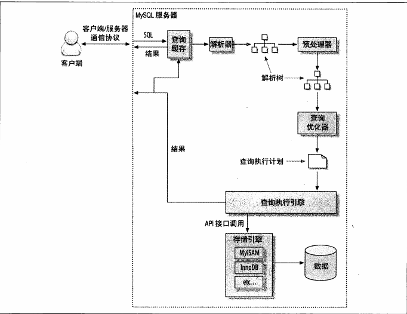
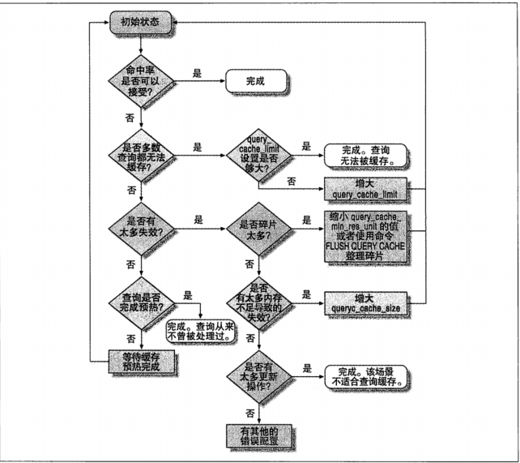

# High Performance Mysql, 3th Edition
```
知识点：
    Schema、数据类型、高性能索引、查询性能优化、Mysql高级特性、Mysql配置、
    复制、可扩展、高可用
    备份与恢复
```

## 第一章 MySQL架构与历史
```
共享锁、排他锁
锁的粒度：row锁，table锁
ACID
```

每种存储引擎实现的隔离级别都不尽相同。可以根据选择的存储引擎来查阅资料了解对应的隔离级别
- READ UNCOMMITED ---> 脏读
- READ COMMITED   ---> 不可重复度
- REPEATABLE READ ---> 幻读(写入新记录，phantom row)，多版本并发控制(MVCC)解决幻读问题, mysql默认隔离级别
- SERIALIZABLE    

死锁发生时，目前(mysql5.5中)Innodb的策略是：将持有最少行级锁的事务回滚

事务日志
- 事务日志可以提供事务的效率。使用事务日志时，存储引擎在修改表数据时只需要修改其内存拷贝，再把该修改行为记录到持久在硬盘的事务日志中，而不用每次都将修改的数据本身持久到磁盘。事务日志采用的是顺序追加的方式，所以速度相对会快很多。事务日志持久化后，内存中被修改的数据可以在后台慢慢刷入磁盘。这种方式叫预写式日志(Write-Ahead Logging), 修改数据需要写两次磁盘。

InnoDB的mvcc是通过增加两个隐藏列实现的：一个记录行的过期时间，一个保持行的创建时间。当然，存储的不是实际时间而是一个系统版本号，每开始一个新事物，系统版本号都会递增.
InnoDB 通过 间隙锁(next-key lock)解决幻读问题。

MVCC 只对 READ COMMITED 和 REPEATABLE READ 两个事务隔离级别生效，其他两个跟MVCC不兼容，因为：READ UNCOMMITED 总是读取最新的数据行，而不是符合当前事务版本的数据行；而 SERIALIZABLE 则会对所有读取的行都加锁。

## 第三章
定义性能最有效的方法是响应时间

准确的性能测量量化，可以很好的帮助发现、解决问题

慢查询日志的记录，对mysql的性能影响很低。

建议诊断问题时先使用以下两种方法：
    - show (global) status
    - show processlist
这两种方法的开销很低，可以通过简单的shell脚本(以较高频率，如，次/s 进行)或者反复执行的查询来交互式的收集数据

对收集到的数据进行可视化处理。可视化的数据最具说服力

INFORMATION_SCHEMA.STATISTICS 统计了很多MySQL的统计信息。

SHOW VARIABLES

# 第四章 Schema与数据类型优化
数据类型选择原则：
- 更小的通常更好：更小的数据类型通常更快，因为他们张勇更少的磁盘、内存和cpu缓存
- 简单就好：简单数据类型的操作通常需要更少的cpu周期。
- 尽量避免NULL：通常情况下最好指定列为NOT NULL, 除非真的需要存储 NULL。
    + 如果查询中包含可为NULL的列，对于MySQL来说更难优化，因为可为 NULL 的列使得索引、索引统计和值比较都更加复杂。
    + 可为 NULL 的列使用更多的存储空间，在MySQL里也需要特殊处理。
    + 当可为 NULL 的列被索引时，每个索引记录需要一个额外的字节。
    但是，通常把可为 NULL 的列改为 NOT NULL 带来的性能提升比较小。

DATETIME 和 TIMESTAMP 都可以存储时间，精确到秒。然而，TIMESTAMP 只使用 DATETIME 一半的存储空间，并且会根据时区变化，但是 TIMESTAMP 允许表达的时间范围要小得多。

MySQL 可以为整数类型指定宽度，如 INT(11)，它不会限制值得合法范围，只是规定了MySQL的一些交互工具(如，MySQL命令行客户端)用来显示字符的个数。

FLOAT 和 DOUBLE 使用标准的浮点运算进行近似计算。
DECIMAL 用于存储精确的小数。
因为 CPU 支持原生浮点计算但不支持 DECIMAL 运算，所以浮点运算明显更快。

当存储类型为 CHAR 时，MySQL 会删除所有的末尾空格。

MySQL 的 ALTER TABLE 操作的性能对大表来说是个大问题：MySQL 执行大部分修改表结构操作的方法是用新的表结构创建一个空表，锁旧表，从旧表中查出所有数据插入新表，然后删除旧表。这样的操作可能会花费很长时间，如果内存不足而表又很大，而且还有很多索引的情况下尤其严重。

## 第五章 创建高性能的索引
对于非常小的表，大部分情况下简单的全表扫码更高效
对于中到大型的表，索引就非常有效。但对于特大型的表，建立和使用索引的代价将随之增长。

如果表的数量特别多，可以建立一个元数据信息表，用来查询需要用到的某些特性。对于TB级别的数据，定位单条记录的意义不大，所以经常会使用块级别元数据技术来替代索引。

高性能的索引策略
- 如果查询中的列不是独立的，则MySQL就不会使用索引。"独立的列"是指索引列不能是表达式的一部分，也不能是函数的参数。

使用索引的最左匹配原则

InnoDB使用主键来聚集(聚簇)数据。如果没有定义主键，InnoDB会选择一个唯一的非空索引代替。如果没有这样的索引，InnoDB会隐式定义一个主键来作为聚簇索引。InnoDB只聚集在同一个页面中的记录，包含相邻键值的页面可能会相距甚远。

聚簇(数据)索引，通过数据存储的连续性，利用磁盘的顺序读取特性，最大限度的提高了IO密集型应用的性能。但是，这也使得 插入新行、主键被更新等导致需要移动行的时候，可能面临“页分裂(page split)”的问题。当行的主键值要求必须将这一行插入到某个已满的页中时，存储引擎会将该页分裂成两个页面来容纳该行，这就是一次页分裂操作。

二级索引(非聚簇索引)可能比想象的更大，因为二级索引的叶子节点包含了引用行的主键列。二级索引访问需要两次索引查找，而不是一次。因为二级索引叶子节点中保存的不是指向行的物理位置的指针，而是行的主键值。

MySQL 允许在相同列上创建多个索引。但是，需要单独维护重复的索引，并且优化器在优化查询的时候也需要逐个地进行考虑，这会影响性能。应尽量避免重复索引。
表中的索引越多插入速度会越慢。一般来说，增加新索引会导致 INSERT、UPDATE、DELETE 等操作的速度变慢。

MySQL 的索引统计信息：
    InnoDB 在打开某些 INFORMATION_SCHEMA 表，或者使用 SHOW TABLE STATUS 和 SHOW INDEX 等时，都有可能触发索引统计信息的更新。如果服务器上有大量的数据，这可能是个严重的问题，尤其是当IO比较慢的时候。

    InnoDB 引擎通过抽样的方式来计算统计信息：首先随机地读取少量的索引页面，然后以此为样本计算索引的统计信息。可以通过参数 innodb_stats_sample_pages 来设置样本页的数量。

## 第六章 查询性能优化
1、确认是否向数据库请求了超过实际需要(大量不需要)的数据
2、确认MySQL服务器层是否在分析大量超过需要的数据行
对于MySQL最简单的衡量查询开销的三个指标如下：
- 响应时间
- 扫描的行数
- 返回的行数

MySQL 通信协议 半双工。这意味着，在任何一个时刻，要么是由服务器向客户端发送数据，要么是由客户端向服务端发送数据，这两个动作不能同时发生。所以，要特别注意查询语句很长，或者返回结果很大的时候。


有很多方式能查看当前的状态，最简单的是使用 SHOW FULLPROCESSLIST 命令。

SHOW STATUS LIKE 'last_query_cost';


MySQL 无法利用多核特性来并行执行查询。

优化LIMIT分页
    当偏移量非常大时，这种分页方式代价非常高，常见的一种优化方式是：使用索引覆盖扫描，而不是查询所有的列。然后根据需要做一次关联操作再返回所需的列。

一般的，我们要尽量避免使用 SELECT FOR UPDATE。

COUNT()有两个非常不同的作用：它可以统计某个列值的数量，也可以统计行数。在统计列值时要求列值是非空的（不统计NULL）。
COUNT(1) is only subject to the same optimization if the first column is defined as NOT NULL.

MySQL 的查询执行计划总是左侧深度优先树。

## 第七章 MySQL高级特性
分区表、视图、临时表、游标

XA事务

一个常见的误区是认为 innodb_support_xa 只有在需要XA支持的情况下才打开。这是错误的：改参数还会控制 MySQL 内部存储引擎和二进制日志之间的分布式事务。


查询缓存

如果查询语句中包含任何的不确定函数，那么 MySQL 在查询缓存中是不可能找到缓存结果的。
如果查询缓存空间过大，在过期操作的时候可能会导致服务器僵死。一个比较简单的方式就是控制缓存空间(query_cache_size)的大小。

打开查询缓存对读和写操作都会带来额外的消耗：
- 读查询在开始之前必须先检查是否命中缓存
- 如果这个读查询可以被缓存，那么当完成执行后，会将其结果放入缓存
- 这对写操作也会有影响，因为当向某个表写入数据的时候，MySQL 必须将对应表的所有缓存都设置为失效。如果查询缓存非常大或者碎片很多，这个操作就可能带来很大的系统消耗。

缓存碎片、内存不足、数据修改等都会造成缓存失效。所以，写密集型的应用，直接禁用查询缓存可能会提高系统性能。

[如何分析和配置查询缓存]()


## 第八章 优化服务器设置
## 第九章 
## 第十章 复制
复制解决的基本问题是让一台服务器的数据与其他服务器保持同步。

MySQL支持两种复制方式：基于行的复制和基于语句的复制。这两种方式都是通过在主库行记录二进制日志、在备库重放日志的方式来实现异步的数据复制。

## 第十一章 可扩展的MySQL
- 扩展方式：
    + 数据分片、多实例、集群、数据切分(保持活跃数据独立，将活跃和不活跃数据隔离)
- 配合以 负载均衡
    + 可以让客户端多扩展无感，以及其他的一些逻辑操作

## 第十二章 高可用的MySQL
- 提升平均失效时间
- 降低平均恢复时间

## 第十五章 备份与恢复
因为 InnoDB 是个 ACID 系统。任何时刻(例如快照时)，每个提交的事务要么在 InnoDB 数据文件中要么在日志文件中。在还原快照后启动MySQL时，InnoDB 将运行恢复进程，就像服务器断过电一样。会查找事务日志中任何提交但没有应用到数据文件中的事务然后应用，因此不会丢失任何事务。这正是要强制 InnoDB 数据文件和日志文件在一起快照的原因。

复制mysql配置，同时观察mysql启动时的错误日志：tail -f /var/log/mysql/mysql.err

## EXPLAIN
在查询中每个表在输出中只有一行。如果查询是两个表的联接，那么输出中将有两行。

- EXPLAIN EXTENDED: 
    + 看起来和正常的EXPLAIN行为一样，但是它会告诉服务器'逆向编译'执行计划为一个SELECT语句。可以通过紧接气候运行SHOW WARNINGS看到这个生成的语句。这个语句直接来自执行计划，而不是原始SQL语句。
- EXPLAIN PARTITIONS
    + 会显示查询将访问的分区，如果查询是基于分区表的话。

认为增加EXPLAIN时MySQL不会执行查询，这是一个常见的错误。实际上，如果查询在FROM子句中包括子查询，那么MySQL实际上会执行子查询，将其结果放在一个临时表中，然后完成外部查询优化。这意味着，如果语句中包含开销较大的子查询或者使用临时表算法的视图，实际上会给服务器带来大量工作。

MySQL EXPLAIN 只能解释 SELECT 查询，并不会对存储程序调用 和 INSERT、UPDATE、DELETE或其他语句做解释。然而，可以重写某些非 SELECT 查询以利用 EXPALIN。为了达到这个目的，只需要将该语句转换成一个等价的访问所有相同列的 SELECT。 

- id 列
    + 标识 SELECT 所属的行。如果在语句中没有子查询或者联合，那么只会有唯一的 SELECT。否则，内层的 SELECT 语句一般会顺序编号。
- select_type 列
    + 显示了对应行是简单还是复杂 SELECT。SIMPLE 值意味着查询不包含子查询和UNION，如果查询有任何复杂的子部分，则最外层部分标记为 PRIMARY, 其他部分标记如下：
        - SUBQUERY
            + 包含在 SELECT 列表中的子查询中的 SELECT(换句话说，不在FROM子句中)标记为 SUBQUERY
        - DERIVED
            + 用来表示包含在 FROM 子句的子查询中的 SELECT，MySQL 会递归执行并将结果放到一个临时表中。服务器内部称其"派生表"，因为该临时表是从子查询中派生来的
        - UNION
            + 在 UNION 中的第二个和随后的 SELECT 被标记为 UNION。第一个 SELECT 被标记就好像它以部分外查询来执行。
        - UNION RESULT
            + 用来从 UNION 的匿名临时表检索结果的 SELECT 被标记为 UNION RESULT
        - DEPENDENT
            + 意味着 SELECT 依赖于外层查询中发现的数据
        - UNCACHEABLE
            + 意味着 SELECT 中的某些特性阻止结果被缓存于一个Item_cache
- table 列
    + 显示了对应行正在访问哪个表。
- type 列
    + 访问类型，换言之就是 MySQL 决定如何查找表中的行
        - ALL
            + 全表扫码
        - index
            + 跟全表扫描一样，只是 MySQL 扫描表时按索引次序进行而不是行。主要优点是避免了排序，最大的缺点是要承担按索引次序读取整个整个表的开销。这通常意味着若是按随机次序访问行，开销将会非常大。如果在 Extra 列中看到 "Using index" 说明 MySQL 正在使用覆盖索引，它只扫描索引的数据，而不是按索引次序的每一行。
        - range
            + 范围扫描就是一个有限制的索引扫描，它开始于索引的某一个点，返回匹配这个值域的行。
        - ref 
            + 索引访问，它返回所有匹配某个单个值的行。此类索引访问只有当使用非唯一索引或者唯一索引的非唯一性前缀时才会发生。把它叫做 ref 是因为索引要跟某个参考值相比较。
        - eq_ref
            + 索引访问，它最多只返回一条符合条件的记录。这种访问方法可以在 MySQL 使用主键或者唯一性索引查找时看到。
        - const, system
            + 当 MySQL 能对查询的某部分进行优化并将其转换成一个常量时，它就会使用这些访问类型。
        - NULL
            + 意味着 MySQL 能再优化阶段分解查询语句，在执行阶段甚至用不着再访问表或者索引。
- possible_keys 列
    + 显示了查询可以使用哪些索引
- key 列
    + 显示了 MySQL 决定采用哪个索引来优化对该表的访问。
- key_len 列
    + 显示了在索引字段中可能的最大长度，而不是表中数据使用的实际字节数。
- ref 列
    + 显示了之前的表在 key 列记录的索引中查找值所使用的列或者常量
- rows 列
    + MySQL估计的为了找到所需的行而需要读取的行数。这个数字是内嵌循环关联计划里的循环数目。也就是说它不是 MySQL 认为它最终要从表里读取出来的行数，而是 MySQL 为了找到符合查询的每一点上标准的那些行而必须读取的行的平均数。
- filtered 列
    + 在使用 EXPLAIN EXTENDED 时出现，显示的是针对表里符合某个条件(WHERE子句或联接条件)的记录数的百分比所做的一个悲观估算。
- Extra 列
    + 包含的是不适合在其它列显示的额外信息。常见的最重要的值如下：
        - Using index
            + 表示 MySQL 将使用覆盖索引，以避免访问表
        - Using where
            + 意味着 MySQL 服务器将在存储引擎检索行后再进行过滤
        - Using temporary 
            + 意味着 MySQL 在对查询结果排序时会使用一个临时表
        - Using filesort
            + 意味着 MySQL 会对结果使用一个外部索引排序，而不是按索引次序从表里读取行
        - Range checked for each record(index map:N)
            + 意味着没有好用的索引，新的索引将在联接的每一行上重新估算

## 锁的调试
锁等待可能发生在服务器级别或存储引擎级别。下面是MySQL服务器使用的几种类型的锁：
- 表锁
    + 表锁可以是显式的也可以是隐式的
        - 显式：用 LOCK TABLES 创建 (可以使用 SHOW PROCESSLIST 观察到锁状态)
        - 隐式：服务器在需要时自动创建和释放，并将它们传递给存储引擎
    + 找出谁持有锁
        - 指令：mysqladmin debug
- 全局锁
    + 可以通过 FLUSH TABLES WITH READ LOCK 或设置 read_only=1 来获取单个全局读锁。
    ```
    一个会话执行：FLUSH TABLES WITH READ LOCK;
    另一个会话尝试再锁这个表：LOCK TABLES test WRITE;
    此时，就会看到会话挂起，通过 SHOW PROCESSLIST 可以看到查询状态是：Waiting for release for readlock。这就说明查询正在等待一个全局读锁而不是表级别锁
    ```
    + MySQL 目前没有提供查出谁持有全局读锁的方法
- 命名锁
    + 表锁的一种，服务器在重命名或者删除一个表时创建
- 字符锁
    + 可以用 GET_LOCK() 及其相关函数在服务器级别内锁住和释放任意一个字符串

存储引擎中的锁
InnoDB 在 SHOW INNODB STATUS 的输出中显露了一些锁信息。如果事务正在等待某个锁，这个锁会显示在 SHOW INNODB STATUS 输出的 TRANSACTIONS 部分。


